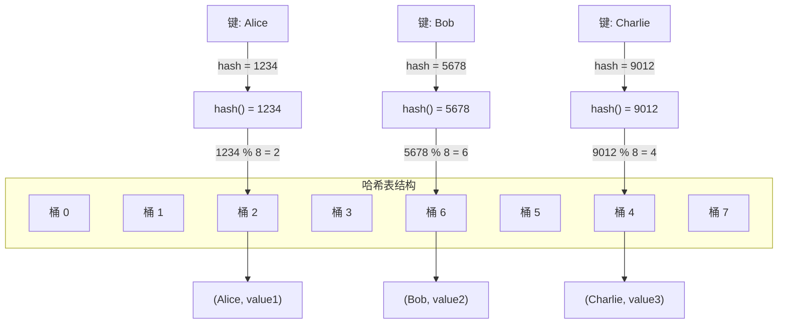
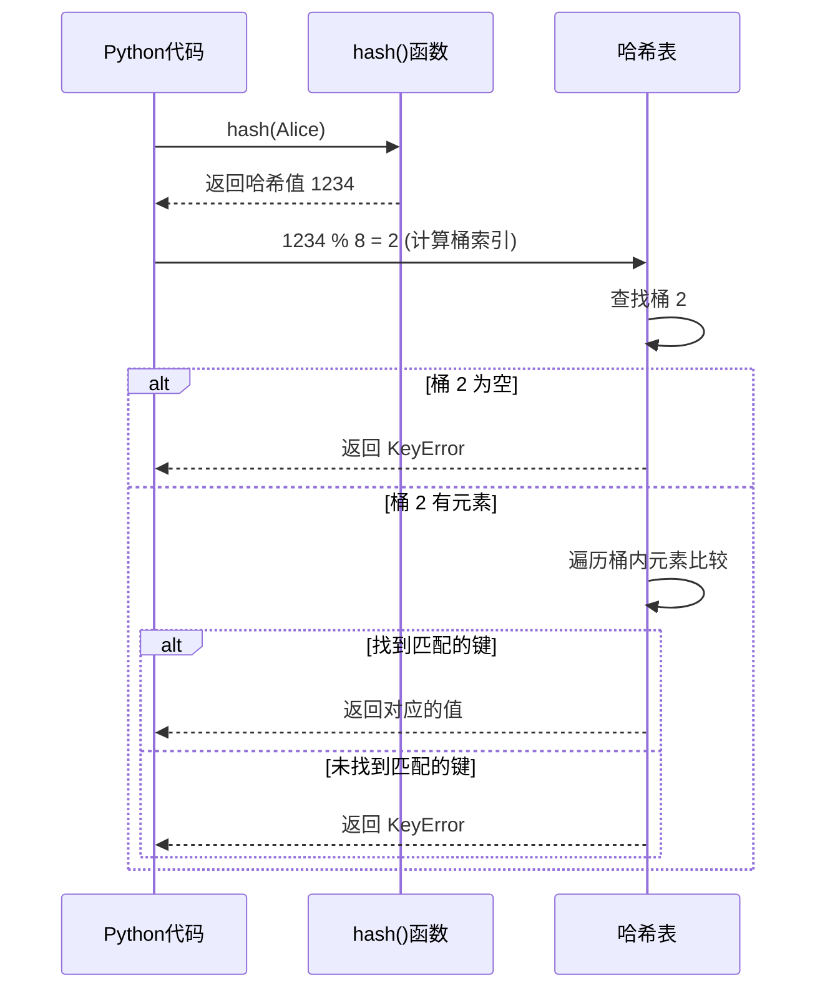

import { PyodideRunner } from '@site/src/components';

# 🚀 Python 哈希机制详解

哈希（Hash）是 Python 中实现高效数据结构（如字典、集合）的基础。理解哈希机制能帮助你写出更高效、更正确的代码。

:::tip 🎯 本节要点
- **hash() vs hashlib**：`hash()` 用于快速查找（dict/set），`hashlib` 用于安全校验
- **可哈希 = 不可变**：对象生命周期内哈希值固定，且能进行相等性比较
- **三大场景**：字典键、集合元素、缓存机制
- **自定义类**：重写 `__eq__` 必须同时处理 `__hash__`，否则实例不可哈希
- **大文件哈希**：复杂度 O(n)，瓶颈在 I/O，永远使用分块读取
:::

:::danger 安全警告
**绝对禁止**用内置 `hash()` 做密码哈希或文件安全校验！
:::

<PyodideRunner title="哈希机制快速体验">

```python
# 基本哈希
print(f"hash(42): {hash(42)}")
print(f"hash('hello'): {hash('hello')}")
print(f"hash((1, 2, 3)): {hash((1, 2, 3))}")

# 不可哈希的类型
try:
    hash([1, 2, 3])
except TypeError as e:
    print(f"列表不可哈希: {e}")

# 自定义 __hash__
class Point:
    def __init__(self, x, y):
        self.x = x
        self.y = y

    def __eq__(self, other):
        return self.x == other.x and self.y == other.y

    def __hash__(self):
        return hash((self.x, self.y))

p1 = Point(1, 2)
p2 = Point(1, 2)
p3 = Point(3, 4)

print(f"p1 == p2: {p1 == p2}")
print(f"hash(p1) == hash(p2): {hash(p1) == hash(p2)}")

# 用作字典键
points = {p1: "点1", p3: "点3"}
print(f"字典: {points}")
print(f"查找 p2: {points[p2]}")  # p2 == p1，所以能找到

# 集合去重
point_set = {p1, p2, p3}
print(f"集合长度: {len(point_set)}")  # p1 和 p2 相等，只保留一个
```

</PyodideRunner>

## 什么是哈希值？

哈希值是通过特定算法将**任意大小的数据**映射成的**固定大小的整数**，相当于数据的 **"数字指纹"**。

在 Python 中，哈希有两条完全不同的赛道：

| 维度 | 内置 `hash()` | 密码学哈希 (`hashlib`) |
| :--- | :--- | :--- |
| **目的** | 快速查找 (dict/set) | 安全验证、完整性校验 |
| **速度** | 极快 (纳秒级) | 较慢 (微秒~毫秒级) |
| **稳定性** | ❌ 每次启动随机化 | ✅ 标准化，全球一致 |
| **典型用途** | 字典键、集合、缓存 | 签名、校验、密码、区块链 |

:::danger 安全警告
**绝对禁止**用内置 `hash()` 做密码哈希或文件安全校验！
:::

## 什么是"可哈希" (Hashable)？

可哈希是指一个对象在其生命周期内拥有**固定不变的哈希值**，且能进行相等性比较。**核心公式：可哈希 = 有稳定的"身份证号" + 能判断是否相等。**

#### 准入条件

1. 实现 `__hash__()` 返回整数。
2. 实现 `__eq__()` 支持比较。
3. **哈希值终身不变**（因此可变对象如 list/dict/set 默认不可哈希）。

#### 核心作用：三大场景

```py title="Python"
# 🔑 1. 作为 dict 的键 (O(1) 查找)
cache = {"user_1": "Alice", (2024, 1): "Jan", frozenset({1,2}): True}

# 🔍 2. 作为 set 的元素 (O(1) 去重)
unique = {1, "hello", (3, 4), frozenset({5, 6})}

# ⚡ 3. 缓存机制 (如 lru_cache)
from functools import lru_cache
@lru_cache()
def compute(tags): pass
compute(frozenset({"a", "b"}))  # ✅ 必须传入可哈希对象
```

#### 哈希表工作原理

字典（dict）和集合（set）底层使用哈希表实现 O(1) 的查找性能：





#### 自定义类的避坑指南

> 💡 **黄金法则**：如果重写了 `__eq__`，**必须**同时处理 `__hash__`（提供一致实现或显式设为 `None`）。

```py title="Python"
class Point:
    def __init__(self, x, y):
        self.x, self.y = x, y
    
    # ✅ 不可变语义：同时定义 eq 和 hash
    def __eq__(self, other):
        return self.x == other.x and self.y == other.y
    
    def __hash__(self):
        return hash((self.x, self.y))
```

:::warning 可变对象不可哈希
如果一个对象是可变的（如 list、dict、set），它的哈希值可能会改变，因此不能作为字典的键或集合的元素。尝试这样做会抛出 `TypeError`。
:::

## 哈希计算为什么快？大文件呢？

**为什么快？**

- **固定输出**：无论输入多大，输出长度固定（如 SHA-256 恒为 32 字节）。
- **纯位运算**：只有 XOR、移位等 CPU 单周期指令，且有硬件指令集加速。

**大文件也快吗？**

- **真相**：时间复杂度永远是 **O(n)**，必须读取每个字节。
- **瓶颈**：通常在 **磁盘 I/O** 而非 CPU。
- **最佳实践**：永远**分块读取**，保持内存占用恒定。

```py title="Python"
import hashlib

def hash_large_file(path):
    h = hashlib.sha256()
    # ✅ 每次只读 1MB，100GB 文件也只需几 MB 内存
    with open(path, 'rb') as f:
        while chunk := f.read(1024 * 1024):
            h.update(chunk)
    return h.hexdigest()
```

## 实战：自定义可哈希类

```py title="Python"
from __future__ import annotations
from typing import Hashable


class UserID(Hashable):
    """用户ID类，支持作为字典键。"""
    
    def __init__(self, id: int, prefix: str = "user"):
        self._id = id
        self._prefix = prefix
    
    def __eq__(self, other: object) -> bool:
        if not isinstance(other, UserID):
            return NotImplemented
        return self._id == other._id and self._prefix == other._prefix
    
    def __hash__(self) -> int:
        return hash((self._prefix, self._id))
    
    def __repr__(self) -> str:
        return f"UserID({self._prefix}:{self._id})"


# 使用示例
cache: dict[UserID, str] = {}
alice = UserID(1)
cache[alice] = "Alice"

# 相同 ID 的对象可以访问同一个缓存项
alice2 = UserID(1)
print(cache[alice2])  # Alice（因为 __eq__ 和 __hash__ 一致）
```

## 🎯 动手练习

1. **自定义哈希类**：实现一个不可变的 `Point` 类，正确实现 `__hash__` 和 `__eq__`
2. **文件完整性校验**：用 `hashlib.sha256` 计算大文件的哈希值，验证文件完整性
3. **缓存键设计**：设计一个合理的缓存键，处理复杂参数的哈希计算
4. **集合去重**：用 `frozenset` 实现嵌套集合的去重操作

## 📊 速查表

| 操作 | 方法 | 说明 |
|------|------|------|
| 计算哈希 | `hash(obj)` | 用于 dict/set 查找 |
| 安全哈希 | `hashlib.sha256(data)` | 用于安全校验 |
| 文件哈希 | 分块读取 + `update()` | 避免一次性读入内存 |
| 可哈希条件 | `__hash__` + `__eq__` | 哈希值终身不变 |
| 不可变集合 | `frozenset` | 可哈希，可作字典键 |
| 不可变字典 | 无内置 | 用 `tuple(sorted(d.items()))` |
| 禁用哈希 | `__hash__ = None` | 使对象不可哈希 |

## 📚 延伸阅读

- **[hash() 官方文档](https://docs.python.org/zh-cn/3/library/functions.html#hash)** - 内置哈希函数
- **[hashlib 官方文档](https://docs.python.org/zh-cn/3/library/hashlib.html)** - 安全哈希库
- **[PEP 452](https://peps.python.org/pep-0452/)** - 内存安全与哈希随机化

## 📝 本节总结

- **哈希值是数据的压缩数字指纹**：`hash()` 用于 O(1) 查找，`hashlib` 用于安全校验
- **可哈希是哈希表的准入门票**：核心是"不可变性"，重写 `__eq__` 必须处理 `__hash__`
- **大文件哈希复杂度仍是 O(n)**，瓶颈在 I/O，永远使用**分块读取**

理解哈希机制，能帮助你正确使用字典和集合，避免常见的 `TypeError`。