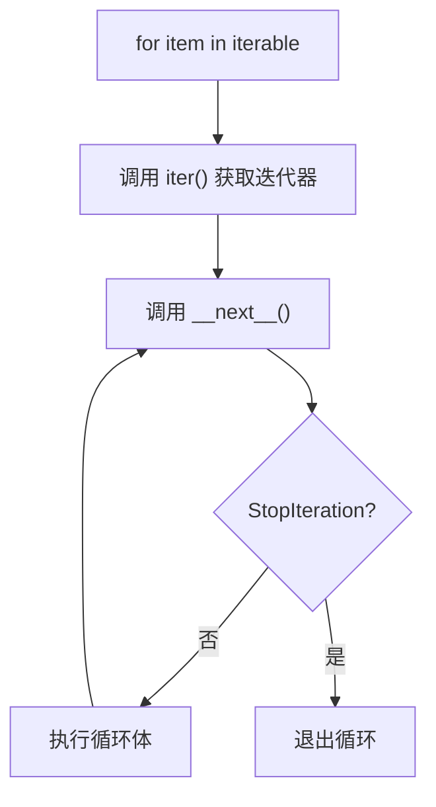

import { PyodideRunner } from '@site/src/components';
import CheatCard from '@site/src/components/CheatCard';

# 🔀 for 循环

Python 的 `for` 循环与 C/Java 中的 `for` 不同，它本质上是 **遍历可迭代对象** 的迭代器协议语法糖。无论遍历列表、字符串、字典，还是数字序列，`for` 都能优雅地处理。

## 📌 本节要点

- `for` 循环本质是迭代器协议的语法糖，遍历任何可迭代对象
- `range()` 生成整数序列，支持步长和倒序
- `enumerate()` 同时获取索引和值，替代手动计数
- `zip()` 并行遍历多个可迭代对象
- `for...else`：循环正常结束时执行 else 块
- 循环变量在循环结束后仍然存在，注意作用域

<PyodideRunner title="for 循环快速体验">

```py
# enumerate 和 zip 的实际应用
fruits = ["苹果", "香蕉", "橙子", "葡萄"]
prices = [5.0, 3.5, 4.0, 8.0]

print("水果价格表：")
for i, (fruit, price) in enumerate(zip(fruits, prices), start=1):
    print(f"  {i}. {fruit}: ¥{price}")

# 计算总价
total = sum(prices)
print(f"\n总价: ¥{total}")
```

</PyodideRunner>

## for...in 基本语法

`for` 循环形式为 `for 变量 in 可迭代对象:`，每次取出一个元素赋给变量：

```py title="Python"
# 遍历列表
fruits = ["苹果", "香蕉", "橙子"]
for fruit in fruits:
    print(fruit)
```

输出：

```text title="输出"
苹果
香蕉
橙子
```

for 循环的执行流程：



```py title="Python"
# 遍历字符串
for char in "Python":
    print(char, end=" ")
# 输出：P y t h o n
```

```py title="Python"
# 遍历字典
person = {"name": "小明", "age": 20, "city": "北京"}
for key in person:
    print(f"{key}: {person[key]}")
```

:::tip[同时获取键和值]
遍历字典时，使用 `.items()` 方法可以同时拿到键和值，比通过键查值更清晰：

```py title="Python"
person = {"name": "小明", "age": 20}
for key, value in person.items():
    print(f"{key}: {value}")
```
:::

## range() 函数

`range()` 用于生成整数序列，常用于按次数循环。它有三种形式：

```py title="Python"
# range(stop)：0 到 stop-1
for i in range(5):
    print(i, end=" ")
# 输出：0 1 2 3 4
print()

# range(start, stop)：start 到 stop-1
for i in range(2, 6):
    print(i, end=" ")
# 输出：2 3 4 5
print()

# range(start, stop, step)：带步长
for i in range(0, 10, 2):
    print(i, end=" ")
# 输出：0 2 4 6 8
print()

# 步长为负，倒序
for i in range(5, 0, -1):
    print(i, end=" ")
# 输出：5 4 3 2 1
```

:::note[range 是惰性序列]
`range()` 返回的并非列表，而是 `range` 对象，它按需生成数字，不会一次性占用内存。因此 `range(10_000_000)` 几乎不消耗内存。需要列表时可用 `list(range(5))` 转换。
:::

## enumerate() 获取索引

需要同时获取索引和元素时，使用 `enumerate()`：

```py title="Python"
fruits = ["苹果", "香蕉", "橙子"]
for index, fruit in enumerate(fruits):
    print(f"{index}: {fruit}")
```

输出：

```text title="输出"
0: 苹果
1: 香蕉
2: 橙子
```

`enumerate()` 的第二个参数指定起始索引（默认 0）：

```py title="Python"
for index, fruit in enumerate(fruits, start=1):
    print(f"第 {index} 个：{fruit}")
```

:::warning[不要用 range(len(...))]
很多初学者会写出这样的代码：

```py title="Python"
fruits = ["苹果", "香蕉"]
for i in range(len(fruits)):
    print(fruits[i])
```

这是 C 语言风格，在 Python 中不推荐。如果需要索引，请使用 `enumerate()`；如果只需要元素，直接遍历即可。
:::

## zip() 并行遍历

`zip()` 把多个可迭代对象"拉链式"配对：

```py title="Python"
names = ["小明", "小红", "小刚"]
ages = [20, 21, 19]
cities = ["北京", "上海", "广州"]

for name, age, city in zip(names, ages, cities):
    print(f"{name}，{age} 岁，来自{city}")
```

输出：

```text title="输出"
小明，20 岁，来自北京
小红，21 岁，来自上海
小刚，19 岁，来自广州
```

:::note[zip 的长度]
`zip()` 以最短的可迭代对象为准。如果想让长的截断补默认值，可使用 `itertools.zip_longest`：

```py title="Python"
from itertools import zip_longest

for a, b in zip_longest([1, 2, 3], [10, 20], fillvalue=0):
    print(a, b)
# 输出：
# 1 10
# 2 20
# 3 0
```
:::

Python 3.10+ 还可以用 `zip(..., strict=True)` 在长度不一致时抛出异常，避免静默截断造成的 bug：

```py title="Python"
list(zip([1, 2, 3], [10, 20], strict=True))
# ValueError: zip() argument 2 is shorter than argument 1
```

## 嵌套循环

`for` 循环内可以再嵌套 `for` 循环，常用于处理二维结构：

```py title="Python"
matrix = [
    [1, 2, 3],
    [4, 5, 6],
    [7, 8, 9],
]

for row in matrix:
    for value in row:
        print(value, end=" ")
    print()
```

输出：

```text title="输出"
1 2 3
4 5 6
7 8 9
```

:::tip[用推导式简化嵌套]
扁平化嵌套循环可以用列表推导式或生成器表达式。例如把二维矩阵展平为一维列表：

```py title="Python"
matrix = [[1, 2, 3], [4, 5, 6]]
flat = [value for row in matrix for value in row]
print(flat)  # [1, 2, 3, 4, 5, 6]
```
:::

## for...else 语句

`for` 循环可以带 `else` 子句，仅在循环 **正常结束（没有被 break 打断）** 时执行：

```py title="Python"
def find_even(numbers: list[int]) -> int | None:
    """返回第一个偶数，找不到返回 None。"""
    for n in numbers:
        if n % 2 == 0:
            print(f"找到偶数：{n}")
            return n
    else:
        # 循环正常结束，说明没找到
        print("没有偶数。")
        return None

find_even([1, 3, 5, 7, 8])  # 找到偶数：8
find_even([1, 3, 5])        # 没有偶数。
```

:::warning[for...else 容易误用]
`for...else` 是 Python 中较少见的语法，许多开发者甚至不知道它的存在。它的"正常结束"语义容易被误解为"没找到元素时执行"。在团队代码中，建议用更显式的方式（如设置标志变量或提前 `return`）替代，以提升可读性。
:::

## 循环变量作用域

与许多其他语言不同，Python 的 `for` 循环变量在循环结束后 **仍然存在**，保留最后一次迭代的值：

```py title="Python"
for i in range(3):
    pass
print(i)  # 2
```

:::warning[注意空可迭代对象]
如果可迭代对象为空，循环体一次都不执行，循环变量 **未定义**，访问会抛出 `NameError`：

```py title="Python"
for x in []:
    pass
print(x)  # NameError: name 'x' is not defined
```

如果担心这种情况，应在循环前给变量一个默认值，或使用 `for...else` 处理空场景。
:::

此外，循环变量在函数闭包中也有陷阱（延迟绑定问题），需要注意：

```py title="Python"
# 常见陷阱：闭包延迟绑定
funcs = []
for i in range(3):
    funcs.append(lambda: i)

for f in funcs:
    print(f(), end=" ")
# 输出：2 2 2 （而非 0 1 2）
```

因为 `lambda` 引用的是变量 `i` 本身，循环结束后 `i == 2`。修正方法是绑定默认参数：

```py title="Python"
funcs = [lambda i=i: i for i in range(3)]
for f in funcs:
    print(f(), end=" ")
# 输出：0 1 2
```

## 实战：九九乘法表

经典的九九乘法表演示了嵌套循环和格式化输出：

```py title="Python"
def multiplication_table() -> None:
    """打印九九乘法表。"""
    for i in range(1, 10):
        for j in range(1, i + 1):
            # 使用 f-string 格式化，右对齐保持列宽一致
            print(f"{j}×{i}={i * j:<2}", end=" ")
        print()  # 换行


multiplication_table()
```

输出：

```text title="输出"
1×1=1  
1×2=2  2×2=4  
1×3=3  2×3=6  3×3=9  
1×4=4  2×4=8  3×4=12 4×4=16 
1×5=5  2×5=10 3×5=15 4×5=20 5×5=25 
1×6=6  2×6=12 3×6=18 4×6=24 5×6=30 6×6=36 
1×7=7  2×7=14 3×7=21 4×7=28 5×7=35 6×7=42 7×7=49 
1×8=8  2×8=16 3×8=24 4×8=32 5×8=40 6×8=48 7×8=56 8×8=64 
1×9=9  2×9=18 3×9=27 4×9=36 5×9=45 6×9=54 7×9=63 8×9=72 9×9=81 
```

:::tip[f-string 对齐技巧]
- `f"{x:<2}"` 表示左对齐，宽度为 2
- `f"{x:>2}"` 表示右对齐
- `f"{x:^4}"` 表示居中，宽度为 4

Python 3.12 还支持在 f-string 中嵌套引号、跨多行，让格式化更灵活。
:::

如果只想求和而不打印，可以用生成器表达式配合 `sum()`，无需显式循环：

```py title="Python"
# 计算 1 到 100 的和
total = sum(range(1, 101))
print(total)  # 5050

# 九九乘法表所有乘积的和
total = sum(i * j for i in range(1, 10) for j in range(1, i + 1))
print(total)  # 1155
```

## 🎯 动手练习

1. **列表过滤**：使用 `for` 循环过滤出列表中的所有正数，分别用传统循环和列表推导式实现
2. **字典反转**：编写函数将字典的键值对反转（如 `{"a": 1}` → `{1: "a"}`）
3. **zip 实践**：使用 `zip()` 合并两个列表：`["张三", "李四"]` 和 `[85, 92]`，输出格式化成绩表
4. **闭包陷阱**：编写 3 个 lambda 函数，分别返回 0、1、2，避免延迟绑定问题

## 📚 延伸阅读

- [PEP 279 - enumerate()](https://peps.python.org/pep-0279/) - enumerate 函数的正式规范
- [Python 迭代器协议](https://docs.python.org/zh-cn/3/library/stdtypes.html#iterator-types) - 可迭代对象与迭代器详解
- [itertools 模块](https://docs.python.org/zh-cn/3/library/itertools.html) - 高效迭代器函数库
- [PEP 618 - zip strict](https://peps.python.org/pep-0618/) - Python 3.10+ zip 严格模式

<CheatCard
    title="速查表"
    headers={["函数/语法","功能","示例"]}
    rows={[["`for x in iterable`","遍历可迭代对象","`for c in \"abc\":`"],["`range(n)`","生成 0~n-1","`range(5)` → `0,1,2,3,4`"],["`range(a, b, s)`","带步长序列","`range(0, 10, 2)` → `0,2,4,6,8`"],["`enumerate(seq)`","索引+元素","`enumerate([\"a\",\"b\"])` → `(0,\"a\"),(1,\"b\")`"],["`zip(a, b)`","并行遍历","`zip([1,2], [\"a\",\"b\"])` → `(1,\"a\"),(2,\"b\")`"],["`zip(..., strict=True)`","严格长度检查","长度不一致时抛异常"],["`for...else`","正常结束执行","未被 `break` 打断时执行"],["`[x for x in seq]`","列表推导式","`[i**2 for i in range(5)]`"]]}
  />
## ✅ 本节总结

- `for` 循环遍历可迭代对象，是 Python 中最常用的循环形式
- `range()` 生成整数序列，常用于按次数循环，且是惰性的，不占内存
- `enumerate()` 同时获取索引和元素，比 `range(len(...))` 更 Pythonic
- `zip()` 并行遍历多个序列，`strict=True` 可在长度不一致时报错
- 嵌套循环处理二维结构；列表推导式可简化简单嵌套
- `for...else` 在循环正常结束时执行，但易被误用，慎用
- 循环变量在循环后仍可访问，且在闭包中存在延迟绑定陷阱