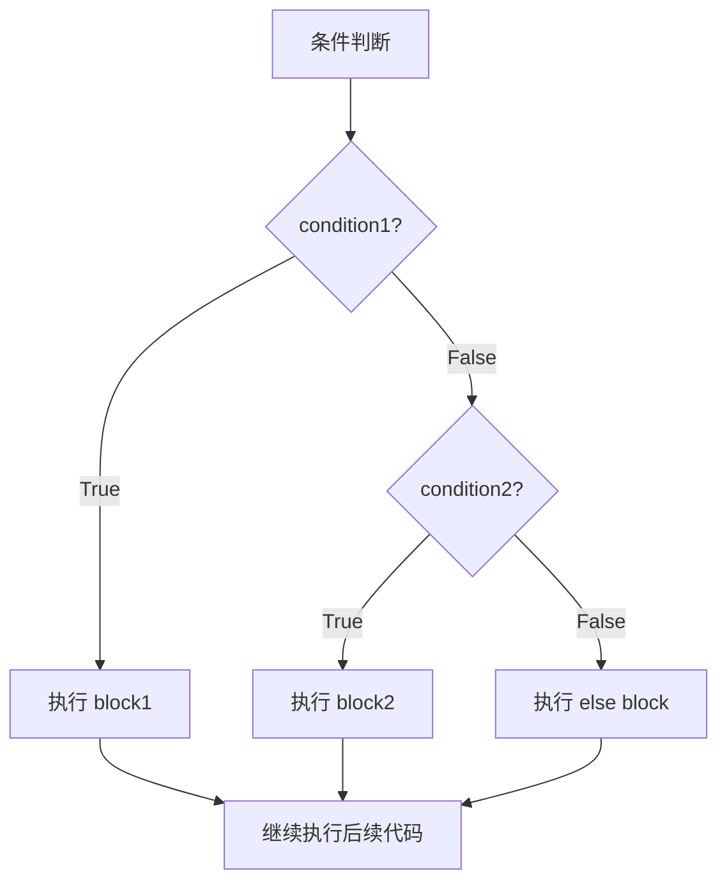

import { PyodideRunner } from '@site/src/components';

# 🔀 条件语句

条件语句是控制程序执行流程的基础。Python 使用 `if`、`elif`、`else` 三个关键字来实现分支判断，配合缩进来划分代码块。掌握条件语句是写出有"判断力"的程序的第一步。

## 📌 本节要点

- `if`/`elif`/`else` 实现多分支判断，缩进决定代码块范围
- 条件表达式（三元运算符）：`x if condition else y`
- 真值测试：Python 中 `0`、`""`、`[]`、`None`、`False` 均为假值
- `match`/`case`（Python 3.10+）实现结构化模式匹配
- 避免过度嵌套：提前返回（early return）让代码更清晰

<PyodideRunner title="条件语句快速体验">

```py
# 成绩等级判定
score = 85

if score >= 90:
    grade = "A"
    comment = "优秀"
elif score >= 80:
    grade = "B"
    comment = "良好"
elif score >= 70:
    grade = "C"
    comment = "中等"
elif score >= 60:
    grade = "D"
    comment = "及格"
else:
    grade = "F"
    comment = "不及格"

print(f"成绩 {score} -> 等级 {grade}：{comment}")
```

</PyodideRunner>

条件判断的执行流程：



## if 语句基本语法

`if` 语句后跟一个布尔表达式，当表达式为 `True` 时执行缩进的代码块：

```py title="Python"
age = 18

if age >= 18:
    print("你已成年，可以进入。")
```

如果条件为 `False`，则跳过缩进代码块。注意 Python 使用缩进（通常 4 个空格）表示代码块层级，而不是大括号。

## if-else 语句

使用 `else` 处理条件不成立的情况：

```py title="Python"
score = 55

if score >= 60:
    print("及格")
else:
    print("不及格")
```

`else` 不需要条件表达式，它会在前面所有 `if` 条件都不满足时执行。

## if-elif-else 多分支

当存在多个互斥条件时，使用 `elif`（else if 的缩写）依次判断。一旦某个分支命中，后续分支将不再判断：

```py title="Python"
score = 85

if score >= 90:
    grade = "A"
elif score >= 80:
    grade = "B"
elif score >= 70:
    grade = "C"
elif score >= 60:
    grade = "D"
else:
    grade = "F"

print(f"成绩等级：{grade}")  # 成绩等级：B
```

:::note[分支顺序很重要]
`elif` 是从上到下顺序判断的。如果把宽松的条件放在前面，后面的严格条件将永远无法命中。例如先判断 `score >= 60` 再判断 `score >= 90`，那么 90 分也会被归入 60 分那一档。
:::

## 条件表达式（三元运算符）

Python 的三元运算符语法为 `x if condition else y`，可以在一行内完成简单的条件赋值：

```py title="Python"
age = 20
status = "成年" if age >= 18 else "未成年"
print(status)  # 成年
```

它等价于：

```py title="Python"
age = 20
if age >= 18:
    status = "成年"
else:
    status = "未成年"
```

条件表达式还可以嵌套，但过度嵌套会降低可读性：

```py title="Python"
score = 75
result = "优秀" if score >= 85 else ("良好" if score >= 70 else "一般")
print(result)  # 良好
```

:::tip[何时使用三元运算符]
当赋值逻辑简单、仅两到三个分支时使用三元运算符能让代码更简洁。如果分支超过三层或涉及复杂表达式，建议改用 `if-elif-else` 语句。
:::

## 嵌套条件

`if` 语句内部可以再嵌套 `if` 语句，用于处理更复杂的判断逻辑：

```py title="Python"
age = 25
has_license = True

if age >= 18:
    if has_license:
        print("可以独自驾驶。")
    else:
        print("已成年，但需要先考取驾照。")
else:
    print("未成年，不能驾驶。")
```

:::warning[避免过深嵌套]
嵌套层数过多会降低代码可读性。一般建议嵌套不超过 3 层。可以通过提前 `return`、合并条件等方式扁平化逻辑。例如上面代码可改写为：

```py title="Python"
age = 25
has_license = True

if age < 18:
    print("未成年，不能驾驶。")
elif has_license:
    print("可以独自驾驶。")
else:
    print("已成年，但需要先考取驾照。")
```
:::

## 真值测试

Python 中并非只有布尔值 `True` / `False` 能参与条件判断。下列值在 `if` 中被视为 **假值（falsy）**：

- `False`
- `None`
- 任何数值类型的 0：`0`、`0.0`、`0j`
- 空序列：`""`、`[]`、`()`、`range(0)`
- 空映射：`{}`
- 自定义对象中 `__bool__()` 返回 `False` 或 `__len__()` 返回 `0` 的实例

其他所有值都视为 **真值（truthy）**。

```py title="Python"
name = ""
if name:
    print(f"你好，{name}！")
else:
    print("未输入姓名。")  # 输出此行

items = [1, 2, 3]
if items:
    print(f"列表非空，共 {len(items)} 个元素。")
```

:::tip[优雅地判断空容器]
在 Python 中，判断列表/字符串/字典是否为空，推荐直接用 `if container:`，而不是 `if len(container) > 0:`。这种写法更 Pythonic，符合 PEP 8 建议。
:::

## 逻辑运算符组合条件

`and`、`or`、`not` 可以组合多个条件：

```py title="Python"
age = 25
has_id = True

if age >= 18 and has_id:
    print("允许进入。")

temperature = 30
if temperature < 10 or temperature > 35:
    print("极端天气，注意防护。")

if not has_id:
    print("请出示证件。")
```

`and` 和 `or` 具有短路特性：

- `a and b`：若 `a` 为假，则不再求值 `b`
- `a or b`：若 `a` 为真，则不再求值 `b`

```py title="Python"
# 利用短路特性安全访问
users = []
default = "匿名"
# 当 users 为空时，不会执行 users[0]
current = users[0] if users else default
print(current)  # 匿名
```

## 实战：成绩等级判定

综合运用条件语句，编写一个完整的成绩等级判定程序：

```py title="Python"
def evaluate_score(score: float) -> str:
    """根据百分制成绩返回等级。

    Args:
        score: 0 到 100 之间的成绩。

    Returns:
        等级字符串及评语。
    """
    if not 0 <= score <= 100:
        return "成绩无效，应在 0~100 之间。"

    if score >= 90:
        grade = "A"
        comment = "优秀"
    elif score >= 80:
        grade = "B"
        comment = "良好"
    elif score >= 70:
        grade = "C"
        comment = "中等"
    elif score >= 60:
        grade = "D"
        comment = "及格"
    else:
        grade = "F"
        comment = "不及格"

    return f"等级 {grade}：{comment}"


# 测试用例
for s in (95, 82, 73, 60, 45, 120, -5):
    print(f"{s:>4} -> {evaluate_score(s)}")
```

输出：

```text title="输出"
  95 -> 等级 A：优秀
  82 -> 等级 B：良好
  73 -> 等级 C：中等
  60 -> 等级 D：及格
  45 -> 等级 F：不及格
 120 -> 成绩无效，应在 0~100 之间。
  -5 -> 成绩无效，应在 0~100 之间。
```

:::info[类型注解提示]
上面代码使用了 `score: float` 和 `-> str` 类型注解。类型注解不会影响运行，但能让 IDE 提供更好的提示，也方便阅读。
:::

## 🎯 动手练习

1. **闰年判断**：编写函数判断某年是否为闰年（能被 4 整除但不能被 100 整除，或能被 400 整除）
2. **BMI 计算器**：根据身高体重计算 BMI，并返回偏瘦/正常/偏胖/肥胖等级
3. **三元运算符重构**：将以下代码改为三元运算符：`if x > 0: sign = 1; else: sign = -1`
4. **真值测试**：编写代码测试 `[]`、`{}`、`""`、`0`、`None`、`[0]`、`" "` 的真值

## 📚 延伸阅读

- [PEP 308 - 条件表达式](https://peps.python.org/pep-0308/) - 三元运算符的正式规范
- [Python 真值测试文档](https://docs.python.org/zh-cn/3/library/stdtypes.html#truth-value-testing) - 官方真值规则说明
- [PEP 8 - 编程建议](https://peps.python.org/pep-0008/#programming-recommendations) - 条件语句的最佳实践

## 📊 速查表

| 语法 | 功能 | 示例 |
|------|------|------|
| `if condition:` | 条件判断 | `if x > 0: print("正数")` |
| `if-else` | 两分支 | `x if cond else y` |
| `if-elif-else` | 多分支 | `if/elif/else` 链式判断 |
| `x if c else y` | 三元运算符 | `"成年" if age>=18 else "未成年"` |
| `and or not` | 逻辑运算 | `x > 0 and x < 100` |
| `if container:` | 真值测试 | `if items:` 判断非空 |
| `a and b` | 短路求值 | `items and items[0]` |

## ✅ 本节总结

- Python 用 `if` / `elif` / `else` 实现分支判断，依靠缩进划分代码块
- `elif` 分支是顺序判断的，命中一个就停止后续判断
- 条件表达式 `x if cond else y` 适合简单的两分支赋值
- Python 有丰富的真值/假值规则，可以直接对容器、字符串、`None` 进行真值测试
- 用 `and` / `or` / `not` 组合条件时注意短路特性
- 避免嵌套过深，优先用提前返回或合并条件来扁平化逻辑