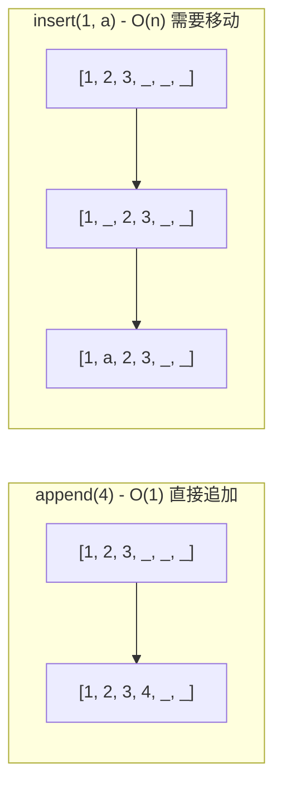
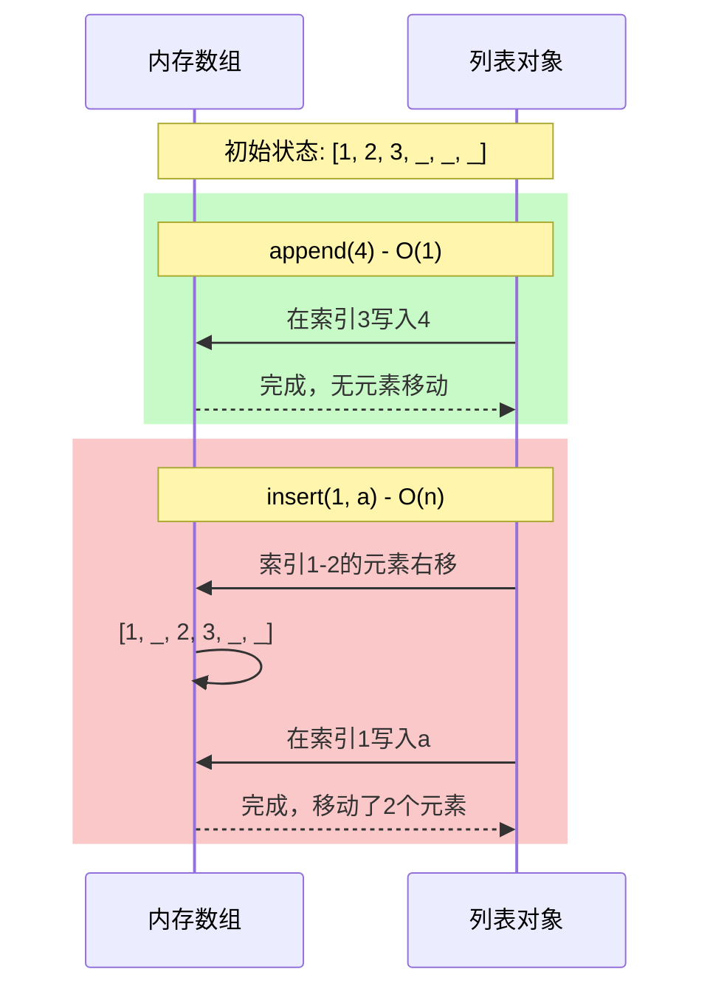

import { PyodideRunner } from '@site/src/components';
import CheatCard from '@site/src/components/CheatCard';

# 📦 列表（List）

列表（`list`）是 Python 中最灵活、使用频率最高的内置数据结构之一。它是一个**有序、可变**的序列容器，能够容纳任意类型的对象，并支持高效的尾部增删以及丰富的操作方法。掌握列表是写出 Pythonic 代码的第一步。

## 📌 本节要点

- 列表是有序、可变序列，支持任意类型元素混存
- 增删改查：`append`、`insert`、`pop`、`remove`、`del`
- 切片 `[start:stop:step]` 实现子序列提取、步长遍历、反转
- 列表推导式 `[expr for x in iter if cond]` 是创建列表的 Pythonic 方式
- 浅拷贝 vs 深拷贝：`list()` / `[:]` 浅拷贝，`copy.deepcopy()` 深拷贝
- `sort()` 原地排序 vs `sorted()` 返回新列表，`key` 参数自定义排序规则

<PyodideRunner title="列表操作快速体验">

```py
# 列表推导式与常用操作
numbers = [1, 2, 3, 4, 5, 6, 7, 8, 9, 10]

# 列表推导式：筛选偶数并平方
squares = [x ** 2 for x in numbers if x % 2 == 0]
print(f"偶数的平方: {squares}")

# 列表切片
print(f"前5个: {numbers[:5]}")
print(f"后3个: {numbers[-3:]}")

# 列表统计
print(f"总和: {sum(numbers)}")
print(f"平均值: {sum(numbers) / len(numbers)}")

# 列表排序
fruits = ["banana", "apple", "cherry", "date"]
fruits.sort()
print(f"排序后: {fruits}")
```

</PyodideRunner>

## 创建列表

创建列表有多种方式，最常见的是使用方括号 `[]` 字面量。

```py title="Python"
# 1. 字面量创建
fruits = ["apple", "banana", "cherry"]
print(fruits)  # ['apple', 'banana', 'cherry']

# 2. 使用 list() 构造器从可迭代对象转换
letters = list("python")
print(letters)  # ['p', 'y', 't', 'h', 'o', 'n']

# 3. 创建空列表
empty: list[int] = []
also_empty = list()

# 4. 列表中可以混合不同类型
mixed = [1, "two", 3.0, [4, 5], True]
print(mixed)  # [1, 'two', 3.0, [4, 5], True]
```

:::tip[使用类型注解]
在 Python 3.9+ 中，可以直接使用 `list[int]` 作为类型注解，无需从 `typing` 导入 `List`。Python 3.12 进一步强化了对泛型容器的注解支持。
:::

## 索引与切片

列表通过索引访问元素，索引从 `0` 开始；负索引从末尾反向计数，`-1` 表示最后一个元素。

```py title="Python"
nums = [10, 20, 30, 40, 50, 60]

# 正向索引
print(nums[0])   # 10
print(nums[3])   # 40

# 负索引
print(nums[-1])  # 60
print(nums[-2])  # 50

# 切片：[start:stop:step]
print(nums[1:4])    # [20, 30, 40]
print(nums[:3])    # [10, 20, 30]
print(nums[3:])    # [40, 50, 60]
print(nums[::2])   # [10, 30, 50]  步长为 2
print(nums[::-1])  # [60, 50, 40, 30, 20, 10]  反转列表
```

:::warning[索引越界]
直接用超出范围的索引访问会抛出 `IndexError`。切片则不会越界报错，而是返回可用的部分，这是切片和索引的一个重要差异。
:::

```py title="Python"
nums = [10, 20, 30]
# print(nums[5])  # IndexError: list index out of range
print(nums[1:100])  # [20, 30]  切片安全
```

## 增删改查

### 修改元素

通过索引或切片直接赋值即可修改元素。

```py title="Python"
nums = [10, 20, 30, 40]
nums[1] = 99
print(nums)  # [10, 99, 30, 40]

# 切片赋值可替换一段区间，长度可以不同
nums[1:3] = [100, 200, 300]
print(nums)  # [10, 100, 200, 300, 40]
```

### 添加元素

```py title="Python"
fruits = ["apple", "banana"]

# append: 在末尾追加单个元素
fruits.append("cherry")
print(fruits)  # ['apple', 'banana', 'cherry']

# insert: 在指定位置插入元素
fruits.insert(1, "avocado")
print(fruits)  # ['apple', 'avocado', 'banana', 'cherry']

# extend: 追加另一个可迭代对象的所有元素
fruits.extend(["date", "elderberry"])
print(fruits)  # ['apple', 'avocado', 'banana', 'cherry', 'date', 'elderberry']

# 使用 + 拼接（生成新列表，不修改原列表）
more = fruits + ["fig"]
print(more[-1])  # fig
```

:::info[append vs extend]
`append` 把参数作为**一个整体**加进去；`extend` 把可迭代对象**展开**逐个追加。混用是初学者常见的坑。
:::

```py title="Python"
data = [1, 2, 3]
data.append([4, 5])   # [1, 2, 3, [4, 5]]
data2 = [1, 2, 3]
data2.extend([4, 5])  # [1, 2, 3, 4, 5]
```

### append vs insert 的内存操作差异

列表在底层是连续的内存数组。`append()` 在末尾添加元素（O(1)），而 `insert()` 需要移动后续元素（O(n)）：





### 删除元素

Python 提供多种删除方式，各有适用场景。

```py title="Python"
fruits = ["apple", "banana", "cherry", "banana", "date"]

# remove: 按值删除第一个匹配项（不存在会抛 ValueError）
fruits.remove("banana")
print(fruits)  # ['apple', 'cherry', 'banana', 'date']

# pop: 按索引删除并返回该元素，默认删除最后一个
last = fruits.pop()
print(last, fruits)  # date ['apple', 'cherry', 'banana']

middle = fruits.pop(1)
print(middle, fruits)  # cherry ['apple', 'banana']

# del 语句：按索引或切片删除
del fruits[0]
print(fruits)  # ['banana']

# clear: 清空整个列表
fruits.clear()
print(fruits)  # []
```

| 方法/语句 | 说明 | 返回值 |
| --- | --- | --- |
| `remove(x)` | 删除第一个等于 `x` 的元素 | 无（`None`） |
| `pop(i)` | 删除索引 `i` 处元素（默认末尾） | 被删除的元素 |
| `del lst[i]` | 删除索引/切片对应元素 | 无 |
| `clear()` | 清空列表 | 无 |

### 时间复杂度速查表

| 操作 | 时间复杂度 |
| :--- | :--- |
| `append(x)` | O(1) |
| `pop()`（末尾） | O(1) |
| `insert(i, x)` | O(n) |
| `pop(i)` | O(n) |
| `remove(x)` | O(n) |
| `del lst[i]` | O(n) |
| `x in lst`（成员查找） | O(n) |
| `lst[i]`（索引访问） | O(1) |
| `len(lst)` | O(1) |

## 列表常用方法

```py title="Python"
nums = [3, 1, 4, 1, 5, 9, 2, 6]

# count: 统计某元素出现次数
print(nums.count(1))  # 2

# index: 查找元素首次出现的索引
print(nums.index(5))  # 4

# copy: 创建浅拷贝
copy_nums = nums.copy()

# reverse: 原地反转
nums.reverse()
print(nums)  # [6, 2, 9, 5, 1, 4, 1, 3]
```

## 排序

排序有两种方式：原地排序 `list.sort()` 和生成新列表的 `sorted()` 函数。

```py title="Python"
nums = [3, 1, 4, 1, 5, 9, 2, 6]

# sorted: 返回新列表，原列表不变
ascending = sorted(nums)
descending = sorted(nums, reverse=True)
print(ascending)   # [1, 1, 2, 3, 4, 5, 6, 9]
print(descending)  # [9, 6, 5, 4, 3, 2, 1, 1]
print(nums)        # [3, 1, 4, 1, 5, 9, 2, 6]  原列表未变

# sort: 原地排序，返回 None
nums.sort()
print(nums)  # [1, 1, 2, 3, 4, 5, 6, 9]

# 用 key 指定排序依据
words = ["banana", "apple", "cherry", "date"]
words.sort(key=len)
print(words)  # ['date', 'apple', 'banana', 'cherry']
```

:::tip[key 函数]
`key` 接受一个函数，对每个元素计算"排序键"。常用 `len`、`str.lower`、`abs`，或用 `lambda` 自定义。
:::

```py title="Python"
students = [
    {"name": "Alice", "score": 88},
    {"name": "Bob", "score": 95},
    {"name": "Charlie", "score": 72},
]

# 按 score 降序
students.sort(key=lambda s: s["score"], reverse=True)
print([s["name"] for s in students])  # ['Bob', 'Alice', 'Charlie']
```

## copy 与深浅拷贝

赋值只是绑定引用，修改一方另一方也会变。要真正复制列表，需理解**浅拷贝**和**深拷贝**。

```py title="Python"
import copy

original = [[1, 2], [3, 4]]

# 引用：完全同步
ref = original
ref[0][0] = 99
print(original)  # [[99, 2], [3, 4]]  原列表也被改了

original = [[1, 2], [3, 4]]

# 浅拷贝：复制外层，内层仍共享
shallow = original.copy()       # 等价于 list(original) 或 original[:]
shallow[0][0] = 99
print(original)  # [[99, 2], [3, 4]]  内层被改了

original = [[1, 2], [3, 4]]

# 深拷贝：递归复制所有层级
deep = copy.deepcopy(original)
deep[0][0] = 99
print(original)  # [[1, 2], [3, 4]]  完全独立
```

:::warning[嵌套结构的拷贝陷阱]
对于一维列表，浅拷贝就够用。但只要列表里装着可变对象（嵌套列表、字典等），想让副本完全独立就必须用 `copy.deepcopy`。
:::

## 列表推导式预告

列表推导式是 Python 中创建列表的优雅写法，本节先做铺垫，详细内容见[推导式](./comprehensions)一章。

```py title="Python"
# 传统写法
squares = []
for x in range(5):
    squares.append(x * x)

# 推导式写法
squares = [x * x for x in range(5)]
print(squares)  # [0, 1, 4, 9, 16]
```

## in 与 len

```py title="Python"
fruits = ["apple", "banana", "cherry"]

# in: 成员测试
print("banana" in fruits)   # True
print("date" not in fruits)  # True

# len: 获取长度
print(len(fruits))  # 3
```

:::info[线性查找]
列表的 `in` 操作是线性扫描，时间复杂度 O(n)。如果需要频繁判断成员存在，建议改用集合（`set`），其查找是 O(1)。
:::

## 嵌套列表

列表可以嵌套，常用于表示矩阵、二维表格等。

```py title="Python"
matrix = [
    [1, 2, 3],
    [4, 5, 6],
    [7, 8, 9],
]

# 访问元素
print(matrix[1][2])  # 6  第 2 行第 3 列

# 遍历所有元素
for row in matrix:
    for value in row:
        print(value, end=" ")
    print()
# 输出：
# 1 2 3
# 4 5 6
# 7 8 9

# 用推导式构造 3x3 单位矩阵
identity = [[1 if i == j else 0 for j in range(3)] for i in range(3)]
print(identity)  # [[1, 0, 0], [0, 1, 0], [0, 0, 1]]
```

:::warning[初始化嵌套列表的陷阱]
不要用 `[[0] * 3] * 3` 创建矩阵，外层的三个引用指向同一个内层列表，改一行会全跟着变。应使用推导式：`[[0] * 3 for _ in range(3)]`。
:::

```py title="Python"
# 错误示范
bad = [[0] * 3] * 3
bad[0][0] = 1
print(bad)  # [[1, 0, 0], [1, 0, 0], [1, 0, 0]]  全变了

# 正确写法
good = [[0] * 3 for _ in range(3)]
good[0][0] = 1
print(good)  # [[1, 0, 0], [0, 0, 0], [0, 0, 0]]
```

## 实战：待办事项管理

下面用列表实现一个简单的命令行待办事项管理器，综合运用增删改查与排序。

```py title="Python"
from datetime import date


def main() -> None:
    todos: list[dict] = [
        {"task": "学习 Python 列表", "done": True, "priority": 2},
        {"task": "完成数据结构作业", "done": False, "priority": 1},
        {"task": "整理学习笔记", "done": False, "priority": 3},
    ]

    # 1. 添加新任务
    todos.append({"task": "复习切片操作", "done": False, "priority": 2})

    # 2. 标记完成（找到第一个未完成且优先级最高的任务）
    todos.sort(key=lambda t: t["priority"])
    for todo in todos:
        if not todo["done"]:
            todo["done"] = True
            print(f"已完成: {todo['task']}")
            break

    # 3. 删除已完成的任务
    todos = [t for t in todos if not t["done"]]

    # 4. 打印剩余任务
    print(f"\n剩余待办（{len(todos)} 项）:")
    for i, todo in enumerate(todos, start=1):
        flag = "✔" if todo["done"] else " "
        print(f"  {i}. [{flag}] (P{todo['priority']}) {todo['task']}")


if __name__ == "__main__":
    main()
```

运行结果示意：

```
已完成: 完成数据结构作业

剩余待办（2 项）:
  1. [ ] (P2) 学习 Python 列表
  2. [ ] (P2) 复习切片操作
```

:::tip[真实场景]
实际项目中，待办事项更适合用字典或自定义类来表达，本例主要演示列表作为容器的用法。`enumerate(todos, start=1)` 是生成带序号输出的常用技巧。
:::

## ⚡ 性能对比

### 列表 vs 其他数据结构

| 数据结构 | 成员查找 | 末尾追加 | 任意插入 | 适用场景 |
|----------|----------|----------|----------|----------|
| `list` | O(n) | O(1) | O(n) | 需要按索引访问的有序集合 |
| `tuple` | O(n) | N/A | N/A | 不可变序列，字典键 |
| `set` | O(1) | O(1) | O(n) | 去重、成员测试 |
| `deque` | O(n) | O(1) | O(n) | 频繁头部操作 |

### 常见操作性能对比

```py title="Python"
import timeit
from collections import deque

# 列表头部插入 vs deque 头部插入
list_time = timeit.timeit('lst.insert(0, 1)', setup='lst = list(range(10000))', number=1000)
deque_time = timeit.timeit('d.appendleft(1)', setup='from collections import deque; d = deque(range(10000))', number=1000)

print(f"列表头部插入: {list_time:.4f}s")
print(f"deque 头部插入: {deque_time:.4f}s")
print(f"deque 快 {list_time/deque_time:.1f} 倍")
```

## ✅ 最佳实践

### 1. 选择合适的数据结构

```py title="Python"
# ❌ 需要频繁成员测试时使用列表
if item in large_list:  # O(n)
    process(item)

# ✅ 转换为 set 进行 O(1) 成员测试
large_set = set(large_list)
if item in large_set:  # O(1)
    process(item)
```

### 2. 避免在循环中修改列表

```py title="Python"
# ❌ 危险：边遍历边删除
nums = [1, 2, 3, 4, 5]
for n in nums:
    if n % 2 == 0:
        nums.remove(n)  # 可能跳过元素

# ✅ 正确：使用列表推导式创建新列表
nums = [n for n in nums if n % 2 != 0]
```

### 3. 使用生成器处理大数据

```py title="Python"
# ❌ 内存占用大
def get_squares(n):
    return [x**2 for x in range(n)]

# ✅ 惰性求值，内存友好
def get_squares(n):
    return (x**2 for x in range(n))
```

### 4. 优先使用内置函数

```py title="Python"
# ❌ 手动实现
total = 0
for x in nums:
    total += x

# ✅ 使用内置 sum
total = sum(nums)
```

## 🎯 动手练习

### 🟢 入门题

1. **列表创建**：创建一个包含 5 个数字的列表，然后分别使用 `append()`、`insert()`、`extend()` 添加元素
2. **切片练习**：使用切片操作提取列表的奇数索引元素和偶数索引元素
3. **列表排序**：使用 `sort()` 和 `sorted()` 对列表进行排序，对比原地排序和返回新列表的区别

### 🟡 进阶题

4. **列表去重**：分别使用 `set()`、`dict.fromkeys()` 和循环实现列表去重，对比保序与非保序的差异
5. **矩阵操作**：编写函数实现矩阵转置（使用嵌套推导式和 `zip(*matrix)` 两种方式）
6. **浅拷贝陷阱**：创建一个嵌套列表 `[[1, 2], [3, 4]]`，演示浅拷贝和深拷贝的区别

### 🔴 挑战题

7. **性能对比**：使用 `timeit` 对比 `list.insert(0, x)` 和 `deque.appendleft(x)` 的性能差异
8. **自定义列表**：实现一个支持负数索引的自定义列表类（`MyList`）

### 💭 思考题

9. 为什么 Python 的列表使用动态数组而不是链表？这对性能有什么影响？
10. 列表的 `in` 操作时间复杂度是 O(n)，如何优化频繁的成员测试？

## 📚 延伸阅读

- [Python 列表文档](https://docs.python.org/zh-cn/3/library/stdtypes.html#lists) - 官方列表类型详解
- [PEP 8 - 编程建议](https://peps.python.org/pep-0008/#programming-recommendations) - 列表操作的最佳实践
- [collections.deque 文档](https://docs.python.org/zh-cn/3/library/collections.html#collections.deque) - 双端队列详解
- [copy 模块文档](https://docs.python.org/zh-cn/3/library/copy.html) - 浅拷贝与深拷贝机制

## 🔗 进阶话题

如需深入了解：
- [性能分析与优化](/docs/performance/profiling) - 掌握 cProfile、line_profiler 等性能分析工具
- [推导式进阶](/docs/data-structures/comprehensions) - 列表、集合、字典推导式的高级用法
- [Pythonic 风格](/docs/advanced/pythonic) - 编写地道的 Python 代码

<CheatCard
    title="速查表"
    headers={["操作","方法/语法","时间复杂度"]}
    rows={[["创建列表","`[1, 2, 3]` 或 `list(iterable)`","O(n)"],["索引访问","`lst[i]`","O(1)"],["切片","`lst[start:stop:step]`","O(k)"],["末尾追加","`lst.append(x)`","O(1)"],["末尾弹出","`lst.pop()`","O(1)"],["任意插入","`lst.insert(i, x)`","O(n)"],["按值删除","`lst.remove(x)`","O(n)"],["成员查找","`x in lst`","O(n)"],["排序","`lst.sort()` 或 `sorted(lst)`","O(n log n)"],["反转","`lst.reverse()` 或 `lst[::-1]`","O(n)"],["浅拷贝","`lst.copy()` 或 `lst[:]`","O(n)"],["深拷贝","`copy.deepcopy(lst)`","O(n)"]]}
  />
## ✅ 本节总结

- 列表是**有序、可变**的序列容器，支持任意类型元素
- 索引从 `0` 开始，负索引从末尾反向计数，切片不会越界
- `append()` 在末尾追加 O(1)，`insert()` 在任意位置插入 O(n)
- `remove()` 按值删除，`pop()` 按索引删除并返回值
- `sort()` 原地排序返回 `None`，`sorted()` 返回新列表
- 浅拷贝只复制外层，深拷贝递归复制所有层级
- 嵌套列表初始化用推导式 `[[0]*3 for _ in range(3)]`，不要用 `[[0]*3]*3`
- 频繁头部操作应使用 `collections.deque` 而非 `list`