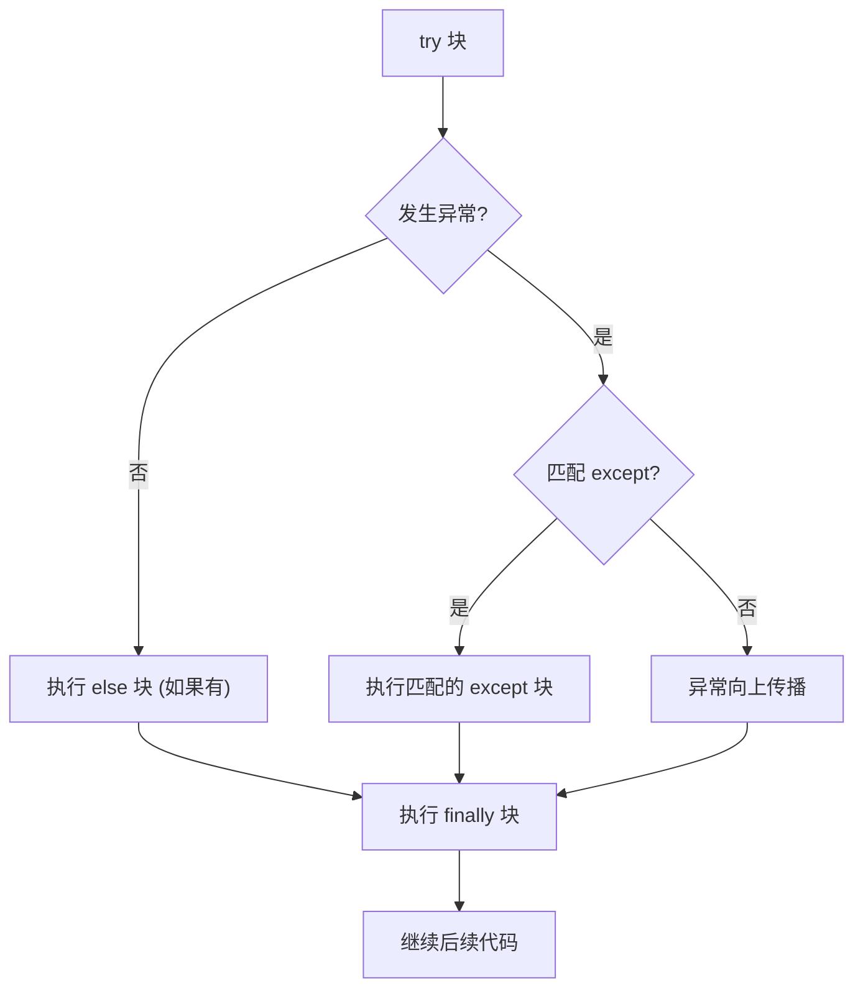

import { PyodideRunner } from '@site/src/components';

# 🛡️ try-except 语句

`try-except` 是 Python 处理异常的核心语法。它使得"可能出错的代码"和"出错后的处理逻辑"能清晰地分开，从而写出既健壮又易读的程序。在飞行控制系统中，传感器数据采集、参数校验、设备通信等环节都可能出错，合理的异常处理是保障飞行安全的关键。本节将系统介绍 `try-except-else-finally` 的完整结构、多异常捕获、异常传递与链式抛出，以及 Python 3.11+ 引入的 `ExceptionGroup` 与 `except*` 语法。

## 📌 本节要点
- `try-except-else-finally` 完整结构：try 放可能抛异常的代码，except 捕获处理，else 成功后执行，finally 清理
- `as` 绑定异常对象，便于读取错误信息和属性
- 多异常捕获：`except (A, B, C):` 元组语法，共用处理逻辑
- 捕获顺序：先具体后宽泛，父类异常放在子类之后
- 永远不要用裸 `except:` 或 `except BaseException:`，用 `except Exception:` 兜底
- `raise` 重新抛出当前异常，保留原始 Traceback
- `raise X from Y` 显式链式异常，`raise X from None` 抑制链
- Python 3.11+ `ExceptionGroup` + `except*` 处理并发场景下的多个异常

<PyodideRunner title="try-except 快速体验">

```py
# 基本 try-except
def safe_convert(text):
    try:
        return int(text)
    except ValueError:
        print(f"无法转换 '{text}' 为整数")
        return None

print(safe_convert("42"))
print(safe_convert("abc"))

# try-except-else-finally
def process_data(data):
    try:
        result = sum(data)
    except TypeError:
        print("数据类型错误")
        return None
    else:
        # 只有 try 成功才执行
        print(f"计算成功: {result}")
        return result
    finally:
        # 无论如何都会执行
        print("处理完成")

print(process_data([1, 2, 3]))
print(process_data("invalid"))

# 多异常捕获
def divide(a, b):
    try:
        return a / b
    except ZeroDivisionError:
        return "除数不能为零"
    except TypeError:
        return "类型错误"

print(divide(10, 2))
print(divide(10, 0))
print(divide("10", 2))
```

</PyodideRunner>

## 基本结构

最简单的形式：把可能抛出异常的代码放进 `try` 块，后面跟一个或多个 `except` 子句捕获并处理异常。

```py title="Python"
import numpy as np

def read_sensor(altitude: float) -> float:
    """读取气压高度传感器，传感器可能返回无效值"""
    try:
        raw_value = 101325.0 - altitude * 12.0  # 模拟气压计算
        if raw_value < 0:
            raise ValueError(f"气压值异常：{raw_value:.1f} Pa")
        return raw_value
    except ValueError as e:
        print(f"传感器读数异常：{e}，使用默认值")
        return 101325.0  # 海平面标准气压

result = read_sensor(-100)
# 输出：传感器读数异常：气压值异常：101445.0 Pa，使用默认值
```

执行流程：

try-except 的执行流程：



:::tip[except 必须匹配异常类型]
`except ValueError` 只能捕获 `ValueError` 及其子类。捕获范围之外的异常会照常向上传播。捕获过宽（如 `except BaseException`）会掩盖意外错误，应避免。
:::

### as 绑定异常对象

用 `as` 把异常对象绑定到变量，可以读取异常信息或调用其方法：

```py title="Python"
import numpy as np

def parse_attitude(data: str) -> np.ndarray:
    """解析姿态角数据（roll, pitch, yaw）"""
    try:
        values = np.array([float(x) for x in data.split(",")])
        if len(values) != 3:
            raise ValueError(f"姿态角需要3个值，实际得到{len(values)}个")
        return values
    except ValueError as exc:
        print(f"解析失败：{exc}")
        print(f"异常类型：{type(exc).__name__}")
        print(f"参数列表：{exc.args}")
        return np.zeros(3)

parse_attitude("10.5,20.3")
# 输出：
# 解析失败：姿态角需要3个值，实际得到2个
# 异常类型：ValueError
# 参数列表：('姿态角需要3个值，实际得到2个',)
```

:::info[异常变量的作用域]
Python 3 中，`except ... as exc` 绑定的 `exc` 在 `except` 块结束时会被自动删除，避免循环引用导致的内存泄漏。这意味着不能在 `except` 块外面再使用 `exc`：

```py title="Python"
try:
    np.array([1.0, 2.0, 3.0]) / 0
except ZeroDivisionError as exc:
    pass
print(exc)  # NameError: name 'exc' is not defined
```

如果需要在 `except` 块外使用，可以提前赋值给一个外部变量。
:::

## 捕获多种异常

### 多个 except 子句

把不同异常的处理逻辑分开写，便于针对性处理：

```py title="Python"
import numpy as np

def validate_flight_param(name: str, value: float, min_val: float, max_val: float):
    """验证飞行参数范围"""
    try:
        if not isinstance(value, (int, float)):
            raise TypeError(f"{name} 必须是数值类型，得到 {type(value).__name__}")
        if np.isnan(value):
            raise ValueError(f"{name} 不能为 NaN")
        if value < min_val or value > max_val:
            raise ValueError(f"{name}={value} 超出范围 [{min_val}, {max_val}]")
        return True
    except TypeError as e:
        print(f"类型错误：{e}")
        return False
    except ValueError as e:
        print(f"值错误：{e}")
        return False

print(validate_flight_param("推力", 85.0, 0, 100))    # True
print(validate_flight_param("攻角", "abc", -10, 20))  # 类型错误
print(validate_flight_param("滚转角", 45.0, -30, 30)) # 值错误
```

### 一个 except 捕获多种异常

把多个异常类型放进元组，共用同一段处理逻辑：

```py title="Python"
import numpy as np

def safe_sensor_read(sensor_data: dict, key: str) -> float:
    """安全读取传感器数据，处理多种可能的错误"""
    try:
        return float(sensor_data[key])
    except (KeyError, TypeError, IndexError) as exc:
        print(f"传感器读取失败：{exc}")
        return float("nan")

gyro_data = {"x": 0.01, "y": -0.002, "z": 0.005}
print(safe_sensor_read(gyro_data, "x"))  # 0.01
print(safe_sensor_read(gyro_data, "w"))  # 读取失败：'w' / nan
```

:::tip[单个异常无需元组]
捕获单个异常时可以直接写 `except ValueError:`，无需元组包裹。捕获多个异常时需要用元组：`except (ValueError, TypeError):`。
:::

### 捕获顺序

`except` 子句按从上到下的顺序匹配，**先匹配更具体的异常**。如果父类异常在前，子类异常的 except 永远不会被触发：

```py title="Python"
import numpy as np

def read_imu_data() -> np.ndarray:
    """读取 IMU 数据，可能抛出 KeyError 或 IndexError"""
    try:
        data = {"accel": [0.1, 0.2, 9.8]}
        return np.array(data["gyro"][0])  # KeyError 会先触发
    except LookupError:  # KeyError 是 LookupError 的子类，会先匹配这里
        print("被 LookupError 捕获了")
        return np.zeros(3)
    except KeyError:  # 这里永远不会执行（dead code）
        print("被 KeyError 捕获了")
        return np.zeros(3)

read_imu_data()
# 输出：被 LookupError 捕获了
```

正确做法是把更具体的异常放前面：

```py title="Python"
import numpy as np

def read_imu_data() -> np.ndarray:
    """读取 IMU 数据，可能抛出 KeyError 或 IndexError"""
    try:
        data = {"accel": [0.1, 0.2, 9.8]}
        return np.array(data["gyro"][0])
    except KeyError:  # 先匹配具体类型
        print("被 KeyError 捕获了：传感器键不存在")
        return np.zeros(3)
    except LookupError:  # 兜底
        print("被 LookupError 捕获了")
        return np.zeros(3)

read_imu_data()
# 输出：被 KeyError 捕获了：传感器键不存在
```

### 兜底捕获 Exception

如果需要捕获所有"普通异常"作为兜底，用 `except Exception`：

```py title="Python"
import numpy as np

def process_imu_measurement(imu_data: dict) -> np.ndarray:
    """处理 IMU 测量数据，包含多种可能的错误"""
    try:
        accel = np.array(imu_data["accel"])
        gyro = np.array(imu_data["gyro"])
        gravity = np.linalg.norm(accel)
        return gyro / gravity
    except KeyError as e:
        print(f"传感器数据缺少字段：{e}")
    except ValueError as e:
        print(f"数据格式错误：{e}")
    except Exception as e:  # 兜底，捕获所有其他 Exception 子类
        print(f"未预期的错误：{type(e).__name__}: {e}")
        raise  # 重新抛出，让上层也知晓
```

:::warning[永远不要用 except: 裸捕获]
**绝对不要**写裸的 `except:` 或 `except BaseException:`，这会同时捕获 `KeyboardInterrupt`、`SystemExit` 等系统信号，导致 Ctrl+C 都无法中断程序。如果确实要兜底，用 `except Exception:`。
:::

## else 子句

`else` 子句**只在 try 块没有抛出异常时执行**。它适合放"成功后的处理逻辑"，让 `try` 块只包含真正可能抛异常的代码——这样能避免捕获到本不该捕获的异常。

```py title="Python"
import numpy as np

def read_barometer(altitude: float) -> float | None:
    """读取气压高度计，成功后计算气压值"""
    try:
        if altitude < -500:
            raise ValueError(f"高度值异常：{altitude}m")
        raw_pressure = 101325.0 * np.exp(-altitude / 8500.0)
    except ValueError as e:
        print(f"气压计读取失败：{e}")
        return None
    else:
        # try 块成功完成才执行这里
        print(f"气压计读取成功，高度 {altitude}m 对应气压 {raw_pressure:.1f} Pa")
        return raw_pressure

print(read_barometer(1000))
# 输出：
# 气压计读取成功，高度 1000m 对应气压 89876.4 Pa
# 89876.37121064808
```

### 为什么需要 else

考虑下面的反面例子——把后续逻辑也放进 try 块：

```py title="Python"
import numpy as np

# 不推荐：把后续逻辑也塞进 try 块
try:
    altitude = float(input("请输入高度（m）："))
    pressure = 101325.0 * np.exp(-altitude / 8500.0)
    temperature = 288.15 - 0.0065 * altitude  # 温度递减率
    print(f"气压：{pressure:.1f} Pa，温度：{temperature:.1f} K")
except ValueError:
    print("输入不是数字")
# 问题：temperature 的计算也可能抛出其他异常，
#       但也会被这个 except 捕获，本不是我们想处理的！
```

正确做法是用 `else` 隔离"可能抛 ValueError 的部分"和"成功后的后续逻辑"：

```py title="Python"
import numpy as np

# 推荐：用 else 隔离
try:
    altitude = float(input("请输入高度（m）："))
except ValueError:
    print("输入不是数字")
else:
    # 只有解析成功才执行
    pressure = 101325.0 * np.exp(-altitude / 8500.0)
    temperature = 288.15 - 0.0065 * altitude
    print(f"气压：{pressure:.1f} Pa，温度：{temperature:.1f} K")
# 如果 altitude 为异常值，这里的异常会向上传播，不会被误捕获
```

:::tip[try 块要尽量"瘦"]
最佳实践：`try` 块中只放**真正可能抛出待捕获异常的代码**，其他逻辑放到 `else` 里。这样能避免意外捕获到不该处理的异常，也让代码意图更清晰。
:::

## finally 子句

`finally` 子句**无论是否抛出异常都会执行**，通常用于资源清理（关闭文件、释放锁、断开连接）。

```py title="Python"
import numpy as np
from typing import TextIO

def read_flight_log(path: str) -> np.ndarray | None:
    """读取飞行日志文件，无论成功失败都要关闭文件句柄"""
    f: TextIO | None = None
    try:
        f = open(path, "r")
        lines = f.readlines()
        return np.array([float(line.strip()) for line in lines])
    except (FileNotFoundError, ValueError) as e:
        print(f"飞行日志读取失败：{e}")
        return None
    finally:
        if f is not None:
            f.close()
        print("文件句柄已释放")
```

### finally 的关键特性

1. **始终执行**：即使 try 块里有 `return`、`break`、`continue`，`finally` 仍会执行
2. **吞异常的陷阱**：`finally` 中的 `return` 或抛出新异常会**覆盖**原异常
3. **异常重新抛出前执行**：异常未被 except 捕获时，`finally` 仍会先执行

```py title="Python"
import numpy as np

def demo_return_in_finally(altitude: float) -> float:
    """演示 finally 中 return 的陷阱"""
    try:
        return altitude * 1.1  # 模拟高度修正
    finally:
        return 0.0  # ← 这会覆盖 try 的返回值！

print(demo_return_in_finally(1000))  # 输出：0.0
```

:::warning[不要在 finally 里 return]
`finally` 块里写 `return` 是一个隐蔽的 bug 来源——它会覆盖 `try` 块的返回值，甚至会吞掉 `try` 块中抛出的异常。`finally` 应该只用于"清理"，不要用于"返回结果"。
:::

## 完整结构

`try-except-else-finally` 的完整形式：

```py {5,8,11,16,21} title="Python"
import numpy as np

def read_and_process_sensor(sensor_id: str, data: dict) -> float | None:
    """读取传感器并处理数据，演示完整结构"""
    try:
        raw = data[sensor_id]
        value = float(raw)
    except KeyError as e:
        print(f"传感器 {sensor_id} 不存在：{e}")
        return None
    except (ValueError, TypeError) as e:
        print(f"传感器 {sensor_id} 数据解析失败：{e}")
        return None
    else:
        # 数据读取和解析都成功
        calibrated = value * 1.02  # 校准系数
        print(f"传感器 {sensor_id} 读取成功：原始={value:.2f}，校准后={calibrated:.2f}")
        return calibrated
    finally:
        print(f"传感器 {sensor_id} 数据处理完成")

# 测试
sensor_data = {"gyro_x": "0.015", "gyro_y": "0.003", "gyro_z": "-0.002"}
print(read_and_process_sensor("gyro_x", sensor_data))
# 输出：
# 传感器 gyro_x 读取成功：原始=0.02，校准后=0.02
# 传感器 gyro_x 数据处理完成
# 0.0153

print(read_and_process_sensor("gyro_w", sensor_data))
# 输出：
# 传感器 gyro_w 不存在：'gyro_w'
# 传感器 gyro_w 数据处理完成
# None
```

### 执行顺序总结

| 情况 | 执行顺序 |
| --- | --- |
| try 无异常 | try → else → finally |
| try 抛异常且被捕获 | try → except → finally |
| try 抛异常未被捕获 | try → finally（异常继续传播） |
| try 中 return | return 前先执行 finally |

## raise 重新抛出

`except` 块里用裸 `raise` 可以重新抛出当前捕获的异常，保留完整的原始 Traceback：

```py title="Python"
import numpy as np

def load_imu_calibration(path: str) -> dict:
    """加载 IMU 校准参数，文件不存在时记录日志并向上层抛出"""
    try:
        with open(path) as f:
            lines = f.readlines()
            return {"bias": [float(x) for x in lines[0].split()]}
    except FileNotFoundError:
        print(f"IMU 校准文件 {path} 不存在，使用默认配置")
        raise  # 让上层调用者也知道这件事

try:
    config = load_imu_calibration("imu_cal.txt")
except FileNotFoundError:
    print("上层也处理了这个错误：无法加载校准参数")
```

### 部分处理后继续抛出

可以在 `except` 中做"日志记录"或"局部恢复"，然后重新抛出让上层做最终决策：

```py title="Python"
import logging
import numpy as np

logger = logging.getLogger(__name__)

def fetch_gps_position(drone_id: int) -> dict:
    """获取无人机 GPS 位置，网络异常时记录日志并重新抛出"""
    try:
        response = {"lat": 39.9042, "lon": 116.4074, "alt": 50.0}
        if drone_id > 100:
            raise ConnectionError("GPS 信号弱，无法定位")
        return response
    except ConnectionError as e:
        logger.warning("无人机 %d GPS 获取失败，可能是信号问题：%s", drone_id, e)
        raise  # 让上层决定是否重试或使用备用定位
```

## raise from 链式异常

有时我们可以在 `except` 块中抛出**另一种异常**，但希望保留原始异常作为"上下文"。Python 提供两种链式异常机制：

- `raise X from Y`：显式链式（`__cause__`），表示"由 Y 导致了 X"
- `raise X`（在 except 块中）：隐式链式（`__context__`），表示"在处理 X 时又发生了 X"

### 显式链式：raise ... from ...

```py title="Python"
import numpy as np

class SensorError(Exception):
    """传感器错误的基类"""

def load_accel_data(path: str) -> np.ndarray:
    """加载加速度计数据文件，将 IO 错误转换为传感器错误"""
    try:
        with open(path, encoding="utf-8") as f:
            lines = f.readlines()
            return np.array([float(line.strip()) for line in lines])
    except OSError as e:
        # 把 OSError 转成更友好的自定义异常，并保留原始信息
        raise SensorError(f"无法加载加速度计数据文件 {path}") from e

try:
    accel = load_accel_data("accel.csv")
except SensorError as exc:
    print(f"主异常：{exc}")
    print(f"原因：{exc.__cause__}")
    print(f"原因类型：{type(exc.__cause__).__name__}")
# 输出：
# 主异常：无法加载加速度计数据文件 accel.csv
# 原因：[Errno 2] No such file or directory: 'accel.csv'
# 原因类型：FileNotFoundError
```

打印 Traceback 时，Python 会显示：

```text title="输出"
  ...
OSError: [Errno 2] No such file or directory: 'accel.csv'

The above exception was the direct cause of the following exception:

  ...
SensorError: 无法加载加速度计数据文件 accel.csv
```

### 隐式链式：except 块内 raise

如果在 `except` 块里抛出新异常而不写 `from`，Python 也会自动把原异常作为上下文保存：

```py title="Python"
import numpy as np

def parse_attitude_strict(data: str) -> np.ndarray:
    """严格解析姿态角数据，异常时隐式链式"""
    try:
        values = np.array([float(x) for x in data.split(",")])
        return values
    except ValueError:
        # 不写 from，但 Python 仍保留原 ValueError 作为 __context__
        raise RuntimeError("姿态角数据格式不正确")

try:
    parse_attitude_strict("abc,def")
except RuntimeError as exc:
    print(f"主异常：{exc}")
    print(f"上下文：{exc.__context__}")
    print(f"上下文类型：{type(exc.__context__).__name__}")
# 输出：
# 主异常：姿态角数据格式不正确
# 上下文：could not convert string to float: 'abc'
# 上下文类型：ValueError
```

Traceback 中显示：

```text title="输出"
ValueError: could not convert string to float: 'abc'

During handling of the above exception, another exception occurred:

  ...
RuntimeError: 姿态角数据格式不正确
```

:::tip[显式 vs 隐式]
- 写 `raise X from Y` 时显示 "The above exception was the direct cause of..."
- 不写 `from` 时显示 "During handling of the above exception, another exception occurred:"

显式 `from` 表达"故意转换"的语义更清晰。如果是有意把低层异常转换成高层业务异常，**用 `raise ... from ...`**；如果是 except 块内部意外出错，保留隐式上下文即可。
:::

### 抑制链式：raise ... from None

如果确定不希望暴露原始异常（例如出于安全或简洁考虑），可以用 `from None` 抑制链：

```py title="Python"
import numpy as np

class FlightControllerError(Exception):
    """飞行控制器错误"""

def parse_control_command(token: str) -> dict:
    """解析控制指令，隐藏内部实现细节"""
    try:
        parts = token.split(":")
        return {"cmd": parts[0], "value": float(parts[1])}
    except Exception as e:
        # 只暴露友好信息，不暴露内部细节
        raise FlightControllerError("无效的控制指令") from None
```

Traceback 中将只显示 `FlightControllerError: 无效的控制指令`，不附带原始异常。**谨慎使用** `from None`——大多数情况下保留链式信息有助于调试。

## 不捕获 BaseException

`BaseException` 是所有异常的根类，包含了 `KeyboardInterrupt`（用户按 Ctrl+C）、`SystemExit`（`sys.exit()` 触发）、`GeneratorExit`（生成器关闭）等"非错误"信号。捕获它会带来严重问题：

```py title="Python"
# ❌ 反例：捕获 BaseException 会让 Ctrl+C 失效
import time

try:
    while True:
        time.sleep(1)
        print("飞行模拟运行中...")
except BaseException:  # Ctrl+C 会被这里吞掉，程序停不下来！
    print("捕获了某些异常")
```

:::warning[为什么不要捕获 BaseException]
- `KeyboardInterrupt`：用户主动中断，应让程序立即停止
- `SystemExit`：`sys.exit()` 触发，应让程序正常退出
- `GeneratorExit`：生成器被关闭的内部信号

如果用 `except BaseException` 或裸 `except:` 捕获它们，这些信号会变成普通异常被处理，程序无法被正常中断。**永远只用 `except Exception`（或更具体的异常类型）兜底。**
:::

正确做法：

```py title="Python"
# ✅ 正例：用 Exception 兜底，KeyboardInterrupt 仍能正常工作
import time

try:
    while True:
        time.sleep(1)
        print("飞行模拟运行中...")
except Exception as e:
    print(f"捕获到错误：{e}")
# 按 Ctrl+C 仍能正常中断程序（抛出 KeyboardInterrupt，未被捕获）
```

## Python 3.11+ ExceptionGroup

Python 3.11 引入了 `ExceptionGroup`（异常组）和 `except*` 语法，专门处理"一次操作可能同时抛出多个异常"的场景，典型应用是并发任务（`asyncio.TaskGroup`、`concurrent.futures`）。

### 为什么需要异常组

传统 `raise` 一次只能抛一个异常。但在并发场景下，多个任务可能同时失败：

```py title="Python"
import asyncio

async def read_imu_x():
    raise ValueError("IMU-X 传感器超时")

async def read_imu_y():
    raise KeyError("IMU-Y 数据缺失")

async def main():
    async with asyncio.TaskGroup() as tg:
        tg.create_task(read_imu_x())
        tg.create_task(read_imu_y())
    # TaskGroup 会等所有任务结束，把所有异常打包成 ExceptionGroup 抛出

asyncio.run(main())
```

执行后会看到：

```text title="输出"
  + Exception Group Traceback (most recent call last):
  |   File "...", line X, in main
  |     async with asyncio.TaskGroup() as tg:
  |   ~~~~~^^^^^^^^^^^^^^^^^^^^^^^^^^^^
  | ExceptionGroup: 2 exceptions were raised (2 sub-exceptions)
  +-+---------------- 1 ----------------
    | ValueError: IMU-X 传感器超时
    +---------------- 2 ----------------
    | KeyError: IMU-Y 数据缺失
    +------------------------------------
```

### except* 语法

普通 `except` 无法拆解 `ExceptionGroup` 内部的多个异常。Python 3.11 引入 `except*` 语法，能按类型分别处理组中的每个异常：

```py title="Python"
def run_sensor_batch():
    try:
        # 假设 run_all_sensors() 会抛 ExceptionGroup
        run_all_sensors()
    except* ValueError as eg:
        # eg 是 ExceptionGroup，包含所有 ValueError 子异常
        print(f"处理了 {len(eg.exceptions)} 个 ValueError")
        for exc in eg.exceptions:
            print(f"  - {exc}")
    except* KeyError as eg:
        print(f"处理了 {len(eg.exceptions)} 个 KeyError")
        for exc in eg.exceptions:
            print(f"  - {exc}")
```

### 手动创建 ExceptionGroup

也可以手动构造 `ExceptionGroup`：

```py title="Python"
errors = [
    ValueError("加速度计超时"),
    TypeError("数据类型错误"),
    ValueError("陀螺仪校准失败"),
]

try:
    raise ExceptionGroup("传感器批量读取失败", errors)
except* ValueError as eg:
    print(f"捕获到 {len(eg.exceptions)} 个 ValueError：")
    for exc in eg.exceptions:
        print(f"  - {exc}")
except* TypeError as eg:
    print(f"捕获到 {len(eg.exceptions)} 个 TypeError：")
    for exc in eg.exceptions:
        print(f"  - {exc}")
# 输出：
# 捕获到 2 个 ValueError：
#   - 加速度计超时
#   - 陀螺仪校准失败
# 捕获到 1 个 TypeError：
#   - 数据类型错误
```

:::info[except vs except*]
- `except ValueError:` 只能匹配单个 `ValueError` 实例，**不**匹配 `ExceptionGroup`
- `except* ValueError:` 会拆开 `ExceptionGroup`，把其中所有 `ValueError` 子异常收集起来交给处理代码
- 如果 `ExceptionGroup` 中有未被任何 `except*` 匹配的异常，会重新打包成新的 `ExceptionGroup` 继续向上抛

`except*` 是处理异常组的专用语法。
:::

### except* 与部分处理

`except*` 允许"部分处理"——只处理一部分异常，未处理的会被重新打包抛出：

```py title="Python"
def handle_sensor_batch():
    try:
        raise ExceptionGroup("传感器批量读取失败", [
            ValueError("加速度计超时"),
            ValueError("陀螺仪校准失败"),
            KeyError("磁力计数据缺失"),
            TypeError("气压计类型错误"),
        ])
    except* ValueError as eg:
        # 只处理 ValueError，其他的继续传播
        print(f"处理了 {len(eg.exceptions)} 个 ValueError")
    # KeyError 和 TypeError 会被重新打包成 ExceptionGroup 继续抛
```

:::tip[ExceptionGroup 不可拆解]
`ExceptionGroup` 本身**不能被普通 `except` 捕获**（除了 `except ExceptionGroup:` 或 `except BaseException`）。这是设计有意为之——它强制使用 `except*` 逐一处理组内异常，避免误吞部分异常。这也是为什么传统代码遇到 `ExceptionGroup` 会直接崩溃：需要专门处理。
:::

## 实战：健壮的传感器数据处理

下面实现一个飞行传感器数据采集与处理系统，综合运用 `try-except-else-finally`、多异常捕获、链式异常等技巧：

```py title="Python"
from __future__ import annotations

import numpy as np


class SensorError(Exception):
    """传感器错误的基类"""


class SensorNotFoundError(SensorError):
    """传感器不存在"""


class SensorDataError(SensorError):
    """传感器数据错误"""


def parse_sensor_value(text: str) -> float:
    """把字符串解析成传感器数值，转换内部异常为业务异常"""
    try:
        value = float(text)
    except ValueError as exc:
        raise SensorDataError(f"无法解析为数值：{text!r}") from exc
    if np.isnan(value) or np.isinf(value):
        raise SensorDataError(f"传感器数值异常：{text!r}")
    return value


def validate_range(name: str, value: float, min_val: float, max_val: float) -> float:
    """验证传感器数值范围"""
    try:
        if value < min_val or value > max_val:
            raise ValueError(f"{name}={value} 超出允许范围 [{min_val}, {max_val}]")
    except ValueError as exc:
        raise SensorDataError(f"校验失败：{exc}") from exc
    return value


class FlightSensorSystem:
    """飞行传感器系统，演示健壮的异常处理"""

    SENSORS = {
        "accel": {"min": -20.0, "max": 20.0, "unit": "m/s²"},
        "gyro": {"min": -500.0, "max": 500.0, "unit": "°/s"},
        "baro": {"min": 0.0, "max": 110000.0, "unit": "Pa"},
    }

    def read_sensor(self, sensor_id: str, raw_data: str) -> float | None:
        """读取并校验单个传感器数据"""
        try:
            if sensor_id not in self.SENSORS:
                raise SensorNotFoundError(f"未知传感器：{sensor_id}")
            value = parse_sensor_value(raw_data)
            spec = self.SENSORS[sensor_id]
            value = validate_range(sensor_id, value, spec["min"], spec["max"])
        except SensorNotFoundError as exc:
            print(f"传感器错误：{exc}")
            return None
        except SensorDataError as exc:
            print(f"数据错误：{exc}")
            return None
        except Exception as exc:
            print(f"未预期错误：{type(exc).__name__}: {exc}")
            return None
        else:
            print(f"{sensor_id} 读取成功：{value} {spec['unit']}")
            return value
        finally:
            pass  # 统计传感器调用次数等

    def read_all_sensors(self, data_batch: dict[str, str]) -> dict[str, float | None]:
        """批量读取所有传感器"""
        results = {}
        for sensor_id, raw in data_batch.items():
            results[sensor_id] = self.read_sensor(sensor_id, raw)
        return results


# 演示批量处理
if __name__ == "__main__":
    system = FlightSensorSystem()

    test_data = {
        "accel": "9.81",
        "gyro": "0.025",
        "baro": "101325",
        "mag": "50.0",       # 未知传感器
        "temp": "abc",       # 解析失败
    }

    print("批量传感器读取：")
    results = system.read_all_sensors(test_data)
    for name, value in results.items():
        status = f"{value}" if value is not None else "失败"
        print(f"  {name:<8} → {status}")
```

输出示例：

```text title="输出"
批量传感器读取：
accel  读取成功：9.81 m/s²
  accel    → 9.81
gyro   读取成功：0.025 °/s
  gyro     → 0.025
baro   读取成功：101325.0 Pa
  baro     → 101325.0
传感器错误：未知传感器：mag
  mag      → 失败
数据错误：无法解析为数值：'abc'
  temp     → 失败
```

:::tip[设计模式：内部异常 + 外部异常]
上面的代码示范了一个常见模式：内部用 `raise ... from ...` 把底层异常（`ValueError`、`KeyError`）转换成统一的业务异常 `SensorDataError`，对外只暴露友好信息，同时保留原始异常作为 `__cause__` 供调试。这让 API 调用者只需关心一种异常类型，简化错误处理代码。
:::

## 🎯 动手练习

1. **完整结构实践**：编写函数读取飞行日志文件，使用 try-except-else-finally 完整结构，处理 FileNotFoundError 和 ValueError
2. **多异常捕获**：实现安全的传感器数据解析函数，同时捕获 KeyError、TypeError、IndexError，用元组语法共用处理逻辑
3. **链式异常**：编写 IMU 校准文件加载函数，将 OSError 转换为 SensorError，使用 `raise ... from ...` 保留上下文
4. **ExceptionGroup 实验**：手动创建包含 ValueError、TypeError、KeyError 的 ExceptionGroup，用 `except*` 分别处理

## 📚 延伸阅读

- **自定义异常类**：继承 Exception 创建传感器异常体系，携带设备 ID、时间戳等上下文信息
- **上下文管理器**：`with` 语句自动管理传感器连接，替代 finally 块
- **日志记录**：`logging.exception()` 自动记录异常堆栈，飞行日志分析必备
- **asyncio 异常处理**：TaskGroup、ExceptionGroup 在多传感器并发采集中的应用

## 📊 速查表

| 语法 | 说明 | 示例 |
|------|------|------|
| 基本捕获 | `except Type:` | `except ValueError:` |
| 绑定异常 | `except Type as e:` | `except KeyError as e:` |
| 多异常元组 | `except (A, B):` | `except (KeyError, IndexError):` |
| 成功后执行 | `else:` | try 无异常时执行 |
| 始终执行 | `finally:` | 清理资源、关闭文件 |
| 重新抛出 | `raise` | 保留原始 Traceback |
| 显式链式 | `raise X from Y` | 转换异常，保留 `__cause__` |
| 抑制链 | `raise X from None` | 隐藏原始异常 |
| 异常组 | `ExceptionGroup(msg, [e1, e2])` | 并发场景多异常 |
| 拆解异常组 | `except* Type:` | 3.11+ 语法 |
| 兜底捕获 | `except Exception:` | 捕获所有普通异常 |
| 禁止裸捕获 | ❌ `except:` | 会吞掉 KeyboardInterrupt |

## ✅ 本节总结

本节我们系统学习了 try-except 语句，核心要点包括：

- **完整结构**：`try-except-else-finally`，try 尽量瘦，else 隔离成功后逻辑，finally 用于清理
- **多异常捕获**：元组语法 `except (A, B):` 共用处理逻辑，按从上到下顺序匹配
- **捕获顺序**：先具体后宽泛，父类异常放后面，避免子类 except 成为死代码
- **异常绑定**：`as exc` 绑定异常对象，可读取信息、属性，但作用域仅限 except 块内
- **重新抛出**：裸 `raise` 保留原始 Traceback，适合部分处理后让上层决策
- **链式异常**：`raise X from Y` 显式链式，`raise X from None` 抑制链，转换异常时保留上下文
- **ExceptionGroup**：3.11+ 引入，`except*` 拆解并发场景下的多个异常
- **禁止裸捕获**：永远不用 `except:` 或 `except BaseException:`，用 `except Exception:` 兜底

下一节我们将学习如何设计自定义异常类，构建清晰的传感器错误体系。
