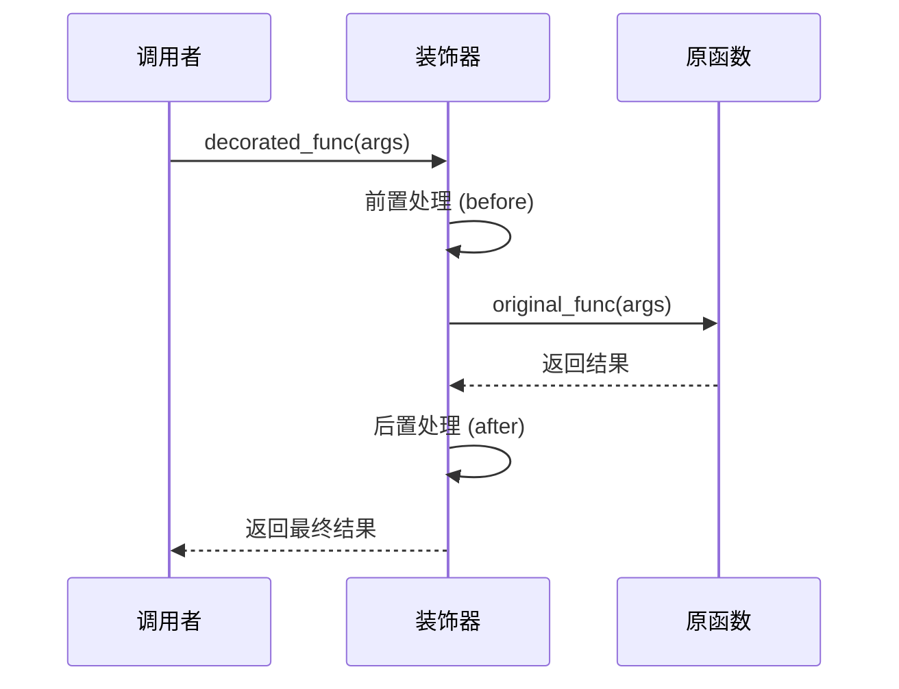

import { PyodideRunner } from '@site/src/components';

# ⚙️ 装饰器

装饰器（decorator）是 Python 中一种优雅的语法机制，它能在不修改函数源代码的前提下，给函数增加额外的功能。装饰器本质上是一个接收函数作为参数并返回新函数的高阶函数。它是闭包最经典的应用之一，广泛用于信号处理中的日志记录、性能监控、参数校验、结果缓存等场景。

## 📌 本节要点

- 装饰器是高阶函数：接收函数，返回新函数
- `@decorator` 语法糖等价于 `func = decorator(func)`
- `functools.wraps` 保留被装饰函数的元信息（名称、文档字符串）
- 带参数的装饰器：三层嵌套（参数 → 装饰器 → 包装函数）
- 类装饰器：实现 `__call__` 方法的类可作为装饰器
- 内置装饰器：`@property`、`@staticmethod`、`@classmethod`
- `@functools.lru_cache` / `@cache` 实现函数结果缓存

<PyodideRunner title="装饰器快速体验">

```py
from functools import wraps
import time

# 计时装饰器
def timer(func):
    @wraps(func)
    def wrapper(*args, **kwargs):
        start = time.perf_counter()
        result = func(*args, **kwargs)
        elapsed = time.perf_counter() - start
        print(f"[耗时] {func.__name__}: {elapsed:.6f}s")
        return result
    return wrapper

# 重试装饰器
def retry(max_attempts=3):
    def decorator(func):
        @wraps(func)
        def wrapper(*args, **kwargs):
            for attempt in range(1, max_attempts + 1):
                try:
                    return func(*args, **kwargs)
                except Exception as e:
                    print(f"  第 {attempt} 次尝试失败: {e}")
            raise Exception(f"函数 {func.__name__} 在 {max_attempts} 次尝试后失败")
        return wrapper
    return decorator

# 使用装饰器
@timer
def compute_sum(n):
    return sum(range(n))

result = compute_sum(1000000)
print(f"求和结果: {result}")

# 带参数的装饰器
@retry(max_attempts=2)
def divide(a, b):
    return a / b

try:
    print(divide(10, 0))
except Exception as e:
    print(f"最终错误: {e}")
```

</PyodideRunner>

## 函数是对象

要理解装饰器，首先要彻底理解"函数是一等对象"。函数可以：
- 赋值给变量
- 作为参数传递
- 作为返回值
- 拥有属性

```py title="Python"
import numpy as np

def lowpass_filter(signal, cutoff, fs):
    """对信号做低通滤波"""
    from scipy.signal import butter, filtfilt
    b, a = butter(4, cutoff / (fs / 2), btype='low')
    return filtfilt(b, a, signal)

# 1. 赋值给变量
filter_func = lowpass_filter
print(filter_func.__name__)  # 输出：lowpass_filter

# 2. 函数有属性
print(lowpass_filter.__doc__)  # 输出：对信号做低通滤波

# 3. 动态修改函数属性
lowpass_filter.fs_default = 1000  # 默认采样率
print(lowpass_filter.fs_default)  # 输出：1000
```

## 装饰器本质

装饰器本质是一个函数：它接收一个函数作为参数，返回一个**新的函数**（通常是包装过的版本）。

```py title="Python"
def log_signal(func):
    def wrapper(*args, **kwargs):
        print(f"[信号处理] 开始执行 {func.__name__}")
        result = func(*args, **kwargs)
        print(f"[信号处理] {func.__name__} 执行完毕")
        return result
    return wrapper

@log_signal
def compute_fft(signal):
    return np.fft.fft(signal)

# 手动装饰等价于：compute_fft = log_signal(compute_fft)
```

装饰器的执行流程：



## @ 语法糖

`@decorator` 是装饰器的语法糖，等价于 `func = decorator(func)`：

```py {1,5,9,12} title="Python"
def log_signal(func):
    def wrapper(*args, **kwargs):
        print(f"[信号处理] 开始执行 {func.__name__}")
        result = func(*args, **kwargs)
        print(f"[信号处理] {func.__name__} 执行完毕")
        return result
    return wrapper

@log_signal  # 等价于 compute_fft = log_signal(compute_fft)
def compute_fft(signal):
    return np.fft.fft(signal)

import numpy as np
signal = np.sin(2 * np.pi * 10 * np.arange(1000) / 1000)
result = compute_fft(signal)
```

输出：

```text title="输出"
[信号处理] 开始执行 compute_fft
[信号处理] compute_fft 执行完毕
```

### 处理参数和返回值

实用的装饰器需要能处理任意参数和返回值。使用 `*args, **kwargs` 配合返回原函数结果：

```py title="Python"
def log_call(func):
    def wrapper(*args, **kwargs):
        print(f"调用 {func.__name__}({args}, {kwargs})")
        result = func(*args, **kwargs)
        print(f"{func.__name__} 返回形状 {getattr(result, 'shape', type(result).__name__)}")
        return result
    return wrapper

@log_call
def design_butterworth(order, cutoff, fs):
    from scipy.signal import butter
    return butter(order, cutoff / (fs / 2), btype='low')

@log_call
def resample_signal(signal, target_len):
    return np.interp(np.linspace(0, 1, target_len), np.linspace(0, 1, len(signal)), signal)

print(design_butterworth(4, 100, 1000))
# 输出：
# 调用 design_butterworth((4, 100, 1000), {})
# design_butterworth 返回形状 tuple
# (array([0.00080649, 0.00322597, 0.00483895, 0.00322597, 0.00080649]), array([ 1.        , -3.18063855,  3.86119435, -2.11215536,  0.43826514]))
```

:::tip[通用 wrapper 模板]
通用的装饰器 wrapper 模板：
```py title="Python"
def decorator(func):
    def wrapper(*args, **kwargs):
        # 装饰前的逻辑
        result = func(*args, **kwargs)
        # 装饰后的逻辑
        return result
    return wrapper
```
:::

## 带参数装饰器

如果装饰器本身需要接收参数，需要再嵌套一层：外层函数接收参数，返回真正的装饰器。

```py title="Python"
def smooth(window_size=5):
    """对被装饰函数的返回值做滑动平均平滑"""
    def decorator(func):
        def wrapper(*args, **kwargs):
            result = func(*args, **kwargs)
            if hasattr(result, 'shape'):  # numpy array
                kernel = np.ones(window_size) / window_size
                return np.convolve(result, kernel, mode='same')
            return result
        return wrapper
    return decorator

@smooth(window_size=5)
def noisy_signal():
    return np.random.randn(100) + np.sin(np.linspace(0, 4 * np.pi, 100))

s = noisy_signal()  # 返回平滑后的信号
print(s.shape)  # 输出：(100,)
```

执行流程：
1. `smooth(5)` 返回 `decorator`
2. `decorator(noisy_signal)` 返回 `wrapper`
3. 调用 `noisy_signal()` 实际是调用 `wrapper()`

### 带参数装饰器模板

```py title="Python"
def decorator_with_args(arg1, arg2):
    def decorator(func):
        def wrapper(*args, **kwargs):
            # 这里可以使用 arg1, arg2
            result = func(*args, **kwargs)
            return result
        return wrapper
    return decorator
```

## functools.wraps

装饰器会替换原函数，导致原函数的元信息（`__name__`、`__doc__` 等）丢失：

```py title="Python"
def log_signal(func):
    def wrapper(*args, **kwargs):
        return func(*args, **kwargs)
    return wrapper

@log_signal
def compute_psd(signal, fs):
    """计算功率谱密度"""
    from scipy.signal import welch
    freqs, psd = welch(signal, fs=fs)
    return freqs, psd

print(compute_psd.__name__)  # 输出：wrapper  ← 不是 compute_psd！
print(compute_psd.__doc__)   # 输出：None
```

使用 `functools.wraps` 保留原函数元信息：

```py title="Python"
from functools import wraps

def log_signal(func):
    @wraps(func)  # 复制原函数的元信息到 wrapper
    def wrapper(*args, **kwargs):
        print(f"调用 {func.__name__}")
        return func(*args, **kwargs)
    return wrapper

@log_signal
def compute_psd(signal, fs):
    """计算功率谱密度"""
    from scipy.signal import welch
    freqs, psd = welch(signal, fs=fs)
    return freqs, psd

print(compute_psd.__name__)  # 输出：compute_psd  ← 正确
print(compute_psd.__doc__)   # 输出：计算功率谱密度  ← 正确
print(compute_psd.__wrapped__)  # Python 3.2+ 可访问原函数
```

:::warning[永远使用 @wraps]
编写装饰器时**永远**记得在 wrapper 上加 `@wraps(func)`，否则：
- 调试时堆栈跟踪中显示的是 `wrapper`，难以定位
- 文档工具（如 Sphinx、help）失效
- 一些依赖函数元信息的库会出错
:::

## 类装饰器

装饰器也可以是类，利用 `__call__` 方法让实例可调用：

```py title="Python"
class SignalProcessor:
    """统计信号处理函数调用次数"""
    def __init__(self, func):
        self.func = func
        self.count = 0
        wraps(func)(self)  # 复制元信息

    def __call__(self, *args, **kwargs):
        self.count += 1
        print(f"第 {self.count} 次调用 {self.func.__name__}")
        return self.func(*args, **kwargs)

@SignalProcessor
def fft_analysis(signal):
    return np.abs(np.fft.fft(signal))

import numpy as np
s = np.sin(2 * np.pi * 10 * np.arange(256) / 256)
fft_analysis(s)  # 第 1 次调用 fft_analysis
fft_analysis(s)  # 第 2 次调用 fft_analysis
fft_analysis(s)  # 第 3 次调用 fft_analysis
print(f"总调用次数：{fft_analysis.count}")  # 输出：总调用次数：3
```

### 带参数的类装饰器

```py title="Python"
class RetryOnNaN:
    """检测 NaN 并自动重试"""
    def __init__(self, max_retries=3):
        self.max_retries = max_retries

    def __call__(self, func):
        @wraps(func)
        def wrapper(*args, **kwargs):
            last_error = None
            for attempt in range(1, self.max_retries + 1):
                try:
                    result = func(*args, **kwargs)
                    if hasattr(result, '__array__'):
                        import numpy as np
                        if np.any(np.isnan(result)):
                            raise ValueError("结果包含 NaN")
                    return result
                except Exception as e:
                    last_error = e
                    print(f"第 {attempt} 次失败：{e}")
            raise last_error
        return wrapper

@RetryOnNaN(max_retries=3)
def risky_filter(signal):
    import numpy as np
    # 假设偶数次调用产生 NaN
    if not hasattr(risky_filter, '_call_count'):
        risky_filter._call_count = 0
    risky_filter._call_count += 1
    if risky_filter._call_count % 2 == 0:
        return np.array([np.nan, 1.0, 2.0])
    return np.array([1.0, 2.0, 3.0])

# 第一次调用成功，第二次返回 NaN 触发重试
```

## 内置装饰器

Python 内置了几个常用装饰器：

### @staticmethod

将方法标记为静态方法，不需要 `self` 或 `cls` 参数：

```py title="Python"
class SignalUtils:
    @staticmethod
    def generate_sine(freq, duration, fs):
        """生成正弦信号"""
        t = np.arange(0, duration, 1 / fs)
        return np.sin(2 * np.pi * freq * t)

    @staticmethod
    def snr_db(signal_power, noise_power):
        """计算信噪比（dB）"""
        import math
        return 10 * math.log10(signal_power / noise_power)

# 既可以通过类调用，也可以通过实例调用
import numpy as np
sine = SignalUtils.generate_sine(10, 1.0, 1000)
print(sine.shape)  # 输出：(1000,)
print(SignalUtils.snr_db(100, 1))  # 输出：20.0

u = SignalUtils()
print(u.snr_db(100, 1))  # 输出：20.0
```

### @classmethod

将方法标记为类方法，第一个参数是类本身（约定为 `cls`）：

```py title="Python"
class SensorCalibration:
    def __init__(self, raw_data, offset, gain):
        self.raw_data = np.array(raw_data)
        self.offset = offset
        self.gain = gain

    @classmethod
    def from_sensor_config(cls, sensor_id, raw_data):
        """工厂方法：根据传感器配置创建标定对象"""
        configs = {
            "IMU_01": {"offset": 0.5, "gain": 2.0},
            "IMU_02": {"offset": 1.0, "gain": 1.5},
        }
        cfg = configs.get(sensor_id, {"offset": 0.0, "gain": 1.0})
        return cls(raw_data, cfg["offset"], cfg["gain"])

    @classmethod
    def from_calibration_file(cls, filepath):
        """工厂方法：从标定文件创建"""
        import json
        with open(filepath) as f:
            data = json.load(f)
        return cls(data["raw"], data["offset"], data["gain"])

    def calibrate(self):
        return (self.raw_data - self.offset) * self.gain

import numpy as np
raw = np.array([10, 20, 30, 40, 50])
s1 = SensorCalibration.from_sensor_config("IMU_01", raw)
print(s1.calibrate())  # 输出：[19. 39. 59. 79. 99.]

s2 = SensorCalibration.from_sensor_config("IMU_02", raw)
print(s2.calibrate())  # 输出：[13.5 28.5 43.5 58.5 73.5]
```

:::tip[工厂方法的用途]
`@classmethod` 经常用于定义**多个构造器**。Python 类只能有一个 `__init__`，需要不同的初始化方式时（如从传感器 ID、从配置文件、从原始数据），用类方法封装为 `from_xxx` 形式。
:::

### @property

将方法转换为只读属性，访问时无需加括号：

```py title="Python"
class ButterworthFilter:
    def __init__(self, order, cutoff, fs):
        self._order = order
        self._cutoff = cutoff
        self._fs = fs

    @property
    def order(self):
        """滤波器阶数"""
        return self._order

    @order.setter
    def order(self, value):
        if value <= 0:
            raise ValueError("阶数必须为正整数")
        self._order = value

    @property
    def nyquist_freq(self):
        """奈奎斯特频率（只读）"""
        return self._fs / 2

    @property
    def normalized_cutoff(self):
        """归一化截止频率（只读）"""
        return self._cutoff / self.nyquist_freq

    @property
    def transfer_function(self):
        """传递函数系数（只读，需 scipy）"""
        from scipy.signal import butter
        return butter(self._order, self._cutoff / self.nyquist_freq, btype='low')

bf = ButterworthFilter(order=4, cutoff=100, fs=1000)
print(bf.nyquist_freq)       # 输出：500.0
print(bf.normalized_cutoff)  # 输出：0.2
print(bf.order)              # 输出：4

bf.order = 6  # 调用 setter
print(bf.order)  # 输出：6

# bf.nyquist_freq = 600  # AttributeError: can't set attribute
```

## 常用第三方 / 标准库装饰器

### @functools.cache

无界缓存装饰器，用于记忆化：

```py title="Python"
from functools import cache

@cache
def design_filter_cached(order, cutoff_type, cutoff_hz):
    """缓存滤波器设计结果"""
    from scipy.signal import butter
    b, a = butter(order, cutoff_hz, btype=cutoff_type)
    return b, a

# 第一次调用：实际计算并缓存
b, a = design_filter_cached(4, 'low', 0.2)
# 第二次调用：命中缓存，瞬间返回
b2, a2 = design_filter_cached(4, 'low', 0.2)
print(design_filter_cached.cache_info())
# 输出示例：CacheInfo(hits=1, misses=1, maxsize=None, currsize=1)
```

### @functools.lru_cache

带 LRU（最近最少使用）淘汰策略的缓存：

```py title="Python"
from functools import lru_cache

@lru_cache(maxsize=64)
def autocorrelation(signal_id, lag):
    """计算信号的自相关（带缓存）"""
    print(f"  计算 signal_id={signal_id}, lag={lag}")
    import random
    return random.random()  # 模拟计算

print(autocorrelation("ch1", 10))  # 输出：  计算 ... / 0.xxx
print(autocorrelation("ch1", 10))  # 输出：0.xxx（命中缓存，不打印）
print(autocorrelation("ch1", 20))  # 输出：  计算 ... / 0.xxx

print(autocorrelation.cache_info())
# 输出：CacheInfo(hits=1, misses=2, maxsize=64, currsize=2)
```

:::warning[缓存的参数必须可哈希]
`@cache`/`@lru_cache` 使用字典存储结果，因此参数必须可哈希。numpy array 等不可哈希类型会报错：
```py title="Python"
@cache
def process_signal(sig):
    return np.sum(sig ** 2)

# process_signal(np.array([1, 2, 3]))  # TypeError: unhashable type: 'ndarray'
```
解决方法：使用信号 ID 或哈希键代替原始数组，或使用 `functools.cached_property` 缓存方法结果。
:::

### @dataclasses.dataclass

Python 3.7+ 自动生成 `__init__`/`__repr__`/`__eq__` 等：

```py title="Python"
from dataclasses import dataclass, field

@dataclass
class FilterConfig:
    """滤波器配置"""
    name: str
    order: int
    cutoff_hz: float
    fs: float
    btype: str = "low"

    @property
    def nyquist(self) -> float:
        return self.fs / 2

    @property
    def normalized_cutoff(self) -> float:
        return self.cutoff_hz / self.nyquist

cfg = FilterConfig(name="anti_alias", order=4, cutoff_hz=100, fs=1000)
print(cfg)              # 输出：FilterConfig(name='anti_alias', order=4, cutoff_hz=100.0, fs=1000.0, btype='low')
print(cfg.nyquist)      # 输出：500.0
print(cfg.normalized_cutoff)  # 输出：0.2
```

### @contextlib.contextmanager

把生成器函数变成上下文管理器：

```py title="Python"
from contextlib import contextmanager

@contextmanager
def signal_capture(sensor_name: str, duration: float):
    """信号采集上下文管理器"""
    import time
    print(f"[{sensor_name}] 开始采集 {duration}s 数据...")
    start = time.perf_counter()
    try:
        yield  # with 块中的代码在此执行
    finally:
        elapsed = time.perf_counter() - start
        print(f"[{sensor_name}] 采集完成，耗时 {elapsed:.4f}s")

with signal_capture("IMU_01", duration=2.0):
    # 在此区间内进行信号采集
    import numpy as np
    data = np.random.randn(2000)  # 模拟 2000 个采样点
    print(f"  采集到 {len(data)} 个点")
# 输出：
# [IMU_01] 开始采集 2.0s 数据...
#   采集到 2000 个点
# [IMU_01] 采集完成，耗时 0.00xxs
```

## 装饰器叠加

多个装饰器可以叠加使用，**执行顺序是从下往上装饰，从上往下执行**：

```py title="Python"
def normalize(func):
    @wraps(func)
    def wrapper(*args, **kwargs):
        result = func(*args, **kwargs)
        return result / np.max(np.abs(result))  # 归一化到 [-1, 1]
    return wrapper

def add_timestamp(func):
    @wraps(func)
    def wrapper(*args, **kwargs):
        import time
        t = time.time()
        result = func(*args, **kwargs)
        print(f"[{t:.2f}] 信号已添加时间戳")
        return result
    return wrapper

@normalize
@add_timestamp
def raw_signal():
    return np.array([10.0, 20.0, 30.0, 40.0, 50.0])

# 等价于 raw_signal = normalize(add_timestamp(raw_signal))
print(raw_signal())
# 输出：
# [1711234567.89] 信号已添加时间戳
# [0.2 0.4 0.6 0.8 1. ]
```

:::info[装饰器顺序理解]
- 装饰阶段：从离函数最近的装饰器开始，逐层向外包装
  `raw_signal = normalize(add_timestamp(raw_signal))`
- 调用阶段：从最外层装饰器开始执行
  调用 `raw_signal()` → 进入 `normalize.wrapper` → 调用 `func()` → 进入 `add_timestamp.wrapper` → 调用真实 `raw_signal()`
:::

## 实战：信号处理计时器与缓存装饰器

下面综合运用装饰器，实现一个可配置的信号处理计时器和缓存装饰器：

```py title="Python"
from functools import wraps, cache, lru_cache
import time
import numpy as np


def timer(label: str = "[耗时]"):
    """带参数的信号处理计时装饰器。

    Args:
        label: 输出标签。
    """
    def decorator(func):
        @wraps(func)
        def wrapper(*args, **kwargs):
            start = time.perf_counter()
            result = func(*args, **kwargs)
            elapsed = time.perf_counter() - start
            print(f"{label} {func.__name__}: {elapsed:.6f}s")
            return result
        return wrapper
    return decorator


def validate_signal(func):
    """信号校验装饰器：检查输入是否为有效信号（非空、无全 NaN）"""
    @wraps(func)
    def wrapper(*args, **kwargs):
        # 检查第一个位置参数是否为信号
        if args and hasattr(args[0], '__array__'):
            signal = np.asarray(args[0])
            if signal.size == 0:
                raise ValueError("输入信号为空")
            if np.all(np.isnan(signal)):
                raise ValueError("输入信号全为 NaN")
        return func(*args, **kwargs)
    return wrapper


# 1. 计时 + 缓存组合使用
@timer("[FFT]")
@cache
def fft_magnitude(n: int) -> tuple:
    """计算 n 点 FFT 的幅度谱"""
    signal = np.sin(2 * np.pi * 10 * np.arange(n) / n)
    spectrum = np.abs(np.fft.fft(signal))
    return tuple(spectrum[:n // 2])  # 转为 tuple 以支持哈希


print("--- FFT 计时+缓存 ---")
print(f"前 5 个频率分量：{fft_magnitude(1024)[:5]}")
# 第一次调用：实际计算并打印耗时
print(f"前 5 个频率分量：{fft_magnitude(1024)[:5]}")
# 第二次调用：缓存命中，几乎不耗时


# 2. 信号校验装饰器
@validate_signal
def signal_power(signal):
    """计算信号功率"""
    return np.mean(signal ** 2)


print("\n--- 信号校验 ---")
sine = np.sin(2 * np.pi * 10 * np.arange(1000) / 1000)
print(f"信号功率：{signal_power(sine):.4f}")  # 输出：0.5000
try:
    signal_power(np.array([]))  # 抛出 ValueError
except ValueError as e:
    print(f"错误：{e}")


# 3. 带参数装饰器 + 类型校验
def require_min_length(min_len: int):
    """要求信号长度不低于 min_len"""
    def decorator(func):
        @wraps(func)
        def wrapper(signal, *args, **kwargs):
            if len(signal) < min_len:
                raise ValueError(f"信号长度 {len(signal)} < {min_len}")
            return func(signal, *args, **kwargs)
        return wrapper
    return decorator

@require_min_length(256)
@timer("[PSD]")
def compute_psd(signal, fs):
    from scipy.signal import welch
    return welch(signal, fs=fs, nperseg=256)

freqs, psd = compute_psd(np.random.randn(1024), fs=1000)
print(f"\n--- PSD 计算 ---")
print(f"频率点数：{len(freqs)}")
```

:::tip[装饰器组合的执行顺序]
`@A @B @C def f` 等价于 `f = A(B(C(f)))`。
- 调用 `f()` 时最先执行 `A` 的 wrapper
- 真正的 `f()` 在最内层被调用
- 缓存装饰器应该放在**最靠近函数**的位置，这样它缓存的才是真实结果
:::

## 🎯 动手练习

1. **计时装饰器**：编写一个 `@timer` 装饰器，统计信号处理函数执行时间并打印
2. **重试装饰器**：实现 `@retry_on_nan(max_attempts=3)` 装饰器，检测到 NaN 结果时自动重试
3. **缓存装饰器**：使用 `@functools.lru_cache` 缓存滤波器设计结果，对比性能差异
4. **装饰器叠加**：同时使用 `@timer` 和 `@normalize` 装饰一个信号函数，观察执行顺序

## 📚 延伸阅读

- [PEP 318 - 装饰器语法](https://peps.python.org/pep-0318/) - 装饰器语法规范
- [functools.wraps 文档](https://docs.python.org/zh-cn/3/library/functools.html#functools.wraps) - 保留函数元信息
- [functools.cache 文档](https://docs.python.org/zh-cn/3/library/functools.html#functools.cache) - 缓存装饰器
- [contextlib.contextmanager](https://docs.python.org/zh-cn/3/library/contextlib.html#contextlib.contextmanager) - 上下文管理器装饰器

## 📊 速查表

| 装饰器 | 功能 | 示例 |
|--------|------|------|
| `@wraps(func)` | 保留原函数元信息 | 装饰器内部使用 |
| `@staticmethod` | 静态方法 | `SignalUtils.snr_db(100, 1)` |
| `@classmethod` | 类方法/工厂方法 | `SensorCalibration.from_sensor_config("IMU_01", data)` |
| `@property` | 属性访问器 | `filter.nyquist_freq`（无需括号） |
| `@cache` | 无界缓存 | `@cache def design_filter(...)` |
| `@lru_cache(maxsize)` | LRU 缓存 | `@lru_cache(64)` |
| `@dataclass` | 自动生成方法 | `@dataclass class FilterConfig: ...` |
| `@contextmanager` | 上下文管理器 | `with signal_capture("IMU", 2.0): ...` |
| 带参数装饰器 | 三层嵌套 | `@smooth(window_size=5)` |
| 装饰器叠加 | 从下往上装饰 | `@normalize @add_timestamp def f` |

## ✅ 本节总结

- 装饰器本质是接收函数、返回函数的高阶函数，是闭包的经典应用
- `@decorator` 是 `func = decorator(func)` 的语法糖
- 通用 wrapper 模板：`def wrapper(*args, **kwargs): ...`
- **永远**使用 `@functools.wraps(func)` 保留原函数元信息
- 带参数的装饰器需要再嵌套一层：外层接收参数，返回真正的装饰器
- 类装饰器利用 `__call__` 实现，适合需要保存状态的场景（如 `@SignalProcessor` 调用计数）
- 内置装饰器：`@staticmethod`（信号工具方法）、`@classmethod`（传感器标定工厂）、`@property`（滤波器参数访问）
- 标准库装饰器：`@functools.cache`（滤波器设计缓存）、`@lru_cache`（自相关缓存）、`@dataclass`（滤波器配置）、`@contextmanager`（信号采集管理）
- 多个装饰器叠加：**从下往上装饰，从上往下执行**
