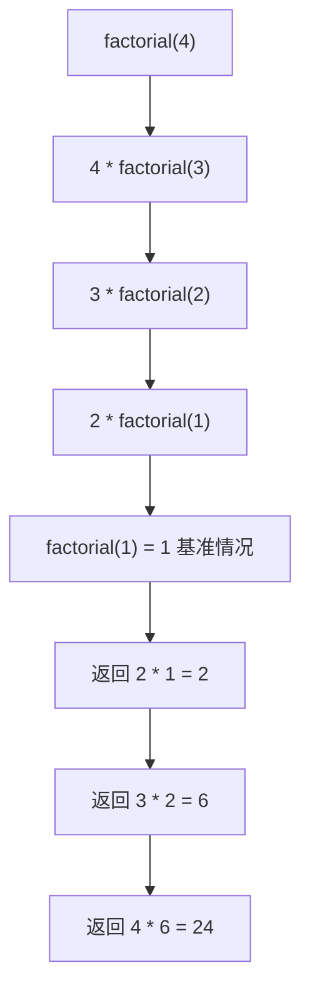

import { PyodideRunner } from '@site/src/components';

# ⚙️ 递归

递归（recursion）是一种函数调用自身来解决问题的编程技巧。它特别适合处理可以分解为**同类型子问题**的场景，例如飞行包线边界计算、递归轨迹规划、飞行系统组件层级遍历等。掌握递归能以更优雅的方式解决许多复杂问题，但同时要注意 Python 中的递归深度限制和性能问题。

## 📌 本节要点

- 递归三要素：基线条件、递归调用、问题规模缩小
- `sys.getrecursionlimit()` 查看递归深度限制，`@lru_cache` 记忆化避免重复计算
- 树形结构遍历、分治算法、回溯问题是递归的经典应用场景
- 递归转迭代：用显式栈替代系统调用栈，突破深度限制
- 尾递归在 Python 中不被优化，了解其原理但不必强求

<PyodideRunner title="递归快速体验">

```py
from functools import lru_cache

# 阶乘函数
def factorial(n):
    """计算 n 的阶乘"""
    if n <= 1:
        return 1
    return n * factorial(n - 1)

print("阶乘:")
for n in range(8):
    print(f"  {n}! = {factorial(n)}")

# 斐波那契数列（带记忆化）
@lru_cache(maxsize=None)
def fibonacci(n):
    """计算第 n 个斐波那契数"""
    if n <= 1:
        return n
    return fibonacci(n - 1) + fibonacci(n - 2)

print("\n斐波那契数列:")
print([fibonacci(i) for i in range(10)])

# 汉诺塔
def hanoi(n, source, target, auxiliary):
    """汉诺塔递归解法"""
    if n == 1:
        print(f"  移动盘子 1 从 {source} 到 {target}")
        return
    hanoi(n - 1, source, auxiliary, target)
    print(f"  移动盘子 {n} 从 {source} 到 {target}")
    hanoi(n - 1, auxiliary, target, source)

print("\n汉诺塔 (3 个盘子):")
hanoi(3, "A", "C", "B")
```

</PyodideRunner>

## 递归思想

递归的核心思想是"分而治之"：把一个大问题分解为规模更小的同类型问题，直到问题小到可以直接求解。

每个递归函数必须包含两个部分：

1. **基线条件（base case）**：不再递归，直接返回结果的终止条件
2. **递归条件（recursive case）**：调用自身处理规模更小的子问题

递归调用栈（以 factorial(4) 为例）：



```py title="Python"
import numpy as np

def countdown_altitude(altitude: float, step: float = 1000.0) -> None:
    """递归倒计时：从当前高度逐步下降到地面"""
    # 基线条件
    if altitude <= 0:
        print("已到达地面！")
        return
    # 递归条件
    print(f"当前高度：{altitude:.0f} m")
    countdown_altitude(altitude - step)

countdown_altitude(5000)
# 输出：
# 当前高度：5000 m
# 当前高度：4000 m
# 当前高度：3000 m
# 当前高度：2000 m
# 当前高度：1000 m
# 已到达地面！
```

:::warning[必须有基线条件]
没有基线条件的递归会无限调用自己，最终触发 `RecursionError`：
```py title="Python"
def infinite_check():
    return infinite_check()  # 没有终止条件

infinite_check()  # RecursionError: maximum recursion depth exceeded
```
:::

## 基线条件

基线条件的设计是递归的关键。一个良好的基线条件应该满足：

1. 一定能被达到（避免无限递归）
2. 能直接给出答案，不需要再递归

```py title="Python"
import numpy as np

# 反例：基线条件设计不当
def bad_envelope_calc(altitude: float) -> float:
    """计算某高度下的最大速度包线"""
    if altitude == 0.0:  # 浮点数精确比较不可靠
        return 0.0
    return 340.0 + bad_envelope_calc(altitude - 0.1)

# bad_envelope_calc(1.0)  # 可能无限递归！浮点精度问题

# 正例：基线条件更稳健
def max_speed_at_altitude(altitude: float) -> float:
    """计算某高度下的最大允许速度（简化包线模型）"""
    if altitude <= 0.0:  # 处理负数和 0
        return 0.0
    # 简化模型：高度每升高 1000m，最大速度降低 10 m/s
    return 340.0 - (altitude / 1000.0) * 10.0

print(max_speed_at_altitude(5000))  # 输出：290.0
print(max_speed_at_altitude(-100))  # 输出：0.0
```

## 递归深度限制

Python 默认递归深度上限是 1000，超过会抛出 `RecursionError`：

```py title="Python"
def recursive_altitude_check(n: int) -> str:
    if n > 0:
        return recursive_altitude_check(n - 1)
    return "done"

# print(recursive_altitude_check(2000))  # RecursionError

import sys
print(f"默认递归深度上限：{sys.getrecursionlimit()}")  # 通常输出：1000
```

### 修改递归深度限制

使用 `sys.setrecursionlimit` 可以调整：

```py title="Python"
import sys

sys.setrecursionlimit(5000)  # 调高上限
print(recursive_altitude_check(2000))  # 输出：done
```

:::warning[不要盲目调高上限]
Python 没有真正的尾调用优化（TCO），每次递归调用都会在调用栈上保留帧。调得过高可能导致：
- 栈溢出（segfault，解释器崩溃）
- 内存暴涨
- 性能下降

如果递归深度真的需要很大，**应该改用迭代**。
:::

## 典型应用

### 1. 飞行包线边界计算

飞行包线（flight envelope）定义了飞行器的安全运行边界。递归可用于逐层计算不同高度下的速度、过载等限制。

```py title="Python"
import numpy as np

def compute_max_speed(altitude: float, v0: float = 340.0, decay: float = 0.01) -> float:
    """
    递归计算给定高度下的最大允许速度。
    简化模型：速度随高度指数衰减。
    """
    if altitude <= 0.0:  # 基线条件：海平面
        return v0
    # 递归条件：每 100m 高度，速度衰减
    return compute_max_speed(altitude - 100.0, v0 * (1 - decay))

# 计算不同高度的最大速度
altitudes = np.array([0, 2000, 5000, 8000, 10000])
max_speeds = np.array([compute_max_speed(a) for a in altitudes])

for alt, spd in zip(altitudes, max_speeds):
    print(f"高度 {alt:5d} m → 最大速度 {spd:.1f} m/s")
# 输出：
# 高度     0 m → 最大速度 340.0 m/s
# 高度  2000 m → 最大速度 276.3 m/s
# 高度  5000 m → 最大速度 207.9 m/s
# 高度  8000 m → 最大速度 155.4 m/s
# 高度 10000 m → 最大速度 124.4 m/s
```

### 2. 递归轨迹规划

递归可用于生成飞行轨迹的航路点序列，每一层递归计算下一个航路点的位置。

```py title="Python"
import numpy as np

def plan_trajectory(
    position: np.ndarray,
    velocity: np.ndarray,
    steps: int,
    dt: float = 1.0,
) -> list[np.ndarray]:
    """
    递归规划直线轨迹航路点。
    position: 当前位置 [x, y, z]
    velocity: 速度向量 [vx, vy, vz]
    steps: 剩余规划步数
    """
    if steps <= 0:  # 基线条件：规划完成
        return [position]

    next_pos = position + velocity * dt
    # 递归条件：规划剩余步骤
    return [position] + plan_trajectory(next_pos, velocity, steps - 1, dt)

# 生成 5 个航路点
start = np.array([0.0, 0.0, 1000.0])
vel = np.array([100.0, 50.0, -10.0])  # 向前、向右、缓慢下降
waypoints = plan_trajectory(start, vel, steps=5)

for i, wp in enumerate(waypoints):
    print(f"WP{i}: ({wp[0]:.0f}, {wp[1]:.0f}, {wp[2]:.0f})")
# 输出：
# WP0: (0, 0, 1000)
# WP1: (100, 50, 990)
# WP2: (200, 100, 980)
# WP3: (300, 150, 970)
# WP4: (400, 200, 960)
# WP5: (500, 250, 950)
```

### 3. 飞行任务序列（汉诺塔变体）

经典汉诺塔问题可以映射为飞行任务调度：将 n 个飞行任务从"待执行"队列转移到"已完成"队列，中间需要借助"暂存"队列。

```py title="Python"
def flight_task_schedule(
    n: int, source: str, target: str, auxiliary: str
) -> None:
    """
    递归调度 n 个飞行任务。
    约束：任务必须按编号从小到大执行。
    """
    if n == 1:
        print(f"  执行任务 {n}：{source} → {target}")
        return
    # 把上面 n-1 个任务移到暂存队列
    flight_task_schedule(n - 1, source, auxiliary, target)
    # 执行最底部的任务
    print(f"  执行任务 {n}：{source} → {target}")
    # 把 n-1 个任务从暂存队列移到目标队列
    flight_task_schedule(n - 1, auxiliary, target, source)

print("3 个飞行任务的调度：")
flight_task_schedule(3, "待执行", "已完成", "暂存")
```

输出：

```text title="输出"
3 个飞行任务的调度：
  执行任务 1：待执行 → 已完成
  执行任务 2：待执行 → 暂存
  执行任务 1：已完成 → 暂存
  执行任务 3：待执行 → 已完成
  执行任务 1：暂存 → 待执行
  执行任务 2：暂存 → 已完成
  执行任务 1：待执行 → 已完成
```

汉诺塔的递推关系：`T(n) = 2*T(n-1) + 1`，移动次数为 `2^n - 1`。

### 4. 飞行系统组件层级遍历

递归遍历飞行器系统组件树是天然适合递归的场景：

```py title="Python"
from dataclasses import dataclass


@dataclass
class FlightComponent:
    name: str
    component_type: str  # "system", "subsystem", "component"
    children: list["FlightComponent"]


def print_component_tree(node: FlightComponent, indent: int = 0) -> None:
    """递归打印飞行器系统组件树。"""
    prefix = "  " * indent
    icon = "🛩️" if node.component_type == "system" else (
        "⚙️" if node.component_type == "subsystem" else "🔩"
    )
    print(f"{prefix}{icon} {node.name}")
    for child in node.children:
        print_component_tree(child, indent + 1)


# 构造飞行器系统组件树
avionics = FlightComponent("航电系统", "system", [
    FlightComponent("飞行控制计算机", "subsystem", [
        FlightComponent("传感器模块", "component", []),
        FlightComponent("执行机构接口", "component", []),
    ]),
    FlightComponent("导航系统", "subsystem", [
        FlightComponent("GPS 接收机", "component", []),
        FlightComponent("惯性测量单元", "component", []),
    ]),
    FlightComponent("通信系统", "subsystem", [
        FlightComponent("甚高频电台", "component", []),
        FlightComponent("数据链", "component", []),
    ]),
])

print_component_tree(avionics)
```

过滤特定类型的组件：

```py title="Python"
def find_components_by_type(node: FlightComponent, comp_type: str) -> list[FlightComponent]:
    """递归查找指定类型的所有组件。"""
    result: list[FlightComponent] = []
    if node.component_type == comp_type:
        result.append(node)
    for child in node.children:
        result.extend(find_components_by_type(child, comp_type))
    return result

components = find_components_by_type(avionics, "component")
print(f"找到 {len(components)} 个底层组件")
for c in components:
    print(f"  - {c.name}")
```

### 5. 飞行决策树

递归遍历飞行决策树，根据当前飞行状态（高度、速度、过载）逐层检查是否满足安全条件。

```py title="Python"
from dataclasses import dataclass
import numpy as np


@dataclass
class DecisionNode:
    """飞行决策树节点"""
    check_name: str
    threshold: float
    unit: str
    left: "DecisionNode | None" = None   # 满足条件的分支
    right: "DecisionNode | None" = None  # 不满足条件的分支
    is_leaf: bool = False
    result: str = ""


def build_flight_decision_tree() -> DecisionNode:
    """构建飞行安全检查决策树"""
    # 叶子节点
    safe = DecisionNode("安全", 0, "", is_leaf=True, result="✅ 通过所有检查")
    warn = DecisionNode("警告", 0, "", is_leaf=True, result="⚠️ 需要关注")
    danger = DecisionNode("危险", 0, "", is_leaf=True, result="❌ 禁止飞行")

    # 第一层：高度检查
    altitude_check = DecisionNode("高度", 500, "m", left=safe, right=danger)

    # 第二层：速度检查（高度合格时）
    speed_check = DecisionNode("速度", 250, "m/s", left=safe, right=warn)

    # 第三层：过载检查（速度合格时）
    load_check = DecisionNode("过载", 2.5, "g", left=safe, right=danger)

    # 组装树
    speed_check.left = load_check
    altitude_check.left = speed_check

    return altitude_check


def check_flight_safety(
    node: DecisionNode,
    altitude: float,
    speed: float,
    load_factor: float,
) -> str:
    """
    递归遍历决策树，检查飞行安全状态。
    """
    if node.is_leaf:  # 基线条件：到达叶子节点
        return node.result

    # 获取当前检查的参数值
    if node.check_name == "高度":
        value = altitude
    elif node.check_name == "速度":
        value = speed
    elif node.check_name == "过载":
        value = load_factor
    else:
        return "❌ 未知检查项"

    # 递归条件：根据检查结果选择分支
    if value >= node.threshold:
        return check_flight_safety(node.left, altitude, speed, load_factor)
    else:
        return check_flight_safety(node.right, altitude, speed, load_factor)


# 测试不同飞行状态
tree = build_flight_decision_tree()
test_cases = [
    (8000, 280, 2.0, "正常巡航"),
    (300, 200, 1.5, "低空慢速"),
    (8000, 300, 3.0, "高速高过载"),
    (200, 150, 1.2, "超低空"),
]

for alt, spd, load, desc in test_cases:
    result = check_flight_safety(tree, alt, spd, load)
    print(f"{desc:8s} → {result}")
# 输出：
# 正常巡航 → ✅ 通过所有检查
# 低空慢速 → ⚠️ 需要关注
# 高速高过载 → ❌ 禁止飞行
# 超低空   → ❌ 禁止飞行
```

## 尾递归

如果一个函数的递归调用是函数体中**最后一步操作**（返回值就是递归调用的返回值），称为尾递归。

```py title="Python"
import numpy as np

# 不是尾递归：递归调用后还要做乘法
def compute_max_speed_non_tail(altitude: float, v0: float = 340.0, decay: float = 0.01) -> float:
    if altitude <= 0.0:
        return v0
    return compute_max_speed_non_tail(altitude - 100.0, v0 * (1 - decay))  # ← 还要乘

# 改写为尾递归：用累加器传递中间结果
def compute_max_speed_tail(
    altitude: float, acc: float = 340.0, decay: float = 0.01
) -> float:
    if altitude <= 0.0:
        return acc
    return compute_max_speed_tail(altitude - 100.0, acc * (1 - decay), decay)  # ← 直接返回

print(compute_max_speed_tail(5000))  # 输出：约 207.9
```

:::warning[Python 没有尾调用优化]
理论上尾递归可以转化为循环，不增加调用栈深度。但 **CPython 解释器不做尾调用优化**，因此尾递归在 Python 中并不能避免 `RecursionError`。

如果递归深度可能很大，应该手动改写为循环：
```py title="Python"
import numpy as np

def compute_max_speed_iter(altitude: float, v0: float = 340.0, decay: float = 0.01) -> float:
    speed = v0
    h = altitude
    while h > 0.0:
        speed *= (1 - decay)
        h -= 100.0
    return speed
```
:::

## 递归 vs 迭代

任何递归都可以改写为迭代（用栈或循环模拟），反之亦然。两者各有优劣：

| 特性 | 递归 | 迭代 |
| --- | --- | --- |
| 代码可读性 | 通常更简洁、贴近问题定义 | 有时较冗长 |
| 调用栈开销 | 每次调用都占栈帧 | 无栈帧开销 |
| 深度限制 | 受 `sys.getrecursionlimit()` 限制 | 无限制 |
| 性能 | 函数调用开销较大 | 通常更快 |
| 调试 | 调用栈清晰 | 状态变量较多 |

```py title="Python"
import numpy as np

# 递归版：计算一组飞行数据的累计能量
def sum_energy_recursive(energies: list[float]) -> float:
    if not energies:
        return 0.0
    return energies[0] + sum_energy_recursive(energies[1:])

# 迭代版
def sum_energy_iterative(energies: list[float]) -> float:
    total = 0.0
    for e in energies:
        total += e
    return total

energy_data = [100.5, 200.3, 150.8, 300.1, 250.7]
print(f"递归：{sum_energy_recursive(energy_data):.1f}")  # 输出：1001.4
print(f"迭代：{sum_energy_iterative(energy_data):.1f}")  # 输出：1001.4
```

:::tip[选择建议]
- **天然递归结构**（树、图、分治、回溯）：用递归更自然
- **简单循环**（求和、累加、计数）：用迭代更高效
- **递归深度大**（> 几百层）：必须用迭代
- **递归+缓存**（记忆化搜索）：可以解决很多动态规划问题
:::

## 实战：飞行数据快速排序

快速排序是经典的分治算法，可用于对飞行数据进行排序分析：

```py title="Python"
def quicksort(arr: list[int]) -> list[int]:
    """快速排序（返回新列表，原地版本略复杂）。"""
    if len(arr) <= 1:  # 基线条件
        return arr

    pivot = arr[len(arr) // 2]  # 选中间元素作为基准
    left = [x for x in arr if x < pivot]
    middle = [x for x in arr if x == pivot]
    right = [x for x in arr if x > pivot]

    return quicksort(left) + middle + quicksort(right)


# 对飞行高度数据排序
altitudes = [3200, 1500, 4800, 2100, 3200, 900, 5600]
sorted_alt = quicksort(altitudes)
print(f"排序后高度：{sorted_alt}")
# 输出：[900, 1500, 2100, 3200, 3200, 4800, 5600]


# 原地版本（性能更好）
def quicksort_inplace(arr: list[int], low: int = 0, high: int | None = None) -> None:
    """原地快速排序。"""
    if high is None:
        high = len(arr) - 1
    if low >= high:  # 基线条件
        return

    pivot = arr[high]
    i = low - 1
    for j in range(low, high):
        if arr[j] <= pivot:
            i += 1
            arr[i], arr[j] = arr[j], arr[i]
    arr[i + 1], arr[high] = arr[high], arr[i + 1]

    quicksort_inplace(arr, low, i)
    quicksort_inplace(arr, i + 2, high)


data = [3200, 1500, 4800, 2100, 3200, 900, 5600]
quicksort_inplace(data)
print(f"原地排序：{data}")
# 输出：[900, 1500, 2100, 3200, 3200, 4800, 5600]
```

:::info[分治与递归]
快速排序、归并排序、二分查找都是典型的分治算法，思路都是：
1. **分**：把问题分解为子问题
2. **治**：递归求解子问题
3. **合**：合并子问题的解

```py title="Python"
# 归并排序：另一个分治经典
def merge_sort(arr):
    if len(arr) <= 1:
        return arr
    mid = len(arr) // 2
    left = merge_sort(arr[:mid])
    right = merge_sort(arr[mid:])
    return merge(left, right)

def merge(a, b):
    result = []
    i = j = 0
    while i < len(a) and j < len(b):
        if a[i] <= b[j]:
            result.append(a[i]); i += 1
        else:
            result.append(b[j]); j += 1
    result.extend(a[i:])
    result.extend(b[j:])
    return result

print(merge_sort([3200, 1500, 4800, 2100, 3200, 900, 5600]))
# 输出：[900, 1500, 2100, 3200, 3200, 4800, 5600]
```
:::

## 🎯 动手练习

1. **包线边界计算**：分别用递归、尾递归、迭代三种方式计算飞行包线边界，对比性能
2. **轨迹规划优化**：使用 `@functools.cache` 优化递归轨迹规划，对比计算 100 步轨迹的时间差异
3. **组件层级遍历**：递归遍历飞行器系统组件树，统计所有底层组件的数量和类型分布
4. **飞行数据排序**：实现快速排序的递归版本和原地版本，对比飞行高度数据的排序性能

## 📚 延伸阅读

- [递归文档](https://docs.python.org/zh-cn/3/faq/design.html#how-does-python-handle-recursion) - Python 递归限制说明
- [functools.cache 文档](https://docs.python.org/zh-cn/3/library/functools.html#functools.cache) - 缓存装饰器
- [sys.setrecursionlimit](https://docs.python.org/zh-cn/3/library/sys.html#sys.setrecursionlimit) - 修改递归深度限制
- [分治算法](https://en.wikipedia.org/wiki/Divide-and-conquer_algorithm) - 分治策略详解

## 📊 速查表

| 概念 | 说明 | 示例 |
|------|------|------|
| 基线条件 | 递归终止条件 | `if altitude <= 0: return v0` |
| 递归条件 | 调用自身处理子问题 | `return compute_max_speed(altitude - 100, ...)` |
| 递归深度限制 | 默认 1000 层 | `sys.getrecursionlimit()` |
| 记忆化搜索 | 缓存已计算结果 | `@functools.cache` |
| 尾递归 | 最后一步是递归调用 | Python 不做 TCO 优化 |
| 迭代替代 | 用循环替代递归 | `while` 循环 + 累加器 |
| 分治算法 | 分→治→合 | 快速排序、归并排序 |
| 决策树遍历 | 天然适合递归 | 飞行安全检查、包线验证 |
| 汉诺塔变体 | 经典递归问题 | 飞行任务调度 `T(n) = 2*T(n-1) + 1` |
| 延迟绑定 | 循环中闭包陷阱 | `lambda i=i: i` 修复 |

## ✅ 本节总结

- 递归函数必须包含**基线条件**（终止）和**递归条件**（调用自身）
- Python 默认递归深度上限 1000，可通过 `sys.setrecursionlimit()` 调整，但不要盲目调高
- 典型应用：飞行包线边界计算、递归轨迹规划、飞行任务调度、系统组件层级遍历、飞行决策树
- **朴素递归效率可能很低**（O(2^n)），用 `@functools.cache` 记忆化搜索可优化到 O(n)
- Python **不做尾调用优化**，需要大深度时改用迭代
- 递归更贴近问题定义、可读性好；迭代性能更好、无深度限制
- 快速排序、归并排序是分治思想的典型应用
