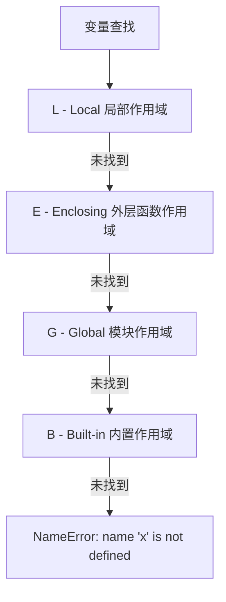

import { PyodideRunner } from '@site/src/components';

# ⚙️ 作用域 LEGB

作用域（scope）决定了变量名在何处可见、何时被销毁。Python 采用 **LEGB 规则**查找变量：Local（局部）→ Enclosing（嵌套）→ Global（全局）→ Built-in（内置）。理解作用域是掌握闭包、装饰器等高级特性的基础，也能避免许多"变量未定义"或"意外修改全局变量"的坑。

## 📌 本节要点

- LEGB 规则：Local → Enclosing → Global → Built-in，逐层查找变量
- `global` 声明在函数内修改全局变量，`nonlocal` 修改嵌套函数变量
- 闭包：嵌套函数捕获外层变量，形成"带环境的函数"
- 可变默认值陷阱：`def f(x=[])` 的列表在多次调用间共享
- 作用域与生命周期：局部变量函数结束即销毁，闭包延长变量生命周期

<PyodideRunner title="作用域与闭包快速体验">

```py
# 闭包：计数器工厂
def make_counter(start=0):
    """创建一个计数器闭包"""
    count = [start]  # 使用列表避免 nonlocal

    def counter():
        count[0] += 1
        return count[0]

    return counter

# 创建两个独立的计数器
counter_a = make_counter(10)
counter_b = make_counter(20)

print("计数器 A:")
print(f"  第1次: {counter_a()}")
print(f"  第2次: {counter_a()}")

print("\n计数器 B:")
print(f"  第1次: {counter_b()}")

# nonlocal 示例
def make_multiplier(factor):
    def multiplier(x):
        return x * factor  # factor 来自外层作用域
    return multiplier

double = make_multiplier(2)
triple = make_multiplier(3)
print(f"\n2 * 5 = {double(5)}")
print(f"3 * 5 = {triple(5)}")
```

</PyodideRunner>

## L-E-G-B 规则

Python 查找一个变量名时，按以下顺序依次查找：

| 简称 | 名称 | 说明 |
| --- | --- | --- |
| **L** | Local | 当前函数内部的局部作用域 |
| **E** | Enclosing | 外层嵌套函数的作用域（闭包中常见） |
| **G** | Global | 模块级全局作用域 |
| **B** | Built-in | 解释器内置的名字，如 `len`、`print`、`int` |

一旦在某层找到该名字，就停止向上查找；如果四层都找不到，抛出 `NameError`。

Python 变量查找遵循 LEGB 规则：



```py title="Python"
altitude_unit = "meters"  # G：全局飞行参数

def flight_control():
    phase = "climb"  # E：外层飞行阶段

    def adjust_throttle():
        delta = 5  # L：局部调整量
        print(f"delta = {delta}")              # 找 L：局部调整量
        print(f"phase = {phase}")              # L 没有 → 找 E：飞行阶段
        print(f"altitude_unit = {altitude_unit}")  # L、E 都没有 → 找 G：全局参数
        print(f"len = {len}")                  # L、E、G 都没有 → 找 B：内置函数

    adjust_throttle()

flight_control()
```

输出：

```text title="输出"
delta = 5
phase = climb
altitude_unit = meters
len = <built-in function len>
```

## 局部作用域

函数内部定义的变量是**局部变量**，仅在函数执行期间存在，函数返回后销毁：

```py title="Python"
def update_altitude():
    current_alt = 10000  # 局部变量：当前高度（米）
    print(f"飞行高度：{current_alt}m")

update_altitude()       # 输出：飞行高度：10000m
# print(current_alt)    # NameError: name 'current_alt' is not defined
```

:::warning[函数内的赋值默认创建局部变量]
在函数内部对变量赋值（不是 += 之类复合赋值的读取，而是 `=` 赋值），会**默认**创建一个局部变量，即使外层有同名变量：
```py title="Python"
altitude = 10000

def recalibrate():
    altitude = 9500  # 这里创建的是局部变量 altitude，不影响外层
    print(f"重新校准后：{altitude}m")

recalibrate()              # 输出：重新校准后：9500m
print(f"原始高度：{altitude}m")  # 输出：原始高度：10000m
```
:::

### 控制流不创建新作用域

`if`/`for`/`while`/`with` 等控制块**不会**创建新作用域，只有函数、类、模块才会：

```py title="Python"
for i in range(3):
    mode = "normal"
print(i)    # 输出：2（for 变量在循环外仍然可见）
print(mode)  # 输出：normal
```

```py title="Python"
def check_altitude():
    for i in range(3):
        mode = "normal"
    # 在函数内部，i 和 mode 都可见
    print(f"阶段 {i}: {mode} 模式")

check_altitude()
# print(i)  # NameError：i 只在 check_altitude 内可见
```

## 嵌套函数

函数内部可以再定义函数，形成嵌套结构。内层函数可以访问外层函数的局部变量：

```py title="Python"
def launch_sequence():
    status = "准备发射"

    def engine_start():
        # 内层函数可以读取外层变量
        print(f"系统状态：{status}")

    engine_start()

launch_sequence()  # 输出：系统状态：准备发射
# engine_start()  # NameError：engine_start 只在 launch_sequence 内可见
```

## global 声明

如果要在函数内部**修改**全局变量，需要使用 `global` 声明：

```py title="Python"
total_flights = 0

def record_flight():
    global total_flights  # 声明使用全局变量
    total_flights += 1

print(total_flights)  # 输出：0
record_flight()
record_flight()
record_flight()
print(total_flights)  # 输出：3
```

:::warning[滥用 global 是反模式]
`global` 让函数产生隐式副作用，难以测试和复用。大多数情况下应该用返回值代替：
```py title="Python"
# 不推荐
total_flights = 0
def record_flight(x):
    global total_flights
    total_flights += x

# 推荐
def record_flight(total_flights, x):
    return total_flights + x

total_flights = 0
total_flights = record_flight(total_flights, 5)
```
:::

### 多个全局变量

```py title="Python"
flight_config = {"auto_pilot": False}
total_flights = 0

def enable_auto_pilot():
    global flight_config, total_flights
    flight_config["auto_pilot"] = True  # 注意：修改字典内容不需要 global
    total_flights = 100                 # 但重新绑定变量需要 global

enable_auto_pilot()
print(flight_config)  # 输出：{'auto_pilot': True}
print(total_flights)    # 输出：100
```

:::info[修改 vs 绑定]
- 修改**可变对象**的**内容**（如 `lst.append(x)`、`d[k]=v`）：不需要 `global`
- 重新**绑定**变量名（如 `x = 5`、`lst = [...]`）：需要 `global`

```py title="Python"
waypoints = [1, 2, 3]

def add_waypoint():
    waypoints.append(4)  # 修改原对象，不需要 global

def reset_waypoints():
    global waypoints
    waypoints = [10, 20]  # 重新绑定，需要 global

add_waypoint()
print(waypoints)  # 输出：[1, 2, 3, 4]

reset_waypoints()
print(waypoints)  # 输出：[10, 20]
```
:::

## nonlocal 声明

`nonlocal` 用于在**嵌套函数**中修改外层（但不是全局）函数的变量。Python 3 引入：

```py title="Python"
def altitude_tracker():
    altitude = 0  # 外层函数的局部变量

    def adjust(delta):
        nonlocal altitude  # 声明使用外层的 altitude
        altitude += delta
        return altitude

    return adjust

climb = altitude_tracker()
print(climb(500))   # 输出：500
print(climb(300))   # 输出：800
print(climb(-200))  # 输出：600
```

:::warning[nonlocal 不能跨到全局]
`nonlocal` 只能查找**最近一层的外层函数**作用域，不能跳到模块级全局。如果外层没有该变量，会报错：
```py title="Python"
altitude = 10000

def outer():
    def inner():
        nonlocal altitude  # SyntaxError: no binding for nonlocal 'altitude'
        altitude += 100
    inner()
```
如果确实需要修改全局变量，使用 `global`。
:::

## 闭包

闭包（closure）是引用了自由变量的函数。被引用的自由变量将与函数一同存在，即使离开了创建它的环境。

### 闭包的形成条件

1. 必须有嵌套函数
2. 内层函数引用了外层函数的变量
3. 外层函数返回了内层函数

```py title="Python"
def make_altitude_filter(base_altitude):
    """返回一个根据基准高度过滤数据的函数"""
    def filter_alt(reading):
        return reading - base_altitude  # 引用外层变量 base_altitude
    return filter_alt

sea_level_filter = make_altitude_filter(1000)
mountain_filter = make_altitude_filter(3000)

print(sea_level_filter(1500))  # 输出：500
print(mountain_filter(3500))   # 输出：500
```

虽然 `make_altitude_filter` 已经返回，但 `base_altitude` 仍然存活在内层函数中——这就是闭包。

### 查看闭包变量

可以通过 `__closure__` 属性查看闭包引用的变量：

```py title="Python"
print(sea_level_filter.__closure__)
# 输出：(<cell at 0x...: int object at 0x...>,)
print(sea_level_filter.__closure__[0].cell_contents)  # 输出：1000
```

### 闭包的典型用途

闭包常用于**工厂函数**和**保持状态**：

```py title="Python"
def make_altitude_averager():
    """返回一个计算移动平均高度的函数"""
    import numpy as np
    readings = []

    def average(reading):
        readings.append(reading)
        return np.mean(readings)

    return average

avg = make_altitude_averager()
print(avg(10000))  # 输出：10000.0
print(avg(10500))  # 输出：10250.0
print(avg(11000))  # 输出：10500.0
```

### 闭包陷阱：循环中的延迟绑定

:::details[🔍 延迟绑定陷阱详解]

```py title="Python"
# 经典陷阱：所有返回的函数都引用同一个 i
funcs = []
for i in range(3):
    funcs.append(lambda: i)  # 注意：lambda 捕获的是变量 i，不是当时的值

print([f() for f in funcs])  # 输出：[2, 2, 2]，而不是 [0, 1, 2]
```

原因：lambda 捕获的是变量 `i` 的**引用**，循环结束时 `i = 2`。

**修复方法 1**：使用默认参数立即绑定值

```py title="Python"
funcs = [lambda i=i: i for i in range(3)]
print([f() for f in funcs])  # 输出：[0, 1, 2]
```

**修复方法 2**：使用工厂函数

```py title="Python"
def make_func(n):
    return lambda: n

funcs = [make_func(i) for i in range(3)]
print([f() for f in funcs])  # 输出：[0, 1, 2]
```

:::tip[闭包的本质]
闭包 = 函数 + 引用的环境变量。每次调用外层函数，都会创建一组新的环境变量，因此每次都是独立的"实例"：
```py title="Python"
tracker1 = altitude_tracker()
tracker2 = altitude_tracker()
tracker1(500)  # 500
tracker1(300)  # 800
tracker2(200)  # 200  ← tracker2 是独立状态
```
:::

:::

## 变量查找顺序详解

完整示例展示 LEGB 各层：

```py title="Python"
# B：内置函数
print("--- 内置作用域 B ---")
print(len("ABCD"))  # 找到内置 len

# G：全局作用域
print("\n--- 全局作用域 G ---")
flight_mode = "auto"

def show_global_mode():
    print(flight_mode)  # L、E 都没有 → G

show_global_mode()

# E：嵌套作用域
print("\n--- 嵌套作用域 E ---")
def preflight_check():
    flight_mode = "manual"  # E：嵌套变量

    def check_systems():
        print(flight_mode)  # L 没有 → E

    check_systems()

preflight_check()

# L：局部作用域
print("\n--- 局部作用域 L ---")
def emergency_mode():
    flight_mode = "emergency"  # L
    print(flight_mode)

emergency_mode()
print(flight_mode)  # 仍是 G：auto
```

### 覆盖内置名（不要这样做）

```py title="Python"
# 不要在全局覆盖内置名
# len = 5  # 危险：之后调用 len(...) 会报错

def bad_practice():
    len = 10  # 局部变量覆盖内置，仅在本函数内
    print(len)  # 输出：10
    # print(len("ABCD"))  # TypeError: 'int' object is not callable

bad_practice()
print(len("ABCD"))  # 输出：4，全局 len 仍是内置函数
```

## 实战：飞行高度追踪闭包

下面实现一个完整、可配置的高度追踪闭包，展示闭包的多种用法：

```py title="Python"
import numpy as np

def make_altitude_tracker(
    initial_alt: float = 0.0,
    climb_rate: float = 100.0,
    max_alt: float | None = None,
):
    """创建一个飞行高度追踪闭包。

    Args:
        initial_alt: 初始高度（米）。
        climb_rate: 每次调整的高度变化量（米）。
        max_alt: 最大高度上限，超过则停止。

    Returns:
        一个函数，调用时返回当前高度并按 climb_rate 变化。
    """
    altitude = initial_alt  # 闭包状态
    history = []            # 记录高度变化历史

    def tracker() -> float:
        nonlocal altitude
        if max_alt is not None and altitude > max_alt:
            raise OverflowError(f"高度超过最大限制 {max_alt}m")
        current = altitude
        history.append(current)
        altitude += climb_rate
        return current

    # 给闭包附加一些元信息
    def reset():
        nonlocal altitude
        altitude = initial_alt
        history.clear()

    def get_altitude() -> float:
        """获取当前高度但不递增"""
        return altitude

    def get_history() -> list[float]:
        """获取高度变化历史"""
        return history.copy()

    def get_statistics() -> dict:
        """获取飞行统计数据"""
        if not history:
            return {"mean": 0.0, "std": 0.0, "max": 0.0, "min": 0.0}
        arr = np.array(history)
        return {
            "mean": float(np.mean(arr)),
            "std": float(np.std(arr)),
            "max": float(np.max(arr)),
            "min": float(np.min(arr)),
        }

    # 通过属性附加额外函数
    tracker.reset = reset  # type: ignore[attr-defined]
    tracker.peek = get_altitude  # type: ignore[attr-defined]
    tracker.history = get_history  # type: ignore[attr-defined]
    tracker.stats = get_statistics  # type: ignore[attr-defined]
    return tracker


# 基本使用
print("--- 基本 ---")
alt = make_altitude_tracker()
print(alt())  # 输出：0.0
print(alt())  # 输出：100.0
print(alt())  # 输出：200.0
print(alt.peek())  # 输出：300.0  ← 当前高度

# 自定义初始高度与爬升率
print("\n--- 自定义参数 ---")
alt2 = make_altitude_tracker(initial_alt=5000, climb_rate=250)
print(alt2())  # 输出：5000.0
print(alt2())  # 输出：5250.0
print(alt2())  # 输出：5500.0

# 重置
print("\n--- 重置 ---")
alt2.reset()
print(alt2())  # 输出：5000.0

# 上限保护
print("\n--- 上限保护 ---")
alt3 = make_altitude_tracker(initial_alt=0, climb_rate=100, max_alt=300)
print(alt3())  # 输出：0.0
print(alt3())  # 输出：100.0
print(alt3())  # 输出：200.0
print(alt3())  # 输出：300.0
try:
    alt3()  # 触发上限
except OverflowError as e:
    print(f"错误：{e}")  # 输出：错误：高度超过最大限制 300m

# 查看统计数据
print("\n--- 统计数据 ---")
print(f"高度历史：{alt3.history()}")
print(f"统计信息：{alt3.stats()}")
```

:::tip[闭包 vs 类]
上面的高度追踪器也可以用类实现：
```py title="Python"
class AltitudeTracker:
    def __init__(self, initial_alt=0.0, climb_rate=100.0, max_alt=None):
        self.altitude = initial_alt
        self.climb_rate = climb_rate
        self.max_alt = max_alt
        self.history = []

    def __call__(self):
        if self.max_alt is not None and self.altitude > self.max_alt:
            raise OverflowError(...)
        current = self.altitude
        self.history.append(current)
        self.altitude += self.climb_rate
        return current

    def reset(self):
        self.altitude = self.initial_alt
        self.history.clear()
```
当状态和行为较多时，类通常更清晰；当只需简单状态时，闭包更轻量。
:::

## 🎯 动手练习

1. **LEGB 验证**：编写代码验证 LEGB 查找顺序，在每层定义同名变量并观察输出
2. **闭包高度追踪器**：实现一个可配置初始高度和爬升率的闭包，支持 `reset()` 和 `stats()` 方法
3. **延迟绑定陷阱**：创建 3 个 lambda 函数分别返回 0、1、2，演示并修复延迟绑定问题
4. **global vs nonlocal**：分别使用 `global` 和 `nonlocal` 修改不同层级的变量，观察差异

## 📚 延伸阅读

- [Python 作用域文档](https://docs.python.org/zh-cn/3/tutorial/classes.html#python-scopes-and-namespaces) - 官方作用域与命名空间详解
- [PEP 3104 - nonlocal 声明](https://peps.python.org/pep-3104/) - `nonlocal` 关键字规范
- [闭包与自由变量](https://docs.python.org/zh-cn/3/reference/datamodel.html) - Python 数据模型中的闭包说明
- [Python 命名空间](https://docs.python.org/zh-cn/3/tutorial/classes.html#scopes-and-namespaces-example) - 命名空间示例

## 📊 速查表

| 概念 | 说明 | 示例 |
|------|------|------|
| L 局部作用域 | 函数内部定义的变量 | `def f(): alt = 10000` |
| E 嵌套作用域 | 外层函数的局部变量 | 闭包中引用外层变量 |
| G 全局作用域 | 模块级变量 | 文件顶层定义的变量 |
| B 内置作用域 | Python 内置名称 | `len`、`print`、`int` |
| global 声明 | 修改全局变量 | `global total_flights; total_flights += 1` |
| nonlocal 声明 | 修改外层嵌套变量 | `nonlocal altitude; altitude += delta` |
| 闭包条件 | 嵌套+引用+返回 | 工厂函数模式 |
| 延迟绑定修复 | 默认参数立即绑定 | `lambda i=i: i` |
| 修改 vs 绑定 | 修改内容不需声明 | `waypoints.append(1)` 不需 `global` |
| 控制流作用域 | `if/for/while` 不创建新作用域 | 循环变量在循环外可见 |

## ✅ 本节总结

- Python 用 **LEGB 规则**查找变量：Local → Enclosing → Global → Built-in
- 函数内部对变量赋值默认创建局部变量，要修改外层变量必须用 `global`（修改全局）或 `nonlocal`（修改外层嵌套函数变量）
- `if`/`for`/`while` 不创建新作用域，只有函数/类/模块才会
- **修改**可变对象内容不需要 `global`/`nonlocal`，**重新绑定**变量名才需要
- 闭包 = 函数 + 引用的环境变量，常用于工厂函数和保持状态
- 循环中创建闭包要小心"延迟绑定"陷阱，用默认参数或工厂函数立即绑定值
- `global` 是反模式，应优先用返回值传递结果
