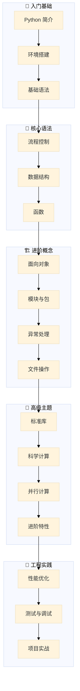

import { LearningPath, TrackSelector } from '@site/src/components';
import CheatCard from '@site/src/components/CheatCard';

# 🐍 Python 简介

Python 是一门简洁、优雅且功能强大的通用编程语言。从 Web 开发到人工智能，从自动化脚本到科学计算，Python 几乎无处不在。本教程将系统学习 Python 3.12+ 的现代写法，从语法基础一路走向工程实战。

无论零基础的新手，还是希望从其他语言转过来的开发者，Python 都能在极短的时间内写出可运行的程序，并用最少的代码表达最清晰的意图。

## 📌 本节要点

学完本节后，我们将了解：

- Python 的设计哲学与核心特点
- Python 的主要应用领域与典型框架
- Python 版本演进历程与关键特性
- 本教程的学习路径与使用方法
- 如何运行第一个 Python 程序

## Python 是什么

Python 是一种**解释型、跨平台、动态类型**的高级编程语言。它由 Guido van Rossum（吉多·范罗苏姆）于 1989 年底开始设计，并在 1991 年发布了第一个公开发行版。Python 的设计哲学强调代码的可读性与简洁性，尤其注重用显著的空白来划分语句块，而不是花括号或关键字。

Python 是一门" batteries included "（自带电池）的语言——它的标准库覆盖了网络通信、文件处理、正则表达式、数据序列化、并发编程等几乎所有常见需求，无需安装第三方依赖就能完成大量工作。

```py title="Python"
# 一段典型的 Python 程序：简洁且易读
import random

def pick_lucky(items: list[str], count: int = 1) -> list[str]:
    """从 items 中随机抽取 count 个幸运项。"""
    return random.sample(items, k=min(count, len(items)))

names = ["张三", "李四", "王五", "赵六", "钱七"]
for name in pick_lucky(names, count=2):
    print(f"🎉 幸运儿：{name}")
# 输出: 🎉 幸运儿：李四
# 输出: 🎉 幸运儿：王五
```

:::tip[Python 之禅]
在 Python 解释器中输入 `import this`，会看到一首描述 Python 设计哲学的短诗。其中最著名的一句是：**"Simple is better than complex."（简洁胜于复杂）**。这也是本教程贯穿始终的写作理念。
:::

## Python 的主要特点

### 1. 简洁易读

Python 使用缩进来表示代码层级，省去了花括号和分号的噪音，让代码像自然语言一样流畅：

```py title="Python"
numbers = [1, 2, 3, 4, 5]
total = sum(n for n in numbers if n % 2 == 1)
print(f"奇数之和：{total}")
```

### 2. 动态类型与渐进式类型注解

变量无需声明类型，但我们可以通过**类型注解**让代码更清晰、让工具更好地辅助开发。Python 3.12 引入了全新的类型参数语法（PEP 695），让泛型写法前所未有地简洁：

```py title="Python"
# Python 3.12+ 全新的泛型函数语法
def first[T](items: list[T]) -> T | None:
    return items[0] if items else None

print(first([1, 2, 3]))  # 输出: 1
print(first(["a", "b"]))  # 输出: a
print(first([]))  # 输出: None
```

### 3. 跨平台

Python 程序可以在 Linux、Windows、macOS 乃至嵌入式设备上运行，同一份 `.py` 文件无需修改就能在不同系统上执行。

### 4. 丰富的生态

Python 拥有全球第二大包仓库 PyPI（Python Package Index），截至 2025 年已有超过 60 万个可安装的第三方包，覆盖几乎所有的领域。

### 5. 多范式编程

Python 同时支持面向对象、函数式和过程式编程，我们可以根据场景灵活选择：

```py title="Python"
# 面向对象
class Counter:
    def __init__(self) -> None:
        self._count = 0

    def tick(self) -> int:
        self._count += 1
        return self._count

# 函数式风格：使用生成器表达式与内置函数
squares = list(map(lambda x: x * x, range(5)))
print(squares)  # 输出: [0, 1, 4, 9, 16]
```

### 6. 自动内存管理

Python 内置垃圾回收机制（引用计数 + 分代回收），开发者通常无需手动管理内存，专注于业务逻辑即可。

## Python 的应用领域

Python 的应用范围之广，几乎涵盖了所有主流技术方向：

| 领域 | 典型库 / 框架 | 典型场景 |
| --- | --- | --- |
| **Web 开发** | Django、FastAPI、Flask | 网站、API 服务 |
| **数据科学** | NumPy、pandas、Polars | 数据清洗、分析 |
| **机器学习 / AI** | PyTorch、scikit-learn、Hugging Face | 模型训练、推理 |
| **自动化 / 运维** | Ansible、Fabric、RPA 脚本 | 批量任务、CI/CD |
| **网络爬虫** | Scrapy、BeautifulSoup、httpx | 数据采集 |
| **科学计算** | SciPy、SymPy、Matplotlib | 数值仿真 |
| **桌面 GUI** | PySide6、Tkinter | 桌面应用 |
| **游戏开发** | Pygame、Arcade | 2D 游戏、教学 |
| **金融量化** | backtrader、Zipline | 策略回测 |

:::info[一个真实案例]
Instagram、Dropbox、Spotify、Netflix 等知名公司的核心服务都大量使用 Python。例如 Instagram 用 Django 处理每天数十亿次的请求，证明 Python 在生产环境中同样能扛住高并发。
:::

## 为什么学习 Python

### 1. 上手快，曲线平缓

Python 的语法接近英语，初学者通常能在几小时内写出第一个可用的程序。

### 2. 就业面广

无论是后端开发、数据分析、AI 算法工程师，还是测试、运维、量化研究，Python 都是高频出现的技能要求。

### 3. 社区活跃，资源丰富

Python 拥有全球最活跃的编程社区之一，遇到问题几乎都能在 Stack Overflow、官方文档或社区论坛找到答案。

### 4. 与现代工具链契合

Python 3.12+ 在性能、错误提示、类型系统上持续改进，配合 `uv`、`ruff` 等用 Rust 编写的新一代工具，开发体验今非昔比。

### 5. 适合"快速验证想法"

Python 的口号之一是"完成同一个任务，用更少的代码"。这让它在原型开发、数据探索、AI 实验等场景中几乎是首选语言。

## Python 版本演进

Python 的版本演进遵循清晰的节奏：每年发布一个小版本，每两年发布一个 LTS 风格的稳定版。本教程以 **Python 3.12+** 为基准，并兼顾 3.13、3.14 的新特性。

### 关键版本时间线

| 版本 | 发布年份 | 里程碑特性 |
| --- | --- | --- |
| Python 3.0 | 2008 | 不兼容升级，统一字符编码 |
| Python 3.6 | 2016 | f-string、变量注解 |
| Python 3.8 | 2019 | 海象运算符 `:=`、仅位置参数 |
| Python 3.9 | 2020 | 字典合并运算符 `\|`、类型提示泛型 |
| Python 3.10 | 2021 | `match-case` 结构、更好的错误信息 |
| Python 3.11 | 2022 | 异常组 `ExceptionGroup`、`TaskGroup`、提速 10%~60% |
| Python 3.12 | 2023 | PEP 695 泛型语法、f-string 嵌套引号、`@override` |
| Python 3.13 | 2024 | 实验性自由线程（无 GIL）、JIT、REPL 增强 |
| Python 3.14 | 2025 | 注解延迟求值（PEP 649）、模板字符串 `t""`（PEP 750） |

### 现代 Python 的几个亮点特性

下面几个特性会贯穿本教程，建议先有个印象：

```py title="Python"
# 1. match-case 模式匹配（3.10+）
def describe(status: int) -> str:
    match status:
        case 200:
            return "OK"
        case 404:
            return "Not Found"
        case 500 | 502 | 503:
            return "服务器错误"
        case _:
            return "未知状态"

# 2. 海象运算符 :=（3.8+）
import re
if (m := re.search(r"\d+", "订单号: 9527")) is not None:
    print(f"找到数字：{m.group()}")

# 3. 异常组与 TaskGroup（3.11+）
import asyncio

async def main() -> None:
    async with asyncio.TaskGroup() as tg:
        tg.create_task(asyncio.sleep(0.1, result="A"))
        tg.create_task(asyncio.sleep(0.2, result="B"))

asyncio.run(main())
print("并发任务全部完成")
```

## 本教程的学习路径

本教程按照"由浅入深、边学边练"的原则组织内容。点击下方任意节点即可跳转到对应章节：

<LearningPath />

### 选择你的学习路径

不同的学习背景适合不同的起点。选择最适合你的路径：

<TrackSelector />

### 学习路径总览



每篇教程都包含**知识点讲解、可运行代码示例、实战练习**三部分。遇到不懂的地方，不必死磕——先把代码跑起来，理解大致思路，随着后续章节的学习自然会融会贯通。

## 如何使用本教程

- **边读边敲**：所有代码示例都可直接运行，建议在自己的环境中复现一遍
- **善用搜索**：左侧的搜索框可以快速定位关心的知识点
- **关注提示框**：`:::tip` 是实用技巧，`:::warning` 是常见坑，`:::note` 是补充说明
- **尝试修改示例**：把示例里的数字、字符串改成自己的，观察行为变化
- **记录学习笔记**：本站的"学习笔记"板块会持续更新一些扩展心得

:::tip[关于 Python 版本]
本教程推荐使用 **Python 3.12 或更高版本**。如果尚未安装，请先跳转到 [安装 Python 环境](./getting-started/installation) 完成环境搭建，再回到这里继续。
:::

## 第一个程序：Hello, World!

按照编程界的传统，用一句 "Hello, World!" 开启这段旅程：

```py title="Python"
print("Hello, World!")
```

把它保存为 `hello.py`，然后在终端运行：

```bash title="Shell"
python hello.py
```

屏幕上会出现：

```text title="输出"
Hello, World!
```

虽然只有一行，但它背后完成了：加载 Python 解释器、编译源码为字节码、执行 `print` 函数、向标准输出写入字符串。后续章节会逐步揭开这些机制的神秘面纱。

:::note[接下来]
环境已经就绪的同学可以直接前往 [入门准备](./getting-started/installation) 章节，正式开始动手实践。
:::

## 🎯 动手练习

尝试完成以下练习，巩固本节知识：

1. **运行 Python 之禅**：在终端或 Python 交互环境中输入 `import this`，阅读并理解 Python 的设计哲学
2. **检查 Python 版本**：在终端运行 `python --version`，确认使用的是 Python 3.12 或更高版本
3. **修改 Hello World**：将 `print("Hello, World!")` 修改为打印自己的名字和一句欢迎语
4. **探索标准库**：尝试运行 `import random; print(random.randint(1, 100))`，体验 Python 标准库的便捷

## 📚 延伸阅读

- [Python 官方文档](https://docs.python.org/zh-cn/3/) - 最权威的 Python 参考资料
- [PEP 20 - Python 之禅](https://peps.python.org/pep-0020/) - Python 设计哲学的完整版本
- [Python 版本发布历史](https://devguide.python.org/versions/) - 了解各版本的发布与维护状态
- [PyPI - Python 包索引](https://pypi.org/) - 探索超过 60 万个第三方包

<CheatCard
    title="速查表"
    headers={["特性","说明","版本"]}
    rows={[["`import this`","Python 之禅","所有版本"],["`f\"{}\"`","f-string 格式化","3.6+"],["`match-case`","模式匹配","3.10+"],["`:=`","海象运算符","3.8+"],["`X | Y`","联合类型","3.10+"],["`def f[T]()`","泛型函数","3.12+"],["`type X = Y`","类型别名","3.12+"]]}
  />
## ✅ 本节总结

- Python 是一门简洁、易读、跨平台的高级语言，由 Guido van Rossum 于 1991 年发布
- 它的特点包括：动态类型、自动内存管理、丰富的标准库与生态、多范式编程
- 应用领域覆盖 Web、数据科学、AI、自动化、量化等几乎所有主流方向
- 本教程基于 **Python 3.12+**，并适当介绍 3.13、3.14 的新特性
- 学习路径由浅入深，建议边读边敲，把每段代码跑起来