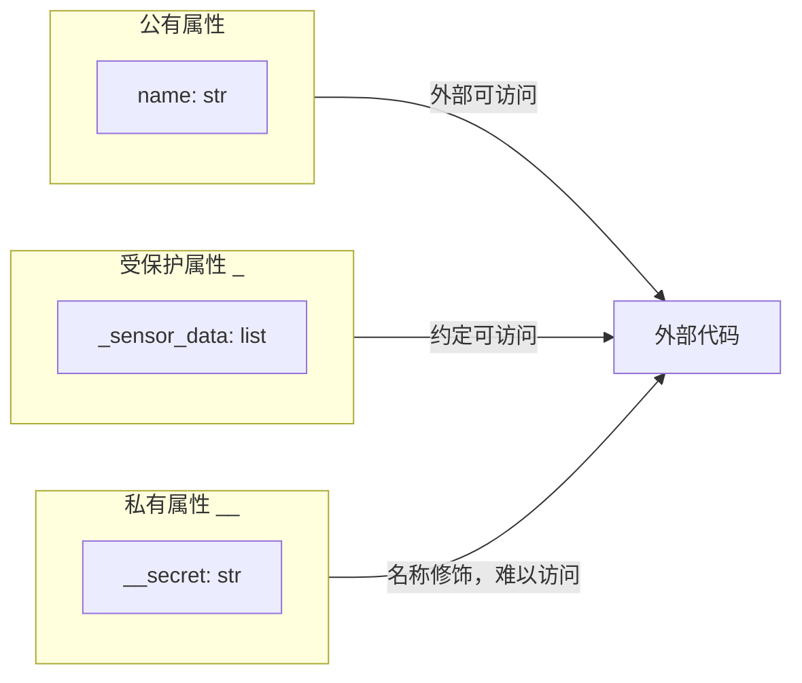

import { PyodideRunner } from '@site/src/components';

# 🏗️ 封装

封装（encapsulation）是面向对象的三大特性之一，指**把数据（属性）和行为（方法）包到对象内部，并控制外部如何访问它们**。通过封装，我们可以隐藏实现细节、保护对象不变量（invariant）、对外暴露稳定接口。Python 的封装哲学与 Java/C++ 不同——它没有真正的访问修饰符（public/private/protected），而是用**命名约定**和**属性协议**来达成"君子协定"。

## 📌 本节要点
- 命名约定：`name`（公开）、`_name`（受保护）、`__name`（私有，名称改写）、`__name__`（魔术方法）
- 单下划线 `_attr` 是约定，双下划线 `__attr` 触发名称改写为 `_类名__attr`
- `@property` 将方法伪装成属性，实现 getter/setter 控制
- 只读属性的三种实现方式
- `__slots__` 限制属性声明、节省内存，海量实例场景收益显著
- 封装的核心价值：不变量保护、统一入口、接口稳定、限制扩展
:::

<PyodideRunner title="封装快速体验">

```py
class BankAccount:
    def __init__(self, owner, balance=0):
        self.owner = owner
        self.__balance = balance  # 私有属性（名称改写）

    @property
    def balance(self):
        """只读属性：外部只能读取余额"""
        return self.__balance

    def deposit(self, amount):
        if amount <= 0:
            print("存款金额必须为正数")
            return
        self.__balance += amount
        print(f"存入 {amount}，余额: {self.__balance}")

    def withdraw(self, amount):
        if amount > self.__balance:
            print("余额不足")
            return
        self.__balance -= amount
        print(f"取出 {amount}，余额: {self.__balance}")

# 使用
account = BankAccount("张三", 1000)
print(f"账户名: {account.owner}")
print(f"余额: {account.balance}")  # 通过 property 读取

account.deposit(500)
account.withdraw(200)

# 尝试直接修改私有属性（会被名称改写阻止）
# account.__balance = 999999  # 这不会修改真正的余额
print(f"余额仍然是: {account.balance}")
```

</PyodideRunner>

## 命名约定

访问控制层级：



Python 用下划线约定属性的可见性：

| 命名          | 含义             | 说明                                 |
|---------------|------------------|--------------------------------------|
| `name`        | 公开             | 任何地方都可访问                     |
| `_name`       | 受保护（约定）   | 仅约定，外部**仍可访问**            |
| `__name`      | 私有（名称改写） | 会被改写为 `_类名__name`，外部难访问 |
| `__name__`    | 魔术方法        | 由 Python 解释器调用，不要自创       |

### 单下划线：`_protected`

```py title="Python"
class FlightDataBuffer:
    """飞行数据缓冲区：受保护的 _buffer 仅供内部使用。"""

    def __init__(self, capacity: int = 100) -> None:
        self.capacity = capacity
        self._buffer: list[float] = []  # 约定：受保护，外部不应该直接改

    def push(self, value: float) -> None:
        if len(self._buffer) >= self.capacity:
            raise ValueError("缓冲区已满")
        self._buffer.append(value)

    def pop(self) -> float:
        if not self._buffer:
            raise ValueError("缓冲区为空")
        return self._buffer.pop()

    def size(self) -> int:
        return len(self._buffer)

buf = FlightDataBuffer(10)
buf.push(1.5)
buf.push(2.3)
print(buf.size())  # 输出：2

# 单下划线只是约定，Python 不会阻止访问
print(buf._buffer)  # 输出：[1.5, 2.3]（能访问，但属于"不应该这么做"）
```

:::note[约定而非强制]
`_buffer` 只是约定，Python 不会阻止外部访问。这反映了 Python "我们都是成年人"的哲学——开发者应该尊重约定。如果硬要访问，那是调用方自己的责任。
:::

:::tip[模块的"私有"]
单下划线在**模块级别**也有意义：`from module import *` 默认不会导入以 `_` 开头的名字。但显式 `from module import _name` 仍然可以导入。
:::

### 双下划线：`__private` 与名称改写

双下划线开头的属性会被 Python **名称改写（name mangling）**：`__attr` 变成 `_类名__attr`。这不是真正的私有，但能有效避免子类无意覆盖，并阻止直接访问：

```py title="Python"
class FlightDataPipeline:
    """飞行数据管道：私有缓冲区，封装数据校验逻辑。"""

    def __init__(self, name: str, buffer_size: int = 1024) -> None:
        self.name = name
        self.__buffer: list[float] = []  # 会被改写为 _FlightDataPipeline__buffer
        self.__max_size = buffer_size

    def feed(self, sample: float) -> None:
        if len(self.__buffer) >= self.__max_size:
            raise ValueError("缓冲区已满")
        self.__buffer.append(sample)

    def read_buffer(self) -> list[float]:
        return list(self.__buffer)

pipeline = FlightDataPipeline("imu_0")
pipeline.feed(1.5)
print(pipeline.name)          # 输出：imu_0
print(pipeline.read_buffer())  # 输出：[1.5]

# print(pipeline.__buffer)  # AttributeError: 'FlightDataPipeline' object has no attribute '__buffer'
print(pipeline._FlightDataPipeline__buffer)  # 输出：[1.5]（绕过改写仍可访问，但极不推荐）
print(pipeline.__dict__)  # {'name': 'imu_0', '_FlightDataPipeline__buffer': [1.5], '_FlightDataPipeline__max_size': 1024}
```

:::warning[双下划线的副作用]
名称改写容易在继承场景下造成困惑——子类访问父类的 `__attr` 必须用 `_父类名__attr`。日常编码中**优先用单下划线 `_attr`**，只在需要避免子类同名属性覆盖时才用双下划线。
:::

### 名称改写避免子类覆盖

```py title="Python"
class BaseFilter:
    def __init__(self) -> None:
        self.__cutoff = 50.0  # _BaseFilter__cutoff

class LowPassFilter(BaseFilter):
    def __init__(self) -> None:
        super().__init__()
        self.__cutoff = 10.0  # _LowPassFilter__cutoff（与父类的不同！）

f = LowPassFilter()
print(f.__dict__)  # 输出：{'_BaseFilter__cutoff': 50.0, '_LowPassFilter__cutoff': 10.0}
```

两个 `__cutoff` 互不冲突，正是因为名称改写让它们成了不同属性。

## `@property` 装饰器

`@property` 是 Python 实现封装的核心工具，它把方法"伪装"成属性，让外部以 `obj.attr` 形式访问，但内部能加入校验、计算逻辑。配合 `@attr.setter` 实现可读写控制：

### getter：只读属性

```py title="Python"
class SensorBuffer:
    """传感器缓冲区：容量和填充率只读，外部不能直接改。"""

    def __init__(self, capacity: int) -> None:
        self._capacity = capacity
        self._data: list[float] = []

    @property
    def capacity(self) -> int:
        """缓冲区容量（只读访问）。"""
        return self._capacity

    @property
    def fill_ratio(self) -> float:
        """填充率（计算属性）。"""
        return len(self._data) / self._capacity if self._capacity > 0 else 0.0

    @property
    def mean(self) -> float:
        """当前均值（计算属性）。"""
        return sum(self._data) / len(self._data) if self._data else 0.0

buf = SensorBuffer(100)
buf._data = [1.0, 2.0, 3.0, 4.0, 5.0]  # 模拟写入
# 像属性一样访问，无需加括号
print(buf.capacity)    # 输出：100
print(buf.fill_ratio)  # 输出：0.05
print(buf.mean)        # 输出：3.0

# buf.capacity = 200  # AttributeError: property 'capacity' has no setter（只读）
```

:::tip[property 的好处]
- **接口稳定**：把方法改成属性不影响调用方代码
- **惰性计算**：每次访问才计算，无需缓存
- **可加校验**：在 setter 中加入参数验证
- **可演进**：先用普通属性，将来需要逻辑时改用 `@property`，调用代码不变
:::

### setter：带校验的写

```py title="Python"
class IMUCalibration:
    """IMU 校准参数：带范围校验的属性访问。"""

    def __init__(self, scale: float = 1.0) -> None:
        # 注意：直接赋值会触发 setter，从而进行校验
        self.scale = scale

    @property
    def scale(self) -> float:
        return self._scale

    @scale.setter
    def scale(self, value: float) -> None:
        if not (0.5 <= value <= 2.0):
            raise ValueError(f"IMU 缩放因子必须在 [0.5, 2.0] 范围内：{value}")
        self._scale = value

    @property
    def scale_percent(self) -> float:
        """百分比表示（计算属性）。"""
        return self._scale * 100

    @scale_percent.setter
    def scale_percent(self, value: float) -> None:
        self.scale = value / 100  # 复用 scale 的 setter

cal = IMUCalibration(1.0)
print(cal.scale)          # 输出：1.0
print(cal.scale_percent)  # 输出：100.0

cal.scale = 1.5           # 通过 setter 修改
print(cal.scale_percent)  # 输出：150.0

cal.scale_percent = 80    # 通过百分比 setter 修改
print(cal.scale)          # 输出：0.8

# cal.scale = 3.0  # ValueError: IMU 缩放因子必须在 [0.5, 2.0] 范围内：3.0
```

:::warning[初始化陷阱]
在 `__init__` 中直接 `self.scale = scale` 会触发 setter。如果此时属性还未定义，setter 内部对 `self._scale` 赋值是 OK 的，但要确保 setter 不依赖其他尚未初始化的属性。
:::

### 只读属性的三种写法

```py title="Python"
# 方法 1：只定义 getter，不定义 setter
class ReadOnlySensor1:
    def __init__(self) -> None:
        self._reading = 42.0
    @property
    def reading(self) -> float:
        return self._reading

# 方法 2：双下划线 + 只暴露 getter
class ReadOnlySensor2:
    def __init__(self) -> None:
        self.__reading = 42.0
    @property
    def reading(self) -> float:
        return self.__reading

# 方法 3：用 property 内置的 fget 参数（不推荐 setter 写法，仅作了解）
class ReadOnlySensor3:
    def __init__(self) -> None:
        self._reading = 42.0
    def _get_reading(self) -> float:
        return self._reading
    reading = property(_get_reading)  # 仅提供 getter

r1, r2, r3 = ReadOnlySensor1(), ReadOnlySensor2(), ReadOnlySensor3()
print(r1.reading, r2.reading, r3.reading)  # 输出：42.0 42.0 42.0
# 都无法通过 .reading = xxx 修改
```

## 使用 `@property` 实现封装

下面是一个完整的封装示例：内部用 `_attrs` 存储，对外暴露受控接口：

```py title="Python"
class SensorConfig:
    """传感器配置：校准偏移、采样率、单位规范化。"""

    VALID_UNITS = {"m/s²", "rad/s", "Hz", "dBm"}

    def __init__(self, name: str, sample_rate: int, unit: str) -> None:
        self.name = name
        self.sample_rate = sample_rate  # 触发 setter
        self.unit = unit  # 触发 setter
        self._offset: float = 0.0

    @property
    def sample_rate(self) -> int:
        return self._sample_rate

    @sample_rate.setter
    def sample_rate(self, value: int) -> None:
        if value <= 0 or value > 10000:
            raise ValueError(f"采样率必须在 1~10000 Hz 范围内：{value}")
        self._sample_rate = value

    @property
    def unit(self) -> str:
        return self._unit

    @unit.setter
    def unit(self, value: str) -> None:
        value = value.strip()
        if value not in self.VALID_UNITS:
            raise ValueError(f"不支持的单位：{value!r}，可选：{self.VALID_UNITS}")
        self._unit = value

    def set_offset(self, raw_offset: float) -> None:
        """对外只提供设置偏移的方法，不暴露校准细节。"""
        if abs(raw_offset) > 100:
            raise ValueError(f"偏移量过大：{raw_offset}")
        self._offset = raw_offset

    def get_calibrated(self, raw_value: float) -> float:
        """应用偏移校准。"""
        return raw_value - self._offset

    def __repr__(self) -> str:
        return f"SensorConfig(name={self.name!r}, rate={self._sample_rate}, unit={self._unit!r})"

cfg = SensorConfig("accel_z", 500, "m/s²")
print(cfg)  # 输出：SensorConfig(name='accel_z', rate=500, unit='m/s²')

cfg.set_offset(0.35)
print(cfg.get_calibrated(9.81))  # 输出：9.46

# 外部无法直接修改偏移（_offset 约定受保护）
# 也不能直接修改单位绕过校验
```

## `__slots__`：限制属性与节省内存

默认情况下，每个实例都有 `__dict__` 字典存储属性——这很灵活，但占用内存。用 `__slots__` 可以**声明实例只能有的属性**，从而省去 `__dict__`，节省内存并阻止动态添加属性：

```py title="Python"
class FlightState:
    __slots__ = ("timestamp", "roll", "pitch", "yaw")  # 实例只能有这四个属性

    def __init__(self, timestamp: float, roll: float, pitch: float, yaw: float) -> None:
        self.timestamp = timestamp
        self.roll = roll
        self.pitch = pitch
        self.yaw = yaw

    def __repr__(self) -> str:
        return f"FlightState(t={self.timestamp:.3f}, r={self.roll:.2f}, p={self.pitch:.2f}, y={self.yaw:.2f})"

s = FlightState(0.0, 1.5, 0.3, -0.1)
print(s)  # 输出：FlightState(t=0.000, r=1.50, p=0.30, y=-0.10)

# s.altitude = 1000  # AttributeError: 'FlightState' object has no attribute 'altitude'
# print(s.__dict__)  # AttributeError: 'FlightState' object has no attribute '__dict__'
```

:::info[__slots__ 的权衡]
**优点**：
- 节省内存：每个实例少了 `__dict__`，约省 40~100 字节，海量实例时收益显著
- 属性访问稍快：少了字典查找
- 防止拼写错误：`s.alt = 5`（本想写 `yaw`）会直接报错

**缺点**：
- 不能动态添加属性
- 子类默认不继承 `__slots__`，需要重新声明
- 影响某些依赖 `__dict__` 的库（如 pickle 的某些版本）
:::

### 大量实例的内存对比

```py title="Python"
import sys


class FlightStateDict:
    def __init__(self, timestamp: float, roll: float) -> None:
        self.timestamp = timestamp
        self.roll = roll


class FlightStateSlots:
    __slots__ = ("timestamp", "roll")

    def __init__(self, timestamp: float, roll: float) -> None:
        self.timestamp = timestamp
        self.roll = roll


s1 = FlightStateDict(0.0, 1.5)
s2 = FlightStateSlots(0.0, 1.5)

print(sys.getsizeof(s1.__dict__))  # 输出：104（字典开销）
# FlightStateSlots 没有 __dict__
print(sys.getsizeof(s2))           # 输出：48（更小）

# 大量实例场景下的内存差异
n = 1_000_000
list_dict = [FlightStateDict(i * 0.01, i * 0.001) for i in range(n)]   # 约 100MB+
list_slots = [FlightStateSlots(i * 0.01, i * 0.001) for i in range(n)]  # 显著更小
print("创建完成")
```

### `__slots__` 与继承

```py title="Python"
class BaseState:
    __slots__ = ("timestamp",)

class DictState(BaseState):  # 不声明 __slots__，会有 __dict__
    pass

class SlotState(BaseState):  # 继承并扩展 __slots__
    __slots__ = ("roll",)

c1 = DictState()
c1.timestamp = 0.0
c1.anything = 2  # 可以！子类没有 __slots__，恢复了 __dict__

c2 = SlotState()
c2.timestamp = 0.0
c2.roll = 1.5
# c2.pitch = 0.3  # AttributeError，被 __slots__ 限制
print(c2.timestamp, c2.roll)  # 输出：0.0 1.5
```

:::warning[__slots__ 与 property 共存]
`__slots__` 中**不应该**包含 `@property` 定义的名字，否则会导致冲突。`@property` 创建的是类级别的描述符，与 `__slots__` 的实例存储机制不兼容。需要只读属性时，可以把真实存储字段放进 `__slots__`，再对外用 property 别名：

```py title="Python"
class IMUSample:
    __slots__ = ("_raw_value",)  # 存储字段

    def __init__(self, value: float) -> None:
        self._raw_value = value

    @property
    def value(self) -> float:  # 别名，不放 __slots__
        return self._raw_value
```
:::

## 实战：飞行数据管道

综合运用命名约定、`@property`、`__slots__`，实现一个安全的飞行数据管道系统：

```py title="Python"
from datetime import datetime
import numpy as np


class BufferOverflowError(Exception):
    """缓冲区溢出异常。"""


class FlightDataPipeline:
    """飞行数据管道：封装数据缓冲、校验、统计，保证不变量。"""

    __slots__ = ("_name", "_buffer", "_capacity", "_is_paused", "_log")

    def __init__(self, name: str, capacity: int = 1024) -> None:
        if capacity <= 0:
            raise ValueError("缓冲区容量必须为正")
        self._name = name
        self._buffer: list[float] = []
        self._capacity: int = capacity
        self._is_paused: bool = False
        self._log: list[tuple[str, int, str]] = []
        self._record("初始化", 0)

    # ---------- 只读属性 ----------
    @property
    def name(self) -> str:
        return self._name

    @property
    def size(self) -> int:
        """当前缓冲区大小（只读，不能直接赋值修改）。"""
        return len(self._buffer)

    @property
    def is_paused(self) -> bool:
        return self._is_paused

    @property
    def fill_ratio(self) -> float:
        """缓冲区填充率。"""
        return len(self._buffer) / self._capacity if self._capacity > 0 else 0.0

    # ---------- 业务方法（封装状态变更逻辑） ----------
    def _check_paused(self) -> None:
        if self._is_paused:
            raise RuntimeError(f"管道 {self._name} 已暂停")

    def _record(self, kind: str, count: int) -> None:
        """内部方法：记录操作日志（约定受保护）。"""
        self._log.append(
            (kind, count, datetime.now().strftime("%Y-%m-%d %H:%M:%S"))
        )

    def push(self, sample: float) -> None:
        """推入一个采样值：必须为有限数值。"""
        self._check_paused()
        if not np.isfinite(sample):
            raise ValueError(f"无效采样值：{sample}")
        if len(self._buffer) >= self._capacity:
            raise BufferOverflowError(
                f"缓冲区已满：当前 {len(self._buffer)}/{self._capacity}"
            )
        self._buffer.append(sample)
        self._record("push", 1)

    def push_batch(self, samples: list[float]) -> None:
        """批量推入：保证原子性，失败回滚。"""
        self._check_paused()
        original_size = len(self._buffer)
        try:
            for s in samples:
                self.push(s)
        except Exception as e:
            # 回滚已推入的数据
            self._buffer = self._buffer[:original_size]
            raise RuntimeError(f"批量推入失败已回滚：{e}") from e

    def flush(self) -> list[float]:
        """清空缓冲区并返回所有数据。"""
        data = list(self._buffer)
        self._buffer.clear()
        self._record("flush", len(data))
        return data

    def pause(self) -> None:
        self._is_paused = True

    def resume(self) -> None:
        self._is_paused = False

    def stats(self) -> dict:
        """返回当前缓冲区的统计信息。"""
        if not self._buffer:
            return {"count": 0, "mean": 0.0, "std": 0.0, "min": 0.0, "max": 0.0}
        arr = np.array(self._buffer)
        return {
            "count": len(arr),
            "mean": float(np.mean(arr)),
            "std": float(np.std(arr)),
            "min": float(np.min(arr)),
            "max": float(np.max(arr)),
        }

    def log(self, limit: int = 5) -> str:
        """打印最近操作记录。"""
        lines = [f"=== {self._name} 操作日志 ==="]
        for kind, count, ts in self._log[-limit:]:
            lines.append(f"  [{ts}] {kind} ×{count}")
        lines.append(f"  当前缓冲区：{len(self._buffer)}/{self._capacity}")
        return "\n".join(lines)

    def __repr__(self) -> str:
        return f"FlightDataPipeline(name={self._name!r}, size={len(self._buffer)}/{self._capacity})"


# ===== 使用示例 =====
pipe = FlightDataPipeline("imu_0", capacity=100)
print(pipe)  # 输出：FlightDataPipeline(name='imu_0', size=0/100)

# 通过方法操作，不能直接改 buffer
pipe.push(9.81)
pipe.push(0.15)
pipe.push(-0.03)
print(pipe.size)       # 输出：3
print(pipe.fill_ratio)  # 输出：0.03

# pipe.size = 999  # AttributeError: can't set attribute（只读）

# 校验生效
try:
    pipe.push(float("nan"))  # ValueError
except ValueError as e:
    print(f"拦截：{e}")

try:
    for i in range(200):
        pipe.push(float(i))  # 缓冲区溢出
except BufferOverflowError as e:
    print(f"拦截：{e}")

# 批量推入（带原子性）
pipe2 = FlightDataPipeline("gps_1", capacity=10)
pipe2.push_batch([1.0, 2.0, 3.0])
print(pipe2.stats())  # {'count': 3, 'mean': 2.0, ...}

# 暂停
pipe.pause()
try:
    pipe.push(5.0)  # RuntimeError
except RuntimeError as e:
    print(f"拦截：{e}")
pipe.resume()

# 统计信息
print(pipe.stats())

# 操作日志
print("\n" + pipe.log())
# 输出示例：
# === imu_0 操作日志 ===
#   [2026-07-14 ...] 初始化 ×0
#   [2026-07-14 ...] push ×1
#   [2026-07-14 ...] push ×1
#   [2026-07-14 ...] push ×1
#   当前缓冲区：3/100
```

:::tip[封装的核心收益]
这个例子展示了封装的核心价值：
1. **不变量保护**：缓冲区大小永远不超过 capacity（push 前校验），数据永远为有限值
2. **统一入口**：所有状态变更都通过方法，便于加日志、校验、审计
3. **接口稳定**：把 `size` 从属性改成 `@property` 后，外部调用方 `pipe.size` 不变
4. **限制扩展**：`__slots__` 防止误添加属性，内存占用也更小
:::

## 🎯 动手练习

1. **带校验的传感器类**：实现 `Accelerometer` 类，使用 `@property` 校验量程（±16g）、零偏（±0.5g），非法值抛出 `ValueError`
2. **不可变姿态四元数**：使用 `__slots__` 实现 `Quaternion`，只提供只读属性 `w`、`x`、`y`、`z` 和 `magnitude`（模长计算属性）
3. **配置类**：设计 `FlightConfig` 类，内部用字典存储配置项，通过 `@property` 和 `__getattr__` 实现点号访问（`config.control_gain`）
4. **名称改写验证**：创建父类和子类，分别定义 `__calibration_offset` 属性，用 `__dict__` 验证名称改写效果

## 📚 延伸阅读

- **描述符协议**：深入理解 `__get__`、`__set__`、`__delete__`，`@property` 的底层机制
- **数据类**：`@dataclass` 自动生成属性，配合 `field()` 控制行为
- **类型提示**：`typing.Final` 标记只读属性，`typing.ClassVar` 标记类变量
- **对象序列化**：`pickle` 模块与 `__getstate__`/`__setstate__` 自定义序列化

## 📊 速查表

| 操作 | 语法 | 示例 |
|------|------|------|
| 公开属性 | `self.name` | 任何地方可访问 |
| 受保护约定 | `self._name` | 外部可访问但不应该 |
| 私有（名称改写） | `self.__name` | 改写为 `_类名__name` |
| 只读属性 | `@property` + getter | `@property def x(self): return self._x` |
| 可读写属性 | `@property` + `@x.setter` | `@x.setter def x(self, v): ...` |
| 只定义 getter | 不设 setter | 赋值时抛 `AttributeError` |
| 限制属性 | `__slots__ = ("x", "y")` | 节省内存，阻止动态添加 |
| 动态属性操作 | `getattr/setattr/hasattr` | `getattr(obj, "name", default)` |
| 查看实例属性 | `obj.__dict__` | 显示所有实例属性 |
| 查看类属性 | `cls.__dict__` | 显示类级别定义 |
| 模块私有 | `_name` | `from module import *` 不导入 |

## ✅ 本节总结

本节我们学习了封装机制，核心要点包括：

- **Python 的封装靠约定**：没有真正的 private，单下划线 `_attr` 是君子协定，双下划线 `__attr` 触发名称改写
- **名称改写防覆盖**：`__attr` 变成 `_类名__attr`，避免子类意外覆盖父类属性
- **`@property` 是封装利器**：把方法伪装成属性，外部调用不变，内部可加校验和计算逻辑
- **只读属性保护数据**：只定义 getter 不设 setter，防止外部直接修改关键状态
- **`__slots__` 节省内存**：海量实例场景下显著减少内存占用，但牺牲了动态添加属性的灵活性
- **封装的核心价值**：不变量保护（缓冲区不溢出）、统一入口（所有变更走方法）、接口稳定（属性改 property 不影响调用方）

良好的封装让对象对外稳定、对内可控。下一节将系统学习**多态**——同一接口在不同对象上表现出不同行为。
