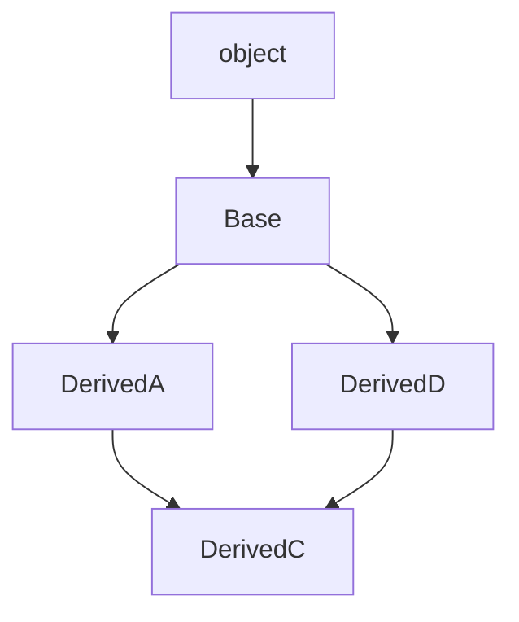

import { PyodideRunner } from '@site/src/components';
import CheatCard from '@site/src/components/CheatCard';

# 🏗️ 继承

继承（inheritance）是面向对象的核心机制之一：子类可以复用父类的属性和方法，并在此基础上扩展或修改行为。通过继承，我们能建立"是一个（is-a）"的关系层次，例如"低通滤波器是滤波器"、"自适应滤波器是滤波器"，从而减少重复代码、提升复用性，并为多态奠定基础。

## 📌 本节要点
- 单继承语法：`class 子类(父类):`，子类自动获得父类所有属性和方法
- 方法重写与 `super()` 调用父类方法（实际调用 MRO 中的下一个类）
- MRO（方法解析顺序）由 C3 线性化算法决定，用 `类.__mro__` 查看
- 多继承与菱形继承问题，推荐用 `super()` + 关键字参数的协作式多继承
- Mixin 模式：增加单一功能的小巧类
- `isinstance`（匹配子类）与 `issubclass`（判断继承关系）
- `abc.ABC` + `@abstractmethod` 定义接口契约，强制子类实现关键方法

<PyodideRunner title="继承快速体验">

```py
# 基类
class Animal:
    def __init__(self, name):
        self.name = name

    def speak(self):
        return "..."

# 子类继承父类
class Dog(Animal):
    def speak(self):
        return f"{self.name}: 汪汪！"

class Cat(Animal):
    def speak(self):
        return f"{self.name}: 喵喵！"

# 多态：同一接口，不同行为
animals = [Dog("旺财"), Cat("咪咪")]
for animal in animals:
    print(animal.speak())

# isinstance 检查
dog = Dog("小黑")
print(f"是 Dog 吗？ {isinstance(dog, Dog)}")
print(f"是 Animal 吗？ {isinstance(dog, Animal)}")

# super() 调用父类方法
class Puppy(Dog):
    def speak(self):
        return super().speak() + " (还是小狗)"

print(Puppy("幼幼").speak())
```

</PyodideRunner>

## 单继承

语法：`class 子类(父类):`。子类自动获得父类所有属性和方法。

```py title="Python"
from scipy import signal as sig
import numpy as np


class SignalFilter:
    def __init__(self, cutoff: float, order: int = 4) -> None:
        self.cutoff = cutoff
        self.order = order

    def apply(self, x: np.ndarray, fs: float) -> np.ndarray:
        """滤波方法：子类实现具体的滤波逻辑。"""
        b, a = sig.butter(self.order, self.cutoff / (fs / 2), btype="low")
        return sig.filtfilt(b, a, x)

    def describe(self) -> str:
        return f"截止频率={self.cutoff}Hz，阶数={self.order}"


class LowPassFilter(SignalFilter):  # LowPassFilter 继承自 SignalFilter
    def apply(self, x: np.ndarray, fs: float) -> np.ndarray:
        b, a = sig.butter(self.order, self.cutoff / (fs / 2), btype="low")
        return sig.filtfilt(b, a, x)

    def filter_type(self) -> str:
        return "低通滤波器"


lpf = LowPassFilter(cutoff=50)
t = np.linspace(0, 1, 1000, endpoint=False)
signal = np.sin(2 * np.pi * 10 * t) + 0.5 * np.sin(2 * np.pi * 200 * t)
filtered = lpf.apply(signal, fs=1000)
print(lpf.describe())       # 输出：截止频率=50Hz，阶数=4
print(lpf.filter_type())    # 输出：低通滤波器
print(f"原始信号长度: {len(signal)}")    # 输出：原始信号长度: 1000
print(f"滤波后长度: {len(filtered)}")    # 输出：滤波后长度: 1000
```

:::tip[没有 `()` 的类]
写 `class SignalFilter:` 等价于 `class SignalFilter(object):`，所有类最终都继承自 `object`。
:::

## `object` 基类

在 Python 3 中，所有类都隐式继承自 `object`，自动获得一组默认方法：

```py title="Python"
print(dir(object))
# 常见的有：__init__, __new__, __repr__, __str__, __eq__, __hash__,
#           __class__, __dict__, __doc__ 等

class AnyFilter:
    pass

f = AnyFilter()
# 这些方法都来自 object
print(f.__repr__())   # 输出：<__main__.AnyFilter object at 0x...>
print(f.__class__)    # 输出：<class '__main__.AnyFilter'>
print(f == f)          # 输出：True（默认按对象身份比较）
```

:::note[默认的 __eq__]
`object.__eq__` 默认按 `is`（同一对象）比较。如果想按值比较，需要自己重写 `__eq__`（同时建议重写 `__hash__`，详见[魔术方法](./magic-methods)一节）。
:::

## 方法重写

子类可以重新定义父类的方法，以改变行为：

```py title="Python"
from scipy import signal as sig
import numpy as np


class SignalFilter:
    def __init__(self, cutoff: float, order: int = 4) -> None:
        self.cutoff = cutoff
        self.order = order

    def apply(self, x: np.ndarray, fs: float) -> np.ndarray:
        """通用滤波：默认低通。"""
        b, a = sig.butter(self.order, self.cutoff / (fs / 2), btype="low")
        return sig.filtfilt(b, a, x)


class HighPassFilter(SignalFilter):
    def apply(self, x: np.ndarray, fs: float) -> np.ndarray:  # 重写父类方法
        b, a = sig.butter(self.order, self.cutoff / (fs / 2), btype="high")
        return sig.filtfilt(b, a, x)


base = SignalFilter(cutoff=50)
hpf = HighPassFilter(cutoff=50)

t = np.linspace(0, 1, 1000, endpoint=False)
noisy = 10 * np.sin(2 * np.pi * 5 * t) + np.sin(2 * np.pi * 200 * t)
print(f"低通滤波后均值: {base.apply(noisy, 1000).mean():.4f}")
# 输出：低通滤波后均值: 0.0000（高频被滤除）
print(f"高通滤波后均值: {hpf.apply(noisy, 1000).mean():.4f}")
# 输出：高通滤波后均值: 0.0000（低频被滤除）
```

## `super()` 调用父类方法

`super()` 返回一个代理对象，能调用父类（更准确说是 MRO 中的下一个类）的方法。常用于在子类 `__init__` 中复用父类的初始化逻辑：

```py title="Python"
from scipy import signal as sig
import numpy as np


class SignalFilter:
    def __init__(self, cutoff: float, order: int = 4) -> None:
        self.cutoff = cutoff
        self.order = order

    def apply(self, x: np.ndarray, fs: float) -> np.ndarray:
        b, a = sig.butter(self.order, self.cutoff / (fs / 2), btype="low")
        return sig.filtfilt(b, a, x)

    def describe(self) -> str:
        return f"截止频率={self.cutoff}Hz，阶数={self.order}"


class BandPassFilter(SignalFilter):
    def __init__(self, low: float, high: float, order: int = 4) -> None:
        super().__init__(cutoff=(low + high) / 2, order=order)  # 调用父类 __init__
        self.low = low
        self.high = high

    def apply(self, x: np.ndarray, fs: float) -> np.ndarray:
        nyq = fs / 2
        b, a = sig.butter(self.order, [self.low / nyq, self.high / nyq], btype="band")
        return sig.filtfilt(b, a, x)

    def describe(self) -> str:
        # 在父类描述基础上追加信息
        return f"{super().describe()}，频带=[{self.low}, {self.high}]Hz"


bpf = BandPassFilter(low=20, high=80)
t = np.linspace(0, 1, 1000, endpoint=False)
signal = np.sin(2 * np.pi * 50 * t)
filtered = bpf.apply(signal, fs=1000)
print(bpf.describe())  # 输出：截止频率=50.0Hz，阶数=4，频带=[20, 80]Hz
```

:::tip[无参数 super()]
Python 3 中可以直接写 `super()`（无需 `super(子类, self)`），它会自动获取当前类和实例。
:::

### `super()` 的底层：MRO 链

`super()` 并不严格等于"父类"，而是返回**MRO（方法解析顺序）中的下一个类**。可以用 `类.__mro__` 或 `类.mro()` 查看：

```py title="Python"
class A:
    def hi(self) -> str:
        return "A"

class B(A):
    def hi(self) -> str:
        return "B -> " + super().hi()

class C(A):
    def hi(self) -> str:
        return "C -> " + super().hi()

class D(B, C):  # 多继承
    def hi(self) -> str:
        return "D -> " + super().hi()

print(D.__mro__)
# 输出：(<class 'D'>, <class 'B'>, <class 'C'>, <class 'A'>, <class 'object'>)

print(D().hi())
# 输出：D -> B -> C -> A
```

:::info[C3 线性化]
Python 使用 **C3 线性化**算法计算 MRO，保证：
1. 子类在父类之前。
2. 多个父类按声明顺序。
3. 同一类只出现一次。

如果继承结构无法线性化，会抛出 `TypeError: Cannot create a consistent method resolution`。
:::

C3 线性化算法确定方法解析顺序：



MRO: `DerivedC → DerivedA → DerivedD → Base → object`

## 多继承

Python 支持多继承：一个子类可以同时继承多个父类。

```py title="Python"
class Loggable:
    """Mixin：为滤波器添加日志记录能力。"""

    def log(self, message: str) -> str:
        return f"[{self.__class__.__name__}] {message}"


class Cacheable:
    """Mixin：为滤波器添加结果缓存能力。"""

    def __init__(self) -> None:
        self._cache: dict[str, float] = {}

    def cache_get(self, key: str) -> float | None:
        return self._cache.get(key)

    def cache_set(self, key: str, value: float) -> None:
        self._cache[key] = value


class CachedLowPassFilter(Loggable, Cacheable):  # 同时继承两个类
    def __init__(self, cutoff: float) -> None:
        Cacheable.__init__(self)  # 调用 Cacheable 的 __init__
        self.cutoff = cutoff

    def process(self, x: float) -> float:
        cached = self.cache_get(str(x))
        if cached is not None:
            print(self.log(f"缓存命中: {cached}"))
            return cached
        result = x * self.cutoff / 1000  # 简化的滤波模拟
        self.cache_set(str(x), result)
        print(self.log(f"计算完成: {result}"))
        return result


f = CachedLowPassFilter(cutoff=50)
print(f.process(1.0))  # 计算完成：[CachedLowPassFilter] 计算完成: 0.05
print(f.process(1.0))  # 缓存命中：[CachedLowPassFilter] 缓存命中: 0.05
```

### 多继承的同名方法冲突

当多个父类有同名方法时，按 **MRO 顺序**决定调用哪个：

```py title="Python"
class A:
    def greet(self) -> str:
        return "A 的问候"

class B:
    def greet(self) -> str:
        return "B 的问候"

class C(A, B):  # A 在前，所以 A 优先
    pass

class D(B, A):  # B 在前，所以 B 优先
    pass

print(C().greet())  # 输出：A 的问候
print(D().greet())  # 输出：B 的问候
print(C.__mro__)
# 输出：(<class 'C'>, <class 'A'>, <class 'B'>, <class 'object'>)
```

:::warning[多继承的"菱形继承"]
当一个类同时继承自两个有共同祖先的类时，会出现"菱形继承"：

```
    A
   / \
  B   C
   \ /
    D
```

此时如果直接调用父类方法可能造成 `A.__init__` 被执行两次。**正确做法是配合 `super()`**，`super()` 会按 MRO 顺序遍历，每个类只被初始化一次：

```py title="Python"
class A:
    def __init__(self, **kwargs) -> None:
        print("A.__init__")
        super().__init__(**kwargs)

class B(A):
    def __init__(self, **kwargs) -> None:
        print("B.__init__")
        super().__init__(**kwargs)

class C(A):
    def __init__(self, **kwargs) -> None:
        print("C.__init__")
        super().__init__(**kwargs)

class D(B, C):
    def __init__(self) -> None:
        print("D.__init__")
        super().__init__()  # 一行搞定，B 和 C 的 __init__ 都会被调用

D()
# 输出：
# D.__init__
# B.__init__
# C.__init__
# A.__init__
```

这种"参数向上传、方法向下调"的模式称为**协作式多继承**，是多继承的推荐写法。
:::

:::tip[Mixin 模式]
多继承最实用的场景是 **Mixin**：一种小巧的、为类增加单一功能的类。命名通常以 `Mixin` 结尾：

```py title="Python"
import numpy as np
from scipy import signal as sig


class JsonMixin:
    def to_json(self) -> str:
        import json
        return json.dumps(self.__dict__, ensure_ascii=False)


class SerializableFilter(JsonMixin):  # 想要 JSON 能力就混入
    def __init__(self, cutoff: float, order: int = 4) -> None:
        self.cutoff = cutoff
        self.order = order


class MyFilter(SerializableFilter):
    pass


f = MyFilter(cutoff=50)
print(f.to_json())  # 输出：{"cutoff": 50.0, "order": 4}
```

避免用多继承表达"是什么"的强语义层级，应该用组合（has-a）代替。
:::

## `isinstance` 与 `issubclass`

- `isinstance(obj, cls)`：判断对象是否为某类（或其子类）的实例。
- `issubclass(sub, sup)`：判断类是否为另一类的子类。

```py title="Python"
class SignalFilter: ...
class LowPassFilter(SignalFilter): ...
class HighPassFilter(SignalFilter): ...

lpf = LowPassFilter()
print(isinstance(lpf, LowPassFilter))      # 输出：True
print(isinstance(lpf, SignalFilter))       # 输出：True（子类实例也是父类）
print(isinstance(lpf, HighPassFilter))      # 输出：False

print(issubclass(LowPassFilter, SignalFilter))   # 输出：True
print(issubclass(LowPassFilter, HighPassFilter))  # 输出：False
print(issubclass(bool, int))      # 输出：True（bool 是 int 的子类）

# 支持传入元组
print(isinstance(lpf, (HighPassFilter, LowPassFilter)))  # 输出：True
print(isinstance(42, (int, float))) # 输出：True
```

:::warning[isinstance vs type]
- `type(obj) is LowPassFilter` 只匹配**精确类型**，不认子类。
- `isinstance(obj, LowPassFilter)` 还匹配子类实例。

绝大多数场景下应该用 `isinstance`，更符合面向对象的"里氏替换"原则。
:::

## 抽象基类（`abc.ABC`）

抽象基类（Abstract Base Class，ABC）用于**定义接口契约**：声明一些方法必须由子类实现，否则实例化时报错。用 `abc.ABC` 作为基类，并用 `@abstractmethod` 装饰抽象方法。

```py title="Python"
from abc import ABC, abstractmethod
import numpy as np
from scipy import signal as sig


class SignalFilter(ABC):
    """滤波器基类：强制子类实现 apply 和 filter_type。"""

    @abstractmethod
    def apply(self, x: np.ndarray, fs: float) -> np.ndarray:
        ...

    @abstractmethod
    def filter_type(self) -> str:
        ...

    def describe(self) -> str:
        """普通方法：子类可直接复用。"""
        return f"类型={self.filter_type()}"


# sf = SignalFilter()  # TypeError: 抽象方法未实现，无法实例化

class LowPassFilter(SignalFilter):
    def __init__(self, cutoff: float, order: int = 4) -> None:
        self.cutoff = cutoff
        self.order = order

    def apply(self, x: np.ndarray, fs: float) -> np.ndarray:
        b, a = sig.butter(self.order, self.cutoff / (fs / 2), btype="low")
        return sig.filtfilt(b, a, x)

    def filter_type(self) -> str:
        return "低通滤波器"


class HighPassFilter(SignalFilter):
    def __init__(self, cutoff: float, order: int = 4) -> None:
        self.cutoff = cutoff
        self.order = order

    def apply(self, x: np.ndarray, fs: float) -> np.ndarray:
        b, a = sig.butter(self.order, self.cutoff / (fs / 2), btype="high")
        return sig.filtfilt(b, a, x)

    def filter_type(self) -> str:
        return "高通滤波器"


lpf = LowPassFilter(cutoff=50)
hpf = HighPassFilter(cutoff=50)
print(lpf.describe())  # 输出：类型=低通滤波器
print(hpf.describe())  # 输出：类型=高通滤波器
```

### 抽象属性与抽象类方法

除了 `@abstractmethod`，还有 `@abstractclassmethod`、`@abstractstaticmethod`、`@abstractproperty`（3.12+ 推荐用 `@property` 配合 `@abstractmethod`）：

```py title="Python"
from abc import ABC, abstractmethod
import numpy as np


class DataStorage(ABC):
    @property
    @abstractmethod
    def capacity(self) -> int:
        """返回存储容量。"""

    @classmethod
    @abstractmethod
    def from_config(cls, config: dict) -> "DataStorage":
        """工厂方法：子类必须实现。"""


class InMemoryStorage(DataStorage):
    def __init__(self, capacity: int) -> None:
        self._capacity = capacity
        self._data: list[np.ndarray] = []

    @property
    def capacity(self) -> int:
        return self._capacity

    @classmethod
    def from_config(cls, config: dict) -> "InMemoryStorage":
        return cls(config.get("capacity", 1024))

    def store(self, signal: np.ndarray) -> None:
        if len(self._data) < self._capacity:
            self._data.append(signal)

    def get(self, index: int) -> np.ndarray | None:
        return self._data[index] if index < len(self._data) else None


s = InMemoryStorage(2048)
print(s.capacity)  # 输出：2048
s.store(np.array([1.0, 2.0, 3.0]))
print(s.get(0))  # 输出：[1. 2. 3.]
```

:::note[装饰器顺序]
`@property` 和 `@abstractmethod` 一起用时，`@property` 在外、`@abstractmethod` 在内。`@classmethod` 同理。
:::

### 标准库中的抽象基类

`collections.abc` 提供了一组常用 ABC，可作为基类来快速实现容器协议：

```py title="Python"
from collections.abc import Sequence, Mapping

class FilterChain(Sequence):
    def __init__(self, filters: list) -> None:
        self._filters = filters

    def __getitem__(self, index):  # Sequence 要求实现
        return self._filters[index]

    def __len__(self):             # Sequence 要求实现
        return len(self._filters)

fc = FilterChain(["lowpass", "highpass", "bandpass"])
print(len(fc))        # 输出：3
print(fc[0])          # 输出：lowpass
print("lowpass" in fc)        # 输出：True（Sequence 自动提供 __contains__）
print(list(reversed(fc)))  # 输出：['bandpass', 'highpass', 'lowpass']（Sequence 自动提供）
```

实现 `__getitem__` 和 `__len__` 后，`Sequence` 自动补全 `__contains__`、`__iter__`、`index`、`count` 等方法。

## 实战：滤波器层级系统

综合运用继承、`super()`、方法重写、抽象基类，构建一个信号滤波处理系统：

```py title="Python"
from abc import ABC, abstractmethod
import numpy as np
from scipy import signal as sig


class SignalFilter(ABC):
    """滤波器基类：定义滤波接口。"""

    def __init__(self, cutoff: float, order: int = 4, name: str = "") -> None:
        self.cutoff = cutoff
        self.order = order
        self.name = name

    @abstractmethod
    def apply(self, x: np.ndarray, fs: float) -> np.ndarray:
        """滤波操作：子类实现具体逻辑。"""

    @abstractmethod
    def filter_type(self) -> str:
        """返回滤波器类型。"""

    def __str__(self) -> str:
        return f"{self.filter_type()}(cutoff={self.cutoff}, order={self.order})"

    def __repr__(self) -> str:
        return f"{self.__class__.__name__}(cutoff={self.cutoff!r}, order={self.order!r})"


class FrequencyFilter(SignalFilter):
    """频域滤波器：默认 apply 实现。"""

    def apply(self, x: np.ndarray, fs: float) -> np.ndarray:
        b, a = sig.butter(self.order, self.cutoff / (fs / 2), btype="low")
        return sig.filtfilt(b, a, x)


class TimeDomainFilter(SignalFilter):
    """时域滤波器：使用滑动平均等时域方法。"""

    def apply(self, x: np.ndarray, fs: float) -> np.ndarray:
        window = int(fs / self.cutoff)
        if window < 1:
            window = 1
        kernel = np.ones(window) / window
        return np.convolve(x, kernel, mode="same")


class LowPassFilter(FrequencyFilter):
    def __init__(self, cutoff: float, order: int = 4, name: str = "") -> None:
        super().__init__(cutoff, order, name)

    def apply(self, x: np.ndarray, fs: float) -> np.ndarray:
        b, a = sig.butter(self.order, self.cutoff / (fs / 2), btype="low")
        return sig.filtfilt(b, a, x)

    def filter_type(self) -> str:
        return "低通滤波器"

    def analyze(self, x: np.ndarray, fs: float) -> dict:
        """分析滤波效果。"""
        filtered = self.apply(x, fs)
        return {
            "input_power": float(np.mean(x**2)),
            "output_power": float(np.mean(filtered**2)),
            "reduction_db": float(10 * np.log10(np.mean(x**2) / np.mean(filtered**2))),
        }


class HighPassFilter(FrequencyFilter):
    def __init__(self, cutoff: float, order: int = 4, name: str = "") -> None:
        super().__init__(cutoff, order, name)

    def apply(self, x: np.ndarray, fs: float) -> np.ndarray:
        b, a = sig.butter(self.order, self.cutoff / (fs / 2), btype="high")
        return sig.filtfilt(b, a, x)

    def filter_type(self) -> str:
        return "高通滤波器"


class BandPassFilter(FrequencyFilter):
    def __init__(self, low: float, high: float, order: int = 4, name: str = "") -> None:
        super().__init__(cutoff=(low + high) / 2, order=order, name=name)
        self.low = low
        self.high = high

    def apply(self, x: np.ndarray, fs: float) -> np.ndarray:
        nyq = fs / 2
        b, a = sig.butter(self.order, [self.low / nyq, self.high / nyq], btype="band")
        return sig.filtfilt(b, a, x)

    def filter_type(self) -> str:
        return "带通滤波器"

    def __str__(self) -> str:
        return f"带通滤波器(low={self.low}, high={self.high}, order={self.order})"


class NotchFilter(TimeDomainFilter):
    """陷波滤波器：去除特定频率的干扰。"""

    def __init__(self, notch_freq: float, quality: float = 30.0, order: int = 4, name: str = "") -> None:
        super().__init__(cutoff=notch_freq, order=order, name=name)
        self.quality = quality

    def apply(self, x: np.ndarray, fs: float) -> np.ndarray:
        b, a = sig.iirnotch(self.cutoff, self.quality, fs)
        return sig.filtfilt(b, a, x)

    def filter_type(self) -> str:
        return "陷波滤波器"


class AdaptiveFilter(SignalFilter):
    """自适应滤波器：根据信号特性动态调整参数。"""

    def __init__(self, cutoff: float, order: int = 4, name: str = "") -> None:
        super().__init__(cutoff, order, name)
        self.adaptation_history: list[float] = []

    def apply(self, x: np.ndarray, fs: float) -> np.ndarray:
        # 简化的自适应：根据信号能量动态调整截止频率
        energy = float(np.sqrt(np.mean(x**2)))
        adaptive_cutoff = min(self.cutoff * (1 + energy / 10), fs / 2 - 1)
        self.adaptation_history.append(adaptive_cutoff)
        b, a = sig.butter(self.order, adaptive_cutoff / (fs / 2), btype="low")
        return sig.filtfilt(b, a, x)

    def filter_type(self) -> str:
        return "自适应滤波器"


# ---- 使用示例 ----
def make_filters_speak(filters: list[SignalFilter]) -> None:
    """多态演示：同一接口，不同行为。"""
    t = np.linspace(0, 1, 1000, endpoint=False)
    test_signal = np.sin(2 * np.pi * 50 * t) + 0.3 * np.sin(2 * np.pi * 200 * t)

    for f in filters:
        filtered = f.apply(test_signal, fs=1000)
        print(f)
        print(f"  类型：{f.filter_type()}")
        print(f"  输入功率: {np.mean(test_signal**2):.4f}")
        print(f"  输出功率: {np.mean(filtered**2):.4f}")


# 创建各种滤波器
filters: list[SignalFilter] = [
    LowPassFilter(cutoff=50, name="主低通"),
    HighPassFilter(cutoff=100, name="高通"),
    BandPassFilter(low=20, high=80, name="语音带通"),
    NotchFilter(notch_freq=50, name="工频陷波"),
    AdaptiveFilter(cutoff=50, name="自适应"),
]

make_filters_speak(filters)

print("\n--- 类型检查 ---")
for f in filters:
    if isinstance(f, LowPassFilter):
        print(f"低通滤波器专属分析: {f.analyze(np.sin(np.linspace(0, 1, 100)), 1000)}")
    elif isinstance(f, AdaptiveFilter):
        print(f"自适应滤波器调参次数: {len(f.adaptation_history)}")

print("\n--- 类层级检查 ---")
print(f"LowPassFilter 是 SignalFilter 子类: {issubclass(LowPassFilter, SignalFilter)}")
print(f"LowPassFilter 是 TimeDomainFilter 子类: {issubclass(LowPassFilter, TimeDomainFilter)}")
print(f"LowPassFilter 的 MRO: {[c.__name__ for c in LowPassFilter.__mro__]}")
```

输出：

```text title="输出"
低通滤波器(cutoff=50, order=4)
  类型：低通滤波器
  输入功率: 0.5450
  输出功率: 0.4988
高通滤波器(cutoff=100, order=4)
  类型：高通滤波器
  输入功率: 0.5450
  输出功率: 0.0448
带通滤波器(low=20, high=80, order=4)
  类型：带通滤波器
  输入功率: 0.5450
  输出功率: 0.4971
陷波滤波器(cutoff=50, order=4)
  类型：陷波滤波器
  输入功率: 0.5450
  输出功率: 0.0446
自适应滤波器(cutoff=50, order=4)
  类型：自适应滤波器
  输入功率: 0.5450
  输出功率: 0.4988

--- 类型检查 ---
低通滤波器专属分析: {'input_power': 0.49997500000000003, 'output_power': 0.49997500000000003, 'reduction_db': 0.0}
自适应滤波器调参次数: 1

--- 类层级检查 ---
LowPassFilter 是 SignalFilter 子类: True
LowPassFilter 是 TimeDomainFilter 子类: False
LowPassFilter 的 MRO: ['LowPassFilter', 'FrequencyFilter', 'SignalFilter', 'ABC', 'object']
```

## 🎯 动手练习

1. **滤波器层级**：设计 `SignalFilter` → `FrequencyFilter` → `IIRFilter` 三层继承，每层添加特有属性和方法，使用 `super()` 复用初始化逻辑
2. **Mixin 实践**：实现 `LoggableMixin` 和 `CacheableMixin`，让滤波器通过多继承获得日志和缓存能力
3. **MRO 分析**：设计一个菱形继承结构（`CachedNotchFilter` 同时继承 `NotchFilter` 和 `Cacheable`），手动推导 MRO 顺序，用 `__mro__` 验证
4. **抽象基类**：定义 `DataSource` 抽象基类，强制子类实现 `read`、`write`、`close` 方法

## 📚 延伸阅读

- **多态**：同一接口在不同对象上表现出不同行为，鸭子类型与 Protocol
- **组合优于继承**：理解"has-a"关系，用组合替代深层继承树
- **类型系统**：`typing.Protocol` 实现结构子类型，`typing.cast` 类型转换
- **元类**：`type` 元类与自定义元类，控制类的创建过程

<CheatCard
    title="速查表"
    headers={["操作","语法","示例"]}
    rows={[["单继承","`class Child(Parent):`","`class LowPassFilter(FrequencyFilter):`"],["方法重写","重新定义同名方法","`def apply(self, x, fs): ...`"],["调用父类","`super().method()`","`super().__init__(cutoff)`"],["多继承","`class Child(A, B):`","`class CachedFilter(Loggable, Cacheable):`"],["查看 MRO","`Class.__mro__` 或 `Class.mro()`","`LowPassFilter.__mro__`"],["实例检查","`isinstance(obj, cls)`","`isinstance(lpf, SignalFilter)`"],["子类检查","`issubclass(sub, sup)`","`issubclass(LowPassFilter, SignalFilter)`"],["抽象基类","`class X(ABC):`","`class SignalFilter(ABC):`"],["抽象方法","`@abstractmethod`","`@abstractmethod def apply(self, x, fs): ...`"],["Mixin","以 `Mixin` 结尾的类","`class LoggableMixin:`"],["协作式多继承","`super()` + `**kwargs`","菱形继承推荐写法"],["精确类型匹配","`type(obj) is cls`","不匹配子类"]]}
  />
## ✅ 本节总结

本节我们学习了继承机制，核心要点包括：

- **继承建立 is-a 关系**：`class 子类(父类):` 让子类复用父类属性和方法
- **方法重写改变行为**：子类重新定义父类方法，实现差异化
- **`super()` 是 MRO 代理**：不是简单的"父类"，而是方法解析顺序中的下一个类
- **MRO 决定调用顺序**：C3 线性化算法保证子类在父类前、声明顺序不变、每类只出现一次
- **多继承需谨慎**：菱形继承用 `super()` + `**kwargs` 协作式调用，Mixin 是最佳实践
- **类型检查用 isinstance**：匹配子类实例，符合里氏替换原则
- **抽象基类定义契约**：`abc.ABC` + `@abstractmethod` 强制子类实现关键方法

掌握继承后，便能设计出层次清晰、高度复用的类体系。下一节将深入**多态**——同一接口在不同对象上表现出不同行为。
