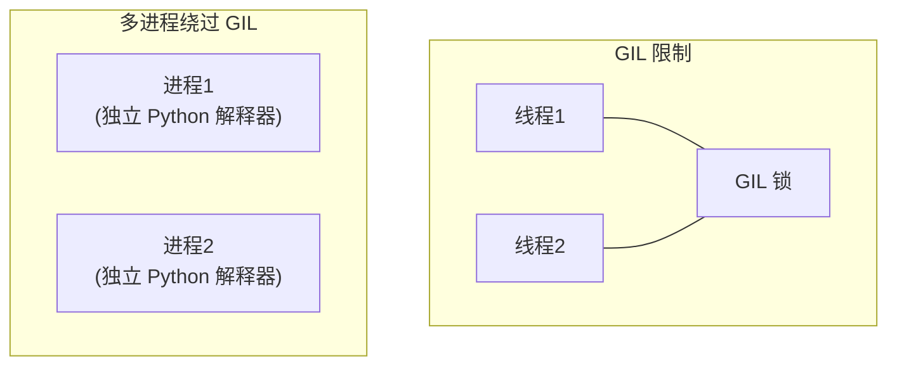
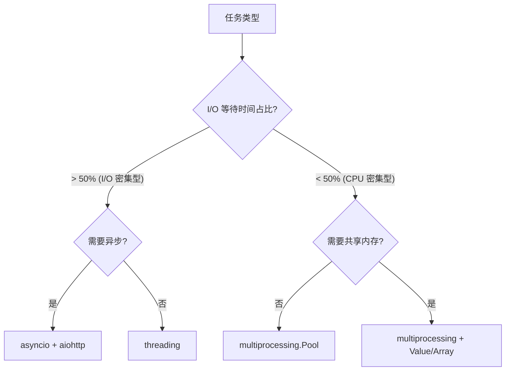
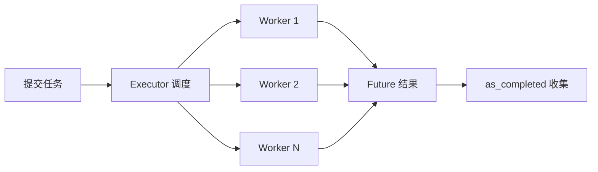

import { PyodideRunner } from '@site/src/components';

# ⚡ 多进程与并行

Python 的 GIL（全局解释器锁）限制了线程对 CPU 密集型任务的并行能力。`multiprocessing` 模块通过创建独立进程绕过 GIL，每个进程拥有自己的 Python 解释器和内存空间，真正实现并行计算。配合 `concurrent.futures` 的高级接口，可以轻松构建高效的并行数据处理管道。本节系统介绍多进程编程的核心概念与实战技巧。

## 📌 本节要点

- **GIL 限制**：CPython 的 GIL 使多线程无法真正并行执行 CPU 密集型代码
- **multiprocessing 核心**：`Process`、`Pool`、`Queue`、`Pipe`、`Value`、`Array`
- **Pool 并行映射**：`map`、`starmap`、`apply_async` 实现任务分发
- **进程间通信**：`Queue`（生产者-消费者）、`Pipe`（点对点）、共享内存（`Value`/`Array`）
- **concurrent.futures**：`ProcessPoolExecutor` 高级接口，`as_completed` 异步收集结果
- **并行数据处理**：批量文件处理、蒙特卡洛模拟、实验批处理

## GIL 限制与应对

### 什么是 GIL

GIL（Global Interpreter Lock）是 CPython 解释器中的全局锁，确保同一时刻只有一个线程执行 Python 字节码。这意味着即使在多核 CPU 上，多线程也无法真正并行执行 CPU 密集型代码。



### 如何选择并行方案



### GIL 对比实验

```py title="Python"
import time
import threading
from multiprocessing import Process

def cpu_bound(n):
    """CPU 密集型任务：计算素数"""
    count = 0
    for i in range(2, n):
        if all(i % j != 0 for j in range(2, int(i**0.5) + 1)):
            count += 1
    return count

def benchmark_single():
    start = time.perf_counter()
    cpu_bound(100_000)
    cpu_bound(100_000)
    elapsed = time.perf_counter() - start
    print(f"串行: {elapsed:.2f}s")
    return elapsed

def benchmark_threading():
    start = time.perf_counter()
    t1 = threading.Thread(target=cpu_bound, args=(100_000,))
    t2 = threading.Thread(target=cpu_bound, args=(100_000,))
    t1.start(); t2.start()
    t1.join(); t2.join()
    elapsed = time.perf_counter() - start
    print(f"多线程: {elapsed:.2f}s (GIL 导致无加速)")
    return elapsed

def benchmark_multiprocessing():
    start = time.perf_counter()
    p1 = Process(target=cpu_bound, args=(100_000,))
    p2 = Process(target=cpu_bound, args=(100_000,))
    p1.start(); p2.start()
    p1.join(); p2.join()
    elapsed = time.perf_counter() - start
    print(f"多进程: {elapsed:.2f}s (接近 2x 加速)")
    return elapsed

if __name__ == "__main__":
    t1 = benchmark_single()
    t2 = benchmark_threading()
    t3 = benchmark_multiprocessing()
    print(f"\n加速比: 多线程 {t1/t2:.2f}x, 多进程 {t1/t3:.2f}x")
```

:::tip[GIL 何时不重要]
- **I/O 密集型任务**：文件读写、网络请求、数据库查询时，线程在等待 I/O 时会释放 GIL
- **C 扩展库**：NumPy、Pandas 等底层用 C 实现的操作会释放 GIL
- **subprocess**：外部进程不受 GIL 限制
:::

## Process 与 Pool

### Process 基础

`Process` 创建独立进程，通过 `start()`/`join()` 管理生命周期：

```py title="Python"
from multiprocessing import Process
import os

def worker(name):
    print(f"子进程 {name}: PID={os.getpid()}, 父PID={os.getppid()}")

if __name__ == "__main__":
    print(f"主进程: PID={os.getpid()}")
    processes = []
    for i in range(3):
        p = Process(target=worker, args=(f"Worker-{i}",))
        p.start()
        processes.append(p)
    for p in processes:
        p.join()
    print("所有子进程完成")
```

### Pool 并行映射

`Pool` 创建进程池，提供 `map`、`starmap`、`apply_async` 等高级接口：

```py title="Python"
from multiprocessing import Pool
import time

def square(x):
    """模拟 CPU 密集型计算"""
    time.sleep(0.1)
    return x ** 2

if __name__ == "__main__":
    data = list(range(20))
    
    # map：同步，结果有序
    with Pool(4) as pool:
        start = time.perf_counter()
        results = pool.map(square, data)
        elapsed = time.perf_counter() - start
    print(f"map 结果: {results[:5]}...")
    print(f"耗时: {elapsed:.2f}s")
    
    # starmap：支持多参数
    def power(x, n):
        return x ** n
    
    with Pool(4) as pool:
        pairs = [(2, 3), (3, 2), (4, 3)]
        results = pool.starmap(power, pairs)
    print(f"starmap: {results}")  # [8, 9, 64]
    
    # apply_async：异步，适合不等长任务
    with Pool(4) as pool:
        async_results = []
        for x in range(10):
            r = pool.apply_async(square, (x,))
            async_results.append(r)
        # 手动收集结果
        results = [r.get() for r in async_results]
    print(f"apply_async: {results}")
```

### Pool 参数详解

```py title="Python"
from multiprocessing import Pool
import os

def info(x):
    return f"PID={os.getpid()}, 值={x}"

if __name__ == "__main__":
    # 进程数默认等于 CPU 核心数
    with Pool() as pool:  # 等价于 Pool(os.cpu_count())
        results = pool.map(info, range(8))
    
    for r in results:
        print(r)
    # 可以看到不同 PID，说明确实使用了多个进程
```

:::warning[Pool 的 fork 问题]
在 macOS 上，默认的 `fork` 启动方式可能导致问题（尤其是涉及线程或 GUI 时）。推荐显式设置启动方式：

```py title="Python"
import multiprocessing
multiprocessing.set_start_method("spawn")  # 放在程序最开始
```
:::

## 进程间通信

进程拥有独立内存空间，需要通过 IPC（Inter-Process Communication）机制交换数据。

### Queue：生产者-消费者模式

```py title="Python"
from multiprocessing import Process, Queue
import time

def producer(queue, n):
    """生产者：生成数据放入队列"""
    for i in range(n):
        item = f"任务-{i}"
        queue.put(item)
        print(f"生产: {item}")
        time.sleep(0.1)
    queue.put(None)  # 毒丸：通知消费者结束

def consumer(queue):
    """消费者：从队列取出数据处理"""
    while True:
        item = queue.get()
        if item is None:
            break
        print(f"消费: {item}")
        time.sleep(0.2)

if __name__ == "__main__":
    q = Queue()
    p1 = Process(target=producer, args=(q, 5))
    p2 = Process(target=consumer, args=(q,))
    p1.start()
    p2.start()
    p1.join()
    p2.join()
```

### Pipe：点对点通信

```py title="Python"
from multiprocessing import Process, Pipe

def sender(conn):
    conn.send({"x": 1, "y": 2})
    conn.send([1, 2, 3])
    conn.send(None)
    conn.close()

def receiver(conn):
    while True:
        msg = conn.recv()
        if msg is None:
            break
        print(f"收到: {msg}")

if __name__ == "__main__":
    parent_conn, child_conn = Pipe()
    p1 = Process(target=sender, args=(child_conn,))
    p2 = Process(target=receiver, args=(parent_conn,))
    p1.start()
    p2.start()
    p1.join()
    p2.join()
```

### Value 与 Array：共享内存

```py title="Python"
from multiprocessing import Process, Value, Array
import ctypes

def increment(counter):
    """每个进程递增计数器"""
    for _ in range(1000):
        counter.value += 1

def fill_array(arr, start):
    """填充共享数组"""
    for i in range(len(arr)):
        arr[i] = start + i

if __name__ == "__main__":
    # 共享整数（加锁保护）
    counter = Value(ctypes.c_int, 0)
    processes = [Process(target=increment, args=(counter,)) for _ in range(4)]
    for p in processes:
        p.start()
    for p in processes:
        p.join()
    print(f"计数器: {counter.value}")  # 4000
    
    # 共享数组
    arr = Array(ctypes.c_int, 10)
    processes = [
        Process(target=fill_array, args=(arr, 0)),
        Process(target=fill_array, args=(arr, 10)),
    ]
    for p in processes:
        p.start()
    for p in processes:
        p.join()
    print(f"数组: {list(arr)}")
```

:::warning[共享内存的竞态条件]
`Value` 和 `Array` 默认使用锁保护，但只保证单个操作的原子性。复合操作（如 `counter.value += 1`）仍需手动加锁：

```py title="Python"
from multiprocessing import Lock

def safe_increment(counter, lock):
    with lock:
        counter.value += 1
```
:::

### Manager：高级共享对象

```py title="Python"
from multiprocessing import Process, Manager

def update_dict(shared_dict, key, value):
    shared_dict[key] = value

def update_list(shared_list, item):
    shared_list.append(item)

if __name__ == "__main__":
    with Manager() as manager:
        shared_dict = manager.dict()
        shared_list = manager.list()
        
        processes = [
            Process(target=update_dict, args=(shared_dict, f"key{i}", i))
            for i in range(5)
        ]
        processes += [
            Process(target=update_list, args=(shared_list, f"item{i}"))
            for i in range(5)
        ]
        
        for p in processes:
            p.start()
        for p in processes:
            p.join()
        
        print(f"字典: {dict(shared_dict)}")
        print(f"列表: {list(shared_list)}")
```

## concurrent.futures

`concurrent.futures` 提供高级接口，抽象了线程/进程的细节，代码更简洁。

### ProcessPoolExecutor

```py title="Python"
from concurrent.futures import ProcessPoolExecutor, as_completed

def process_file(filepath):
    """模拟处理文件"""
    import time
    time.sleep(0.1)
    return {"file": filepath, "lines": 1000, "status": "ok"}

if __name__ == "__main__":
    files = [f"data_{i:03d}.csv" for i in range(20)]
    
    # map：同步，有序
    with ProcessPoolExecutor(max_workers=4) as executor:
        results = list(executor.map(process_file, files))
    print(f"map 结果: {len(results)} 个文件")
    
    # as_completed：异步，按完成顺序
    with ProcessPoolExecutor(max_workers=4) as executor:
        futures = {executor.submit(process_file, f): f for f in files}
        for future in as_completed(futures):
            result = future.result()
            print(f"完成: {result['file']}")
```

### Future 对象



```py title="Python"
from concurrent.futures import ProcessPoolExecutor, Future

def heavy_computation(x):
    import time
    time.sleep(0.5)
    return x ** 2

if __name__ == "__main__":
    with ProcessPoolExecutor(max_workers=2) as executor:
        # 提交任务
        future1 = executor.submit(heavy_computation, 10)
        future2 = executor.submit(heavy_computation, 20)
        
        # 检查状态
        print(f"future1 状态: {future1.done()}")  # False
        print(f"future2 状态: {future2.done()}")  # False
        
        # 获取结果（会阻塞直到完成）
        result1 = future1.result()
        result2 = future2.result()
        print(f"结果: {result1}, {result2}")  # 100, 400
        
        # 带超时获取
        try:
            result = future1.result(timeout=1.0)
        except TimeoutError:
            print("超时")
```

### ThreadPoolExecutor 对比

```py title="Python"
from concurrent.futures import ThreadPoolExecutor, ProcessPoolExecutor
import time

def io_task(n):
    """I/O 密集型任务"""
    time.sleep(1)
    return n

def cpu_task(n):
    """CPU 密集型任务"""
    return sum(i * i for i in range(n))

if __name__ == "__main__":
    # I/O 密集型用线程池
    with ThreadPoolExecutor(max_workers=4) as executor:
        start = time.perf_counter()
        list(executor.map(io_task, range(8)))
        print(f"线程池 (I/O): {time.perf_counter() - start:.2f}s")
    
    # CPU 密集型用进程池
    with ProcessPoolExecutor(max_workers=4) as executor:
        start = time.perf_counter()
        list(executor.map(cpu_task, [100_000] * 4))
        print(f"进程池 (CPU): {time.perf_counter() - start:.2f}s")
```

:::tip[选择建议]
- **I/O 密集型**（网络请求、文件读写）→ `ThreadPoolExecutor`
- **CPU 密集型**（数值计算、图像处理）→ `ProcessPoolExecutor`
- **混合型**：主线程池处理 I/O，子进程池处理计算
:::

## 实战：并行数据处理

### 并行处理传感器数据

完整的并行数据处理管道——批量处理多个传感器数据文件：

```py title="Python"
from concurrent.futures import ProcessPoolExecutor, as_completed
from dataclasses import dataclass
import time
import json

@dataclass
class SensorResult:
    filename: str
    mean: float
    std: float
    min_val: float
    max_val: float
    anomaly_count: int

def process_sensor_file(filepath: str) -> SensorResult:
    """处理单个传感器数据文件"""
    import random
    random.seed(hash(filepath) % 2**32)
    
    # 模拟读取和处理传感器数据
    n_points = random.randint(1000, 5000)
    data = [random.gauss(0, 1) for _ in range(n_points)]
    
    # 注入异常值
    n_anomalies = random.randint(0, 5)
    for _ in range(n_anomalies):
        idx = random.randint(0, n_points - 1)
        data[idx] = random.uniform(10, 20)
    
    # 计算统计量
    mean = sum(data) / len(data)
    variance = sum((x - mean) ** 2 for x in data) / len(data)
    std = variance ** 0.5
    min_val = min(data)
    max_val = max(data)
    anomaly_count = sum(1 for x in data if abs(x) > 3)
    
    # 模拟 I/O 延迟
    time.sleep(0.1)
    
    return SensorResult(
        filename=filepath,
        mean=round(mean, 4),
        std=round(std, 4),
        min_val=round(min_val, 4),
        max_val=round(max_val, 4),
        anomaly_count=anomaly_count,
    )

def parallel_sensor_processing(filepaths: list[str], max_workers: int = 4):
    """并行处理多个传感器文件"""
    results = []
    start = time.perf_counter()
    
    with ProcessPoolExecutor(max_workers=max_workers) as executor:
        # 提交所有任务
        future_to_file = {
            executor.submit(process_sensor_file, fp): fp 
            for fp in filepaths
        }
        
        # 按完成顺序收集结果
        for future in as_completed(future_to_file):
            filepath = future_to_file[future]
            try:
                result = future.result()
                results.append(result)
                print(f"✓ {filepath}: mean={result.mean:.3f}, anomalies={result.anomaly_count}")
            except Exception as e:
                print(f"✗ {filepath}: {e}")
    
    elapsed = time.perf_counter() - start
    print(f"\n处理完成: {len(results)} 个文件, 耗时 {elapsed:.2f}s")
    return results

if __name__ == "__main__":
    # 生成模拟文件列表
    files = [f"sensor_{i:03d}.dat" for i in range(20)]
    results = parallel_sensor_processing(files, max_workers=4)
    
    # 汇总统计
    total_anomalies = sum(r.anomaly_count for r in results)
    avg_std = sum(r.std for r in results) / len(results)
    print(f"\n汇总: 总异常数={total_anomalies}, 平均标准差={avg_std:.4f}")
```

### 并行蒙特卡洛模拟

```py title="Python"
from multiprocessing import Pool
import time

def monte_carlo_pi(n_samples: int) -> int:
    """单次蒙特卡洛模拟，返回圆内点数"""
    import random
    rng = random.Random()
    inside = 0
    for _ in range(n_samples):
        x = rng.uniform(-1, 1)
        y = rng.uniform(-1, 1)
        if x*x + y*y <= 1:
            inside += 1
    return inside

def parallel_monte_carlo(total_samples: int, n_workers: int = 4):
    """并行蒙特卡洛估算 π"""
    samples_per_worker = total_samples // n_workers
    
    start = time.perf_counter()
    with Pool(n_workers) as pool:
        results = pool.map(monte_carlo_pi, [samples_per_worker] * n_workers)
    
    total_inside = sum(results)
    pi_estimate = 4 * total_inside / total_samples
    elapsed = time.perf_counter() - start
    
    print(f"总样本: {total_samples:,}")
    print(f"π 估计值: {pi_estimate:.6f}")
    print(f"真实值:   {3.14159265358979}")
    print(f"误差:     {abs(pi_estimate - 3.14159265358979):.6f}")
    print(f"耗时:     {elapsed:.3f}s")
    return pi_estimate

if __name__ == "__main__":
    parallel_monte_carlo(10_000_000, n_workers=4)
```

### 进度跟踪的并行管道

```py title="Python"
from multiprocessing import Pool, Queue
from functools import partial
import time

def process_with_progress(item, progress_queue):
    """处理单个任务并报告进度"""
    time.sleep(0.05)
    result = item ** 2
    progress_queue.put(1)
    return result

def worker_init(q):
    """初始化工作进程，设置全局队列"""
    global progress_queue
    progress_queue = q

def parallel_with_progress(items, n_workers=4):
    """带进度跟踪的并行处理"""
    q = Queue()
    total = len(items)
    completed = 0
    
    start = time.perf_counter()
    with Pool(n_workers, initializer=worker_init, initargs=(q,)) as pool:
        async_results = [pool.apply_async(process_with_progress, (item,)) for item in items]
        
        # 主进程监控进度
        while completed < total:
            try:
                q.get(timeout=0.1)
                completed += 1
                if completed % 10 == 0 or completed == total:
                    pct = completed / total * 100
                    elapsed = time.perf_counter() - start
                    eta = elapsed / completed * (total - completed) if completed else 0
                    print(f"\r进度: {completed}/{total} ({pct:.1f}%) "
                          f"ETA: {eta:.1f}s", end="", flush=True)
            except:
                pass
        print()
        
        results = [r.get() for r in async_results]
    
    elapsed = time.perf_counter() - start
    print(f"完成: {len(results)} 项, 耗时 {elapsed:.2f}s")
    return results

if __name__ == "__main__":
    items = list(range(100))
    results = parallel_with_progress(items, n_workers=4)
```

:::warning[Windows 平台注意事项]
在 Windows 上，多进程代码必须放在 `if __name__ == "__main__":` 保护内，否则会递归创建子进程导致崩溃：
:::

```py title="Python"
# Windows 必须这样写
from multiprocessing import Process

def worker():
    print("子进程工作")

if __name__ == "__main__":  # 必须有这个保护
    p = Process(target=worker)
    p.start()
    p.join()
```

## 🎯 动手练习

1. **并行文件哈希**：编写程序计算目录下所有文件的 SHA-256 哈希值：
   - 使用 `ProcessPoolExecutor` 并行计算
   - 对比串行和并行的性能差异
   - 处理异常（如权限不足的文件）

2. **并行矩阵乘法**：实现并行的矩阵乘法：
   - 将结果矩阵按行分块
   - 每个进程计算一部分行
   - 使用 `Pool.starmap` 分发任务

3. **生产者-消费者管道**：实现一个数据处理管道：
   - 生产者进程生成随机数据
   - 多个消费者进程并行处理
   - 使用 `Queue` 通信，最终汇总结果

4. **并行超参数搜索**：模拟模型训练的超参数搜索：
   - 定义一个模拟训练函数（接受超参数，返回精度）
   - 使用 `ProcessPoolExecutor` 并行搜索不同超参数组合
   - 用 `as_completed` 实时报告最佳结果

## 📚 延伸阅读

- **[multiprocessing 官方文档](https://docs.python.org/3/library/multiprocessing.html)** - 完整 API 参考
- **[concurrent.futures 官方文档](https://docs.python.org/3/library/concurrent.futures.html)** - 高级并行接口
- **[Python 并行编程](https://docs.python.org/3/library/ipc.html)** - 进程间通信专题
- **[Ray 分布式计算](https://docs.ray.io/)** - 大规模并行与分布式计算框架
- **[Dask 并行计算](https://docs.dask.org/)** - 基于 NumPy/Pandas 的并行计算

## ✅ 本节总结

- **GIL 限制 CPU 并行**：CPython 的 GIL 使多线程无法并行执行 CPU 密集型代码，需用多进程绕过
- **Process 基础**：`Process(target, args)` 创建独立进程，`start()`/`join()` 管理生命周期
- **Pool 高效映射**：`map`/`starmap`/`apply_async` 分发任务，进程池自动管理资源
- **IPC 机制**：`Queue`（生产者-消费者）、`Pipe`（点对点）、`Value`/`Array`（共享内存）
- **concurrent.futures**：`ProcessPoolExecutor`/`ThreadPoolExecutor` 高级接口，`as_completed` 异步收集
- **并行数据处理**：批量文件处理、蒙特卡洛模拟、进度跟踪管道的完整实现
- **平台差异**：Windows 需 `if __name__ == "__main__":` 保护，macOS 推荐 `spawn` 启动方式
