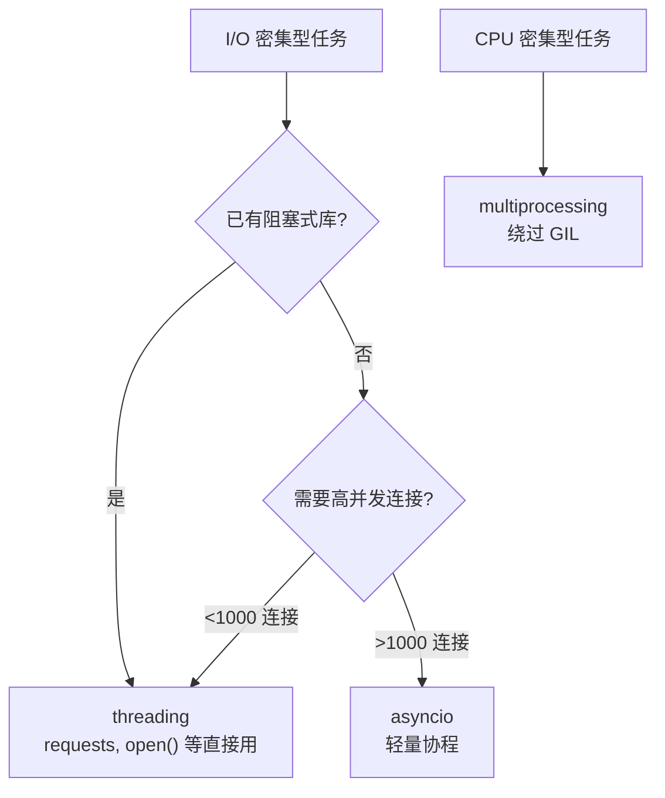

import { PyodideRunner } from '@site/src/components';

# 🧵 多线程

Python 的 `threading` 模块提供了轻量级的线程支持。与 `asyncio` 相比，线程适合已有的阻塞式库（如 `requests`、`open()`），无需修改为异步接口即可实现并发。对于 I/O 密集型任务——文件读写、网络请求、数据库查询——多线程能显著提升吞吐量，因为线程在等待 I/O 时会释放 GIL。本节系统介绍线程创建、同步原语与线程池的实战用法。

## 📌 本节要点

- **threading vs asyncio**：线程适合阻塞式库，asyncio 适合原生异步生态
- **Thread 基础**：`Thread(target=...)`、`.start()`、`.join()`、`.is_alive()`
- **线程同步**：`Lock`、`RLock`、`Event`、`Semaphore` 解决竞态条件
- **线程安全队列**：`queue.Queue` 实现生产者-消费者模式
- **ThreadPoolExecutor**：`concurrent.futures` 高级线程池接口

## threading vs asyncio

两种方案都用于 I/O 密集型并发，但适用场景不同：

| 维度 | threading | asyncio |
|------|-----------|---------|
| 编程模型 | 阻塞式，与同步代码一致 | 异步式，`async`/`await` |
| 生态兼容 | 任何阻塞库直接可用 | 需要异步库（aiohttp 等） |
| 并发上限 | 操作系统线程数（通常数千） | 轻量协程（数万+） |
| 上下文切换 | 内核调度，开销较大 | 用户态调度，开销极小 |
| 共享状态 | 线程共享内存，需加锁 | 协程共享内存，单线程无需锁 |
| 适用场景 | 阻塞式库、已有同步代码改造 | 原生异步生态、高并发网络服务 |



:::tip[选择建议]
- 已有同步代码（`requests`、`open()`、`sqlite3`）→ **threading**
- 全新项目且需要高并发 → **asyncio**
- CPU 密集型 → **multiprocessing**
:::

## Thread 基础

### 创建与启动

`Thread` 创建一个新线程，`target` 指定函数，`args`/`kwargs` 传参：

```py title="Python"
import threading
import time

def download(url, delay=1):
    """模拟下载任务"""
    print(f"[{threading.current_thread().name}] 开始下载 {url}")
    time.sleep(delay)
    print(f"[{threading.current_thread().name}] 完成 {url}")
    return f"data from {url}"

if __name__ == "__main__":
    urls = [f"https://example.com/file{i}" for i in range(5)]
    threads = []

    for url in urls:
        t = threading.Thread(target=download, args=(url,), name=f"Worker-{url[-1]}")
        t.start()
        threads.append(t)

    # join 等待所有线程完成
    for t in threads:
        t.join()

    print("所有下载完成")
```

### 常用属性与方法

```py title="Python"
import threading
import time

def task():
    time.sleep(1)
    return "done"

if __name__ == "__main__":
    t = threading.Thread(target=task, daemon=True)
    t.start()

    print(f"线程名: {t.name}")          # Thread-1
    print(f"是否守护线程: {t.daemon}")   # True
    print(f"是否存活: {t.is_alive()}")   # True
    t.join()
    print(f"是否存活: {t.is_alive()}")   # False
    print(f"线程ID: {t.ident}")          # 内部线程标识
```

:::info[守护线程 vs 用户线程]
- **用户线程**（默认）：主线程结束时，用户线程会继续执行直到完成
- **守护线程**（`daemon=True`）：主线程结束时，守护线程立即被终止
- 适合后台任务（如心跳检测、日志刷盘），不适合需要保证完成的任务
:::

### 并发文件读取

```py title="Python"
import threading
from pathlib import Path
from dataclasses import dataclass

@dataclass
class FileResult:
    path: str
    line_count: int
    word_count: int

def read_file(filepath: str, results: list, index: int):
    """读取单个文件并存入共享列表"""
    path = Path(filepath)
    content = path.read_text()
    lines = content.splitlines()
    words = content.split()
    results[index] = FileResult(
        path=str(path),
        line_count=len(lines),
        word_count=len(words),
    )

if __name__ == "__main__":
    files = [str(p) for p in Path(".").glob("*.py")][:10]
    results = [None] * len(files)

    threads = [
        threading.Thread(target=read_file, args=(f, results, i))
        for i, f in enumerate(files)
    ]

    for t in threads:
        t.start()
    for t in threads:
        t.join()

    total_lines = sum(r.line_count for r in results if r)
    print(f"读取 {len(results)} 个文件, 共 {total_lines} 行")
```

## 线程同步

多个线程共享内存时，不当访问会导致竞态条件。Python 提供了多种同步原语。

### 竞态条件与修复

```py title="Python"
import threading

# 无锁：竞态条件
counter = 0

def increment_no_lock():
    global counter
    for _ in range(100_000):
        counter += 1  # 非原子操作：读-修改-写

threads = [threading.Thread(target=increment_no_lock) for _ in range(4)]
for t in threads:
    t.start()
for t in threads:
    t.join()

print(f"无锁计数器: {counter}")  # 远小于 400_000

# 有锁：线程安全
counter_safe = 0
lock = threading.Lock()

def increment_with_lock():
    global counter_safe
    for _ in range(100_000):
        with lock:
            counter_safe += 1

threads = [threading.Thread(target=increment_with_lock) for _ in range(4)]
for t in threads:
    t.start()
for t in threads:
    t.join()

print(f"有锁计数器: {counter_safe}")  # 正好 400_000
```

### Lock 与 RLock

```py title="Python"
import threading

# Lock：基本互斥锁
lock = threading.Lock()

# RLock：可重入锁，同一线程可多次获取
rlock = threading.RLock()

def deposit(balance, amount, lock):
    """银行存款（需要两次操作：读余额 + 写余额）"""
    with lock:
        current = balance["amount"]
        # 模拟处理延迟
        balance["amount"] = current + amount

def withdraw(balance, amount, lock):
    """银行取款"""
    with lock:
        if balance["amount"] >= amount:
            balance["amount"] -= amount
            return True
        return False

if __name__ == "__main__":
    account = {"amount": 1000}
    lock = threading.Lock()

    # 多个线程同时存取款
    ops = []
    for _ in range(50):
        ops.append(threading.Thread(target=deposit, args=(account, 10, lock)))
        ops.append(threading.Thread(target=withdraw, args=(account, 5, lock)))

    for t in ops:
        t.start()
    for t in ops:
        t.join()

    expected = 1000 + 50 * 10 - 50 * 5  # 1250
    print(f"余额: {account['amount']} (期望: {expected})")
```

### Event：线程间信号

```py title="Python"
import threading
import time

# Event 用于一个线程通知其他线程
ready = threading.Event()

def worker(name):
    print(f"{name}: 等待信号...")
    ready.wait()
    print(f"{name}: 收到信号，开始工作!")

def sender():
    time.sleep(2)
    print("发送者: 发出信号!")
    ready.set()

if __name__ == "__main__":
    threading.Thread(target=sender).start()
    for i in range(3):
        threading.Thread(target=worker, args=(f"W{i}",)).start()
```

### Semaphore：限制并发数

```py title="Python"
import threading
import time

# 限制同时运行的线程数（如限制数据库连接数）
semaphore = threading.Semaphore(3)

def limited_task(task_id):
    with semaphore:
        print(f"任务 {task_id}: 获取许可，开始执行")
        time.sleep(1)
        print(f"任务 {task_id}: 执行完毕，释放许可")

if __name__ == "__main__":
    threads = [threading.Thread(target=limited_task, args=(i,)) for i in range(10)]
    for t in threads:
        t.start()
    for t in threads:
        t.join()
```

:::warning[同步原语选择]
- **Lock/RLock**：保护共享变量（计数器、缓存、状态标志）
- **Event**：线程间信号传递（启动通知、完成通知）
- **Semaphore**：限制并发资源访问数（数据库连接池、API 限流）
- **Condition**：复杂的线程间协调（生产者-消费者）
:::

## 线程安全队列

`queue.Queue` 是线程安全的 FIFO 队列，天然适合生产者-消费者模式。

### 基本用法

```py title="Python"
import queue
import threading
import time

q = queue.Queue()

def producer(q, n):
    for i in range(n):
        item = f"任务-{i}"
        q.put(item)
        print(f"生产: {item}")
        time.sleep(0.1)
    q.put(None)  # 毒丸：通知消费者结束

def consumer(q, name):
    while True:
        item = q.get()
        if item is None:
            q.put(None)  # 传递给下一个消费者
            break
        print(f"{name}: 处理 {item}")
        time.sleep(0.2)
        q.task_done()

if __name__ == "__main__":
    # 1 个生产者 + 3 个消费者
    threading.Thread(target=producer, args=(q, 10)).start()
    for i in range(3):
        threading.Thread(target=consumer, args=(q, f"C{i}")).start()
```

### 多种队列类型

```py title="Python"
import queue

# FIFO 队列
fifo = queue.Queue()
fifo.put("first")
fifo.put("second")
print(fifo.get())  # "first"

# LIFO 队列（栈）
lifo = queue.LifoQueue()
lifo.put("first")
lifo.put("second")
print(lifo.get())  # "second"

# 优先级队列
pq = queue.PriorityQueue()
pq.put((2, "低优先级"))
pq.put((1, "高优先级"))
pq.put((3, "最低优先级"))
print(pq.get())  # (1, "高优先级")

# 带超时
pq_with_timeout = queue.Queue()
try:
    pq_with_timeout.get(timeout=0.1)
except queue.Empty:
    print("队列为空")
```

### 生产者-消费者实战

```py title="Python"
import threading
import queue
import time
import random
from dataclasses import dataclass

@dataclass
class LogEntry:
    level: str
    message: str

def log_producer(log_queue, count):
    """模拟日志生产者"""
    levels = ["INFO", "WARNING", "ERROR"]
    messages = [
        "请求处理完成", "数据库查询慢", "连接超时",
        "缓存命中", "用户登录", "文件上传失败",
    ]
    for _ in range(count):
        entry = LogEntry(
            level=random.choice(levels),
            message=random.choice(messages),
        )
        log_queue.put(entry)
        time.sleep(random.uniform(0.01, 0.05))
    log_queue.put(None)

def log_consumer(log_queue, name):
    """日志消费者：按级别分类处理"""
    stats = {"INFO": 0, "WARNING": 0, "ERROR": 0}
    while True:
        entry = log_queue.get()
        if entry is None:
            log_queue.put(None)
            break
        stats[entry.level] += 1
        if entry.level == "ERROR":
            print(f"[{name}] 触发告警: {entry.message}")
        log_queue.task_done()
    return stats

if __name__ == "__main__":
    q = queue.Queue()
    threading.Thread(target=log_producer, args=(q, 50)).start()

    consumers = []
    for i in range(3):
        t = threading.Thread(target=log_consumer, args=(q, f"C{i}"))
        t.start()
        consumers.append(t)

    for t in consumers:
        t.join()

    print("日志处理完成")
```

## ThreadPoolExecutor

`concurrent.futures.ThreadPoolExecutor` 提供线程池的高级接口，自动管理线程复用和任务调度。

### 基本用法

```py title="Python"
from concurrent.futures import ThreadPoolExecutor, as_completed
import time

def fetch_url(url, timeout=1):
    """模拟网络请求"""
    time.sleep(0.5)
    return {"url": url, "status": 200, "size": 1024}

if __name__ == "__main__":
    urls = [f"https://api.example.com/data/{i}" for i in range(10)]

    # 方式一：map（结果有序）
    with ThreadPoolExecutor(max_workers=4) as executor:
        start = time.perf_counter()
        results = list(executor.map(fetch_url, urls))
        elapsed = time.perf_counter() - start
    print(f"map: {len(results)} 个结果, 耗时 {elapsed:.2f}s")

    # 方式二：submit + as_completed（按完成顺序）
    with ThreadPoolExecutor(max_workers=4) as executor:
        start = time.perf_counter()
        futures = {executor.submit(fetch_url, url): url for url in urls}
        for future in as_completed(futures):
            url = futures[future]
            result = future.result()
            print(f"完成: {url} -> {result['status']}")
        elapsed = time.perf_counter() - start
    print(f"as_completed: 耗时 {elapsed:.2f}s")
```

### 并发 URL 下载

```py title="Python"
from concurrent.futures import ThreadPoolExecutor, as_completed
from dataclasses import dataclass
import time
import random

@dataclass
class DownloadResult:
    url: str
    status: int
    size: int
    elapsed: float
    error: str | None = None

def download_url(url: str) -> DownloadResult:
    """模拟下载单个 URL"""
    start = time.perf_counter()
    try:
        # 模拟网络延迟
        delay = random.uniform(0.1, 1.0)
        time.sleep(delay)
        size = random.randint(1_000, 1_000_000)
        return DownloadResult(
            url=url, status=200, size=size,
            elapsed=time.perf_counter() - start,
        )
    except Exception as e:
        return DownloadResult(
            url=url, status=0, size=0,
            elapsed=time.perf_counter() - start,
            error=str(e),
        )

def batch_download(urls: list[str], max_workers: int = 8) -> list[DownloadResult]:
    """批量并发下载"""
    results = []
    start = time.perf_counter()

    with ThreadPoolExecutor(max_workers=max_workers) as executor:
        future_to_url = {executor.submit(download_url, url): url for url in urls}
        for future in as_completed(future_to_url):
            result = future.result()
            results.append(result)
            status = "OK" if result.status == 200 else f"FAIL: {result.error}"
            print(f"  {result.url}: {status} ({result.elapsed:.2f}s)")

    total_time = time.perf_counter() - start
    total_size = sum(r.size for r in results)
    success = sum(1 for r in results if r.status == 200)
    print(f"\n完成: {success}/{len(urls)} 成功, "
          f"总大小 {total_size:,} bytes, 耗时 {total_time:.2f}s")
    return results

if __name__ == "__main__":
    urls = [f"https://api.example.com/download/{i}" for i in range(20)]
    batch_download(urls, max_workers=4)
```

### 异常处理

```py title="Python"
from concurrent.futures import ThreadPoolExecutor, as_completed

def risky_task(n):
    if n % 3 == 0:
        raise ValueError(f"无效输入: {n}")
    return n * 2

if __name__ == "__main__":
    with ThreadPoolExecutor(max_workers=2) as executor:
        futures = [executor.submit(risky_task, i) for i in range(10)]

        for future in as_completed(futures):
            try:
                result = future.result()
                print(f"成功: {result}")
            except ValueError as e:
                print(f"失败: {e}")
```

## 🎯 动手练习

1. **并发文件搜索**：编写程序在目录中搜索包含指定关键词的文件：
   - 使用 `ThreadPoolExecutor` 并行读取文件
   - 每个线程负责搜索一个文件
   - 收集包含关键词的文件路径和匹配行号

2. **线程池任务调度**：实现一个简单的任务调度器：
   - 定义多个不同耗时的任务（模拟 I/O 操作）
   - 使用 `ThreadPoolExecutor` 控制并发数
   - 用 `as_completed` 实时输出完成的任务和耗时

3. **生产者-消费者管道**：构建数据处理管道：
   - 生产者线程从数据源读取原始数据
   - 消费者线程并行处理数据
   - 使用 `queue.Queue` 传递数据，最终汇总处理结果

## 📚 延伸阅读

- **[threading 官方文档](https://docs.python.org/3/library/threading.html)** - 完整 API 参考
- **[queue 官方文档](https://docs.python.org/3/library/queue.html)** - 线程安全队列
- **[concurrent.futures 官方文档](https://docs.python.org/3/library/concurrent.futures.html)** - 高级并发接口
- **[Python GIL 深入理解](https://realpython.com/python-gil/)** - GIL 的工作原理与影响
- **[Real Python: Thread-Based Parallelism](https://realpython.com/intro-to-python-threading/)** - 线程编程实战指南

## ✅ 本节总结

- **threading vs asyncio**：线程适合阻塞式库（requests、open），asyncio 适合原生异步生态
- **Thread 基础**：`Thread(target, args)` 创建线程，`start()`/`join()` 管理生命周期
- **线程同步**：`Lock` 保护共享变量，`Event` 传递信号，`Semaphore` 限制并发数
- **queue.Queue**：线程安全的 FIFO 队列，天然支持生产者-消费者模式
- **ThreadPoolExecutor**：`map`/`submit`/`as_completed` 高级接口，自动管理线程复用
- **实战应用**：并发文件读取、批量 URL 下载、日志处理管道的完整实现
- **守护线程**：`daemon=True` 的线程随主线程结束而终止，适合后台任务
