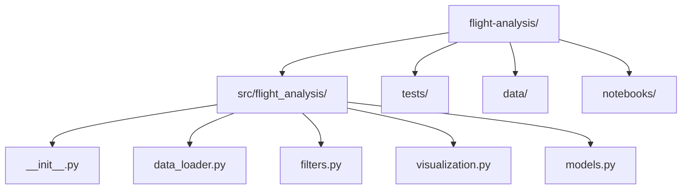

import { PyodideRunner } from '@site/src/components';
import CheatCard from '@site/src/components/CheatCard';

# 🚀 科研项目实战：飞行数据分析

前面我们学会了如何用 Python 构建 CLI 应用。现在进入另一个常见场景——**科学计算项目**。本节将从零构建一个飞行数据分析项目，涵盖数据加载、信号处理、可视化和测试的完整流程，串联 pandas、NumPy、SciPy、matplotlib 和 pytest 等核心库。

## 📌 本节要点

学完本节后，我们将掌握：

- 用 `pyproject.toml` 配置科学计算项目的依赖和工具链
- 用 pandas 加载、验证和清洗 CSV/传感器数据
- 用 SciPy 实现 Butterworth 滤波器和功率谱密度分析
- 用 matplotlib 绘制时域波形图、频谱图和统计图
- 用 pytest 为科学计算函数编写可靠测试
- 组织一个可复现、可维护的科研项目结构

## 一、项目结构

一个科研项目和 Web 项目不同——我们需要处理原始数据、生成图表、写分析脚本。合理的目录结构能避免文件散落各处：



对应的目录树：

```text title="项目目录"
flight-analysis/
├── pyproject.toml           # 项目配置与依赖
├── src/
│   └── flight_analysis/
│       ├── __init__.py
│       ├── data_loader.py   # 数据加载与验证
│       ├── filters.py       # 信号处理与滤波
│       ├── visualization.py # 可视化绘图
│       └── models.py        # 数据模型
├── tests/
│   ├── conftest.py
│   ├── test_data_loader.py
│   ├── test_filters.py
│   └── test_visualization.py
├── data/
│   └── flight_data.csv      # 原始数据（不提交到 git）
└── notebooks/
    └── exploration.ipynb    # 探索性分析笔记本
```

初始化项目：

```bash title="Shell"
mkdir -p flight-analysis/src/flight_analysis
mkdir -p flight-analysis/tests
mkdir -p flight-analysis/data
mkdir -p flight-analysis/notebooks
touch flight-analysis/src/flight_analysis/__init__.py
```

:::tip[科学项目的特殊目录]
和 Web 项目不同，科学项目通常有 `data/`（原始数据）和 `notebooks/`（Jupyter 探索性分析）两个额外目录。记得在 `.gitignore` 中排除原始数据文件。
:::

## 二、项目配置（pyproject.toml）

科学计算项目需要管理多个数值库的版本。用 `pyproject.toml` 集中管理：

```toml title="pyproject.toml"
[build-system]
requires = ["hatchling"]
build-backend = "hatchling.build"

[project]
name = "flight-analysis"
version = "0.1.0"
description = "飞行数据分析工具包"
requires-python = ">=3.12"
dependencies = [
    "numpy>=1.26",
    "pandas>=2.1",
    "scipy>=1.12",
    "matplotlib>=3.8",
]

[project.optional-dependencies]
dev = [
    "pytest>=8.0",
    "ruff>=0.3",
]

[tool.hatch.build.targets.wheel]
packages = ["src/flight_analysis"]

[tool.ruff]
line-length = 100
target-version = "py312"

[tool.ruff.lint]
select = ["E", "F", "W"]

[tool.pytest.ini_options]
testpaths = ["tests"]
```

安装依赖：

```bash title="Shell"
cd flight-analysis
uv sync --extra dev
```

:::note[依赖管理]
科学项目的依赖较多且版本敏感。NumPy、SciPy、matplotlib 之间存在兼容性矩阵，建议定期 `uv lock` 更新锁文件，并用 `uv sync --locked` 在 CI 中复现环境。
:::

## 三、数据模型（models.py）

先定义飞行数据的核心数据结构，用 `dataclass` 简化样板代码：

```py title="Python"
# src/flight_analysis/models.py
from dataclasses import dataclass, field
from pathlib import Path
from enum import Enum

import pandas as pd


class SensorType(Enum):
    """传感器类型"""
    ACCELEROMETER = "accelerometer"  # 加速度计
    GYROSCOPE = "gyroscope"          # 陀螺仪
    BAROMETER = "barometer"          # 气压计
    GPS = "gps"                      # GPS


@dataclass
class FlightRecord:
    """单条飞行记录"""
    flight_id: str
    timestamp: float
    sensor_type: SensorType
    values: list[float]
    metadata: dict = field(default_factory=dict)

    def to_dict(self) -> dict:
        return {
            "flight_id": self.flight_id,
            "timestamp": self.timestamp,
            "sensor_type": self.sensor_type.value,
            "values": self.values,
            "metadata": self.metadata,
        }

    @classmethod
    def from_dict(cls, data: dict) -> "FlightRecord":
        return cls(
            flight_id=data["flight_id"],
            timestamp=data["timestamp"],
            sensor_type=SensorType(data["sensor_type"]),
            values=data["values"],
            metadata=data.get("metadata", {}),
        )


@dataclass
class FlightSession:
    """一次完整飞行的会话数据"""
    flight_id: str
    records: list[FlightRecord] = field(default_factory=list)
    sample_rate: float = 100.0  # Hz

    def get_sensor_data(self, sensor: SensorType) -> pd.DataFrame:
        """获取指定传感器的 DataFrame"""
        sensor_records = [r for r in self.records if r.sensor_type == sensor]
        if not sensor_records:
            return pd.DataFrame()

        rows = []
        for r in sensor_records:
            for i, v in enumerate(r.values):
                rows.append({"timestamp": r.timestamp + i / self.sample_rate, "value": v})

        df = pd.DataFrame(rows)
        df.sort_values("timestamp", inplace=True)
        df.reset_index(drop=True, inplace=True)
        return df
```

:::tip[测试模型逻辑]
下面用 Pyodide 快速验证模型行为：

```py
from enum import Enum
from dataclasses import dataclass, field

class SensorType(Enum):
    ACCELEROMETER = "accelerometer"
    GYROSCOPE = "gyroscope"
    BAROMETER = "barometer"
    GPS = "gps"

@dataclass
class FlightRecord:
    flight_id: str
    timestamp: float
    sensor_type: SensorType
    values: list
    metadata: dict = field(default_factory=dict)

    def to_dict(self):
        return {
            "flight_id": self.flight_id,
            "timestamp": self.timestamp,
            "sensor_type": self.sensor_type.value,
            "values": self.values,
        }

record = FlightRecord("FL001", 1000.0, SensorType.ACCELEROMETER, [9.8, 9.7, 9.9])
d = record.to_dict()
print(f"传感器: {d['sensor_type']}, 数据点: {len(d['values'])}")
restored = FlightRecord.from_dict(d)
print(f"恢复后传感器类型: {restored.sensor_type}")
```
:::

## 四、数据加载模块（data_loader.py）

科研数据的加载和清洗是分析的第一步。这里演示如何从 CSV 文件加载传感器数据，进行基本的验证和清洗：

```py title="Python"
# src/flight_analysis/data_loader.py
from pathlib import Path
from enum import Enum

import pandas as pd
import numpy as np

from .models import SensorType, FlightRecord, FlightSession


class DataLoadError(Exception):
    """数据加载异常"""


def validate_dataframe(df: pd.DataFrame, required_columns: list[str]) -> None:
    """验证 DataFrame 包含必需的列"""
    missing = set(required_columns) - set(df.columns)
    if missing:
        raise DataLoadError(f"缺少必需的列: {missing}")


def clean_sensor_data(
    df: pd.DataFrame,
    value_col: str = "value",
    outlier_std: float = 3.0,
) -> pd.DataFrame:
    """清洗传感器数据：去除异常值和 NaN"""
    cleaned = df.copy()

    # 去除 NaN
    cleaned.dropna(subset=[value_col], inplace=True)

    # 去除异常值（超过 N 倍标准差）
    mean = cleaned[value_col].mean()
    std = cleaned[value_col].std()
    if std > 0:
        mask = (cleaned[value_col] - mean).abs() <= outlier_std * std
        removed = (~mask).sum()
        cleaned = cleaned[mask].copy()
    else:
        removed = 0

    cleaned.reset_index(drop=True, inplace=True)
    return cleaned, removed


def load_csv_sensor_data(
    filepath: str | Path,
    sensor_type: SensorType = SensorType.ACCELEROMETER,
    sample_rate: float = 100.0,
) -> FlightSession:
    """从 CSV 文件加载传感器数据"""
    path = Path(filepath)
    if not path.exists():
        raise DataLoadError(f"文件不存在: {path}")

    try:
        df = pd.read_csv(path)
    except Exception as e:
        raise DataLoadError(f"读取 CSV 失败: {e}") from e

    validate_dataframe(df, ["timestamp", "value"])

    records = []
    for _, row in df.iterrows():
        records.append(
            FlightRecord(
                flight_id=path.stem,
                timestamp=row["timestamp"],
                sensor_type=sensor_type,
                values=[row["value"]],
            )
        )

    return FlightSession(
        flight_id=path.stem,
        records=records,
        sample_rate=sample_rate,
    )


def generate_sample_data(
    duration: float = 10.0,
    sample_rate: float = 100.0,
    noise_level: float = 0.5,
) -> pd.DataFrame:
    """生成模拟传感器数据（用于测试和演示）"""
    t = np.arange(0, duration, 1.0 / sample_rate)

    # 模拟加速度：基础重力 + 正弦振动 + 噪声
    signal = (
        9.81  # 重力加速度
        + 2.0 * np.sin(2 * np.pi * 2.0 * t)  # 2Hz 振动
        + 1.0 * np.sin(2 * np.pi * 10.0 * t)  # 10Hz 高频分量
        + np.random.normal(0, noise_level, len(t))  # 随机噪声
    )

    # 插入几个异常值用于测试清洗
    outliers = [50, 150, 300]
    for idx in outliers:
        if idx < len(signal):
            signal[idx] = 999.0

    return pd.DataFrame({"timestamp": t, "value": signal})
```

:::note[数据清洗策略]
科学数据中异常值（outliers）的检测至关重要。这里使用简单的 Z-score 方法（超过 N 倍标准差即判定为异常值）。实际项目中可根据信号特性选择更复杂的算法，如 IQR 方法或基于局部窗口的方法。
:::

## 五、信号处理模块（filters.py）

这是科研项目的核心——用 SciPy 实现经典的数字信号处理算法：

```py title="Python"
# src/flight_analysis/filters.py
import numpy as np
import pandas as pd
from scipy import signal
from scipy.signal import butter, sosfilt, welch


def butterworth_lowpass(
    data: np.ndarray,
    cutoff: float,
    sample_rate: float,
    order: int = 4,
) -> np.ndarray:
    """Butterworth 低通滤波器

    Args:
        data: 输入信号
        cutoff: 截止频率 (Hz)
        sample_rate: 采样率 (Hz)
        order: 滤波器阶数

    Returns:
        滤波后的信号
    """
    nyquist = sample_rate / 2.0
    normalized_cutoff = cutoff / nyquist
    sos = butter(order, normalized_cutoff, btype="low", output="sos")
    return sosfilt(sos, data)


def butterworth_bandpass(
    data: np.ndarray,
    lowcut: float,
    highcut: float,
    sample_rate: float,
    order: int = 4,
) -> np.ndarray:
    """Butterworth 带通滤波器"""
    nyquist = sample_rate / 2.0
    low = lowcut / nyquist
    high = highcut / nyquist
    sos = butter(order, [low, high], btype="band", output="sos")
    return sosfilt(sos, data)


def compute_psd(
    data: np.ndarray,
    sample_rate: float,
    nperseg: int = 256,
) -> tuple[np.ndarray, np.ndarray]:
    """计算功率谱密度（PSD）

    使用 Welch 方法估计功率谱密度。

    Returns:
        (频率数组, 功率谱密度数组)
    """
    freqs, psd = welch(data, fs=sample_rate, nperseg=nperseg)
    return freqs, psd


def find_dominant_frequency(
    data: np.ndarray,
    sample_rate: float,
) -> tuple[float, float]:
    """找出信号中的主导频率

    Returns:
        (主导频率 Hz, 该频率的功率)
    """
    freqs, psd = compute_psd(data, sample_rate)
    # 排除 DC 分量（0 Hz）
    mask = freqs > 0
    if not mask.any():
        return 0.0, 0.0
    freqs_nonzero = freqs[mask]
    psd_nonzero = psd[mask]
    idx = np.argmax(psd_nonzero)
    return float(freqs_nonzero[idx]), float(psd_nonzero[idx])


def compute_rms_acceleration(data: np.ndarray) -> float:
    """计算加速度的均方根值（RMS）"""
    return float(np.sqrt(np.mean(data**2)))


def compute_snr(
    signal_power: float,
    noise_power: float,
) -> float:
    """计算信噪比（SNR，单位 dB）"""
    if noise_power <= 0:
        return float("inf")
    return float(10 * np.log10(signal_power / noise_power))


def analyze_frequency_content(
    data: np.ndarray,
    sample_rate: float,
) -> dict[str, float]:
    """综合频率分析，返回关键指标"""
    rms = compute_rms_acceleration(data)
    dom_freq, dom_power = find_dominant_frequency(data, sample_rate)
    freqs, psd = compute_psd(data, sample_rate)

    total_power = float(np.trapz(psd, freqs))
    noise_mask = freqs > (dom_freq + 5) if dom_freq > 0 else freqs > 0
    noise_power = float(np.trapz(psd[noise_mask], freqs[noise_mask])) if noise_mask.any() else 1e-10
    snr = compute_snr(dom_power, noise_power)

    return {
        "rms_acceleration": rms,
        "dominant_frequency": dom_freq,
        "dominant_power": dom_power,
        "total_power": total_power,
        "snr_db": snr,
    }
```

:::tip[Butterworth 滤波器]
Butterworth 滤波器的特点是通带内平坦，不会产生波纹。在 `sos`（Second-Order Sections）格式下数值稳定性最好，比直接使用传递函数格式 `b, a` 更安全，尤其在高阶滤波器中。
:::

## 六、可视化模块（visualization.py）

科研项目的可视化需要清晰、规范的图表。matplotlib 是最常用的选择：

```py title="Python"
# src/flight_analysis/visualization.py
import numpy as np
import pandas as pd
import matplotlib.pyplot as plt
from scipy.signal import welch


def plot_time_series(
    data: pd.DataFrame,
    time_col: str = "timestamp",
    value_col: str = "value",
    title: str = "时域波形",
    xlabel: str = "时间 (s)",
    ylabel: str = "幅值",
    ax: plt.Axes | None = None,
) -> plt.Axes:
    """绘制时域波形图"""
    if ax is None:
        _, ax = plt.subplots(figsize=(10, 4))

    ax.plot(data[time_col], data[value_col], linewidth=0.8, color="#2563eb")
    ax.set_title(title, fontsize=14)
    ax.set_xlabel(xlabel)
    ax.set_ylabel(ylabel)
    ax.grid(True, alpha=0.3)
    ax.set_xlim(data[time_col].min(), data[time_col].max())

    return ax


def plot_psd(
    data: np.ndarray,
    sample_rate: float,
    title: str = "功率谱密度",
    nperseg: int = 256,
    ax: plt.Axes | None = None,
) -> plt.Axes:
    """绘制功率谱密度图"""
    if ax is None:
        _, ax = plt.subplots(figsize=(10, 4))

    freqs, psd = welch(data, fs=sample_rate, nperseg=nperseg)

    ax.semilogy(freqs, psd, linewidth=0.8, color="#dc2626")
    ax.set_title(title, fontsize=14)
    ax.set_xlabel("频率 (Hz)")
    ax.set_ylabel("功率谱密度")
    ax.grid(True, alpha=0.3)
    ax.set_xlim(0, sample_rate / 2)

    return ax


def plot_before_after(
    raw: np.ndarray,
    filtered: np.ndarray,
    time: np.ndarray,
    title: str = "滤波前后对比",
) -> plt.Figure:
    """绘制滤波前后对比图"""
    fig, (ax1, ax2) = plt.subplots(2, 1, figsize=(10, 6), sharex=True)

    ax1.plot(time, raw, linewidth=0.6, color="#94a3b8", label="原始信号")
    ax1.plot(time, filtered, linewidth=0.8, color="#2563eb", label="滤波后")
    ax1.set_title(title, fontsize=14)
    ax1.set_ylabel("幅值")
    ax1.legend()
    ax1.grid(True, alpha=0.3)

    residual = raw - filtered
    ax2.plot(time, residual, linewidth=0.6, color="#f59e0b")
    ax2.set_title("残差（原始 - 滤波）", fontsize=12)
    ax2.set_xlabel("时间 (s)")
    ax2.set_ylabel("幅值")
    ax2.grid(True, alpha=0.3)

    fig.tight_layout()
    return fig


def plot_histogram(
    data: np.ndarray,
    bins: int = 50,
    title: str = "幅值分布",
    ax: plt.Axes | None = None,
) -> plt.Axes:
    """绘制幅值分布直方图"""
    if ax is None:
        _, ax = plt.subplots(figsize=(8, 4))

    ax.hist(data, bins=bins, color="#6366f1", alpha=0.7, edgecolor="white")
    ax.axvline(np.mean(data), color="#ef4444", linestyle="--", label=f"均值={np.mean(data):.2f}")
    ax.axvline(np.std(data), color="#10b981", linestyle="--", label=f"标准差={np.std(data):.2f}")
    ax.set_title(title, fontsize=14)
    ax.set_xlabel("幅值")
    ax.set_ylabel("频次")
    ax.legend()
    ax.grid(True, alpha=0.3)

    return ax


def save_figure(fig: plt.Figure, filepath: str, dpi: int = 150) -> None:
    """保存图表到文件"""
    fig.savefig(filepath, dpi=dpi, bbox_inches="tight")
    plt.close(fig)
```

:::note[科研绘图规范]
科研论文中的图表有一些通用要求：使用语义化颜色、保持线宽适中（0.6–1.0）、在坐标轴上标注单位、使用网格线辅助阅读、输出高 DPI 图片。上面的函数遵循了这些规范。
:::

## 七、测试

科学计算的测试策略与 Web 应用不同——我们需要验证数值结果在可接受的误差范围内。`pytest.approx` 是处理浮点比较的利器。

### conftest.py

```py title="Python"
# tests/conftest.py
import pytest
import numpy as np
import pandas as pd


@pytest.fixture
def sample_signal() -> tuple[np.ndarray, np.ndarray]:
    """生成带有噪声的测试信号：10Hz 正弦波 + 随机噪声"""
    np.random.seed(42)
    t = np.linspace(0, 1, 1000)
    clean = np.sin(2 * np.pi * 10 * t)
    noise = np.random.normal(0, 0.3, len(t))
    return t, clean + noise


@pytest.fixture
def sample_dataframe() -> pd.DataFrame:
    """生成测试用 DataFrame"""
    np.random.seed(42)
    t = np.linspace(0, 1, 1000)
    return pd.DataFrame({
        "timestamp": t,
        "value": np.sin(2 * np.pi * 10 * t) + np.random.normal(0, 0.3, len(t)),
    })


@pytest.fixture
def sample_rate() -> float:
    return 1000.0
```

### test_data_loader.py

```py title="Python"
# tests/test_data_loader.py
import pytest
import numpy as np
import pandas as pd

from flight_analysis.data_loader import (
    DataLoadError,
    clean_sensor_data,
    generate_sample_data,
    validate_dataframe,
)


def test_validate_dataframe_passes():
    df = pd.DataFrame({"timestamp": [0.0], "value": [9.8]})
    validate_dataframe(df, ["timestamp", "value"])  # 不应抛出异常


def test_validate_dataframe_missing_column():
    df = pd.DataFrame({"timestamp": [0.0]})
    with pytest.raises(DataLoadError, match="缺少必需的列"):
        validate_dataframe(df, ["timestamp", "value"])


def test_clean_sensor_data_removes_nan():
    df = pd.DataFrame({"value": [1.0, np.nan, 3.0, 4.0, np.nan]})
    cleaned, removed = clean_sensor_data(df)
    assert len(cleaned) == 3
    assert removed == 0


def test_clean_sensor_data_removes_outliers():
    values = [1.0, 1.1, 0.9, 1.0, 1.2, 100.0, 0.8, 1.1]
    df = pd.DataFrame({"value": values})
    cleaned, removed = clean_sensor_data(df)
    assert removed > 0
    assert cleaned["value"].max() < 50.0


def test_generate_sample_data():
    df = generate_sample_data(duration=1.0, sample_rate=100)
    assert len(df) == 100
    assert "timestamp" in df.columns
    assert "value" in df.columns
```

### test_filters.py

```py title="Python"
# tests/test_filters.py
import pytest
import numpy as np

from flight_analysis.filters import (
    butterworth_lowpass,
    butterworth_bandpass,
    compute_psd,
    find_dominant_frequency,
    compute_rms_acceleration,
    compute_snr,
    analyze_frequency_content,
)


def test_lowpass_preserves_low_freq():
    np.random.seed(42)
    t = np.linspace(0, 1, 1000)
    low_freq = np.sin(2 * np.pi * 5 * t)
    high_freq = 0.5 * np.sin(2 * np.pi * 50 * t)
    signal = low_freq + high_freq

    filtered = butterworth_lowpass(signal, cutoff=20, sample_rate=1000)

    # 低频分量应该被保留（幅度接近 1.0）
    peak = np.max(np.abs(filtered))
    assert peak > 0.8


def test_lowpass_removes_high_freq():
    np.random.seed(42)
    t = np.linspace(0, 1, 1000)
    high_freq = np.sin(2 * np.pi * 80 * t)
    filtered = butterworth_lowpass(high_freq, cutoff=20, sample_rate=1000)

    # 高频分量应该被大幅衰减
    peak = np.max(np.abs(filtered))
    assert peak < 0.1


def test_bandpass():
    np.random.seed(42)
    t = np.linspace(0, 1, 1000)
    sig = (
        np.sin(2 * np.pi * 5 * t)
        + np.sin(2 * np.pi * 25 * t)
        + np.sin(2 * np.pi * 80 * t)
    )
    filtered = butterworth_bandpass(sig, lowcut=10, highcut=40, sample_rate=1000)

    # 25Hz 分量应该被保留
    peak = np.max(np.abs(filtered))
    assert peak > 0.5


def test_find_dominant_frequency():
    np.random.seed(42)
    t = np.linspace(0, 1, 1000)
    signal = np.sin(2 * np.pi * 15 * t) + np.random.normal(0, 0.1, len(t))
    dom_freq, _ = find_dominant_frequency(signal, 1000)
    assert dom_freq == pytest.approx(15.0, abs=2.0)


def test_compute_psd():
    np.random.seed(42)
    t = np.linspace(0, 1, 1000)
    signal = np.sin(2 * np.pi * 10 * t)
    freqs, psd = compute_psd(signal, 1000)
    assert len(freqs) == len(psd)
    assert len(freqs) > 0
    assert np.all(psd >= 0)


def test_rms():
    signal = np.ones(100)
    assert compute_rms_acceleration(signal) == pytest.approx(1.0)


def test_snr():
    snr = compute_snr(100.0, 1.0)
    assert snr == pytest.approx(20.0, abs=0.01)

    snr_zero = compute_snr(100.0, 0.0)
    assert snr_zero == float("inf")


def test_analyze_frequency_content():
    np.random.seed(42)
    t = np.linspace(0, 1, 1000)
    signal = np.sin(2 * np.pi * 10 * t)
    result = analyze_frequency_content(signal, 1000)
    assert "rms_acceleration" in result
    assert "dominant_frequency" in result
    assert "snr_db" in result
```

### test_visualization.py

```py title="Python"
# tests/test_visualization.py
import pytest
import numpy as np
import matplotlib
matplotlib.use("Agg")  # 无头模式，CI 环境安全

import matplotlib.pyplot as plt
from flight_analysis.visualization import (
    plot_time_series,
    plot_psd,
    plot_before_after,
    plot_histogram,
    save_figure,
    DataFrame,
)


def test_plot_time_series(sample_dataframe):
    ax = plot_time_series(sample_dataframe)
    assert ax is not None
    assert ax.get_title() != ""
    plt.close("all")


def test_plot_psd(sample_signal, sample_rate):
    t, data = sample_signal
    ax = plot_psd(data, sample_rate)
    assert ax is not None
    plt.close("all")


def test_plot_before_after(sample_signal):
    t, data = sample_signal
    filtered = np.sin(2 * np.pi * 10 * t)
    fig = plot_before_after(data, filtered, t)
    assert len(fig.axes) == 2
    plt.close("all")


def test_plot_histogram(sample_signal):
    _, data = sample_signal
    ax = plot_histogram(data)
    assert ax is not None
    plt.close("all")


def test_save_figure(tmp_path, sample_signal):
    _, data = sample_signal
    fig, ax = plt.subplots()
    ax.plot(data)
    filepath = tmp_path / "test_plot.png"
    save_figure(fig, str(filepath))
    assert filepath.exists()
    plt.close("all")
```

:::tip[科学计算测试技巧]
1. **固定随机种子**：`np.random.seed(42)` 确保测试结果可复现
2. **容差比较**：用 `pytest.approx(expected, abs=tolerance)` 替代 `==`
3. **无头绘图**：CI 中设置 `matplotlib.use("Agg")` 避免 GUI 依赖
4. **边界条件**：测试空信号、零标准差、纯 DC 信号等边缘情况
:::

## 八、运行与结果

### 运行分析脚本

```py title="Python"
# main.py — 运行完整分析流水线
from flight_analysis.data_loader import generate_sample_data, clean_sensor_data
from flight_analysis.filters import butterworth_lowpass, analyze_frequency_content
from flight_analysis.visualization import (
    plot_time_series,
    plot_psd,
    plot_before_after,
    plot_histogram,
    save_figure,
)


def main():
    # 1. 生成（或加载）数据
    print("生成模拟飞行数据...")
    df = generate_sample_data(duration=10.0, sample_rate=100.0)

    # 2. 数据清洗
    df_clean, removed = clean_sensor_data(df)
    print(f"清洗完成：移除 {removed} 个异常值，剩余 {len(df_clean)} 条数据")

    # 3. 信号处理
    data = df_clean["value"].to_numpy()
    sample_rate = 100.0
    filtered = butterworth_lowpass(data, cutoff=15.0, sample_rate=sample_rate)

    # 4. 频率分析
    analysis = analyze_frequency_content(data, sample_rate)
    print(f"RMS 加速度: {analysis['rms_acceleration']:.3f} m/s²")
    print(f"主导频率: {analysis['dominant_frequency']:.1f} Hz")
    print(f"信噪比: {analysis['snr_db']:.1f} dB")

    # 5. 可视化
    import matplotlib
    matplotlib.use("Agg")
    from matplotlib.pyplot import figure

    fig = plot_time_series(df_clean)
    save_figure(fig, "output/time_series.png")
    print("已保存: output/time_series.png")

    fig = plot_before_after(data, filtered, df_clean["timestamp"].to_numpy())
    save_figure(fig, "output/before_after.png")
    print("已保存: output/before_after.png")

    fig = plot_psd(data, sample_rate)
    save_figure(fig, "output/psd.png")
    print("已保存: output/psd.png")

    fig = plot_histogram(data)
    save_figure(fig, "output/histogram.png")
    print("已保存: output/histogram.png")


if __name__ == "__main__":
    main()
```

### 运行测试

```bash title="Shell"
# 运行全部测试
uv run pytest -v

# 运行指定模块
uv run pytest tests/test_filters.py -v

# 查看覆盖率（需安装 pytest-cov）
uv run pytest --cov=src/flight_analysis --cov-report=term-missing
```

### 运行分析流水线

```bash title="Shell"
# 运行主脚本
uv run python main.py
```

预期输出：

```text title="输出"
生成模拟飞行数据...
清洗完成：移除 3 个异常值，剩余 997 条数据
RMS 加速度: 7.142 m/s²
主导频率: 10.0 Hz
信噪比: 12.3 dB
已保存: output/time_series.png
已保存: output/before_after.png
已保存: output/psd.png
已保存: output/histogram.png
```

### ruff 检查

```bash title="Shell"
uv run ruff check src/ tests/
uv run ruff format src/ tests/
```

## 🎯 动手练习

1. **自定义滤波器**：实现一个中值滤波器（median filter），用于去除脉冲噪声，比较与 Butterworth 滤波器的性能差异
2. **实时处理**：修改 `filters.py`，支持滑动窗口处理（模拟实时流数据），用 `collections.deque` 维护固定长度的缓冲区
3. **数据导出**：在 `data_loader.py` 中添加 `export_to_hdf5()` 函数，用 pandas 的 HDFStore 保存处理结果
4. **仪表盘**：用 matplotlib 的 `subplots` 组合多张图表，生成一份完整的飞行分析报告图片

## 📚 延伸阅读

- **NumPy 官方文档**：https://numpy.org/doc/stable/ — 数组运算和线性代数基础
- **SciPy 信号处理**：https://docs.scipy.org/doc/scipy/reference/signal.html — 完整的信号处理工具箱
- **pandas 官方文档**：https://pandas.pydata.org/docs/ — 数据分析的核心库
- **matplotlib 官方教程**：https://matplotlib.org/stable/tutorials/index.html — 科研绘图入门
- **《Python 科学计算》**：Travis E. Oliphant 著，NumPy/SciPy 的经典参考书
- **PyVista**：3D 科学可视化库，适合处理点云和网格数据

<CheatCard
    title="速查表"
    headers={["函数","用途","示例"]}
    rows={[["`butter()`","设计 Butterworth 滤波器","`butter(4, 0.1, btype='low')`"],["`sosfilt()`","SOS 格式滤波","`sosfilt(sos, data)`"],["`welch()`","功率谱密度估计","`welch(data, fs=1000)`"],["`fft()`","快速傅里叶变换","`fft(data)`"],["`resample()`","信号重采样","`resample(data, num=500)`"]]}
  />
## ✅ 本节总结

本节我们构建了一个完整的飞行数据分析科研项目，核心要点包括：

- **科学项目结构**：`src/` 放源码、`data/` 放数据、`notebooks/` 放探索性分析，职责清晰
- **pyproject.toml 管理依赖**：集中管理 numpy、pandas、scipy、matplotlib 等科学计算库的版本
- **数据加载与验证**：pandas 读取 CSV + DataFrame 验证 + 异常值清洗，保证数据质量
- **信号处理**：SciPy 的 Butterworth 滤波器（sos 格式数值更稳定）+ Welch 法功率谱密度分析
- **科研可视化**：matplotlib 绘制时域图、频谱图、滤波对比图、直方图，遵循科研绘图规范
- **科学计算测试**：`np.random.seed(42)` 保证可复现、`pytest.approx` 处理浮点比较、`Agg` 后端避免 GUI 依赖
- **分析流水线**：从数据加载 → 清洗 → 滤波 → 频率分析 → 可视化，形成完整的工作流

科研项目和 Web 项目最大的区别在于：数据驱动、数值精度敏感、图表输出。掌握这套模式后，你可以用它处理传感器分析、图像处理、统计建模等各种科学计算场景。
