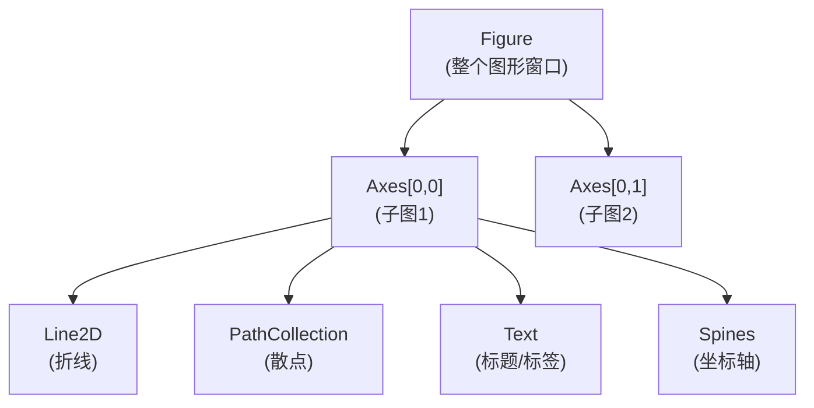

# 📊 matplotlib 入门

matplotlib 是 Python 最基础、最广泛使用的绘图库。NumPy、SciPy、pandas、PyTorch 等几乎所有科学计算库都以 matplotlib 作为可视化后端。从飞行器姿态角的时间序列分析，到传感器信号的频谱展示，再到控制系统的阶跃响应——matplotlib 是科研工作者将数据转化为洞察的核心工具。本节系统介绍 pyplot 基础绘图、子图布局、图形美化与出版级图表绘制。

## 📌 本节要点

- **对象层级**：Figure → Axes → Line2D / PathCollection / Text / Spines，理解层级是灵活绘图的基础
- **基础绘图**：`plt.plot`（折线）、`plt.scatter`（散点）、`plt.bar`（柱状）、`plt.hist`（直方）
- **子图布局**：`plt.subplots` 快速创建、`GridSpec` 灵活排布、`constrained_layout` 自动调整
- **图形美化**：样式表、颜色映射、标注、图例、坐标轴标签，打造出版级图表
- **保存图形**：`plt.savefig` 的 DPI、裁剪、格式选项
- **与 NumPy/SciPy 集成**：数组可视化、直方图、曲线拟合

## matplotlib 对象层级

理解 matplotlib 的对象层级是灵活绘图的关键。每个图形由 Figure（画布）和一个或多个 Axes（子图）组成，每个 Axes 内部包含 Line2D、PathCollection、Text、Spines 等图形元素。



### 两种 API 风格

matplotlib 提供两种绘图接口：

```py title="Python"
import matplotlib.pyplot as plt
import numpy as np

# 方式一： pyplot 状态接口（简单，适合快速绘图）
t = np.linspace(0, 2 * np.pi, 100)
plt.figure(figsize=(8, 4))
plt.plot(t, np.sin(t), label="sin")
plt.title("pyplot 状态接口")
plt.legend()
plt.close()

# 方式二：面向对象接口（精确控制，适合复杂图表）
fig, ax = plt.subplots(figsize=(8, 4))
ax.plot(t, np.sin(t), label="sin")
ax.set_title("面向对象接口")
ax.legend()
plt.close()
```

:::tip[选择建议]
- 快速探索、一次性脚本 → **pyplot 状态接口**（`plt.plot`）
- 复杂布局、出版级图表、需要精确控制 → **面向对象接口**（`fig, ax = plt.subplots`）

本节所有示例优先使用面向对象接口。
:::

## 基础绘图

### 折线图 `plt.plot`

折线图是最基础的图表类型，适用于时间序列、函数曲线等连续数据：

```py title="Python"
import matplotlib.pyplot as plt
import numpy as np

t = np.linspace(0, 10, 500)

fig, axes = plt.subplots(1, 3, figsize=(15, 4))

# 左图：基本折线
axes[0].plot(t, np.sin(t), color="steelblue", linewidth=1.5, label="sin(t)")
axes[0].plot(t, np.cos(t), color="coral", linewidth=1.5, linestyle="--", label="cos(t)")
axes[0].set_xlabel("时间 / s")
axes[0].set_ylabel("幅值")
axes[0].set_title("三角函数")
axes[0].legend()
axes[0].grid(True, alpha=0.3)

# 中图：衰减振荡（飞行器姿态响应）
omega_n = 2.0  # 自然频率
zeta = 0.3     # 阻尼比
t_response = np.linspace(0, 10, 500)
response = 1 - np.exp(-zeta * omega_n * t_response) * (
    np.cos(omega_n * np.sqrt(1 - zeta**2) * t_response)
    + zeta / np.sqrt(1 - zeta**2) * np.sin(omega_n * np.sqrt(1 - zeta**2) * t_response)
)
axes[1].plot(t_response, response, color="darkgreen", linewidth=1.5)
axes[1].axhline(y=1.0, color="gray", linestyle=":", label="稳态值")
axes[1].set_xlabel("时间 / s")
axes[1].set_ylabel("响应")
axes[1].set_title("二阶系统阶跃响应")
axes[1].legend()
axes[1].grid(True, alpha=0.3)

# 右图：多变量时间序列（姿态角）
rng = np.random.default_rng(42)
t_att = np.linspace(0, 20, 200)
roll = 15 * np.exp(-0.3 * t_att) * np.sin(1.5 * t_att)
pitch = 8 * np.exp(-0.2 * t_att) * np.cos(1.2 * t_att)
yaw = 30 * (1 - np.exp(-0.5 * t_att))

axes[2].plot(t_att, roll, label="滚转角 φ")
axes[2].plot(t_att, pitch, label="俯仰角 θ")
axes[2].plot(t_att, yaw, label="偏航角 ψ")
axes[2].set_xlabel("时间 / s")
axes[2].set_ylabel("角度 / °")
axes[2].set_title("飞行器姿态角")
axes[2].legend()
axes[2].grid(True, alpha=0.3)

fig.tight_layout()
plt.close()
```

### 散点图 `plt.scatter`

散点图用于展示两个变量之间的关系，常用于传感器数据分布分析：

```py title="Python"
import matplotlib.pyplot as plt
import numpy as np

rng = np.random.default_rng(42)

fig, axes = plt.subplots(1, 2, figsize=(12, 5))

# 左图：基本散点
n = 200
x = rng.normal(0, 1, n)
y = 0.8 * x + rng.normal(0, 0.5, n)
axes[0].scatter(x, y, alpha=0.6, s=30, c="steelblue", edgecolors="white", linewidths=0.5)
axes[0].set_xlabel("传感器 A 读数")
axes[0].set_ylabel("传感器 B 读数")
axes[0].set_title("双传感器相关性")
axes[0].grid(True, alpha=0.3)

# 右图：气泡图（第三个维度用大小表示）
n_bubble = 100
x_b = rng.uniform(0, 10, n_bubble)
y_b = rng.uniform(0, 10, n_bubble)
sizes = rng.uniform(50, 500, n_bubble)
colors = rng.uniform(0, 1, n_bubble)
scatter = axes[1].scatter(x_b, y_b, s=sizes, c=colors, cmap="viridis", alpha=0.7, edgecolors="gray")
fig.colorbar(scatter, ax=axes[1], label="权重")
axes[1].set_xlabel("X 坐标 / m")
axes[1].set_ylabel("Y 坐标 / m")
axes[1].set_title("采样点分布（气泡大小 = 权重）")

fig.tight_layout()
plt.close()
```

### 柱状图 `plt.bar`

柱状图适用于分类数据对比：

```py title="Python"
import matplotlib.pyplot as plt
import numpy as np

fig, axes = plt.subplots(1, 2, figsize=(12, 5))

# 左图：基本柱状图
categories = ["姿态解算", "导航滤波", "航迹规划", "控制分配", "故障诊断"]
exec_time = [1.2, 3.5, 8.7, 2.1, 5.3]
colors = ["#4C72B0", "#55A868", "#C44E52", "#8172B2", "#CCB974"]

axes[0].barh(categories, exec_time, color=colors, edgecolor="white")
axes[0].set_xlabel("执行时间 / ms")
axes[0].set_title("各模块计算耗时")
for i, v in enumerate(exec_time):
    axes[0].text(v + 0.1, i, f"{v:.1f}", va="center", fontsize=9)

# 右图：分组柱状图
algorithms = ["EKF", "UKF", "PF"]
x_pos = np.arange(len(algorithms))
width = 0.35

rmse = [0.42, 0.35, 0.31]
time_ms = [2.1, 4.8, 15.3]

bars1 = axes[1].bar(x_pos - width/2, rmse, width, label="RMSE / °", color="#4C72B0")
ax2 = axes[1].twinx()
bars2 = ax2.bar(x_pos + width/2, time_ms, width, label="耗时 / ms", color="#C44E52")

axes[1].set_xlabel("滤波算法")
axes[1].set_ylabel("RMSE / °")
ax2.set_ylabel("耗时 / ms")
axes[1].set_xticks(x_pos)
axes[1].set_xticklabels(algorithms)
axes[1].set_title("滤波算法对比")
axes[1].legend(loc="upper left")
ax2.legend(loc="upper right")

fig.tight_layout()
plt.close()
```

### 直方图 `plt.hist`

直方图用于展示数据分布，是数据探索的必备工具：

```py title="Python"
import matplotlib.pyplot as plt
import numpy as np

rng = np.random.default_rng(42)

fig, axes = plt.subplots(1, 2, figsize=(12, 5))

# 左图：基本直方图
gyro_data = rng.normal(0.02, 0.5, 1000)  # 陀螺仪零偏
axes[0].hist(gyro_data, bins=50, color="steelblue", edgecolor="white", alpha=0.8)
axes[0].axvline(x=gyro_data.mean(), color="red", linestyle="--", label=f"均值 = {gyro_data.mean():.4f}")
axes[0].axvline(x=gyro_data.std(), color="orange", linestyle=":", label=f"标准差 = {gyro_data.std():.4f}")
axes[0].set_xlabel("角速度偏差 / (°/s)")
axes[0].set_ylabel("频次")
axes[0].set_title("陀螺仪零偏分布")
axes[0].legend()
axes[0].grid(True, alpha=0.3)

# 右图：多组对比直方图
accel_x = rng.normal(0, 0.1, 500)
accel_y = rng.normal(0, 0.15, 500)
accel_z = rng.normal(9.8, 0.08, 500)

axes[1].hist(accel_x, bins=40, alpha=0.5, label="X 轴", color="steelblue")
axes[1].hist(accel_y, bins=40, alpha=0.5, label="Y 轴", color="coral")
axes[1].hist(accel_z, bins=40, alpha=0.5, label="Z 轴", color="green")
axes[1].set_xlabel("加速度 / (m/s²)")
axes[1].set_ylabel("频次")
axes[1].set_title("加速度计三轴数据分布")
axes[1].legend()
axes[1].grid(True, alpha=0.3)

fig.tight_layout()
plt.close()
```

## 子图布局

### `plt.subplots` 快速创建

最常用的子图创建方式，返回 Figure 和 Axes 数组：

```py title="Python"
import matplotlib.pyplot as plt
import numpy as np

# 2x2 子图网格
fig, axes = plt.subplots(2, 2, figsize=(10, 8))

t = np.linspace(0, 2 * np.pi, 200)

# 左上：正弦
axes[0, 0].plot(t, np.sin(t), color="steelblue")
axes[0, 0].set_title("sin(t)")
axes[0, 0].grid(True, alpha=0.3)

# 右上：余弦
axes[0, 1].plot(t, np.cos(t), color="coral")
axes[0, 1].set_title("cos(t)")
axes[0, 1].grid(True, alpha=0.3)

# 左下：散点
rng = np.random.default_rng(42)
x = rng.normal(0, 1, 100)
y = rng.normal(0, 1, 100)
axes[1, 0].scatter(x, y, alpha=0.6, s=20, c="darkgreen")
axes[1, 0].set_title("随机散点")
axes[1, 0].grid(True, alpha=0.3)

# 右下：直方图
data = rng.exponential(2, 200)
axes[1, 1].hist(data, bins=30, color="purple", edgecolor="white", alpha=0.7)
axes[1, 1].set_title("指数分布")
axes[1, 1].grid(True, alpha=0.3)

fig.suptitle("2×2 子图示例", fontsize=14, fontweight="bold")
fig.tight_layout()
plt.close()
```

:::tip[共享坐标轴]
用 `sharex=True` / `sharey=True` 让子图共享坐标轴，避免重复刻度：

```py title="Python"
fig, axes = plt.subplots(2, 1, sharex=True, figsize=(8, 6))
```
:::

### `GridSpec` 灵活排布

当子图需要不同大小时，使用 `GridSpec` 实现不等分布局：

```py title="Python"
import matplotlib.pyplot as plt
import matplotlib.gridspec as gridspec
import numpy as np

fig = plt.figure(figsize=(12, 8))
gs = gridspec.GridSpec(2, 3, figure=fig, hspace=0.35, wspace=0.3)

t = np.linspace(0, 10, 500)

# 左侧大图：跨两行
ax_big = fig.add_subplot(gs[:, 0])
ax_big.plot(t, np.sin(t) * np.exp(-0.2 * t), color="steelblue", linewidth=1.5)
ax_big.set_title("衰减振荡")
ax_big.set_xlabel("时间 / s")
ax_big.set_ylabel("幅值")
ax_big.grid(True, alpha=0.3)

# 右上：俯视图
ax_top = fig.add_subplot(gs[0, 1])
ax_top.plot(t, np.cos(0.5 * t), color="coral")
ax_top.set_title("水平方向")
ax_top.grid(True, alpha=0.3)

# 右中：侧视图
ax_mid = fig.add_subplot(gs[0, 2])
ax_mid.plot(t, np.sin(0.3 * t) * 2, color="green")
ax_mid.set_title("垂直方向")
ax_mid.grid(True, alpha=0.3)

# 右下：跨两列
ax_bot = fig.add_subplot(gs[1, 1:])
rng = np.random.default_rng(42)
x = rng.normal(0, 1, 300)
y = 0.6 * x + rng.normal(0, 0.4, 300)
ax_bot.scatter(x, y, alpha=0.5, s=15, c="purple")
ax_bot.set_title("传感器相关性")
ax_bot.set_xlabel("传感器 A")
ax_bot.set_ylabel("传感器 B")
ax_bot.grid(True, alpha=0.3)

fig.suptitle("GridSpec 灵活布局", fontsize=14, fontweight="bold")
plt.close()
```

### `constrained_layout`

`constrained_layout` 比 `tight_layout` 更智能，能自动处理颜色条、图例等元素的间距：

```py title="Python"
import matplotlib.pyplot as plt
import numpy as np

fig, axes = plt.subplots(1, 3, figsize=(14, 4), constrained_layout=True)

rng = np.random.default_rng(42)
data = rng.randn(50, 50)

im0 = axes[0].imshow(data, cmap="RdBu_r", aspect="auto")
axes[0].set_title("热力图")
fig.colorbar(im0, ax=axes[0])

im1 = axes[1].contourf(data, levels=20, cmap="viridis")
axes[1].set_title("等高线填充")
fig.colorbar(im1, ax=axes[1])

im2 = axes[2].pcolormesh(data, cmap="coolwarm")
axes[2].set_title("伪彩色")
fig.colorbar(im2, ax=axes[2])

fig.suptitle("constrained_layout 自动调整间距", fontsize=13)
plt.close()
```

## 图形美化

### 使用样式表

matplotlib 内置了多种样式表，一行代码即可切换整体风格：

```py title="Python"
import matplotlib.pyplot as plt
import numpy as np

# 查看所有可用样式
print(plt.style.available)

# 使用内置样式
with plt.style.context("seaborn-v0_8-whitegrid"):
    fig, ax = plt.subplots(figsize=(8, 5))
    t = np.linspace(0, 10, 200)
    ax.plot(t, np.sin(t), label="sin")
    ax.plot(t, np.cos(t), label="cos")
    ax.set_title("seaborn-whitegrid 样式")
    ax.legend()
    plt.close()
```

### 颜色映射

```py title="Python"
import matplotlib.pyplot as plt
import numpy as np

# 查看所有颜色映射
cmaps = plt.colormaps()
print(f"共有 {len(cmaps)} 个颜色映射")

# 分类展示
sequential = [c for c in cmaps if not c.endswith("_r")]
print(f"顺序型: {sequential[:10]}...")

# 常用颜色映射推荐
# 顺序型：viridis, plasma, inferno, magma, cividis
# 发散型：RdBu_r, coolwarm, PiYG_r, BrBG_r
# 定性型：tab10, Set2, Paired

rng = np.random.default_rng(42)
fig, axes = plt.subplots(1, 3, figsize=(14, 4))

x = rng.uniform(-3, 3, 200)
y = rng.uniform(-3, 3, 200)
colors = np.sin(x**2 + y**2)

axes[0].scatter(x, y, c=colors, cmap="viridis", s=30, alpha=0.7)
axes[0].set_title("viridis")
axes[0].set_aspect("equal")

axes[1].scatter(x, y, c=colors, cmap="RdBu_r", s=30, alpha=0.7)
axes[1].set_title("RdBu_r")
axes[1].set_aspect("equal")

axes[2].scatter(x, y, c=colors, cmap="coolwarm", s=30, alpha=0.7)
axes[2].set_title("coolwarm")
axes[2].set_aspect("equal")

fig.suptitle("颜色映射对比", fontsize=13)
fig.tight_layout()
plt.close()
```

### 标注与文本

`plt.annotate` 可以在图中添加带箭头的标注，非常适合在图表中标记关键数据点：

```py title="Python"
import matplotlib.pyplot as plt
import numpy as np

fig, ax = plt.subplots(figsize=(10, 6))

t = np.linspace(0, 10, 300)
response = 1 - np.exp(-0.5 * t) * np.cos(np.sqrt(3) * t)

ax.plot(t, response, color="steelblue", linewidth=2, label="阶跃响应")
ax.axhline(y=1.0, color="gray", linestyle=":", label="稳态值 = 1.0")

# 标注超调量峰值
peak_idx = np.argmax(response)
peak_t, peak_val = t[peak_idx], response[peak_idx]
ax.annotate(
    f"超调量 = {peak_val:.2f}",
    xy=(peak_t, peak_val),
    xytext=(peak_t + 1.5, peak_val + 0.3),
    fontsize=10,
    arrowprops=dict(arrowstyle="->", color="red", lw=1.5),
    color="red",
    fontweight="bold",
)

# 标注上升时间（首次到达 0.9 的时间）
rise_idx = np.argmax(response >= 0.9)
rise_t = t[rise_idx]
ax.annotate(
    f"上升时间 = {rise_t:.2f}s",
    xy=(rise_t, 0.9),
    xytext=(rise_t - 3, 0.5),
    fontsize=10,
    arrowprops=dict(arrowstyle="->", color="green", lw=1.5),
    color="green",
    fontweight="bold",
)

ax.set_xlabel("时间 / s", fontsize=12)
ax.set_ylabel("响应", fontsize=12)
ax.set_title("二阶系统阶跃响应", fontsize=14)
ax.legend(fontsize=10)
ax.grid(True, alpha=0.3)
ax.set_xlim(0, 10)
ax.set_ylim(-0.2, 1.6)

plt.close()
```

### 图例与样式定制

```py title="Python"
import matplotlib.pyplot as plt
import numpy as np

fig, axes = plt.subplots(1, 2, figsize=(14, 5))

t = np.linspace(0, 10, 200)
rng = np.random.default_rng(42)

# 左图：图例位置
ax = axes[0]
for i, (label, color, ls) in enumerate([
    ("传感器 A", "steelblue", "-"),
    ("传感器 B", "coral", "--"),
    ("传感器 C", "green", ":"),
]):
    ax.plot(t, np.sin(t + i * 0.5) + i * 0.3, color=color, linestyle=ls, linewidth=1.5, label=label)

ax.set_xlabel("时间 / s")
ax.set_ylabel("读数")
ax.set_title("图例位置示例")
ax.legend(loc="upper right", framealpha=0.9, edgecolor="gray")
ax.grid(True, alpha=0.3)

# 右图：中文字体支持
ax = axes[1]
ax.plot(t, np.sin(t), color="steelblue", linewidth=2, label="俯仰角 θ")
ax.plot(t, np.cos(t), color="coral", linewidth=2, label="滚转角 φ")
ax.fill_between(t, np.sin(t) - 0.2, np.sin(t) + 0.2, alpha=0.2, color="steelblue", label="±2σ 置信区间")
ax.set_xlabel("时间 / s", fontsize=12)
ax.set_ylabel("角度 / °", fontsize=12)
ax.set_title("飞行器姿态角变化", fontsize=13)
ax.legend(fontsize=10)
ax.grid(True, alpha=0.3)

fig.tight_layout()
plt.close()
```

:::tip[中文字体配置]
在正式绘图中使用中文，需在绘图前配置字体：

```py title="Python"
import matplotlib.pyplot as plt

plt.rcParams["font.sans-serif"] = ["SimHei", "DejaVu Sans"]
plt.rcParams["axes.unicode_minus"] = False  # 解决负号显示问题
```

不同系统可用的中文字体不同：
- Windows：SimHei（黑体）、SimSun（宋体）
- macOS：PingFang SC、Heiti SC
- Linux：Noto Sans CJK、WenQuanYi Micro Hei
:::

## 出版级图表实战

以下是一个完整的科研图表示例，展示如何将飞行器姿态数据绘制为符合期刊要求的出版级图表：

```py title="Python"
import matplotlib.pyplot as plt
import numpy as np

# 配置出版级样式
plt.rcParams.update({
    "font.family": "serif",
    "font.size": 10,
    "axes.labelsize": 11,
    "axes.titlesize": 12,
    "legend.fontsize": 9,
    "xtick.labelsize": 9,
    "ytick.labelsize": 9,
    "figure.dpi": 150,
    "savefig.dpi": 300,
    "savefig.bbox": "tight",
    "axes.grid": True,
    "grid.alpha": 0.3,
    "lines.linewidth": 1.5,
})

fig, axes = plt.subplots(2, 2, figsize=(8, 6))

rng = np.random.default_rng(42)
t = np.linspace(0, 20, 500)

# (a) 姿态角时间序列
roll = 15 * np.exp(-0.3 * t) * np.sin(1.5 * t) + rng.normal(0, 0.2, 500)
pitch = 8 * np.exp(-0.2 * t) * np.cos(1.2 * t) + rng.normal(0, 0.1, 500)
yaw = 30 * (1 - np.exp(-0.5 * t)) + rng.normal(0, 0.15, 500)

axes[0, 0].plot(t, roll, label="Roll (φ)", color="#4C72B0")
axes[0, 0].plot(t, pitch, label="Pitch (θ)", color="#C44E52")
axes[0, 0].plot(t, yaw, label="Yaw (ψ)", color="#55A868")
axes[0, 0].set_xlabel("Time / s")
axes[0, 0].set_ylabel("Angle / deg")
axes[0, 0].set_title("(a) Attitude Angles")
axes[0, 0].legend(loc="upper right")

# (b) 角速度
gyro_roll = np.gradient(roll, t) + rng.normal(0, 0.05, 500)
gyro_pitch = np.gradient(pitch, t) + rng.normal(0, 0.05, 500)

axes[0, 1].plot(t, gyro_roll, label="p (roll rate)", color="#4C72B0", alpha=0.8)
axes[0, 1].plot(t, gyro_pitch, label="q (pitch rate)", color="#C44E52", alpha=0.8)
axes[0, 1].set_xlabel("Time / s")
axes[0, 1].set_ylabel("Angular Velocity / (deg/s)")
axes[0, 1].set_title("(b) Angular Velocities")
axes[0, 1].legend(loc="upper right")

# (c) 误差分布直方图
error = roll + pitch - (15 * np.exp(-0.3 * t) * np.sin(1.5 * t)
                        + 8 * np.exp(-0.2 * t) * np.cos(1.2 * t))
axes[1, 0].hist(error, bins=40, color="#8172B2", edgecolor="white", alpha=0.8, density=True)
axes[1, 0].set_xlabel("Estimation Error / deg")
axes[1, 0].set_ylabel("Density")
axes[1, 0].set_title("(c) Error Distribution")
mu, sigma = error.mean(), error.std()
axes[1, 0].axvline(x=mu, color="red", linestyle="--", linewidth=1, label=f"μ={mu:.3f}")
axes[1, 0].legend()

# (d) 散点图：估计值 vs 真实值
true_val = 15 * np.exp(-0.3 * t) * np.sin(1.5 * t)
est_val = roll - rng.normal(0, 0.2, 500)
axes[1, 1].scatter(true_val, est_val, s=5, alpha=0.5, color="#CCB974")
axes[1, 1].plot([-20, 20], [-20, 20], "r--", linewidth=1, label="y = x")
axes[1, 1].set_xlabel("True Value / deg")
axes[1, 1].set_ylabel("Estimated Value / deg")
axes[1, 1].set_title("(d) Estimation Accuracy")
axes[1, 1].legend()
axes[1, 1].set_aspect("equal")
axes[1, 1].set_xlim(-20, 20)
axes[1, 1].set_ylim(-20, 20)

fig.tight_layout()
plt.close()
```

:::tip[出版级图表清单]
投稿前检查以下要素：
- 字体大小 ≥ 8pt（缩小后仍可读）
- 线宽 1-2pt，标记大小适中
- 颜色使用色盲友好调色板（viridis、plasma、tab10）
- DPI ≥ 300，格式优先 PDF/EPS（矢量图）
- 包含清晰的轴标签（含单位）、图例、子图编号
- 黑白打印时仍可区分（用不同线型或标记）
:::

## 保存图形

`plt.savefig` 是将图表输出为文件的关键函数：

```py title="Python"
import matplotlib.pyplot as plt
import numpy as np

fig, ax = plt.subplots(figsize=(8, 5))
t = np.linspace(0, 10, 200)
ax.plot(t, np.sin(t), label="sin(t)")
ax.set_xlabel("Time / s")
ax.set_ylabel("Amplitude")
ax.set_title("Example Plot")
ax.legend()
ax.grid(True, alpha=0.3)

# 保存为 PNG（默认）
fig.savefig("plot.png")

# 保存为高分辨率 PNG（出版用）
fig.savefig("plot_hires.png", dpi=300, bbox_inches="tight")

# 保存为矢量图（PDF，推荐用于论文）
fig.savefig("plot.pdf", format="pdf", bbox_inches="tight")

# 保存为 SVG（网页用）
fig.savefig("plot.svg", format="svg", bbox_inches="tight")

# 保存为 EPS（LaTeX 兼容）
fig.savefig("plot.eps", format="eps", bbox_inches="tight")

plt.close()
```

```py title="Python"
import matplotlib.pyplot as plt

# 常用保存参数
# fig.savefig("file.png", dpi=300)          # 分辨率（默认 100）
# fig.savefig("file.png", bbox_inches="tight")  # 去除多余白边
# fig.savefig("file.png", pad_inches=0.1)    # 白边内边距
# fig.savefig("file.png", transparent=True)  # 透明背景
# fig.savefig("file.png", facecolor="white") # 白色背景（透明背景时需要）
# fig.savefig("file.pdf", format="pdf")      # 指定格式

# 批量保存示例
formats = {"png": {"dpi": 150}, "pdf": {}, "svg": {}}
fig, ax = plt.subplots()
ax.plot([1, 2, 3], [1, 4, 9])
for fmt, kwargs in formats.items():
    fig.savefig(f"output.{fmt}", bbox_inches="tight", **kwargs)
plt.close()
```

:::warning[保存前必须 close]
`savefig` 之后务必调用 `plt.close()`，否则图形对象会持续占用内存。在循环中批量绘图时尤其重要。
:::

## 与 NumPy/SciPy 集成

### 数组可视化

```py title="Python"
import matplotlib.pyplot as plt
import numpy as np

rng = np.random.default_rng(42)

fig, axes = plt.subplots(1, 3, figsize=(15, 4))

# 二维数组作为图像
matrix = rng.randn(20, 20)
im = axes[0].imshow(matrix, cmap="RdBu_r", aspect="auto")
fig.colorbar(im, ax=axes[0], shrink=0.8)
axes[0].set_title("矩阵可视化")

# 伪彩色图（适合传感器阵列数据）
x = np.linspace(-3, 3, 50)
y = np.linspace(-3, 3, 50)
X, Y = np.meshgrid(x, y)
Z = np.sin(X**2 + Y**2)
im = axes[1].pcolormesh(X, Y, Z, cmap="viridis", shading="auto")
fig.colorbar(im, ax=axes[1], shrink=0.8)
axes[1].set_title("伪彩色图")

# 等高线
contour = axes[2].contour(X, Y, Z, levels=15, colors="black", linewidths=0.5)
axes[2].clabel(contour, inline=True, fontsize=8)
axes[2].set_title("等高线图")
axes[2].set_aspect("equal")

fig.tight_layout()
plt.close()
```

### 曲线拟合可视化

结合 SciPy 进行曲线拟合，并用 matplotlib 展示拟合结果：

```py title="Python"
import matplotlib.pyplot as plt
import numpy as np

rng = np.random.default_rng(42)

# 生成含噪声的数据
t = np.linspace(0, 5, 50)
true_freq = 2.0
true_amp = 3.0
true_decay = 0.5
model = true_amp * np.exp(-true_decay * t) * np.sin(2 * np.pi * true_freq * t)
noise = rng.normal(0, 0.3, len(t))
data = model + noise

# 拟合模型（最小二乘）
from numpy.polynomial import polynomial as P

# 简单拟合：用 numpy polyfit 拟合包络
envelope = np.abs(data)
coeffs = np.polyfit(t, envelope, 2)
fitted_envelope = np.polyval(coeffs, t)

fig, axes = plt.subplots(1, 2, figsize=(12, 5))

# 左图：原始数据与拟合
axes[0].scatter(t, data, s=20, color="steelblue", alpha=0.7, label="观测数据")
axes[0].plot(t, model, color="red", linewidth=2, label=f"真实信号 (f={true_freq}Hz)")
axes[0].plot(t, fitted_envelope, color="green", linewidth=1.5, linestyle="--", label="包络拟合")
axes[0].fill_between(t, -fitted_envelope, fitted_envelope, alpha=0.1, color="green")
axes[0].set_xlabel("Time / s")
axes[0].set_ylabel("Amplitude")
axes[0].set_title("信号拟合")
axes[0].legend()
axes[0].grid(True, alpha=0.3)

# 右图：残差分析
residuals = data - model
axes[1].scatter(t, residuals, s=20, color="coral", alpha=0.7)
axes[1].axhline(y=0, color="gray", linestyle="--")
axes[1].set_xlabel("Time / s")
axes[1].set_ylabel("Residual")
axes[1].set_title(f"残差分析 (RMSE = {np.sqrt(np.mean(residuals**2)):.4f})")
axes[1].grid(True, alpha=0.3)

fig.tight_layout()
plt.close()
```

### 三维绘图

```py title="Python"
import matplotlib.pyplot as plt
import numpy as np
from mpl_toolkits.mplot3d import Axes3D

fig = plt.figure(figsize=(10, 4))

# 左图：三维曲线
ax1 = fig.add_subplot(121, projection="3d")
t = np.linspace(0, 4 * np.pi, 500)
x = np.sin(t)
y = np.cos(t)
z = t / (4 * np.pi)
ax1.plot(x, y, z, color="steelblue", linewidth=1.5)
ax1.set_xlabel("X")
ax1.set_ylabel("Y")
ax1.set_zlabel("Z")
ax1.set_title("三维螺旋线")

# 右图：三维曲面
ax2 = fig.add_subplot(122, projection="3d")
x = np.linspace(-3, 3, 50)
y = np.linspace(-3, 3, 50)
X, Y = np.meshgrid(x, y)
Z = np.sin(np.sqrt(X**2 + Y**2))
surf = ax2.plot_surface(X, Y, Z, cmap="viridis", alpha=0.8, edgecolor="none")
fig.colorbar(surf, ax=ax2, shrink=0.5, label="Z 值")
ax2.set_xlabel("X")
ax2.set_ylabel("Y")
ax2.set_zlabel("Z")
ax2.set_title("三维曲面")

fig.tight_layout()
plt.close()
```

## 🎯 动手练习

1. **飞行数据可视化**：模拟一段 30 秒的飞行数据，包含滚转角、俯仰角和偏航角：
   - 生成三个姿态角的时间序列（含噪声）
   - 用 2×1 子图布局，上图画三个姿态角，下图画角速度
   - 添加图例、网格、轴标签（含单位），保存为 300 DPI 的 PDF 文件

2. **传感器数据探索**：模拟 500 个采样点的加速度计三轴数据：
   - 绘制三轴数据的直方图（用 `alpha` 叠加显示）
   - 绘制三轴数据的散点矩阵（XY、XZ、YZ 平面）
   - 计算并标注每组数据的均值和标准差

3. **控制系统响应**：绘制不同阻尼比（ζ = 0.1, 0.3, 0.5, 0.7, 1.0）下的二阶系统阶跃响应：
   - 用不同颜色和线型区分各曲线
   - 标注每条曲线的超调量
   - 添加水平参考线表示稳态值
   - 保存为矢量图格式

4. **出版级图表**：选择一个你感兴趣的科学数据集，绘制一张包含 4 个子图的出版级图表：
   - 满足：轴标签含单位、子图编号、图例、适当字体大小
   - 导出 PNG（300 DPI）和 PDF 两种格式
   - 对比不同颜色映射方案的效果

## ✅ 本节总结

- **matplotlib 是 Python 科学计算可视化的基石**，几乎所有科学计算库都以它为可视化后端
- **两种 API 风格**：pyplot 状态接口（快速探索）和面向对象接口（精确控制）
- **基础绘图四件套**：`plot`（折线）、`scatter`（散点）、`bar`（柱状）、`hist`（直方）
- **子图布局三层级**：`plt.subplots`（快速）、`GridSpec`（灵活）、`constrained_layout`（智能）
- **图形美化靠四要素**：样式表、颜色映射、标注文本、图例配置
- **保存图形用 `savefig`**：推荐 PDF/EPS 矢量格式，DPI ≥ 300，`bbox_inches="tight"` 去白边
- **与 NumPy/SciPy 天然集成**：数组可视化、`imshow/pcolormesh/contour`、曲线拟合展示
- **出版级图表检查清单**：字体 ≥ 8pt、色盲友好配色、清晰的轴标签和图例、矢量格式导出

## 📚 延伸阅读

- **[matplotlib 官方文档](https://matplotlib.org/stable/)** - 完整 API 参考与教程
- **[matplotlib 教程](https://matplotlib.org/stable/tutorials/index.html)** - 官方分步教程
- **[Python 数据科学手册](https://jakevdp.github.io/PythonDataScienceHandbook/)** - Jake VanderPlas 著，含大量 matplotlib 实战
- **[Scientific Visualization: Python + Matplotlib](https://rougier.github.io/scientific-visualization/)** - Nicolas P. Rougier 著，科研可视化专著
- **[matplotlib 样式表参考](https://matplotlib.org/stable/gallery/style_sheets/style_sheets_reference.html)** - 内置样式一览
- **[ColorBrewer](https://colorbrewer2.org/)** - 色盲友好配色方案参考
