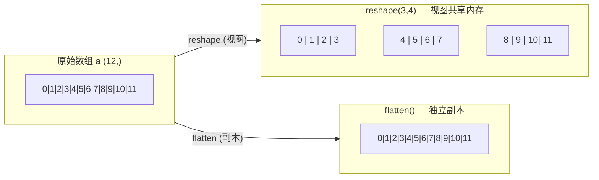
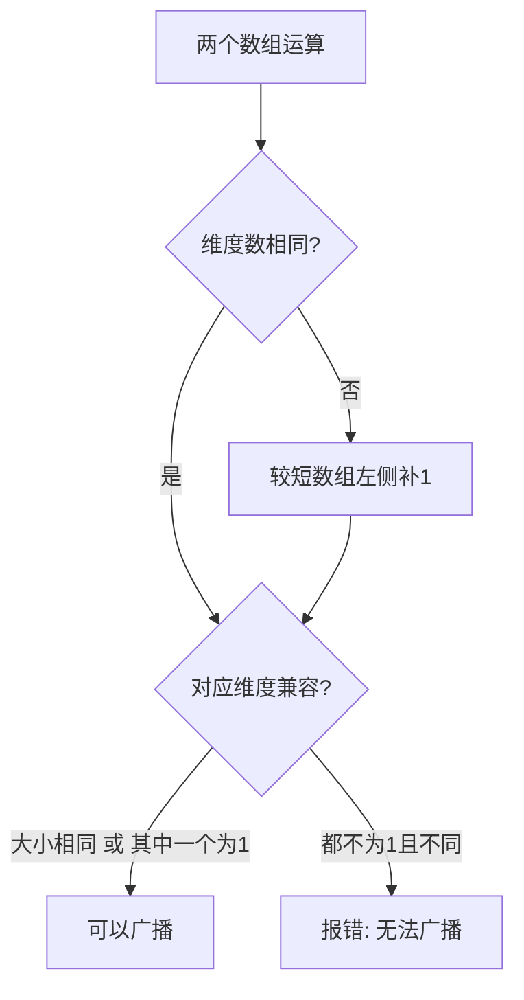
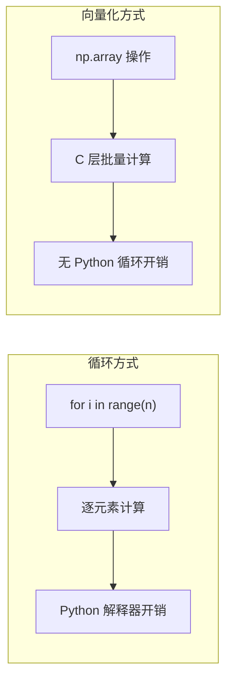

# 🔢 NumPy 基础

NumPy（Numerical Python）是 Python 科学计算的基石库，提供了高性能的多维数组对象 `ndarray` 和丰富的数学函数。从自动控制中的状态矩阵运算，到深度强化学习中的批量经验回放，再到飞行器姿态旋转矩阵计算——几乎所有科学计算任务都以 NumPy 为起点。本节系统介绍 NumPy 的核心用法。

## 📌 本节要点

- **ndarray** 是 NumPy 的核心数据结构，支持同类型元素的连续内存存储
- **创建方式**：`np.array`、`np.zeros/ones/full`、`np.arange/linspace`、`np.random`、`np.eye`
- **索引切片**：基本索引、切片、布尔索引、花式索引、`reshape/flatten/ravel`
- **广播机制**：不同形状数组运算的隐式扩展规则
- **向量化运算**：消除 Python 循环，利用 C 层批量计算，性能提升数十到数百倍
- **聚合函数**：`np.sum/mean/std/min/max/argmin/argmax`，`axis` 参数控制计算方向
- **线性代数**：矩阵乘法、求逆、特征分解、SVD、解线性方程组
- **随机数生成**：使用现代 `default_rng()` API 生成各种分布的随机数

## ndarray 基础

`ndarray`（N-dimensional array）是 NumPy 的核心数据结构。与 Python 列表不同，ndarray 中所有元素类型相同，数据在内存中连续存储，这使得向量化运算极其高效。

### 创建数组

```py title="Python"
import numpy as np

# 从 Python 列表创建
a = np.array([1, 2, 3, 4, 5])
print(a)        # [1 2 3 4 5]
print(a.dtype)  # int64

# 二维数组
b = np.array([[1, 2, 3], [4, 5, 6]])
print(b.shape)  # (2, 3)

# 指定数据类型
c = np.array([1.1, 2.2, 3.3], dtype=np.float32)
print(c.dtype)  # float32

# 从嵌套列表创建
d = np.array([[[1, 2], [3, 4]], [[5, 6], [7, 8]]])
print(d.ndim)   # 3
print(d.shape)  # (2, 2, 2)
```

### 常用创建函数

```py title="Python"
import numpy as np

# 全零数组
zeros = np.zeros((3, 4))
print(f"全零: {zeros.shape}")

# 全一数组
ones = np.ones((2, 3), dtype=np.float32)
print(f"全一: {ones}")

# 填充指定值
full = np.full((3, 3), 3.14)
print(f"填充: \n{full}")

# 等差序列
arange = np.arange(0, 10, 2)  # [0, 2, 4, 6, 8]
linspace = np.linspace(0, 1, 5)  # [0, 0.25, 0.5, 0.75, 1.0]
print(f"arange: {arange}")
print(f"linspace: {linspace}")

# 单位矩阵
eye = np.eye(3)
print(f"单位矩阵:\n{eye}")

# 对角矩阵
diag = np.diag([1, 2, 3])
print(f"对角矩阵:\n{diag}")
```

### 随机数创建

```py title="Python"
import numpy as np

rng = np.random.default_rng(seed=42)

# 均匀分布 [0, 1)
uniform = rng.random((3, 3))
print(f"均匀分布:\n{uniform.round(3)}")

# 标准正态分布
normal = rng.standard_normal((2, 4))
print(f"标准正态:\n{normal.round(3)}")

# 指定均值和标准差的正态分布
sensor_noise = rng.normal(loc=0.0, scale=0.5, size=1000)
print(f"传感器噪声 均值={sensor_noise.mean():.4f}, 标准差={sensor_noise.std():.4f}")

# 随机整数
ints = rng.integers(0, 10, size=(3, 3))
print(f"随机整数:\n{ints}")
```

### 数组属性

```py title="Python"
import numpy as np

a = np.array([[1, 2, 3, 4], [5, 6, 7, 8]])

print(f"形状 shape:     {a.shape}")     # (2, 4)
print(f"维度 ndim:      {a.ndim}")      # 2
print(f"元素总数 size:   {a.size}")     # 8
print(f"数据类型 dtype:  {a.dtype}")    # int64
print(f"元素字节 itemsize: {a.itemsize}")  # 8
print(f"总字节 nbytes:  {a.nbytes}")    # 64
print(f"是否连续:        {a.flags['C_CONTIGUOUS']}")
```

:::tip[linspace vs arange]
- `np.arange(start, stop, step)` 按**步长**生成，浮点数场景可能产生不确定个数的元素
- `np.linspace(start, stop, num)` 按**元素个数**生成，保证精确的端点和元素数

科学计算中推荐 `np.linspace` 生成时间轴或频率轴。
:::

## 索引与切片

ndarray 的索引方式灵活强大，掌握索引是高效使用 NumPy 的前提。

### 基本索引与切片

```py title="Python"
import numpy as np

a = np.array([[1, 2, 3, 4],
              [5, 6, 7, 8],
              [9, 10, 11, 12]])

# 单元素索引
print(a[1, 2])     # 7

# 行切片
print(a[0, :])     # [1 2 3 4]  第 0 行
print(a[:, 2])     # [ 3  7 11]  第 2 列

# 子矩阵
print(a[0:2, 1:3])
# [[2 3]
#  [6 7]]

# 步长切片
print(a[::2, ::2])
# [[ 1  3]
#  [ 9 11]]

# 负索引
print(a[-1, :])    # [ 9 10 11 12]  最后一行
```

:::warning[切片是视图，不是副本]
NumPy 切片返回的是原始数据的**视图**（view），修改切片会影响原数组：

```py title="Python"
a = np.array([1, 2, 3, 4, 5])
b = a[1:4]      # b 是 a 的视图
b[0] = 99       # 修改 b
print(a)        # [ 1 99  3  4  5]  a 也被修改了！

# 如果需要副本，使用 .copy()
c = a[1:4].copy()
c[0] = 0
print(a)        # [ 1 99  3  4  5]  a 不受影响
```
:::

### 布尔索引

布尔索引根据条件筛选元素，是数据清洗和条件提取的核心工具：

```py title="Python"
import numpy as np

temperatures = np.array([23.5, 25.1, 18.7, 30.2, 22.8, 27.6, 19.3])

# 条件筛选
hot = temperatures[temperatures > 25]
print(f"高温: {hot}")  # [25.1 30.2 27.6]

# 多条件组合（用 & | ~，不要用 and or not）
warm_humid = temperatures[(temperatures > 20) & (temperatures < 28)]
print(f"温暖: {warm_humid}")

# 布尔索引用于赋值
temperatures[temperatures < 20] = 20  # 低温截断
print(f"截断后: {temperatures}")

# np.where 条件选择
labels = np.where(temperatures > 25, "hot", "normal")
print(f"标签: {labels}")
```

### 花式索引（Fancy Indexing）

用整数数组或整数列表索引，可以一次性选取多个不连续的元素：

```py title="Python"
import numpy as np

a = np.array([10, 20, 30, 40, 50, 60])

# 整数列表索引
indices = [0, 2, 4]
print(a[indices])  # [10 30 50]

# 二维花式索引
matrix = np.arange(20).reshape(4, 5)
rows = np.array([0, 1, 3])
cols = np.array([1, 3, 4])
print(matrix[rows, cols])  # [ 1  8 19]

# 布尔花式索引
mask = np.array([True, False, True, False, True, True])
print(a[mask])  # [10 30 50 60]
```

### reshape、flatten、ravel

改变数组形状但不改变数据：

```py title="Python"
import numpy as np

a = np.arange(12)
print(f"原始: {a}, shape={a.shape}")

# reshape：返回视图（如果可能）
b = a.reshape(3, 4)
print(f"reshape:\n{b}")

# -1 自动推断维度
c = a.reshape(2, -1)  # 自动推断为 6 列
print(f"自动推断:\n{c}")

# flatten：返回副本（总是复制）
d = b.flatten()
print(f"flatten: {d}")

# ravel：返回视图（通常不复制）
e = b.ravel()
print(f"ravel: {e}")

# 转置
print(f"转置:\n{b.T}")
```



## 广播机制

广播（Broadcasting）是 NumPy 隐式扩展数组形状以进行运算的规则，避免了显式复制数据。

### 广播规则



兼容性判断：从**最后一个维度**开始向前逐一对比，两个维度满足以下任一条件即可：
- 大小相等
- 其中一个为 1

### 广播示例

```py title="Python"
import numpy as np

# 示例 1：标量与数组
a = np.array([1, 2, 3, 4])
b = 2
print(a + b)  # [3 4 5 6]
# 标量被广播为 (4,) 形状

# 示例 2：1D 与 2D
matrix = np.ones((3, 4))
vector = np.array([10, 20, 30, 40])
result = matrix + vector
print(result)
# [[11. 21. 31. 41.]
#  [11. 21. 31. 41.]
#  [11. 21. 31. 41.]]
# vector (4,) 广播为 (1, 4)，再广播为 (3, 4)

# 示例 3：按行加不同偏置
sensor_offsets = np.array([[0.1], [0.2], [0.3]])  # (3, 1)
raw_data = np.ones((3, 4)) * 5.0                   # (3, 4)
calibrated = raw_data + sensor_offsets               # (3, 4)
print(f"校准后:\n{calibrated}")
# [[5.1 5.1 5.1 5.1]
#  [5.2 5.2 5.2 5.2]
#  [5.3 5.3 5.3 5.3]]
```

### 广播常见陷阱

```py title="Python"
import numpy as np

# 陷阱 1：形状不兼容
a = np.ones((3, 4))
b = np.ones((3,))
try:
    result = a + b  # 报错！
except ValueError as e:
    print(f"错误: {e}")
    # operands could not be broadcast together with shapes (3,4) (3,)

# 修复：reshape 为 (1, 3) 或 (3, 1)
b_fixed = b.reshape(1, 3)  # 或 b[:, np.newaxis]
# 但 (3,4) + (1,3) 仍然不兼容，需要匹配最后一个维度

# 陷阱 2：一维数组的维度对齐
a = np.ones((4, 3))
b = np.array([1, 2, 3, 4])  # shape (4,)
# (4, 3) + (4,) → 报错！因为从末尾对齐：3 vs 4 不兼容
# 正确做法：
b_reshaped = b.reshape(4, 1)  # (4, 1) + (4, 3) → (4, 3) ✓
result = a + b_reshaped
print(f"修正后:\n{result}")
```

:::tip[广播的心智模型]
把广播想象成"对齐右端，向左扩展"：
1. 两个数组的维度从右往左对齐
2. 缺少的维度在左侧补 1
3. 每个维度上，大小为 1 的维度被"拉伸"到与另一个数组匹配
:::

## 向量化运算

向量化（Vectorization）是用数组整体操作替代 Python 循环的编程范式。NumPy 的底层用 C/Fortran 实现，向量化运算比纯 Python 循环快 10-100 倍。



### 性能对比

```py title="Python"
import numpy as np
import time

n = 1_000_000
a = np.random.randn(n)
b = np.random.randn(n)

# Python 循环方式
start = time.perf_counter()
result_loop = np.empty(n)
for i in range(n):
    result_loop[i] = a[i] * b[i] + np.sin(a[i])
loop_time = time.perf_counter() - start

# 向量化方式
start = time.perf_counter()
result_vec = a * b + np.sin(a)
vec_time = time.perf_counter() - start

print(f"循环方式:  {loop_time:.4f}s")
print(f"向量化方式: {vec_time:.6f}s")
print(f"加速比: {loop_time / vec_time:.1f}x")
# 典型加速比: 50-200x
```

### 向量化编程技巧

```py title="Python"
import numpy as np

# 技巧 1：避免循环，用数组运算
# 错误：逐元素相加
x = np.arange(1000)
result_bad = np.empty(1000)
for i in range(1000):
    result_bad[i] = x[i] ** 2 + 2 * x[i] + 1

# 正确：一行搞定
result_good = x ** 2 + 2 * x + 1

# 技巧 2：np.where 替代 if-else 循环
values = np.random.randn(1000)
# 错误
clipped_bad = np.empty_like(values)
for i in range(len(values)):
    if values[i] > 0:
        clipped_bad[i] = values[i]
    else:
        clipped_bad[i] = 0

# 正确
clipped_good = np.where(values > 0, values, 0)

# 技巧 3：np.maximum/np.minimum 向量化裁剪
clipped = np.clip(values, -1, 1)  # 裁剪到 [-1, 1]

# 技巧 4：布尔运算做条件统计
positive_count = np.sum(values > 0)
print(f"正值个数: {positive_count}")
```

:::warning[避免隐式循环的常见模式]
以下写法看起来像向量化，实际上隐含了 Python 循环：

```py title="Python"
# 这些写法都是慢的！
# 错误 1：列表推导
result = np.array([a[i] + b[i] for i in range(n)])

# 错误 2：np.vectorize（仍然逐元素调用 Python 函数）
vfunc = np.vectorize(lambda x, y: x + y)
result = vfunc(a, b)

# 正确：直接数组运算
result = a + b
```
:::

## 常用聚合函数

NumPy 提供了丰富的聚合函数，支持沿指定轴（axis）计算。

### 基本聚合

```py title="Python"
import numpy as np

data = np.array([[1, 2, 3, 4],
                 [5, 6, 7, 8],
                 [9, 10, 11, 12]])

# 全局聚合
print(f"总和: {np.sum(data)}")      # 78
print(f"均值: {np.mean(data)}")     # 6.5
print(f"标准差: {np.std(data):.2f}")  # 3.45
print(f"最小值: {np.min(data)}")    # 1
print(f"最大值: {np.max(data)}")    # 12

# axis 参数：沿指定轴计算
print(f"行均值(axis=1): {np.mean(data, axis=1)}")  # [ 2.5  6.5 10.5]
print(f"列均值(axis=0): {np.mean(data, axis=0)}")  # [5. 6. 7. 8.]

# argmin/argmax：返回最值的索引
print(f"最小值位置: {np.argmin(data)}")      # 0（展平后的索引）
print(f"第 0 行最大位置: {np.argmax(data[0])}")  # 3
```

### axis 参数图解

```py title="Python"
import numpy as np

a = np.array([[1, 2, 3],
              [4, 5, 6]])

# axis=0：沿行方向压缩（纵向）→ 每列的聚合
print(np.sum(a, axis=0))  # [5 7 9]

# axis=1：沿列方向压缩（横向）→ 每行的聚合
print(np.sum(a, axis=1))  # [ 6 15]

# axis=None（默认）：全局聚合
print(np.sum(a))          # 21
```

:::tip[axis 记忆口诀]
`axis=0` 沿**行方向**运算，结果的第 0 维消失（行数减少）；
`axis=1` 沿**列方向**运算，结果的第 1 维消失（列数减少）。
简单记："沿着哪个 axis，就消掉哪个 axis"。
:::

### 实用聚合函数速查

```py title="Python"
import numpy as np

a = np.array([3, 1, 4, 1, 5, 9, 2, 6, 5, 3])

# 累计和 / 累计乘积
print(f"累计和: {np.cumsum(a)}")
print(f"累计积: {np.cumprod(a[:5])}")

# 中位数
print(f"中位数: {np.median(a)}")

# 百分位数
print(f"90% 分位: {np.percentile(a, 90)}")

# 唯一值
print(f"唯一值: {np.unique(a)}")

# 排序
sorted_a = np.sort(a)
print(f"排序: {sorted_a}")

# 二维排序
matrix = np.array([[3, 1], [4, 2]])
print(f"按行排序:\n{np.sort(matrix, axis=1)}")
print(f"按列排序:\n{np.sort(matrix, axis=0)}")
```

## 线性代数

NumPy 的线性代数模块 `np.linalg` 提供了矩阵运算的核心功能，是控制理论和飞行力学计算的基础。

### 矩阵乘法

```py title="Python"
import numpy as np

A = np.array([[1, 2], [3, 4]])
B = np.array([[5, 6], [7, 8]])

# 方式 1：np.dot
C1 = np.dot(A, B)

# 方式 2：@ 运算符（推荐）
C2 = A @ B

# 方式 3：np.matmul
C3 = np.matmul(A, B)

print(f"矩阵乘法:\n{C2}")
# [[19 22]
#  [43 50]]

# 矩阵-向量乘法
v = np.array([1, 0])
print(f"A @ v = {A @ v}")  # [1 3]
```

### 矩阵求逆与线性方程组

```py title="Python"
import numpy as np

A = np.array([[2, 1], [1, 3]])

# 求逆
A_inv = np.linalg.inv(A)
print(f"A 的逆:\n{A_inv}")

# 验证：A @ A_inv ≈ I
print(f"A @ A_inv:\n{(A @ A_inv).round(10)}")

# 解线性方程组 Ax = b
b = np.array([5, 7])
x = np.linalg.solve(A, b)
print(f"方程组的解: {x}")
# 验证
print(f"A @ x = {A @ x}")  # 应该等于 b
```

### 特征分解

```py title="Python"
import numpy as np

# 对称矩阵（如惯性张量）
I = np.array([[10, -2, 0],
              [-2, 10, 0],
              [0, 0, 5]])

eigenvalues, eigenvectors = np.linalg.eig(I)
print(f"特征值: {eigenvalues}")
print(f"特征向量（列）:\n{eigenvectors}")

# 验证：A @ v = λ * v
for i in range(len(eigenvalues)):
    lhs = I @ eigenvectors[:, i]
    rhs = eigenvalues[i] * eigenvectors[:, i]
    print(f"  特征值 {eigenvalues[i]:.1f} 验证: {np.allclose(lhs, rhs)}")
```

### SVD 奇异值分解

```py title="Python"
import numpy as np

# 构造一个低秩矩阵
A = np.array([[1, 0, 1],
              [0, 1, 0],
              [1, 0, 1]], dtype=float)

U, S, Vt = np.linalg.svd(A)
print(f"奇异值: {S}")
print(f"U:\n{U.round(3)}")
print(f"Vt:\n{Vt.round(3)}")

# 用 SVD 近似重构（只保留前 k 个奇异值）
k = 1
A_approx = U[:, :k] @ np.diag(S[:k]) @ Vt[:k, :]
print(f"秩-1 近似:\n{A_approx}")
```

### 飞行器姿态旋转矩阵

在飞行力学中，常用方向余弦矩阵（DCM）描述坐标系旋转。以下是一个绕各轴旋转的完整示例：

```py title="Python"
import numpy as np

def rotation_x(angle_deg):
    """绕 X 轴旋转（滚转 Roll）"""
    rad = np.radians(angle_deg)
    return np.array([
        [1, 0, 0],
        [0, np.cos(rad), -np.sin(rad)],
        [0, np.sin(rad),  np.cos(rad)],
    ])

def rotation_y(angle_deg):
    """绕 Y 轴旋转（俯仰 Pitch）"""
    rad = np.radians(angle_deg)
    return np.array([
        [ np.cos(rad), 0, np.sin(rad)],
        [0, 1, 0],
        [-np.sin(rad), 0, np.cos(rad)],
    ])

def rotation_z(angle_deg):
    """绕 Z 轴旋转（偏航 Yaw）"""
    rad = np.radians(angle_deg)
    return np.array([
        [np.cos(rad), -np.sin(rad), 0],
        [np.sin(rad),  np.cos(rad), 0],
        [0, 0, 1],
    ])

# 机体坐标系中的速度矢量
v_body = np.array([100, 0, 0])  # 机头方向 100 m/s

# 姿态角：滚转 30°，俯仰 10°，偏航 45°
R = rotation_z(45) @ rotation_y(10) @ rotation_x(30)
print(f"DCM:\n{R.round(4)}")

# 转换到地面坐标系
v_earth = R @ v_body
print(f"地面坐标系速度: {v_earth.round(2)}")
# 三个分量都不为零，说明姿态旋转确实改变了投影
```

:::tip[旋转矩阵的性质]
- 正交矩阵：`R @ R.T = I`，`det(R) = 1`
- 逆等于转置：`R^{-1} = R^T`
- 复合旋转：按顺序右乘，如 `R = Rz @ Ry @ Rx`
- 验证：`np.allclose(R @ R.T, np.eye(3))` 应返回 `True`
:::

## 随机数生成

NumPy 的现代随机数 API 基于 `default_rng()`，提供更好的统计质量和可重复性。

### 基本用法

```py title="Python"
import numpy as np

# 创建 RNG 实例（推荐用 seed 保证可重复性）
rng = np.random.default_rng(seed=42)

# 均匀分布 [0, 1)
uniform = rng.random(5)
print(f"均匀分布: {uniform.round(4)}")

# 正态分布
normal = rng.normal(loc=0, scale=1, size=5)
print(f"正态分布: {normal.round(4)}")

# 指定范围的随机整数
ints = rng.integers(0, 100, size=5)
print(f"随机整数: {ints}")

# 随机排列
arr = np.arange(10)
rng.shuffle(arr)
print(f"随机排列: {arr}")
```

### 常用分布

```py title="Python"
import numpy as np

rng = np.random.default_rng(seed=42)

# 均匀分布 U(a, b)
uniform = rng.uniform(low=-1, high=1, size=5)
print(f"U(-1,1): {uniform.round(4)}")

# 正态分布 N(μ, σ²)
gaussian = rng.normal(loc=100, scale=15, size=5)
print(f"N(100,15²): {gaussian.round(2)}")

# 指数分布（模拟泊松过程间隔）
exponential = rng.exponential(scale=2.0, size=5)
print(f"指数分布: {exponential.round(4)}")

# 多项式分布（模拟掷骰子）
die_rolls = rng.choice([1, 2, 3, 4, 5, 6], size=10)
print(f"掷骰子: {die_rolls}")

# 带权重的抽样
categories = ["正常", "异常", "警告"]
weights = [0.7, 0.2, 0.1]
samples = rng.choice(categories, size=20, p=weights)
print(f"抽样结果: {samples}")
```

### 科学计算中的随机数应用

```py title="Python"
import numpy as np

rng = np.random.default_rng(seed=42)

# 模拟传感器数据（含噪声和漂移）
n_points = 100
t = np.linspace(0, 10, n_points)
true_signal = np.sin(2 * np.pi * 0.5 * t)  # 0.5 Hz 正弦
noise = rng.normal(0, 0.1, n_points)        # 高斯噪声
drift = np.cumsum(rng.normal(0, 0.001, n_points))  # 随机漂移
sensor_data = true_signal + noise + drift

print(f"真实信号范围: [{true_signal.min():.3f}, {true_signal.max():.3f}]")
print(f"传感器数据范围: [{sensor_data.min():.3f}, {sensor_data.max():.3f}]")
print(f"信噪比（近似）: {np.std(true_signal) / np.std(noise):.1f}x")
```

:::tip[新旧 API 对比]
- 旧 API：`np.random.randn()`、`np.random.random()`、`np.random.seed()` — 全局状态，不推荐
- 新 API：`rng = np.random.default_rng()`、`rng.random()`、`rng.normal()` — 实例化，可重复，线程安全

新代码一律使用 `default_rng()`。
:::

## 🎯 动手练习

1. **传感器数据校准**：创建一个 3×100 的数组模拟 3 个传感器各 100 个采样点，实现：
   - 用 `np.mean` 计算每个传感器的零偏
   - 用布尔索引剔除超过 3 倍标准差的异常值
   - 用广播机制减去零偏进行校准

2. **飞行器姿态变换**：用旋转矩阵实现以下任务：
   - 定义机体坐标系下的 6 个顶点（正六面体）
   - 分别绕 X、Y、Z 轴旋转 30°、45°、60°
   - 验证复合旋转矩阵仍是正交矩阵（`det(R) ≈ 1`）

3. **向量化加速**：编写一个函数计算两个大规模向量的欧氏距离：
   - 先用 Python 循环实现
   - 再用向量化实现
   - 对比 `n = 1_000_000` 时的性能差异

4. **蒙特卡洛积分**：用随机数估算 π 值：
   - 生成 n 个均匀分布在 [-1, 1] 的随机点
   - 统计落在单位圆内的比例
   - 画出不同 n 下的收敛曲线（用 matplotlib）

## 📚 延伸阅读

- **[NumPy 官方文档](https://numpy.org/doc/stable/)** - 完整 API 参考与用户指南
- **[NumPy 教程](https://numpy.org/doc/stable/user/quickstart.html)** - 官方快速入门
- **[SciPy 文档](https://docs.scipy.org/doc/scipy/)** - 基于 NumPy 的科学计算工具箱
- **[NumPy 广播规则](https://numpy.org/doc/stable/user/basics.broadcasting.html)** - 广播机制详解
- **[NumPy 线性代数](https://numpy.org/doc/stable/reference/routines.linalg.html)** - linalg 模块参考
- **[NumPy 随机数生成](https://numpy.org/doc/stable/reference/random/index.html)** - 随机数生成器文档

## ✅ 本节总结

- **ndarray 是 NumPy 核心**：同类型连续存储，支持高效向量化运算
- **创建方式多样**：`np.array`、`np.zeros/ones/full`、`np.arange/linspace`、`np.eye`、`rng.random/normal`
- **索引切片灵活**：基本索引、切片、布尔索引、花式索引；切片是视图而非副本
- **广播机制高效**：从右向左对齐，大小为 1 的维度可隐式扩展，避免显式数据复制
- **向量化是性能关键**：用数组整体操作替代 Python 循环，加速 10-100 倍
- **axis 参数控制聚合方向**：`axis=0` 沿行压缩，`axis=1` 沿列压缩
- **线性代数功能完备**：`@` 矩阵乘法、`np.linalg.inv` 求逆、`eig` 特征分解、`svd` 奇异值分解、`solve` 解方程组
- **现代随机数 API**：使用 `default_rng()` 替代旧的全局函数，保证可重复性和线程安全
