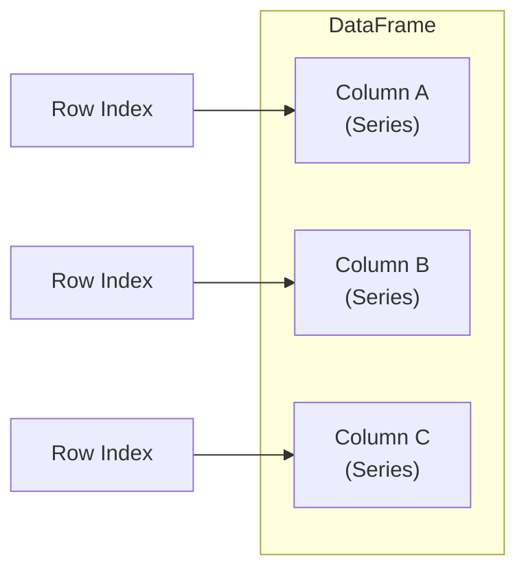
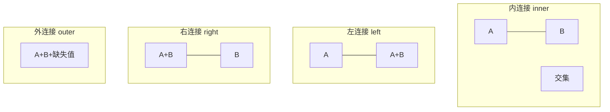

# 📊 pandas 入门

pandas 是 Python 数据分析的核心库，构建在 NumPy 之上，提供了高效易用的数据结构和数据分析工具。从实验数据清洗到飞行测试数据分析，pandas 能帮你快速处理、转换和分析结构化数据。本节系统介绍 pandas 的核心用法。

## 📌 本节要点

- **Series 与 DataFrame**：pandas 的两大核心数据结构
- **数据读写**：`read_csv`、`read_excel`、`read_json`、`to_csv` 等常用 IO 方法
- **数据选择**：`loc`、`iloc`、布尔索引、`query()` 等灵活的数据筛选方式
- **数据清洗**：缺失值处理、重复值检测、类型转换
- **分组聚合**：`groupby` + `agg`、`transform`、`apply` 实现数据分组统计
- **数据合并**：`merge`（四种连接方式）和 `concat` 数据合并
- **时间序列**：`pd.to_datetime`、`resample`、`rolling` 时间序列处理

## Series 与 DataFrame

pandas 的两大核心数据结构是 Series（一维）和 DataFrame（二维表格）。Series 可以理解为带标签的 NumPy 数组，DataFrame 则是多个 Series 组成的表格。



### 创建 Series

```py title="Python"
import pandas as pd

# 从列表创建 Series
s = pd.Series([1, 2, 3, 4, 5])
print(s)
# 0    1
# 1    2
# 2    3
# 3    4
# 4    5

# 指定索引
s = pd.Series([1, 2, 3], index=['a', 'b', 'c'])
print(s['b'])  # 2

# 从字典创建
s = pd.Series({'温度': 23.5, '压力': 101.3, '湿度': 45})
print(s['温度'])  # 23.5

# Series 属性
print(f"值: {s.values}")
print(f"索引: {s.index}")
print(f"数据类型: {s.dtype}")
```

### 创建 DataFrame

```py title="Python"
import pandas as pd

# 从字典创建 DataFrame（最常用）
df = pd.DataFrame({
    '传感器': ['A1', 'A2', 'A3', 'A4'],
    '读数': [23.5, 24.1, 22.8, 23.9],
    '误差': [0.1, 0.2, 0.15, 0.12],
    '状态': ['正常', '正常', '异常', '正常']
})
print(df)

# 从 NumPy 数组创建
import numpy as np
arr = np.random.randn(3, 4)
df = pd.DataFrame(arr, columns=['x', 'y', 'z', 'w'])
print(df)

# DataFrame 属性
print(f"形状: {df.shape}")        # (3, 4)
print(f"列名: {df.columns.tolist()}")
print(f"索引: {df.index.tolist()}")
print(f"数据类型:\n{df.dtypes}")
print(f"前3行:\n{df.head(3)}")
```

### 数据信息

```py title="Python"
import pandas as pd

# 创建示例数据
df = pd.DataFrame({
    '实验编号': [f'E{i:03d}' for i in range(1, 11)],
    '温度': [23.5, 24.1, 22.8, 23.9, 25.0, 24.5, 23.2, 22.9, 24.8, 23.7],
    '压力': [101.3, 100.8, 101.5, 100.9, 101.2, 101.0, 100.7, 101.4, 100.6, 101.1],
    '湿度': [45, 52, 48, 51, 47, 50, 46, 53, 49, 44]
})

# 快速统计
print(df.describe())

# 信息概览
print(df.info())

# 非空计数
print(df.isna().sum())
```

:::tip[pandas vs NumPy]
- **NumPy ndarray**：同类型、高性能数值计算，适合数学运算和数组操作
- **pandas DataFrame**：异构数据、带标签、灵活索引，适合数据分析和处理
- 实际项目中常结合使用：用 pandas 读取和清洗数据，用 NumPy 进行数值计算
:::

## 数据读写

pandas 支持多种文件格式的读写，是数据导入导出的核心工具。

### CSV 文件

```py title="Python"
import pandas as pd

# 创建示例数据
df = pd.DataFrame({
    '时间戳': pd.date_range('2024-01-01', periods=5, freq='h'),
    '传感器': ['A', 'A', 'B', 'B', 'A'],
    '读数': [23.5, 24.1, 22.8, 23.9, 25.0],
    '状态': ['正常', '正常', '异常', '正常', '正常']
})

# 写入 CSV
df.to_csv('sensor_data.csv', index=False, encoding='utf-8')

# 读取 CSV
df_read = pd.read_csv('sensor_data.csv')
print(df_read.head())

# 高级读取选项
df_filtered = pd.read_csv(
    'sensor_data.csv',
    usecols=['时间戳', '读数'],  # 只读取指定列
    parse_dates=['时间戳'],      # 解析日期列
    index_col='时间戳'           # 设置索引列
)
```

### Excel 文件

```py title="Python"
import pandas as pd

# 写入 Excel（需要 openpyxl）
df.to_excel('sensor_data.xlsx', index=False, sheet_name='实验数据')

# 读取 Excel
df_excel = pd.read_excel('sensor_data.xlsx', sheet_name='实验数据')
print(df_excel.head())

# 读取多个 sheet
all_sheets = pd.read_excel('sensor_data.xlsx', sheet_name=None)
for name, sheet in all_sheets.items():
    print(f"Sheet {name}: {sheet.shape}")
```

### JSON 文件

```py title="Python"
import pandas as pd

# 写入 JSON
df.to_json('sensor_data.json', orient='records', force_ascii=False)

# 读取 JSON
df_json = pd.read_json('sensor_data.json')
print(df_json.head())

# JSON 格式选项
# orient='records': [{"col1": val1, "col2": val2}, ...]
# orient='columns': {"col1": {"0": val1, "1": val2}, ...}
# orient='index': {"0": {"col1": val1, "col2": val2}, ...}
```

### 文件格式对比

| 格式 | 优点 | 缺点 | 适用场景 |
|------|------|------|----------|
| CSV | 通用、轻量、易读 | 不支持多sheet、类型丢失 | 数据交换、文本数据 |
| Excel | 多sheet、格式丰富 | 需要额外库、文件较大 | 报告、人工编辑 |
| JSON | 结构化、支持嵌套 | 文件较大、解析慢 | API数据、配置文件 |
| Parquet | 列存储、压缩高效 | 需要额外库 | 大规模数据、分析 |
| HDF5 | 高效读写、支持压缩 | 需要额外库 | 科学计算、大数据 |

:::warning[CSV 读写注意事项]
1. **编码问题**：中文数据使用 `encoding='utf-8'` 或 `encoding='gbk'`
2. **大文件**：使用 `chunksize` 分块读取，避免内存溢出
3. **类型推断**：`dtype` 参数指定列类型，避免类型错误
4. **缺失值**：`na_values` 参数指定缺失值表示
:::

### pandas vs 标准库 csv

```py title="Python"
import pandas as pd
import csv

# 标准库 csv：逐行处理，需要手动管理
# 适合简单场景，大数据时内存效率低
with open('data.csv', 'r', encoding='utf-8') as f:
    reader = csv.DictReader(f)
    for row in reader:
        # 处理每行
        pass

# pandas：批量处理，自动类型推断，功能强大
# 适合数据分析，大数据时内存效率高
df = pd.read_csv('data.csv')
# 一行代码完成所有操作
summary = df.groupby('category').agg({'value': 'mean'})
```

## 数据选择与过滤

pandas 提供了多种灵活的数据选择方式，是数据分析的核心操作。

### loc（标签索引）

```py title="Python"
import pandas as pd

df = pd.DataFrame({
    '传感器': ['A1', 'A2', 'A3', 'A4', 'A5'],
    '读数': [23.5, 24.1, 22.8, 23.9, 25.0],
    '误差': [0.1, 0.2, 0.15, 0.12, 0.18],
    '状态': ['正常', '正常', '异常', '正常', '正常']
}, index=['E001', 'E002', 'E003', 'E004', 'E005'])

# 选择单列
print(df['读数'])

# 选择多列
print(df[['传感器', '读数']])

# 选择单行
print(df.loc['E001'])

# 选择多行
print(df.loc['E001':'E003'])

# 选择行和列
print(df.loc['E001':'E003', ['传感器', '读数']])

# 条件选择
print(df.loc[df['读数'] > 24, ['传感器', '读数']])
```

### iloc（位置索引）

```py title="Python"
import pandas as pd

df = pd.DataFrame({
    '传感器': ['A1', 'A2', 'A3', 'A4', 'A5'],
    '读数': [23.5, 24.1, 22.8, 23.9, 25.0],
    '误差': [0.1, 0.2, 0.15, 0.12, 0.18]
})

# 选择第 0 行
print(df.iloc[0])

# 选择前 3 行
print(df.iloc[:3])

# 选择第 0 列
print(df.iloc[:, 0])

# 选择前 3 行，前 2 列
print(df.iloc[:3, :2])

# 选择第 0、2、4 行，第 1、2 列
print(df.iloc[[0, 2, 4], [1, 2]])
```

### 布尔索引

```py title="Python"
import pandas as pd

df = pd.DataFrame({
    '温度': [23.5, 24.1, 22.8, 23.9, 25.0, 24.5],
    '压力': [101.3, 100.8, 101.5, 100.9, 101.2, 101.0],
    '湿度': [45, 52, 48, 51, 47, 50]
})

# 单条件
hot = df[df['温度'] > 24]
print(hot)

# 多条件（& 且，| 或）
warm_humid = df[(df['温度'] > 23) & (df['湿度'] > 48)]
print(warm_humid)

# isin 多值筛选
target = df[df['温度'].isin([23.5, 24.1, 25.0])]
print(target)

# 条件赋值
df.loc[df['温度'] > 24, '状态'] = '高温'
df.loc[df['温度'] <= 24, '状态'] = '正常'
print(df)
```

### query() 方法

```py title="Python"
import pandas as pd

df = pd.DataFrame({
    '温度': [23.5, 24.1, 22.8, 23.9, 25.0, 24.5],
    '压力': [101.3, 100.8, 101.5, 100.9, 101.2, 101.0],
    '湿度': [45, 52, 48, 51, 47, 50]
})

# query 方法：用字符串表达式筛选
result = df.query('温度 > 24 and 湿度 > 48')
print(result)

# 引用变量
threshold = 23
result = df.query('温度 > @threshold')
print(result)

# 复杂条件
result = df.query('(温度 > 23) & (压力 < 101) | (湿度 > 50)')
print(result)
```

:::tip[选择方法对比]
- **loc**：基于标签（名称），适合已知列名和索引名的场景
- **iloc**：基于位置（整数索引），适合按位置切片
- **布尔索引**：基于条件，适合数据筛选
- **query()**：字符串表达式，语法简洁，适合复杂条件
:::

## 数据清洗

真实数据往往包含缺失值、重复值和类型错误，数据清洗是分析前的必要步骤。

### 缺失值处理

```py title="Python"
import pandas as pd
import numpy as np

# 创建含缺失值的数据
df = pd.DataFrame({
    '温度': [23.5, np.nan, 22.8, 23.9, 25.0, np.nan],
    '压力': [101.3, 100.8, np.nan, 100.9, 101.2, 101.0],
    '湿度': [45, 52, 48, np.nan, 47, 50]
})

# 检测缺失值
print(df.isna())
print(df.isna().sum())  # 每列缺失值计数

# 删除缺失值
df_drop = df.dropna()
print(f"删除后: {df_drop.shape}")

df_drop_col = df.dropna(axis=1)  # 删除含缺失值的列
print(f"删除列后: {df_drop_col.shape}")

# 填充缺失值
df_fill_zero = df.fillna(0)
df_fill_mean = df.fillna(df.mean())  # 用均值填充
df_fill_ffill = df.fillna(method='ffill')  # 前向填充
df_fill_bfill = df.fillna(method='bfill')  # 后向填充

print(f"均值填充:\n{df_fill_mean}")

# 插值
df_interp = df.interpolate()
print(f"插值填充:\n{df_interp}")
```

### 重复值处理

```py title="Python"
import pandas as pd

# 创建含重复值的数据
df = pd.DataFrame({
    '传感器': ['A1', 'A1', 'A2', 'A2', 'A3'],
    '读数': [23.5, 23.5, 24.1, 24.1, 22.8],
    '时间': ['10:00', '10:00', '10:01', '10:01', '10:02']
})

# 检测重复值
print(df.duplicated())  # 布尔标记
print(f"重复行数: {df.duplicated().sum()}")

# 删除重复值（保留第一个）
df_unique = df.drop_duplicates()
print(f"去重后:\n{df_unique}")

# 删除重复值（保留最后一个）
df_unique_last = df.drop_duplicates(keep='last')

# 基于特定列判断重复
df_sensor_dup = df.drop_duplicates(subset=['传感器', '时间'])
print(f"传感器-时间去重:\n{df_sensor_dup}")
```

### 类型转换

```py title="Python"
import pandas as pd

df = pd.DataFrame({
    '日期': ['2024-01-01', '2024-01-02', '2024-01-03'],
    '温度': ['23.5', '24.1', '22.8'],
    '湿度': ['45', '52', '48'],
    '状态': ['正常', '异常', '正常']
})

print(df.dtypes)

# 转换为数值
df['温度'] = pd.to_numeric(df['温度'])
df['湿度'] = df['湿度'].astype(int)

# 转换为日期时间
df['日期'] = pd.to_datetime(df['日期'])

# 转换为类别（节省内存）
df['状态'] = df['状态'].astype('category')

print(df.dtypes)
print(df.head())
```

:::tip[数据清洗流程]
1. **检查数据**：`df.info()`、`df.describe()`、`df.head()`
2. **处理缺失值**：删除、填充、插值（根据业务逻辑选择）
3. **处理重复值**：检测、删除（注意保留策略）
4. **类型转换**：确保每列数据类型正确
5. **异常值处理**：用统计方法或领域知识识别
:::

## 分组聚合

分组聚合（groupby）是数据分析的核心操作，能快速计算分组统计量。

### 基本分组

```py title="Python"
import pandas as pd

# 创建实验数据
df = pd.DataFrame({
    '实验组': ['对照组', '对照组', '实验组', '实验组', '对照组', '实验组'],
    '传感器': ['A1', 'A2', 'A1', 'A2', 'A1', 'A2'],
    '读数': [23.5, 24.1, 25.2, 26.8, 23.8, 25.9],
    '温度': [22.0, 22.5, 23.0, 23.5, 22.2, 23.2]
})

# 单列分组
grouped = df.groupby('实验组')
print(grouped.mean())

# 多列分组
grouped = df.groupby(['实验组', '传感器'])
print(grouped.mean())
```

### agg 聚合

```py title="Python"
import pandas as pd

df = pd.DataFrame({
    '实验组': ['对照组', '对照组', '实验组', '实验组', '对照组', '实验组'],
    '传感器': ['A1', 'A2', 'A1', 'A2', 'A1', 'A2'],
    '读数': [23.5, 24.1, 25.2, 26.8, 23.8, 25.9],
    '温度': [22.0, 22.5, 23.0, 23.5, 22.2, 23.2]
})

# 多种聚合函数
result = df.groupby('实验组').agg({
    '读数': ['mean', 'std', 'min', 'max'],
    '温度': ['mean', 'std']
})
print(result)

# 自定义聚合函数
def range_calc(x):
    return x.max() - x.min()

result = df.groupby('实验组').agg({
    '读数': ['mean', range_calc],
    '温度': ['mean', 'std']
})
print(result)

# 重命名聚合结果
result = df.groupby('实验组').agg(
    读数均值=('读数', 'mean'),
    读数标准差=('读数', 'std'),
    温度均值=('温度', 'mean')
)
print(result)
```

### transform

```py title="Python"
import pandas as pd

df = pd.DataFrame({
    '实验组': ['对照组', '对照组', '实验组', '实验组'],
    '读数': [23.5, 24.1, 25.2, 26.8],
    '温度': [22.0, 22.5, 23.0, 23.5]
})

# transform 保持原始形状，返回与原 DataFrame 相同长度的结果
df['组内均值'] = df.groupby('实验组')['读数'].transform('mean')
df['读数偏差'] = df['读数'] - df['组内均值']
print(df)

# 标准化（z-score）
df['读数标准化'] = df.groupby('实验组')['读数'].transform(
    lambda x: (x - x.mean()) / x.std()
)
print(df)
```

### apply

```py title="Python"
import pandas as pd
import numpy as np

df = pd.DataFrame({
    '实验组': ['对照组', '对照组', '实验组', '实验组'],
    '读数': [23.5, 24.1, 25.2, 26.8],
    '温度': [22.0, 22.5, 23.0, 23.5]
})

# apply：应用自定义函数
def analyze_group(group):
    return pd.Series({
        '样本数': len(group),
        '读数均值': group['读数'].mean(),
        '读数标准差': group['读数'].std(),
        '温度范围': group['温度'].max() - group['温度'].min(),
        '异常值个数': ((group['读数'] - group['读数'].mean()).abs() > group['读数'].std()).sum()
    })

result = df.groupby('实验组').apply(analyze_group)
print(result)
```

:::tip[聚合方法选择]
- **agg()**：简单聚合，指定聚合函数，性能好
- **transform()**：保持原始形状，适合归一化、标准化
- **apply()**：最灵活，可应用任意函数，但性能较差
- 大数据集优先使用 agg()，复杂逻辑再用 apply()
:::

## 数据合并

数据合并是将多个 DataFrame 组合在一起的操作，常用 merge 和 concat。

### merge 连接

```py title="Python"
import pandas as pd

# 实验基本信息
df_experiment = pd.DataFrame({
    '实验ID': ['E001', 'E002', 'E003', 'E004'],
    '日期': ['2024-01-01', '2024-01-02', '2024-01-03', '2024-01-04'],
    '操作员': ['张三', '李四', '王五', '赵六']
})

# 实验数据
df_data = pd.DataFrame({
    '实验ID': ['E001', 'E002', 'E003', 'E005'],
    '温度': [23.5, 24.1, 22.8, 23.9],
    '压力': [101.3, 100.8, 101.5, 100.9]
})

# 内连接（默认）
inner = pd.merge(df_experiment, df_data, on='实验ID')
print("内连接:")
print(inner)

# 左连接
left = pd.merge(df_experiment, df_data, on='实验ID', how='left')
print("\n左连接:")
print(left)

# 右连接
right = pd.merge(df_experiment, df_data, on='实验ID', how='right')
print("\n右连接:")
print(right)

# 外连接
outer = pd.merge(df_experiment, df_data, on='实验ID', how='outer')
print("\n外连接:")
print(outer)
```

### 连接类型对比



### concat 连接

```py title="Python"
import pandas as pd

# 按行连接（纵向）
df1 = pd.DataFrame({
    '传感器': ['A1', 'A2'],
    '读数': [23.5, 24.1]
})

df2 = pd.DataFrame({
    '传感器': ['A3', 'A4'],
    '读数': [22.8, 23.9]
})

df_vertical = pd.concat([df1, df2], ignore_index=True)
print("纵向连接:")
print(df_vertical)

# 按列连接（横向）
df3 = pd.DataFrame({
    '温度': [22.0, 22.5]
})

df_horizontal = pd.concat([df1, df3], axis=1)
print("\n横向连接:")
print(df_horizontal)

# 多个 DataFrame 连接
df_list = [df1, df2, pd.DataFrame({'传感器': ['A5'], '读数': [25.0]})]
df_all = pd.concat(df_list, ignore_index=True)
print("\n多个连接:")
print(df_all)
```

:::warning[合并注意事项]
1. **键的选择**：确保连接键的数据类型一致
2. **重复列名**：使用 `suffixes` 参数处理
3. **索引对齐**：注意索引是否需要重置
4. **内存使用**：大数据集考虑分块处理
:::

## 时间序列

pandas 提供了强大的时间序列处理能力，特别适合实验数据的时间分析。

### 日期时间处理

```py title="Python"
import pandas as pd

# 创建时间序列
dates = pd.date_range('2024-01-01', periods=24, freq='h')
print(dates)

# 从字符串转换
df = pd.DataFrame({
    '时间': ['2024-01-01 10:00', '2024-01-01 11:00', '2024-01-01 12:00'],
    '温度': [23.5, 24.1, 22.8]
})
df['时间'] = pd.to_datetime(df['时间'])
print(df.dtypes)

# 时间组件提取
df['小时'] = df['时间'].dt.hour
df['日期'] = df['时间'].dt.date
df['星期'] = df['时间'].dt.day_name()
print(df)
```

### 重采样

```py title="Python"
import pandas as pd
import numpy as np

# 创建高频时间序列
np.random.seed(42)
dates = pd.date_range('2024-01-01', periods=1440, freq='min')  # 1 分钟数据
df = pd.DataFrame({
    '时间': dates,
    '温度': 23 + np.random.randn(1440) * 0.5
})
df.set_index('时间', inplace=True)

# 降采样：1 分钟 → 1 小时
hourly = df.resample('h').agg({
    '温度': ['mean', 'std', 'min', 'max']
})
print(hourly.head())

# 降采样：1 分钟 → 1 天
daily = df.resample('D').agg({
    '温度': ['mean', 'std']
})
print(daily.head())

# 上采样：填充缺失值
upsampled = df.resample('5min').ffill()
print(upsampled.head())
```

### 滚动窗口

```py title="Python"
import pandas as pd
import numpy as np

# 创建模拟传感器数据
np.random.seed(42)
dates = pd.date_range('2024-01-01', periods=100, freq='h')
df = pd.DataFrame({
    '时间': dates,
    '温度': 23 + np.cumsum(np.random.randn(100) * 0.1)
})
df.set_index('时间', inplace=True)

# 简单移动平均
df['SMA_6h'] = df['温度'].rolling(window=6).mean()
df['SMA_24h'] = df['温度'].rolling(window=24).mean()

# 指数移动平均
df['EMA_6h'] = df['温度'].ewm(span=6).mean()

# 滚动标准差
df['波动性'] = df['温度'].rolling(window=6).std()

print(df[['温度', 'SMA_6h', 'SMA_24h', '波动性']].head(30))

# 移动窗口统计
def rolling_stats(series):
    return pd.Series({
        '均值': series.mean(),
        '标准差': series.std(),
        '最大值': series.max(),
        '最小值': series.min()
    })

stats = df['温度'].rolling(window=24).apply(rolling_stats, raw=False)
print(stats.head())
```

:::tip[时间序列最佳实践]
1. **索引设置**：将时间列设为索引，便于时间序列操作
2. **频率指定**：明确数据频率（`freq` 参数），避免歧义
3. **时区处理**：使用 `tz_localize` 和 `tz_convert` 处理时区
4. **缺失值处理**：时间序列常用前向填充（`ffill`）或插值
:::

## 🎯 动手练习

1. **实验数据清洗**：创建一个包含 100 条记录的传感器数据 DataFrame，包含缺失值和重复值，实现：
   - 检测并处理缺失值（至少两种方法）
   - 检测并处理重复值
   - 将数据类型转换为适当类型
   - 生成清洗报告（各步骤处理了多少条记录）

2. **分组聚合分析**：使用上面的传感器数据，实现：
   - 按传感器分组，计算每组的均值、标准差、最大值、最小值
   - 使用 transform 计算每个读数相对于组均值的偏差
   - 使用 apply 实现自定义分析函数，返回每组的异常值个数

3. **时间序列分析**：创建 24 小时的模拟温度数据（1 分钟间隔），实现：
   - 重采样为 1 小时数据
   - 计算 6 小时和 24 小时移动平均
   - 计算波动性（滚动标准差）
   - 找出温度变化最大的时间段

4. **数据合并实战**：创建三个相关 DataFrame（实验信息、传感器数据、操作员信息），实现：
   - 使用不同连接方式合并数据
   - 处理合并后的缺失值
   - 生成合并后的数据质量报告

## 📚 延伸阅读

- **[pandas 官方文档](https://pandas.pydata.org/docs/)** - 完整 API 参考与用户指南
- **[pandas 入门教程](https://pandas.pydata.org/docs/getting_started/index.html)** - 官方快速入门
- **[pandas 实战](https://github.com/jvns/pandas-cookbook)** - 实用代码示例
- **[数据清洗指南](https://www.tidyverse.org/)** - 数据清洗最佳实践
- **[时间序列分析](https://www.statsmodels.org/stable/tsa.html)** - 基于 pandas 的时间序列分析
- **[pandas 性能优化](https://pandas.pydata.org/docs/user_guide/enhancingperf.html)** - 大数据集性能优化

## ✅ 本节总结

- **pandas 核心数据结构**：Series（一维）和 DataFrame（二维表格），构建在 NumPy 之上
- **数据读写灵活**：支持 CSV、Excel、JSON 等多种格式，pandas 是数据导入导出的首选工具
- **数据选择多样**：loc（标签）、iloc（位置）、布尔索引、query() 方法，满足各种筛选需求
- **数据清洗必备**：缺失值处理（isna、fillna、dropna）、重复值处理（duplicated、drop_duplicates）、类型转换（astype、pd.to_datetime）
- **分组聚合强大**：groupby + agg（聚合）、transform（保持形状）、apply（自定义函数）
- **数据合并灵活**：merge（四种连接方式）和 concat（纵向/横向连接）
- **时间序列处理**：pd.to_datetime、resample（重采样）、rolling（滚动窗口）
- **实际应用广泛**：从实验数据清洗到飞行测试分析，pandas 是数据处理的利器