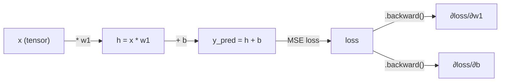
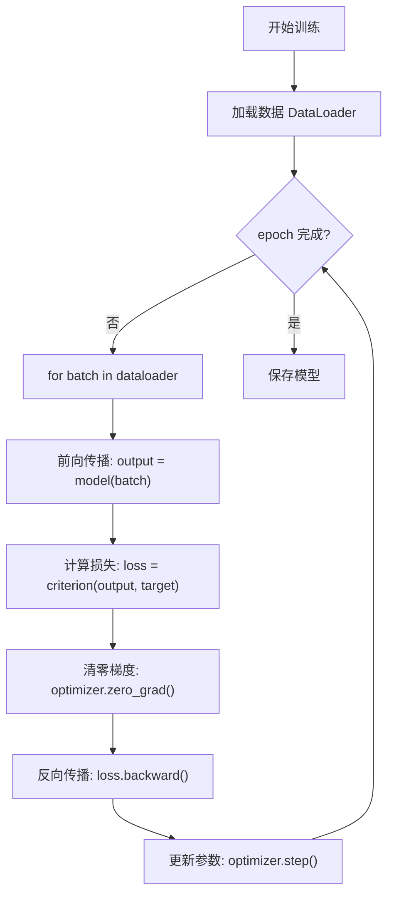

# 🔥 PyTorch 入门

PyTorch 是当前深度学习研究的主导框架，以其动态计算图、Pythonic 设计和强大的 GPU 加速能力著称。从深度强化学习中的策略网络到飞行器姿态控制中的非线性动力学建模，PyTorch 提供了从研究原型到生产部署的完整工具链。本节系统介绍 PyTorch 的核心概念与实战用法。

## 📌 本节要点

- **Tensor** 是 PyTorch 的核心数据结构，类似 NumPy ndarray 但支持 GPU 加速
- **自动微分 (autograd)** 自动计算梯度，是反向传播的基础
- **nn.Module** 是构建神经网络的基类，支持自定义层和模型
- **损失函数与优化器** 提供常用的损失计算和参数更新策略
- **DataLoader** 实现高效的数据加载和批处理
- **训练循环** 将上述组件组合成完整的模型训练流程
- **GPU 加速** 通过 `.to(device)` 轻松将计算迁移到 GPU
- **模型保存与加载** 使用 `state_dict` 实现模型的持久化

## Tensor 基础

Tensor 是 PyTorch 的核心数据结构，与 NumPy 的 ndarray 类似，但增加了自动微分和 GPU 加速支持。

### 创建 Tensor

```py title="Python"
import torch

# 从 Python 列表创建
a = torch.tensor([1, 2, 3, 4, 5])
print(f"一维 Tensor: {a}")
print(f"形状: {a.shape}, dtype: {a.dtype}")

# 二维 Tensor
b = torch.tensor([[1, 2, 3], [4, 5, 6]])
print(f"二维 Tensor: {b.shape}")  # torch.Size([2, 3])

# 指定数据类型
c = torch.tensor([1.1, 2.2, 3.3], dtype=torch.float32)
print(f"float32 Tensor: {c.dtype}")

# 从 NumPy 创建
import numpy as np
np_array = np.array([1, 2, 3])
d = torch.from_numpy(np_array)
print(f"从 NumPy 创建: {d}")

# 从 Tensor 创建 NumPy
e = d.numpy()
print(f"转回 NumPy: {e}")
```

### 常用创建函数

```py title="Python"
import torch

# 全零 Tensor
zeros = torch.zeros(3, 4)
print(f"全零: {zeros.shape}")

# 全一 Tensor
ones = torch.ones(2, 3, dtype=torch.float32)
print(f"全一:\n{ones}")

# 填充指定值
full = torch.full((3, 3), 3.14)
print(f"填充:\n{full}")

# 等差序列
arange = torch.arange(0, 10, 2)  # [0, 2, 4, 6, 8]
linspace = torch.linspace(0, 1, 5)  # [0, 0.25, 0.5, 0.75, 1.0]
print(f"arange: {arange}")
print(f"linspace: {linspace}")

# 随机 Tensor
randn = torch.randn(2, 4)
print(f"标准正态:\n{randn}")

# 单位矩阵
eye = torch.eye(3)
print(f"单位矩阵:\n{eye}")
```

### Tensor 与 ndarray 对比

| 特性 | Tensor | ndarray |
|------|--------|---------|
| 库 | PyTorch | NumPy |
| GPU 加速 | 支持 | 不支持 |
| 自动微分 | 支持 | 不支持 |
| 内存布局 | 连续或非连续 | 连续 |
| 广播机制 | 支持 | 支持 |
| 切片行为 | 视图 | 视图 |
| 数据类型 | `torch.float32` 等 | `np.float32` 等 |

:::tip[Tensor 与 NumPy 互转]
- `torch.from_numpy(np_array)` — NumPy → Tensor（共享内存）
- `tensor.numpy()` — Tensor → NumPy（共享内存）
- 注意：在 GPU 上的 Tensor 不能直接转 NumPy，需先 `.cpu()`
:::

### 索引与切片

```py title="Python"
import torch

a = torch.tensor([[1, 2, 3, 4],
                  [5, 6, 7, 8],
                  [9, 10, 11, 12]])

# 单元素索引
print(a[1, 2])  # 7

# 行切片
print(a[0, :])  # [1, 2, 3, 4]

# 列切片
print(a[:, 2])  # [3, 7, 11]

# 子矩阵
print(a[0:2, 1:3])
# tensor([[ 2,  3],
#         [ 6,  7]])

# 布尔索引
mask = a > 8
print(a[mask])  # tensor([ 9, 10, 11, 12])
```

## 自动微分 (autograd)

自动微分是深度学习的核心机制。PyTorch 的 autograd 模块自动构建计算图并计算梯度。

### 基本用法

```py title="Python"
import torch

# 创建需要梯度的 Tensor
x = torch.tensor(2.0, requires_grad=True)
w = torch.tensor(3.0, requires_grad=True)
b = torch.tensor(1.0, requires_grad=True)

# 前向传播
y = w * x + b  # y = 3*2 + 1 = 7

# 反向传播
y.backward()

# 查看梯度
print(f"∂y/∂w = {w.grad}")  # 2.0 (∂y/∂w = x)
print(f"∂y/∂x = {x.grad}")  # 3.0 (∂y/∂x = w)
print(f"∂y/∂b = {b.grad}")  # 1.0 (∂y/∂b = 1)
```

### 计算图可视化



### 实际示例：线性回归梯度计算

```py title="Python"
import torch

# 模拟数据
x = torch.randn(100)
y_true = 2.5 * x + 1.0 + torch.randn(100) * 0.1

# 模型参数
w = torch.randn(1, requires_grad=True)
b = torch.randn(1, requires_grad=True)

# 前向传播
y_pred = w * x + b

# 计算 MSE 损失
loss = torch.mean((y_pred - y_true) ** 2)

# 反向传播
loss.backward()

print(f"损失: {loss.item():.4f}")
print(f"w 的梯度: {w.grad:.4f}")
print(f"b 的梯度: {b.grad:.4f}")
```

### torch.no_grad()

在推理或不需要计算梯度时，使用 `torch.no_grad()` 可以禁用梯度计算，节省内存和计算：

```py title="Python"
import torch

x = torch.randn(100, requires_grad=True)

# 训练时计算梯度
y = x ** 2
loss = y.sum()
loss.backward()

# 推理时不计算梯度
with torch.no_grad():
    y_inference = x ** 2
    print(f"推理结果形状: {y_inference.shape}")
    print(f"requires_grad: {y_inference.requires_grad}")  # False
```

:::warning[梯度累积]
PyTorch 默认会累积梯度。在训练循环中，每次反向传播前需要清零梯度：

```py title="Python"
# 错误：梯度会累积
for epoch in range(10):
    loss = model(x).sum()
    loss.backward()
    optimizer.step()
    # 忘记清零梯度会导致梯度爆炸！

# 正确：每次清零
for epoch in range(10):
    optimizer.zero_grad()  # 清零梯度
    loss = model(x).sum()
    loss.backward()
    optimizer.step()
```
:::

## nn.Module

`nn.Module` 是 PyTorch 构建神经网络的基类。所有自定义网络都需要继承它。

### 基本结构

```py title="Python"
import torch
import torch.nn as nn

class SimpleNet(nn.Module):
    def __init__(self, input_size, hidden_size, output_size):
        super().__init__()
        self.layer1 = nn.Linear(input_size, hidden_size)
        self.layer2 = nn.Linear(hidden_size, output_size)
        self.relu = nn.ReLU()

    def forward(self, x):
        x = self.relu(self.layer1(x))
        x = self.layer2(x)
        return x

# 创建模型
model = SimpleNet(10, 20, 5)
print(model)
# SimpleNet(
#   (layer1): Linear(in_features=10, out_features=20, bias=True)
#   (layer2): Linear(in_features=20, out_features=5, bias=True)
#   (relu): ReLU()
# )

# 前向传播
x = torch.randn(32, 10)  # batch_size=32, input_size=10
output = model(x)
print(f"输出形状: {output.shape}")  # torch.Size([32, 5])
```

### 使用 nn.Sequential

`nn.Sequential` 可以快速构建线性堆叠的网络：

```py title="Python"
import torch
import torch.nn as nn

# 使用 Sequential 构建网络
model = nn.Sequential(
    nn.Linear(10, 20),
    nn.ReLU(),
    nn.Linear(20, 20),
    nn.ReLU(),
    nn.Linear(20, 5),
)

print(model)
# Sequential(
#   (0): Linear(in_features=10, out_features=20, bias=True)
#   (1): ReLU()
#   (2): Linear(in_features=20, out_features=20, bias=True)
#   (3): ReLU()
#   (4): Linear(in_features=20, out_features=5, bias=True)
# )

# 前向传播
x = torch.randn(32, 10)
output = model(x)
print(f"输出形状: {output.shape}")  # torch.Size([32, 5])
```

### 飞行器姿态预测模型

以下是一个用于预测飞行器姿态角的神经网络模型：

```py title="Python"
import torch
import torch.nn as nn

class AttitudePredictor(nn.Module):
    """飞行器姿态预测网络
    输入: IMU 传感器数据 (加速度计 + 陀螺仪)
    输出: 姿态角 (roll, pitch, yaw)
    """

    def __init__(self, input_dim=6, hidden_dim=64, output_dim=3):
        super().__init__()
        self.network = nn.Sequential(
            nn.Linear(input_dim, hidden_dim),
            nn.ReLU(),
            nn.BatchNorm1d(hidden_dim),
            nn.Dropout(0.2),
            nn.Linear(hidden_dim, hidden_dim),
            nn.ReLU(),
            nn.BatchNorm1d(hidden_dim),
            nn.Dropout(0.2),
            nn.Linear(hidden_dim, output_dim),
        )

    def forward(self, x):
        """
        Args:
            x: (batch_size, 6) - [ax, ay, az, gx, gy, gz]
        Returns:
            (batch_size, 3) - [roll, pitch, yaw] in radians
        """
        return self.network(x)

# 创建模型
model = AttitudePredictor()

# 模拟 IMU 数据 (batch_size=32)
imu_data = torch.randn(32, 6)

# 前向预测
attitude = model(imu_data)
print(f"预测姿态角形状: {attitude.shape}")  # torch.Size([32, 3])
print(f"预测值范围: [{attitude.min():.3f}, {attitude.max():.3f}]")
```

### 常用层

```py title="Python"
import torch
import torch.nn as nn

# 线性层（全连接）
linear = nn.Linear(in_features=10, out_features=5)
x = torch.randn(32, 10)
print(f"Linear: {linear(x).shape}")  # torch.Size([32, 5])

# 卷积层
conv = nn.Conv1d(in_channels=3, out_channels=16, kernel_size=3, padding=1)
x = torch.randn(32, 3, 100)  # (batch, channels, length)
print(f"Conv1d: {conv(x).shape}")  # torch.Size([32, 16, 100])

# 循环层
rnn = nn.LSTM(input_size=10, hidden_size=20, num_layers=2, batch_first=True)
x = torch.randn(32, 50, 10)  # (batch, seq_len, features)
output, (h_n, c_n) = rnn(x)
print(f"LSTM output: {output.shape}")  # torch.Size([32, 50, 20])

# 层归一化
layer_norm = nn.LayerNorm(normalized_shape=10)
x = torch.randn(32, 10)
print(f"LayerNorm: {layer_norm(x).shape}")  # torch.Size([32, 10])
```

## 损失函数与优化器

### 常用损失函数

```py title="Python"
import torch
import torch.nn as nn

# 回归任务：MSE 损失
mse_loss = nn.MSELoss()
y_pred = torch.randn(32, 3)
y_true = torch.randn(32, 3)
loss = mse_loss(y_pred, y_true)
print(f"MSE Loss: {loss.item():.4f}")

# 二分类任务：BCE 损失
bce_loss = nn.BCEWithLogitsLoss()
logits = torch.randn(32)
targets = torch.randint(0, 2, (32,)).float()
loss = bce_loss(logits, targets)
print(f"BCE Loss: {loss.item():.4f}")

# 多分类任务：交叉熵损失
ce_loss = nn.CrossEntropyLoss()
logits = torch.randn(32, 10)  # 10 类
targets = torch.randint(0, 10, (32,))
loss = ce_loss(logits, targets)
print(f"CrossEntropy Loss: {loss.item():.4f}")

# RL 常用：Huber 损失（对异常值鲁棒）
huber_loss = nn.SmoothL1Loss()
y_pred = torch.randn(32, 1)
y_true = torch.randn(32, 1)
loss = huber_loss(y_pred, y_true)
print(f"Huber Loss: {loss.item():.4f}")
```

### 常用优化器

```py title="Python"
import torch
import torch.nn as nn

# 创建模型
model = nn.Sequential(
    nn.Linear(10, 20),
    nn.ReLU(),
    nn.Linear(20, 5),
)

# SGD 优化器
sgd_optimizer = torch.optim.SGD(
    model.parameters(),
    lr=0.01,           # 学习率
    momentum=0.9,      # 动量
    weight_decay=1e-4, # L2 正则化
)

# Adam 优化器（最常用）
adam_optimizer = torch.optim.Adam(
    model.parameters(),
    lr=0.001,          # 学习率
    betas=(0.9, 0.999),
    eps=1e-8,
    weight_decay=1e-4,
)

# 学习率调度器
scheduler = torch.optim.lr_scheduler.StepLR(
    adam_optimizer,
    step_size=10,      # 每 10 个 epoch
    gamma=0.1,         # 学习率乘以 0.1
)

print("优化器和调度器已创建")
```

### RL 风格：值函数估计

```py title="Python"
import torch
import torch.nn as nn

class ValueNetwork(nn.Module):
    """用于深度强化学习的值函数网络
    输入: 环境状态
    输出: 状态值 V(s)
    """

    def __init__(self, state_dim, hidden_dim=64):
        super().__init__()
        self.network = nn.Sequential(
            nn.Linear(state_dim, hidden_dim),
            nn.ReLU(),
            nn.Linear(hidden_dim, hidden_dim),
            nn.ReLU(),
            nn.Linear(hidden_dim, 1),
        )

    def forward(self, state):
        return self.network(state)

# 模拟 RL 场景
state_dim = 8  # 例如：飞行器的 8 维状态
model = ValueNetwork(state_dim)

# 模拟一批经验
batch_size = 64
states = torch.randn(batch_size, state_dim)

# 计算状态值
values = model(states)
print(f"状态值形状: {values.shape}")  # torch.Size([64, 1])

# 模拟 TD 误差计算
target_values = torch.randn(batch_size, 1)
td_loss = nn.MSELoss()(values, target_values)
print(f"TD Loss: {td_loss.item():.4f}")
```

## DataLoader

DataLoader 负责高效地加载和批处理数据，支持多进程并行加载。

### 自定义 Dataset

```py title="Python"
import torch
from torch.utils.data import Dataset, DataLoader

class FlightDataset(Dataset):
    """飞行器数据集"""

    def __init__(self, num_samples=1000, state_dim=6):
        # 模拟数据
        self.states = torch.randn(num_samples, state_dim)
        self.attitudes = torch.randn(num_samples, 3)  # roll, pitch, yaw

    def __len__(self):
        return len(self.states)

    def __getitem__(self, idx):
        return self.states[idx], self.attitudes[idx]

# 创建数据集
dataset = FlightDataset(num_samples=1000)
print(f"数据集大小: {len(dataset)}")

# 创建 DataLoader
dataloader = DataLoader(
    dataset,
    batch_size=32,
    shuffle=True,       # 训练时打乱数据
    num_workers=0,      # 多进程加载（0 表示主进程）
    drop_last=True,     # 丢弃最后不完整的 batch
)

# 迭代 DataLoader
for batch_idx, (states, attitudes) in enumerate(dataloader):
    if batch_idx >= 3:  # 只看前 3 个 batch
        break
    print(f"Batch {batch_idx}: states={states.shape}, attitudes={attitudes.shape}")
# Batch 0: states=torch.Size([32, 6]), attitudes=torch.Size([32, 3])
# Batch 1: states=torch.Size([32, 6]), attitudes=torch.Size([32, 3])
# Batch 2: states=torch.Size([32, 6]), attitudes=torch.Size([32, 3])
```

### 数据增强

```py title="Python"
import torch
import torch.nn as nn
from torchvision import transforms

# 图像数据增强
transform = transforms.Compose([
    transforms.RandomHorizontalFlip(p=0.5),
    transforms.RandomRotation(degrees=10),
    transforms.ColorJitter(brightness=0.2, contrast=0.2),
    transforms.ToTensor(),
    transforms.Normalize(mean=[0.485, 0.456, 0.406],
                        std=[0.229, 0.224, 0.225]),
])

# 时序数据增强（例如 IMU 数据）
class IMUTransform:
    def __init__(self, noise_std=0.01, scale_range=(0.9, 1.1)):
        self.noise_std = noise_std
        self.scale_range = scale_range

    def __call__(self, x):
        # 添加噪声
        noise = torch.randn_like(x) * self.noise_std
        x = x + noise

        # 随机缩放
        scale = torch.empty(1).uniform_(*self.scale_range)
        x = x * scale

        return x

# 使用
transform = IMUTransform()
sample = torch.randn(100, 6)  # 100 个时间步，6 轴数据
augmented = transform(sample)
print(f"原始形状: {sample.shape}, 增强后: {augmented.shape}")
```

## 训练循环

完整的训练循环将上述所有组件组合在一起。

### 标准训练流程



### 完整训练示例

```py title="Python"
import torch
import torch.nn as nn
from torch.utils.data import DataLoader, TensorDataset

# 1. 准备数据
X_train = torch.randn(1000, 10)
y_train = torch.randn(1000, 1)

dataset = TensorDataset(X_train, y_train)
dataloader = DataLoader(dataset, batch_size=32, shuffle=True)

# 2. 定义模型
model = nn.Sequential(
    nn.Linear(10, 64),
    nn.ReLU(),
    nn.Linear(64, 32),
    nn.ReLU(),
    nn.Linear(32, 1),
)

# 3. 定义损失函数和优化器
criterion = nn.MSELoss()
optimizer = torch.optim.Adam(model.parameters(), lr=0.001)

# 4. 训练循环
num_epochs = 50
for epoch in range(num_epochs):
    model.train()
    total_loss = 0.0

    for batch_x, batch_y in dataloader:
        # 前向传播
        output = model(batch_x)
        loss = criterion(output, batch_y)

        # 反向传播
        optimizer.zero_grad()
        loss.backward()
        optimizer.step()

        total_loss += loss.item()

    # 打印训练进度
    if (epoch + 1) % 10 == 0:
        avg_loss = total_loss / len(dataloader)
        print(f"Epoch [{epoch+1}/{num_epochs}], Loss: {avg_loss:.4f}")

print("训练完成！")
```

### 飞行器姿态预测训练

```py title="Python"
import torch
import torch.nn as nn
from torch.utils.data import DataLoader, TensorDataset

# 1. 生成模拟飞行器数据
torch.manual_seed(42)
num_samples = 2000

# IMU 数据：加速度计 (3轴) + 陀螺仪 (3轴)
imu_data = torch.randn(num_samples, 6)

# 真实姿态角（roll, pitch, yaw）— 简化的物理关系
true_roll = torch.atan2(imu_data[:, 1], imu_data[:, 2])
true_pitch = torch.atan2(-imu_data[:, 0], torch.sqrt(imu_data[:, 1]**2 + imu_data[:, 2]**2))
true_yaw = torch.cumsum(imu_data[:, 5] * 0.01, dim=0)  # 积分角速度

attitudes = torch.stack([true_roll, true_pitch, true_yaw], dim=1)

# 划分训练集和验证集
train_size = int(0.8 * num_samples)
X_train, X_val = imu_data[:train_size], imu_data[train_size:]
y_train, y_val = attitudes[:train_size], attitudes[train_size:]

# 2. 创建 DataLoader
train_dataset = TensorDataset(X_train, y_train)
val_dataset = TensorDataset(X_val, y_val)

train_loader = DataLoader(train_dataset, batch_size=64, shuffle=True)
val_loader = DataLoader(val_dataset, batch_size=64, shuffle=False)

# 3. 定义模型
class AttitudeNet(nn.Module):
    def __init__(self):
        super().__init__()
        self.network = nn.Sequential(
            nn.Linear(6, 128),
            nn.ReLU(),
            nn.BatchNorm1d(128),
            nn.Dropout(0.3),
            nn.Linear(128, 64),
            nn.ReLU(),
            nn.BatchNorm1d(64),
            nn.Dropout(0.3),
            nn.Linear(64, 3),
        )

    def forward(self, x):
        return self.network(x)

model = AttitudeNet()

# 4. 定义损失函数和优化器
criterion = nn.MSELoss()
optimizer = torch.optim.Adam(model.parameters(), lr=0.001)
scheduler = torch.optim.lr_scheduler.ReduceLROnPlateau(
    optimizer, mode='min', factor=0.5, patience=5
)

# 5. 训练循环
best_val_loss = float('inf')
num_epochs = 100

for epoch in range(num_epochs):
    # 训练阶段
    model.train()
    train_loss = 0.0
    for batch_x, batch_y in train_loader:
        output = model(batch_x)
        loss = criterion(output, batch_y)

        optimizer.zero_grad()
        loss.backward()
        optimizer.step()

        train_loss += loss.item()

    # 验证阶段
    model.eval()
    val_loss = 0.0
    with torch.no_grad():
        for batch_x, batch_y in val_loader:
            output = model(batch_x)
            loss = criterion(output, batch_y)
            val_loss += loss.item()

    # 计算平均损失
    train_loss /= len(train_loader)
    val_loss /= len(val_loader)

    # 学习率调度
    scheduler.step(val_loss)

    # 保存最佳模型
    if val_loss < best_val_loss:
        best_val_loss = val_loss
        torch.save(model.state_dict(), 'best_attitude_model.pth')

    # 打印进度
    if (epoch + 1) % 20 == 0:
        print(f"Epoch [{epoch+1}/{num_epochs}]")
        print(f"  Train Loss: {train_loss:.6f}")
        print(f"  Val Loss:   {val_loss:.6f}")

print(f"最佳验证损失: {best_val_loss:.6f}")
```

## GPU 加速

PyTorch 支持 CUDA GPU 加速，只需几行代码即可将计算迁移到 GPU。

### 基本用法

```py title="Python"
import torch

# 检查 GPU 可用性
print(f"CUDA 可用: {torch.cuda.is_available()}")
print(f"GPU 数量: {torch.cuda.device_count()}")

if torch.cuda.is_available():
    print(f"GPU 名称: {torch.cuda.get_device_name(0)}")

    # 设置设备
    device = torch.device('cuda' if torch.cuda.is_available() else 'cpu')
    print(f"使用设备: {device}")

    # 创建 Tensor 并移到 GPU
    x = torch.randn(1000, 1000).to(device)
    y = torch.randn(1000, 1000).to(device)

    # GPU 上的计算
    z = x @ y  # 矩阵乘法
    print(f"结果形状: {z.shape}")
    print(f"结果设备: {z.device}")
else:
    print("使用 CPU")
```

### 模型和数据迁移到 GPU

```py title="Python"
import torch
import torch.nn as nn

# 定义模型
model = nn.Sequential(
    nn.Linear(100, 256),
    nn.ReLU(),
    nn.Linear(256, 10),
)

# 定义设备
device = torch.device('cuda' if torch.cuda.is_available() else 'cpu')

# 将模型移到 GPU
model = model.to(device)

# 创建数据并移到 GPU
x = torch.randn(64, 100).to(device)
y = torch.randint(0, 10, (64,)).to(device)

# 前向传播（自动在 GPU 上计算）
output = model(x)
loss = nn.CrossEntropyLoss()(output, y)

print(f"模型设备: {next(model.parameters()).device}")
print(f"输出设备: {output.device}")
print(f"损失设备: {loss.device}")
```

:::tip[GPU 编程模式]
标准的 GPU 编程模式：

```py title="Python"
# 1. 定义设备
device = torch.device('cuda' if torch.cuda.is_available() else 'cpu')

# 2. 创建模型并移到 GPU
model = MyModel().to(device)

# 3. 训练循环中，数据移到 GPU
for batch_x, batch_y in dataloader:
    batch_x = batch_x.to(device)
    batch_y = batch_y.to(device)

    # 4. 前向传播和反向传播（自动在 GPU 上）
    output = model(batch_x)
    loss = criterion(output, batch_y)

    optimizer.zero_grad()
    loss.backward()
    optimizer.step()

# 5. 保存模型（自动保存到 CPU）
torch.save(model.state_dict(), 'model.pth')
```
:::

## 模型保存与加载

### 使用 state_dict

`state_dict` 是 PyTorch 推荐的模型保存方式，只保存模型参数，不保存计算图结构。

```py title="Python"
import torch
import torch.nn as nn

# 定义模型
model = nn.Sequential(
    nn.Linear(10, 64),
    nn.ReLU(),
    nn.Linear(64, 1),
)

# 保存模型参数
torch.save(model.state_dict(), 'model_weights.pth')

# 加载模型参数
model_loaded = nn.Sequential(
    nn.Linear(10, 64),
    nn.ReLU(),
    nn.Linear(64, 1),
)
model_loaded.load_state_dict(torch.load('model_weights.pth'))
model_loaded.eval()  # 设置为评估模式

print("模型保存和加载成功")
```

### 保存完整模型

```py title="Python"
import torch
import torch.nn as nn

# 定义模型
model = nn.Sequential(
    nn.Linear(10, 64),
    nn.ReLU(),
    nn.Linear(64, 1),
)

# 保存完整模型（包括结构和参数）
torch.save(model, 'full_model.pth')

# 加载完整模型
model_loaded = torch.load('full_model.pth')
model_loaded.eval()

print("完整模型保存和加载成功")
```

### 保存训练检查点

```py title="Python"
import torch
import torch.nn as nn

# 定义模型和优化器
model = nn.Sequential(nn.Linear(10, 1))
optimizer = torch.optim.Adam(model.parameters(), lr=0.001)

# 训练过程中保存检查点
def save_checkpoint(model, optimizer, epoch, loss, path='checkpoint.pth'):
    torch.save({
        'epoch': epoch,
        'model_state_dict': model.state_dict(),
        'optimizer_state_dict': optimizer.state_dict(),
        'loss': loss,
    }, path)

# 加载检查点
def load_checkpoint(model, optimizer, path='checkpoint.pth'):
    checkpoint = torch.load(path)
    model.load_state_dict(checkpoint['model_state_dict'])
    optimizer.load_state_dict(checkpoint['optimizer_state_dict'])
    epoch = checkpoint['epoch']
    loss = checkpoint['loss']
    return epoch, loss

# 模拟训练
epoch = 10
loss = 0.5
save_checkpoint(model, optimizer, epoch, loss)

# 恢复训练
model_restored = nn.Sequential(nn.Linear(10, 1))
optimizer_restored = torch.optim.Adam(model_restored.parameters(), lr=0.001)
start_epoch, start_loss = load_checkpoint(model_restored, optimizer_restored)
print(f"从 epoch {start_epoch}, loss {start_loss:.4f} 恢复训练")
```

## 🎯 动手练习

1. **张量运算练习**：
   - 创建两个随机矩阵 A (3×4) 和 B (4×5)
   - 计算矩阵乘法 C = A @ B
   - 验证 C 的形状和值
   - 将 A 和 B 转换为 NumPy 数组，再转回 Tensor

2. **自动微分练习**：
   - 实现函数 f(x, y) = x² + 2xy + y²
   - 计算 ∂f/∂x 和 ∂f/∂y 在点 (1, 2) 处的值
   - 手动验证梯度是否正确

3. **神经网络练习**：
   - 实现一个用于回归任务的神经网络
   - 输入维度为 5，输出维度为 1
   - 包含至少 2 个隐藏层
   - 使用 ReLU 激活函数

4. **训练循环练习**：
   - 生成一个非线性回归数据集（如 y = sin(x) + 噪声）
   - 使用你定义的网络进行训练
   - 绘制训练过程中的损失曲线
   - 在测试集上评估模型性能

## ✅ 本节总结

- **Tensor 是核心**：类似 NumPy ndarray，但支持 GPU 加速和自动微分
- **autograd 自动微分**：通过 `requires_grad=True` 启用，`.backward()` 计算梯度
- **nn.Module 是网络基类**：继承它并实现 `forward()` 方法构建自定义网络
- **损失函数和优化器**：`nn.MSELoss`、`nn.CrossEntropyLoss`、`torch.optim.Adam`
- **DataLoader 高效加载**：支持多进程、打乱、批处理等
- **训练循环四步走**：前向传播 → 计算损失 → 反向传播 → 更新参数
- **GPU 加速简单**：`.to(device)` 一键迁移，计算自动在 GPU 上执行
- **state_dict 保存**：推荐只保存参数，灵活恢复模型

## 📚 延伸阅读

- **[PyTorch 官方文档](https://pytorch.org/docs/stable/)** - 完整 API 参考
- **[PyTorch 教程](https://pytorch.org/tutorials/)** - 官方教程和示例
- **[PyTorch 60 分钟入门](https://pytorch.org/tutorials/beginner/deep_learning_60min_blitz.html)** - 快速入门指南
- **[PyTorch Lightning](https://lightning.ai/docs/pytorch/stable/)** - 高级训练框架
- **[torchrl](https://pytorch.org/rl/)** - PyTorch 强化学习库
- **[Hugging Face Transformers](https://huggingface.co/docs/transformers/)** - 预训练模型库
