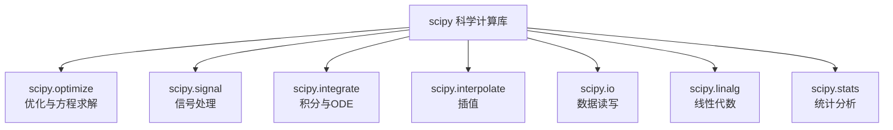

# 🔬 SciPy 入门

SciPy（Scientific Python）是 Python 科学计算的算法核心库，建立在 NumPy 之上，提供了优化、信号处理、积分、插值、线性代数、统计等专业模块。在自动控制与飞行器研究中，SciPy 几乎无处不在——从飞行数据的信号滤波到姿态动力学的 ODE 求解，从轨迹优化到传感器数据插值，它都是不可或缺的工具。本节系统介绍 SciPy 最常用的四个模块：optimize、signal、integrate 和 interpolate。

## 📌 本节要点

- **scipy.optimize**：函数最小化（`minimize`）、曲线拟合（`curve_fit`）、方程求根（`root`、`brentq`）
- **scipy.signal**：Butterworth 滤波器设计（`butter`）、零相位滤波（`filtfilt`）、功率谱密度（`welch`）、时频分析（`spectrogram`）
- **scipy.integrate**：常微分方程初值问题求解（`solve_ivp`）
- **scipy.interpolate**：一维插值（`interp1d`）、三次样条（`CubicSpline`）、径向基函数插值（`RBFInterpolator`）
- **scipy.io**：MATLAB 文件读写（`loadmat`、`savemat`）

## SciPy 模块总览



SciPy 的设计哲学是**模块化**：每个子模块专注解决一类问题，按需导入。在飞行器控制与研究中，最常用的是：

| 模块 | 典型应用场景 |
|------|-------------|
| `scipy.optimize` | 轨迹优化、参数辨识、最优控制 |
| `scipy.signal` | 飞行数据滤波、频谱分析、控制器设计 |
| `scipy.integrate` | 姿态动力学仿真、轨道传播 |
| `scipy.interpolate` | 传感器数据插值、查找表构建 |
| `scipy.io` | 读写 MATLAB 仿真数据 |

## scipy.optimize — 优化与方程求解

`scipy.optimize` 提供了函数最小化、方程求根、曲线拟合等核心功能，是轨迹优化和参数辨识的基础工具。

### minimize — 函数最小化

`minimize` 是 SciPy 中最通用的优化接口，支持多种算法：

```py title="Python"
import numpy as np
from scipy.optimize import minimize

# Rosenbrock 函数：经典优化测试函数
def rosenbrock(x):
    return (1 - x[0]) ** 2 + 100 * (x[1] - x[0] ** 2) ** 2

# BFGS：拟牛顿法，适合光滑函数，利用梯度信息
result_bfgs = minimize(rosenbrock, x0=[0, 0], method='BFGS')
print(f"BFGS:     x={result_bfgs.x.round(4)}, fun={result_bfgs.fun:.2e}, iters={result_bfgs.nit}")

# L-BFGS-B：限内存 BFGS，支持变量边界约束
result_lbfgsb = minimize(rosenbrock, x0=[0, 0], method='L-BFGS-B',
                         bounds=[(-2, 2), (-2, 2)])
print(f"L-BFGS-B: x={result_lbfgsb.x.round(4)}, fun={result_lbfgsb.fun:.2e}")

# Nelder-Mead：单纯形法，不需要梯度，适合噪声函数
result_nm = minimize(rosenbrock, x0=[0, 0], method='Nelder-Mead')
print(f"Nelder-Mead: x={result_nm.x.round(4)}, fun={result_nm.fun:.2e}")
```

:::tip[方法选择指南]
- **BFGS / L-BFGS-B**：函数光滑、可计算梯度时首选，收敛快
- **Nelder-Mead**：不需要梯度，适合黑箱函数或含噪声的场景
- **L-BFGS-B**：需要变量有界约束时使用（如物理参数不能为负）
:::

### curve_fit — 曲线拟合

`curve_fit` 用最小二乘法拟合任意函数模型，返回最优参数和协方差矩阵：

```py title="Python"
import numpy as np
from scipy.optimize import curve_fit

# 飞行器阻力模型：D = q * (C_D0 + C_D2 * α²)
def drag_model(alpha, q, C_D0, C_D2):
    return q * (C_D0 + C_D2 * alpha ** 2)

# 模拟测量数据
rng = np.random.default_rng(42)
alpha = np.linspace(-10, 10, 50)  # 攻角，度
q = 0.5 * 1.225 * 50 ** 2       # 动压
true_drag = drag_model(alpha, q, 0.02, 0.05)
noise = rng.normal(0, 5, 50)
measured_drag = true_drag + noise

# 拟合
popt, pcov = curve_fit(drag_model, alpha, measured_drag, p0=[1000, 0.03, 0.04])
perr = np.sqrt(np.diag(pcov))  # 参数标准差

print(f"拟合参数:")
print(f"  q = {popt[0]:.1f} ± {perr[0]:.1f}")
print(f"  C_D0 = {popt[1]:.4f} ± {perr[1]:.4f}")
print(f"  C_D2 = {popt[2]:.4f} ± {perr[2]:.4f}")
```

### root — 非线性方程求根

`root` 求解向量函数 `f(x) = 0`：

```py title="Python"
import numpy as np
from scipy.optimize import root

# 飞行器平衡状态：升力 = 重力，推力 = 阻力
def equilibrium(x):
    V, alpha = x
    CL = 0.1 * alpha  # 简化升力模型
    CD = 0.02 + 0.05 * alpha ** 2  # 阻力模型
    L = 0.5 * 1.225 * V ** 2 * CL  # 升力
    D = 0.5 * 1.225 * V ** 2 * CD  # 阻力
    W = 5000 * 9.81                 # 重力
    T = 2000                        # 推力
    return [L - W, T - D]          # 两个方程，两个未知数

sol = root(equilibrium, x0=[30, 5])
print(f"平衡速度: {sol.x[0]:.1f} m/s")
print(f"平衡攻角: {sol.x[1]:.2f}°")
print(f"求解成功: {sol.success}")
```

### brentq — 区间求根

`brentq` 用于求解单变量方程在给定区间内的根，保证收敛：

```py title="Python"
from scipy.optimize import brentq

# 求解飞行器升力系数等于目标值时的攻角
def CL_minus_target(alpha, CL_target=0.8):
    CL = 0.1 * alpha  # 升力系数模型
    return CL - CL_target

# 在 [0, 20] 区间内找根
alpha_eq = brentq(CL_minus_target, 0, 20)
print(f"升力系数 = 0.8 时的攻角: {alpha_eq:.1f}°")
```

### 无人机轨迹优化示例

以下示例用 `minimize` 优化无人机在三维空间中的平滑轨迹：

```py title="Python"
import numpy as np
from scipy.optimize import minimize

# 路径点：起点 → 中间点 → 终点
waypoints = np.array([
    [0, 0, 10],      # 起点
    [50, 20, 30],    # 中间点
    [100, 0, 10],    # 终点
])
n_segments = 20

def trajectory_cost(params):
    """轨迹代价：路径长度 + 路径点偏差 + 平滑度"""
    # 将优化变量重塑为 (n_segments, 3)
    points = params.reshape(n_segments, 3)

    # 路径长度
    diffs = np.diff(points, axis=0)
    path_length = np.sum(np.linalg.norm(diffs, axis=1))

    # 路径点偏差（必须经过 waypoints）
    total_deviation = 0.0
    for wp in waypoints:
        distances = np.linalg.norm(points - wp, axis=1)
        total_deviation += np.min(distances)

    # 平滑度（加速度的平方和）
    if len(diffs) > 1:
        acc = np.diff(diffs, axis=0)
        smoothness = np.sum(acc ** 2)
    else:
        smoothness = 0.0

    return path_length + 10 * total_deviation + 0.1 * smoothness

# 初始轨迹：线性插值
t = np.linspace(0, 1, n_segments)
x0 = np.column_stack([
    np.interp(t, [0, 0.5, 1], waypoints[:, 0]),
    np.interp(t, [0, 0.5, 1], waypoints[:, 1]),
    np.interp(t, [0, 0.5, 1], waypoints[:, 2]),
]).ravel()

result = minimize(trajectory_cost, x0, method='L-BFGS-B')
optimal_path = result.x.reshape(n_segments, 3)

print(f"优化代价: {result.fun:.2f}")
print(f"起点: {optimal_path[0]}")
print(f"终点: {optimal_path[-1]}")
print(f"最大高度: {optimal_path[:, 2].max():.1f} m")
```

## scipy.signal — 信号处理

`scipy.signal` 是飞行数据处理的核心模块，提供了滤波器设计、频谱分析和时频分析等功能。

### 信号处理流程


### butter + filtfilt — 滤波器设计与零相位滤波

Butterworth 滤波器具有最平坦的通带响应，`filtfilt` 实现零相位滤波（前向+反向），不引入相位延迟：

```py title="Python"
import numpy as np
from scipy.signal import butter, filtfilt, freqz

# 设计 4 阶低通 Butterworth 滤波器
# Nyquist 频率 = 采样率 / 2
fs = 500  # 采样率 500 Hz
cutoff = 20  # 截止频率 20 Hz
b, a = butter(4, cutoff / (fs / 2), btype='low')

# 查看频率响应
w, h = freqz(b, a, worN=512, fs=fs)
print(f"3dB 截止频率: {w[np.abs(h) <= 1/np.sqrt(2)][0]:.1f} Hz")
```

:::warning[零相位滤波的代价]
`filtfilt` 会将信号长度缩短约 `3 * max(len(b), len(a))` 个采样点，且需要至少 `3 * max(len(b), len(a))` 个数据点。对于实时系统，应使用 `sosfilt` 代替。
:::

### welch — 功率谱密度估计

Welch 方法通过分段平均降低功率谱估计的方差：

```py title="Python"
import numpy as np
from scipy.signal import welch

# 模拟飞行器振动信号
fs = 1000  # 采样率
t = np.arange(0, 2, 1 / fs)
rng = np.random.default_rng(42)

# 结构振动：包含两个主要频率成分
vibration = (1.0 * np.sin(2 * np.pi * 25 * t) +   # 25 Hz 模态
             0.3 * np.sin(2 * np.pi * 80 * t) +   # 80 Hz 模态
             rng.normal(0, 0.2, len(t)))            # 宽带噪声

# Welch 功率谱密度估计
freqs, psd = welch(vibration, fs=fs, nperseg=256)

# 找到主频率
dominant_idx = np.argmax(psd)
print(f"主频率: {freqs[dominant_idx]:.1f} Hz")
print(f"主频率功率: {psd[dominant_idx]:.4f}")
```

### spectrogram — 时频分析

短时傅里叶变换（STFT）提供频率随时间变化的信息：

```py title="Python"
import numpy as np
from scipy.signal import spectrogram

fs = 1000
t = np.arange(0, 2, 1 / fs)
rng = np.random.default_rng(42)

# 时变信号：频率从 10 Hz 线性扫到 100 Hz
chirp_freq = 10 + 45 * t
signal = np.sin(2 * np.pi * np.cumsum(chirp_freq) / fs) + rng.normal(0, 0.1, len(t))

# 计算时频谱
f, t_spec, Sxx = spectrogram(signal, fs=fs, nperseg=128, noverlap=96)
print(f"频率范围: {f[0]:.0f} - {f[-1]:.0f} Hz")
print(f"时间点数: {len(t_spec)}")
print(f"频率点数: {len(f)}")
```

### 飞行器振动滤波实例

以下示例模拟飞行器加速度计数据的完整处理流程：

```py title="Python"
import numpy as np
from scipy.signal import butter, filtfilt, welch

fs = 1000  # 采样率
t = np.arange(0, 5, 1 / fs)
rng = np.random.default_rng(42)

# 模拟真实加速度信号：低频姿态运动 + 高频结构振动 + 噪声
attitude_motion = 0.5 * np.sin(2 * np.pi * 2 * t)    # 2 Hz 姿态运动
structural_vibration = 0.2 * np.sin(2 * np.pi * 120 * t)  # 120 Hz 结构振动
noise = rng.normal(0, 0.05, len(t))
raw_accel = attitude_motion + structural_vibration + noise

# 设计低通滤波器，保留姿态运动，滤除结构振动
# 截止频率 10 Hz，采样率 1000 Hz
b, a = butter(6, 10 / (fs / 2), btype='low')
filtered_accel = filtfilt(b, a, raw_accel)

# 对比滤波前后的功率谱
freqs_raw, psd_raw = welch(raw_accel, fs=fs, nperseg=512)
freqs_filt, psd_filt = welch(filtered_accel, fs=fs, nperseg=512)

# 检查滤波效果
peak_freq_raw = freqs_raw[np.argmax(psd_raw)]
peak_freq_filt = freqs_filt[np.argmax(psd_filt)]
print(f"滤波前主频: {peak_freq_raw:.0f} Hz")
print(f"滤波后主频: {peak_freq_filt:.0f} Hz")
print(f"100Hz 以上能量衰减: {10 * np.log10(np.mean(psd_filt[freqs_filt > 100]) / np.mean(psd_raw[freqs_raw > 100])):.1f} dB")
```

:::tip[滤波器阶数选择]
- **低阶（2-4阶）**：过渡带宽，相位失真小，适合实时滤波
- **高阶（6-8阶）**：过渡带窄，频率选择性好，但计算量大且可能不稳定
- 工程实践中 4-6 阶 Butterworth 滤波器是最常用的选择
:::

## scipy.integrate — 积分与 ODE 求解

`scipy.integrate.solve_ivp` 是求解常微分方程初值问题的标准接口，广泛用于飞行器动力学仿真。

### solve_ivp 基本用法

```py title="Python"
import numpy as np
from scipy.integrate import solve_ivp

# 简单指数衰减：dy/dt = -k * y
def exponential_decay(t, y):
    return -0.5 * y

# 求解：y(0) = 1, t ∈ [0, 10]
sol = solve_ivp(exponential_decay, t_span=[0, 10], y0=[1.0],
                t_eval=np.linspace(0, 10, 100))

print(f"时间点数: {len(sol.t)}")
print(f"y(0) = {sol.y[0, 0]:.4f}")
print(f"y(10) ≈ {sol.y[0, -1]:.4f} (理论值: {np.exp(-5):.4f})")
print(f"求解成功: {sol.success}")
```

### 姿态动力学仿真

二阶阻尼振荡系统：`dθ/dt = ω`，`dω/dt = -kθ - cω`，模拟飞行器俯仰姿态：

```py title="Python"
import numpy as np
from scipy.integrate import solve_ivp

def attitude_dynamics(t, state, k, c):
    """飞行器俯仰姿态动力学
    state = [θ, ω]
    dθ/dt = ω
    dω/dt = -k*θ - c*ω
    """
    theta, omega = state
    dtheta_dt = omega
    domega_dt = -k * theta - c * omega
    return [dtheta_dt, domega_dt]

# 参数
k = 4.0    # 弹性刚度（恢复力矩系数）
c = 0.5    # 阻尼系数
theta0 = 0.2  # 初始俯仰角 (rad)，约 11.5°
omega0 = 0.0  # 初始角速度

# 求解
sol = solve_ivp(
    attitude_dynamics,
    t_span=[0, 20],
    y0=[theta0, omega0],
    args=(k, c),
    t_eval=np.linspace(0, 20, 500),
    method='RK45'
)

print(f"初始俯仰角: {np.degrees(sol.y[0, 0]):.1f}°")
print(f"最大俯仰角: {np.degrees(np.max(np.abs(sol.y[0]))):.1f}°")
print(f"稳态俯仰角: {np.degrees(sol.y[0, -1]):.4f}°")

# 分析振荡特性
omega_n = np.sqrt(k)           # 无阻尼自然频率
zeta = c / (2 * omega_n)       # 阻尼比
print(f"自然频率: {omega_n:.2f} rad/s ({omega_n / (2 * np.pi):.2f} Hz)")
print(f"阻尼比: {zeta:.3f}")
```

:::tip[method 参数选择]
- **`RK45`**（默认）：显式 Runge-Kutta，适合非刚性问题
- **`Radau`**：隐式 Runge-Kutta，适合刚性问题（如快慢动力学耦合）
- **`BDF`**：向后差分公式，适合刚性问题和 DAE（微分代数方程）
- **`LSODA`**：自动切换显式/隐式方法，最鲁棒但最慢
:::

### 线性系统状态空间仿真

用 `solve_ivp` 仿真二阶传递函数的状态空间模型：

```py title="Python"
import numpy as np
from scipy.integrate import solve_ivp

# 二阶传递函数：ω_n² / (s² + 2ζω_n s + ω_n²)
omega_n = 5.0  # 自然频率
zeta = 0.3     # 阻尼比

# 状态空间：x' = Ax + Bu, y = Cx
A = np.array([
    [0, 1],
    [-omega_n ** 2, -2 * zeta * omega_n]
])
B = np.array([0, omega_n ** 2])
C = np.array([1, 0])

def state_equation(t, x):
    u = 1.0 if t >= 1.0 else 0.0  # 阶跃输入
    return A @ x + B * u

sol = solve_ivp(state_equation, [0, 5], [0, 0],
                t_eval=np.linspace(0, 5, 1000), method='RK45')

# 提取输出
y = (C @ sol.y).flatten()
overshoot = (np.max(y) - 1.0) / 1.0 * 100
print(f"阶跃响应超调量: {overshoot:.1f}%")
print(f"峰值时间: {sol.t[np.argmax(y)]:.2f} s")
print(f"稳态值: {y[-1]:.4f}")
```

## scipy.interpolate — 插值

`scipy.interpolate` 提供从简单线性插值到复杂多维插值的完整工具集，在传感器数据处理和查找表构建中应用广泛。

### interp1d — 一维插值

```py title="Python"
import numpy as np
from scipy.interpolate import interp1d

# 传感器采样数据（非均匀采样）
t_raw = np.array([0, 0.1, 0.3, 0.5, 0.8, 1.0])
altitude_raw = np.array([0, 100, 350, 500, 800, 1000])

# 线性插值
f_linear = interp1d(t_raw, altitude_raw, kind='linear')

# 三次样条插值
f_cubic = interp1d(t_raw, altitude_raw, kind='cubic')

# 在均匀时间点上插值
t_interp = np.linspace(0, 1, 100)
alt_linear = f_linear(t_interp)
alt_cubic = f_cubic(t_interp)

print(f"原始点数: {len(t_raw)}")
print(f"插值点数: {len(t_interp)}")
print(f"线性插值 t=0.4: {f_linear(0.4):.1f} m")
print(f"三次插值 t=0.4: {f_cubic(0.4):.1f} m")
```

### CubicSpline — 三次样条

`CubicSpline` 比 `interp1d` 更灵活，支持不同的边界条件：

```py title="Python"
import numpy as np
from scipy.interpolate import CubicSpline

# 飞行器高度剖面（离散航点）
t_wp = np.array([0, 5, 10, 15, 20, 25, 30])
h_wp = np.array([0, 500, 1000, 1200, 800, 300, 0])

# 自然样条（二阶导数为零）
cs_natural = CubicSpline(t_wp, h_wp, bc_type='natural')

# 固定一阶导数（指定起止爬升率）
cs_clamped = CubicSpline(t_wp, h_wp, bc_type=((1, 0), (1, 0)))

# 在精细时间点上评估
t_fine = np.linspace(0, 30, 300)
h_natural = cs_natural(t_fine)
h_clamped = cs_clamped(t_fine)

# 计算爬升率（一阶导数）
climb_rate = cs_natural(t_fine, 1)
max_climb_idx = np.argmax(climb_rate)

print(f"最大爬升率: {climb_rate[max_climb_idx]:.1f} m/s (t={t_fine[max_climb_idx]:.1f}s)")
print(f"自然样条 t=12: {cs_natural(12):.1f} m")
print(f"固定导数 t=12: {cs_clamped(12):.1f} m")
```

### RBFInterpolator — 径向基函数插值

适用于散点数据和多维插值：

```py title="Python"
import numpy as np
from scipy.interpolate import RBFInterpolator

# 飞行器周围的压力分布（散点测量）
rng = np.random.default_rng(42)
# 测量点
x_meas = rng.uniform(-1, 1, 20)
y_meas = rng.uniform(-1, 1, 20)

# 翼型表面压力分布模型
pressure = 101325 - 5000 * x_meas ** 2 + 2000 * y_meas + rng.normal(0, 100, 20)

# 构建 RBF 插值器
rbf = RBFInterpolator(
    np.column_stack([x_meas, y_meas]),
    pressure,
    kernel='thin_plate_spline',
    smoothing=1.0
)

# 在规则网格上插值
xi = np.linspace(-1, 1, 50)
yi = np.linspace(-1, 1, 50)
XI, YI = np.meshgrid(xi, yi)
grid_points = np.column_stack([XI.ravel(), YI.ravel()])
pressure_grid = rbf(grid_points).reshape(XI.shape)

print(f"插值网格形状: {pressure_grid.shape}")
print(f"压力范围: [{pressure_grid.min():.0f}, {pressure_grid.max():.0f}] Pa")
print(f"插值点数: {grid_points.shape[0]}")
```

### 传感器数据插值实例

将不同采样率的传感器数据对齐到统一时间轴：

```py title="Python"
import numpy as np
from scipy.interpolate import interp1d

rng = np.random.default_rng(42)

# 传感器 A：100 Hz，气压高度
t_a = np.arange(0, 10, 0.01)
h_a = np.cumsum(rng.normal(0.1, 0.01, len(t_a)))  # 累积爬升

# 传感器 B：20 Hz，GPS 高度（延迟 + 噪声）
t_b = np.arange(0.05, 10, 0.05)
h_b_true = np.interp(t_b, t_a, h_a)
h_b = h_b_true + rng.normal(0, 0.5, len(t_b)) + 0.1  # GPS 偏差

# 传感器 C：50 Hz，雷达高度
t_c = np.arange(0.02, 10, 0.02)
h_c = np.interp(t_c, t_a, h_a) + rng.normal(0, 0.3, len(t_c))

# 统一到 100 Hz 时间轴
t_common = t_a.copy()
f_a = interp1d(t_a, h_a, kind='linear')
f_b = interp1d(t_b, h_b, kind='linear', fill_value='extrapolate')
f_c = interp1d(t_c, h_c, kind='linear', fill_value='extrapolate')

h_a_aligned = f_a(t_common)
h_b_aligned = f_b(t_common)
h_c_aligned = f_c(t_common)

# 融合：加权平均（权重基于传感器精度）
weights = np.array([0.5, 0.2, 0.3])  # A 最精确，B 最差
h_fused = (weights[0] * h_a_aligned +
           weights[1] * h_b_aligned +
           weights[2] * h_c_aligned)

print(f"传感器 A 偏差: {np.mean(h_a_aligned - h_fused):.4f} m")
print(f"传感器 B 偏差: {np.mean(h_b_aligned - h_fused):.4f} m")
print(f"传感器 C 偏差: {np.mean(h_c_aligned - h_fused):.4f} m")
```

## scipy.io — 数据读写

`scipy.io` 提供了读写 MATLAB `.mat` 文件的功能，是与 MATLAB 仿真工具交互的桥梁。

### loadmat / savemat

```py title="Python"
import numpy as np
from scipy.io import loadmat, savemat

# 创建模拟数据
data = {
    'time': np.linspace(0, 10, 1000),
    'position': np.sin(np.linspace(0, 10, 1000)),
    'velocity': np.cos(np.linspace(0, 10, 1000)),
    'config': np.array([0.5, 1.0, 2.0]),  # PID 参数
}

# 保存为 .mat 文件
savemat('flight_data.mat', data)
print("已保存 flight_data.mat")

# 读取 .mat 文件
loaded = loadmat('flight_data.mat')
print(f"包含的变量: {[k for k in loaded.keys() if not k.startswith('__')]}")
print(f"time shape: {loaded['time'].shape}")
print(f"position shape: {loaded['position'].shape}")

# 使用 v5 格式（兼容旧版 MATLAB）
savemat('flight_data_v5.mat', data, do_compression=True)
```

:::tip[.mat 文件兼容性]
- 默认保存为 v5 格式，兼容 MATLAB 5.0+
- 使用 `do_compression=True` 压缩文件大小
- 读取时注意 NumPy 数组维度与 MATLAB 矩阵的转置关系（MATLAB 列优先，NumPy 行优先）
:::

## 🎯 动手练习

1. **滤波器设计与对比**：
   - 设计一个带通滤波器（10-50 Hz），用于提取飞行器特定频率的振动
   - 对比 Butterworth、Chebyshev Type I 和椭圆滤波器的频率响应
   - 分析不同阶数对滤波效果的影响

2. **二阶系统参数辨识**：
   - 用 `curve_fit` 拟合二阶系统的阶跃响应：`y(t) = 1 - e^(-ζω_nt) * (cos(ω_dt) + (ζω_n/ω_d)sin(ω_dt))`
   - 从含噪声数据中辨识自然频率 ω_n 和阻尼比 ζ
   - 评估参数估计的不确定性

3. **轨迹规划**：
   - 用 `CubicSpline` 规划无人机从 A 点到 B 点的三维轨迹
   - 要求轨迹经过指定的航点，且起止点速度为零
   - 计算轨迹的曲率和总弧长

4. **多传感器数据融合**：
   - 模拟三个不同采样率和精度的高度传感器
   - 用 `interp1d` 将数据对齐到统一时间轴
   - 实现简单的加权卡尔曼滤波进行数据融合

## ✅ 本节总结

- **scipy.optimize**：`minimize` 支持多种优化算法，`curve_fit` 用于参数辨识，`root` 和 `brentq` 求解方程
- **scipy.signal**：`butter` + `filtfilt` 实现零相位滤波，`welch` 估计功率谱密度，`spectrogram` 进行时频分析
- **scipy.integrate**：`solve_ivp` 是 ODE 求解的标准接口，支持 RK45、Radau、BDF 等多种方法
- **scipy.interpolate**：`interp1d` 简单快速，`CubicSpline` 平滑高效，`RBFInterpolator` 适合散点数据
- **scipy.io**：`loadmat` 和 `savemat` 实现与 MATLAB 的数据交换
- **选择合适的方法**：优化问题根据是否需要梯度选择方法，ODE 问题根据刚性程度选择求解器

## 📚 延伸阅读

- **[SciPy 官方文档](https://docs.scipy.org/doc/scipy/)** - 完整 API 参考
- **[SciPy 教程](https://docs.scipy.org/doc/scipy/tutorial/index.html)** - 官方用户指南
- **[scipy.optimize 参考](https://docs.scipy.org/doc/scipy/reference/optimize.html)** - 优化模块详解
- **[scipy.signal 参考](https://docs.scipy.org/doc/scipy/reference/signal.html)** - 信号处理模块
- **[scipy.integrate 参考](https://docs.scipy.org/doc/scipy/reference/integrate.html)** - 积分与 ODE 模块
- **[scipy.interpolate 参考](https://docs.scipy.org/doc/scipy/reference/interpolate.html)** - 插值模块
- **[SciPy 基础教程](https://scipy-lectures.org/)** - Scipy Lectures 系列教程
